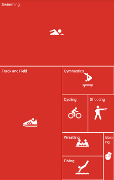

# Customization

**TreeMap** control supports color customization to determine the exact combination of colors for tree nodes displayed in **TreeMap** and tooltip support to display additional information of treemap data.

## Color

You can customize the colors of the leaf nodes of **TreeMap** using the ColorMapping support of the **TreeMap**. 

ColorMapping is categorized into three different types such as,

* UniColorMapping
* RangeColorMapping
* DesaturationColorMapping

### UniColorMapping

You can color, all the leaf nodes with the same color by setting the `color` value of the `UniColorMapping` property of the **TreeMap**.



uniMapping = new UniColorMapping (){ Color = Color.FromHex ("#D21243") };



### Range Color Mapping

You can group the leaf nodes based on the range of the data’s color values. You can set a unique color for every ranges. To achieve this, specify the `to` and `from` values as range bound and `color` value to fill the leaf nodes of the particular range, through the `rangeColorMapping` property of the **TreeMap**.



…

…

ObservableCollection<Range> ranges = new ObservableCollection<Range>();
ranges.Add(new Range() { LegendLabel="1 % Growth", From = 0, To = 1, Color = Color.FromHex("#77D8D8") });
ranges.Add(new Range() { LegendLabel = "2 % Growth", From = 0, To = 2, Color = Color.FromHex("#AED960") });
ranges.Add(new Range() { LegendLabel = "3 % Growth", From = 0, To = 3, Color = Color.FromHex("#FFAF51") });
ranges.Add(new Range() { LegendLabel = "4 % Growth", From = 0, To = 4, Color = Color.FromHex("#F3D240") });
treeMap.LeafItemColorMapping = new RangeColorMapping (){ Ranges = ranges };



### Desaturation Color Mapping

You can differentiate all the leaf nodes using the `desaturationColorMapping` property of the **TreeMap**. Differentiation is achieved, even though same color is applied for all the leaf nodes by varying the opacity of the leaf nodes based on the color value specified in the color value range using `rangeMinimum` and `rangeMaximum` value of the data collection. You can also bound the opacity range by setting `from` and `to` property of the `desaturationColorMapping`.



    DesaturationColorMapping desaturation = new DesaturationColorMapping ();
	desaturation.Color = Color.FromHex ("#41B8C4");
	desaturation.From = 1;
	desaturation.To = 0.2;
    tree.LeafItemColorMapping = desaturation;



## Tooltip

You can enable the tooltip support for the TreeMap by setting the `showTooltip` property to true. By default, it takes the property of the bound object that is referred to in the groupPath and displays its content when the corresponding node is tapped.

## Leaf Item Setting

You can customize the **Leaf level TreeMap items** using `leafItemSettings`. The Label and tooltip values take the property of bound object that is referred in the `labelPath` when defined.



…

LeafItemSettings leafSetting = new LeafItemSettings();
leafSetting.BorderWidth = 1;
leafSetting.BorderColor = Color.White;
leafSetting.LabelPath= "Country";
treeMap.LeafItemSettings = leafSetting;



# ItemTemplate

The tree map control provides template support for tree map items, allowing any type of custom template to be created with any type of view element.



    <tree:SfTreeMap.ItemTemplate>
      <DataTemplate>
         <Grid BackgroundColor ="#D73028" >
           <Image  HorizontalOptions= "Center" VerticalOptions= "Center" HeightRequest= "50" WidthRequest= "50" Source="{Binding Data.GameImgSource}" />
           <Label Margin="5,5,0,0"  FontSize="12" Text= "{Binding Data.GameName}" TextColor = "White" HeightRequest="50" WidthRequest="100" HorizontalOptions= "Start" VerticalOptions= "Start"/>
         </Grid>
      </DataTemplate>
    </tree:SfTreeMap.ItemTemplate>
 


