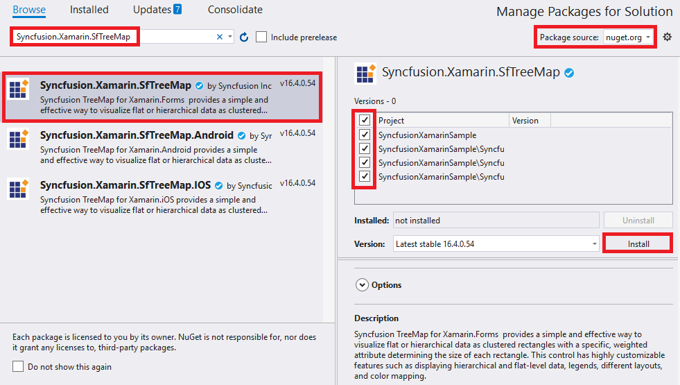

# Getting Started

This section explains you the steps to configure a TreeMap control in a real-time scenario and also provides a walk-through on some of the customization features available in TreeMap control.

## Adding SfTreeMap reference

You can add SfTreeMap reference using one of the following methods:

**Method 1: Adding SfTreeMap reference from nuget.org**

Syncfusion Xamarin components are available in [nuget.org](https://www.nuget.org/). To add SfTreeMap to your project, open the NuGet package manager in Visual Studio, search for [Syncfusion.Xamarin.SfTreeMap](https://www.nuget.org/packages/Syncfusion.Xamarin.SfTreeMap), and then install it.

N> Install the same version of SfTreeMap NuGet in all the projects.

**Method 2: Adding SfTreeMap reference from toolbox**

Syncfusion also provides Xamarin Toolbox. Using this toolbox, you can drag the SfTreeMap control to the XAML page. It will automatically install the required NuGet packages and add the namespace to the page. To install Syncfusion Xamarin Toolbox, refer to [Toolbox](https://help.syncfusion.com/xamarin/utility#toolbox).

**Method 3: Adding SfTreeMap assemblies manually from the installed location**

If you prefer to manually reference the assemblies instead referencing from NuGet, add the following assemblies in respective projects.

Location: {Installed location}/{version}/Xamarin/lib

<table>
<tr>
<td>PCL</td>
<td>Syncfusion.SfTreeMap.XForms.dll Syncfusion.Core.XForms.dll Syncfusion.Licensing.dll </td>
</tr>
<tr>
<td>Android</td>
<td>Syncfusion.SfTreeMap.Android.dll Syncfusion.SfTreeMap.XForms.Android.dll Syncfusion.SfTreeMap.XForms.dll Syncfusion.Core.XForms.dll Syncfusion.Core.XForms.Android.dll Syncfusion.Licensing.dll </td>
</tr>
<tr>
<td>iOS</td>
<td>Syncfusion.SfTreeMap.iOS.dll Syncfusion.SfTreeMap.XForms.iOS.dll Syncfusion.SfTreeMap.XForms.dll Syncfusion.Core.XForms.dll Syncfusion.Core.XForms.iOS.dll Syncfusion.Licensing.dll </td>
</tr>
<tr>
<td>UWP</td>
<td>Syncfusion.SfTreeMap.UWP.dll Syncfusion.SfTreeMap.XForms.UWP.dll Syncfusion.SfTreeMap.XForms.dll Syncfusion.Core.XForms.dll Syncfusion.Core.XForms.UWP.dll Syncfusion.Licensing.dll </td>
</tr>
</table>

N> To know more about obtaining our components, refer to these links for [Mac](https://help.syncfusion.com/xamarin/introduction/download-and-installation/mac/) and [Windows](https://help.syncfusion.com/xamarin/introduction/download-and-installation/windows/).

I> Starting with v16.2.0.x, if you reference Syncfusion assemblies from the trial setup or from the NuGet feed, you also have to include a license key in your projects. Please refer to [Syncfusion license key](https://help.syncfusion.com/common/essential-studio/licensing/license-key/) to know about registering Syncfusion license key in your Xamarin application to use our components.

N> Currently an additional step is required for UWP project. You need to create an instance of the TreeMap custom renderer. If you are adding the references from toolbox, this step is not needed.

Create an instance of SfTreeMapRenderer in MainPage constructor of the UWP project as shown in the following code sample.

  

public MainPage()
{

    new SfTreeMapRenderer ();

    ...    

}



   
Create an instance of the SfTreeMapRenderer in FinishedLaunching overridden method of AppDelegate class in iOS Project as follows.

  

public override bool FinishedLaunching(UIApplication app, NSDictionary options)
{

    ...

    new SfTreeMapRenderer ();

    ...

}



   
## Initializing the TreeMap

The Treemap control can be configured entirely in C# code or using XAML markup.

The first step is to create a TreeMap object. 

  



<?xml version="1.0" encoding="UTF-8"?>

<ContentPage xmlns="http://xamarin.com/schemas/2014/forms" xmlns:local="clr-namespace:Syncfusion.SfTreeMap.XForms;
  assembly=Syncfusion.SfTreeMap.XForms" xmlns:x="http://schemas.microsoft.com/winfx/2009/xaml" 
  x:Class="TreeMapGettingStarted.Sample" BackgroundColor=”Black”>

<ContentPage.Content >
	<local:SfTreeMap x:Name="treeMap">
</local:SfTreeMap>

</ContentPage.Content>
</ContentPage>





public static Page GetMainPage()
{

SfTreeMap treeMap = new SfTreeMap();

return new ContentPage
{

    BackgroundColor = Color.Black,

    Content = treeMap,

};
}



  

## Populating TreeMap Items

The TreeMap accepts a collection of TreeMapItems as input.

  



// BindingContext is set for the content page class.

//DataModel model = new DataModel();

//..

//..

//this.BindingContext = model;

<local:SfTreeMap x:Name="treeMap" Items = "{Binding TreeMapItems}">

</local:SfTreeMap>





public class DataModel : BindableObject

{

public static readonly BindableProperty TreeMapItemsProperty =

	BindableProperty.Create<DataModel, ObservableCollection<TreeMapItem>>(p => p.TreeMapItems, null, BindingMode.TwoWay, null, null, null, null);

public ObservableCollection<TreeMapItem> TreeMapItems
{

    get { return (ObservableCollection<TreeMapItem>)GetValue(TreeMapItemsProperty); }

    set { SetValue(TreeMapItemsProperty, value); }

}

public DataModel()
{

    this.TreeMapItems = new ObservableCollection<TreeMapItem>();

    TreeMapItems.Add(new TreeMapItem() { Label = "Indonesia", ColorWeight = 3, Weight = 237641326 });

    TreeMapItems.Add(new TreeMapItem() { Label = "Russia", ColorWeight = 2, Weight = 152518015 });

    TreeMapItems.Add(new TreeMapItem() { Label = "United States", ColorWeight = 4, Weight = 315645000 });

    TreeMapItems.Add(new TreeMapItem() { Label = "Mexico", ColorWeight = 2, Weight = 112336538 });

    TreeMapItems.Add(new TreeMapItem() { Label = "Nigeria", ColorWeight = 2, Weight = 170901000 });

    TreeMapItems.Add(new TreeMapItem() { Label = "Egypt", ColorWeight = 1, Weight = 83661000 });

    TreeMapItems.Add(new TreeMapItem() { Label = "Germany", ColorWeight = 1, Weight = 81993000 });

    TreeMapItems.Add(new TreeMapItem() { Label = "France", ColorWeight = 1, Weight = 65605000 });

    TreeMapItems.Add(new TreeMapItem() { Label = "UK", ColorWeight = 1, Weight = 63181775 });

}
}

SfTreeMap treeMap = new SfTreeMap();

DataModel model = new DataModel();

treeMap.Items = model.TreeMapItems;



  

## Grouping of TreeMap Items using Levels

You can group TreeMapItems using two types of levels.

1. TreeMap Flat Level
2. TreeMap Hierarchical Level

## Customize TreeMap Appearance by Range

You can differentiate the nodes based on its value and color ranges using the Range color. You can also define the color value range using the From and To properties. 

  



<local:SfTreeMap x:Name="treeMap" Items = "{Binding TreeMapItems}">

<local:SfTreeMap.LeafItemColorMapping>
    <local:RangeColorMapping>
        <local:RangeColorMapping.Ranges>
           <local:Range LegendLabel = "1 % Growth" From = "0" To = "1" Color =  "#77D8D8"  />
           <local:Range LegendLabel = "2 % Growth" From = "0" To = "2" Color =  "#AED960"  />
           <local:Range LegendLabel = "3 % Growth" From = "0" To = "3" Color =  "#FFAF51"  />
           <local:Range LegendLabel = "4 % Growth" From = "0" To = "4" Color =  "#F3D240"  />
        </local:RangeColorMapping.Ranges>
    </local:RangeColorMapping> 
</local:SfTreeMap.LeafItemColorMapping>

</local:SfTreeMap>





…

…

ObservableCollection<Range> ranges = new ObservableCollection<Range>();
ranges.Add(new Range() { LegendLabel="1 % Growth", From = 0, To = 1, Color = Color.FromHex("#77D8D8") });
ranges.Add(new Range() { LegendLabel = "2 % Growth", From = 0, To = 2, Color = Color.FromHex("#AED960") });
ranges.Add(new Range() { LegendLabel = "3 % Growth", From = 0, To = 3, Color = Color.FromHex("#FFAF51") });
ranges.Add(new Range() { LegendLabel = "4 % Growth", From = 0, To = 4, Color = Color.FromHex("#F3D240") });
treeMap.LeafItemColorMapping = new RangeColorMapping (){ Ranges = ranges };



  

## LeafItemSetting

You can customize the Leaf level TreeMap items using LeafItem setting. 

  



<local:SfTreeMap x:Name="treeMap" Items = "{Binding TreeMapItems}">

…

<local:SfTreeMap.LeafItemSettings>
        <local: LeafItemSettings BorderWidth=“1" BorderColor=“White"  />
</local:SfTreeMap. LeafItemSettings >

</local:SfTreeMap>





…

LeafItemSettings leafSetting = new LeafItemSettings();
leafSetting.BorderWidth = 1;
leafSetting.BorderColor = Color.White;
treeMap.LeafItemSettings = leafSetting;



 

## Enable Legend

You can set the color value of leaf nodes using the TreeMap Legend. This legend is appropriate only for the TreeMap whose leaf nodes are colored using RangeColorMapping. You can set ShowLegend property value to “True” to make the legend visible.

## Label for Legends

You can customize the labels of the legend items using the LegendLabel property of RangeColorMapping. 

 



<local:SfTreeMap.LegendSettings>
    <local:LegendSettings  ShowLegend ="true" IconSize=“15,15" Size=“350,70"  />
</local:SfTreeMap.LegendSettings>




…

LegendSettings legendSettings = new LegendSettings();
legendSettings.ShowLegend= true;
legendSettings.IconSize = new Size(15, 15);
legendSettings.Size = new Size (350, 70);
treeMap.LegendSettings= legendSettings;



  

