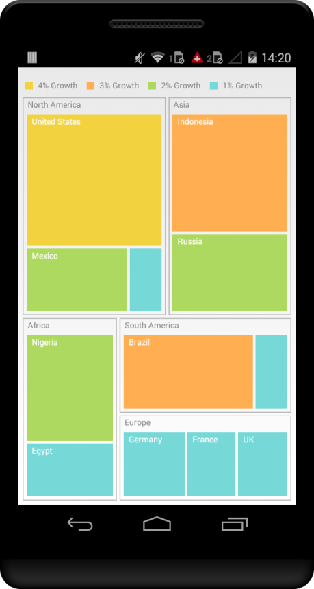

# Overview

The Essential Xamarin Treemap control provides a simple yet effective way to visualize flat or hierarchical data as clustered rectangles, with a specific weighted attribute determining the size of the rectangle.

## Key Features

* `Levels` - TreeMap levels are used to define levels of various flat data and hierarchical data collection.
 
* `Layout` - Layouts such as Squarified, SliceAndDiceAuto, SliceAndDiceHorizontal and SliceAndDiceVertical determines the visual representation of nodes belonging to all the TreeMap levels in TreeMap.
 
* `Visualization for Colors` - Easy customization options is provided to customize the colors of the leaf nodes of TreeMap.

