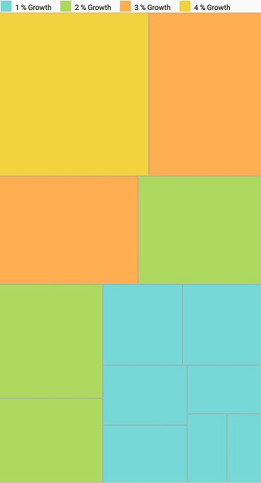
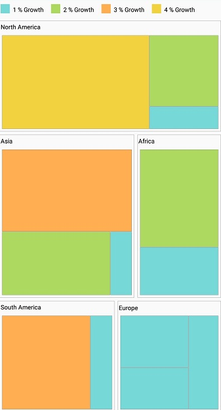
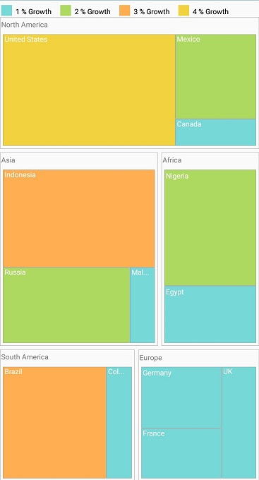
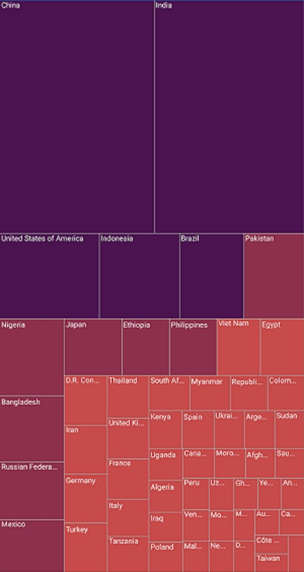
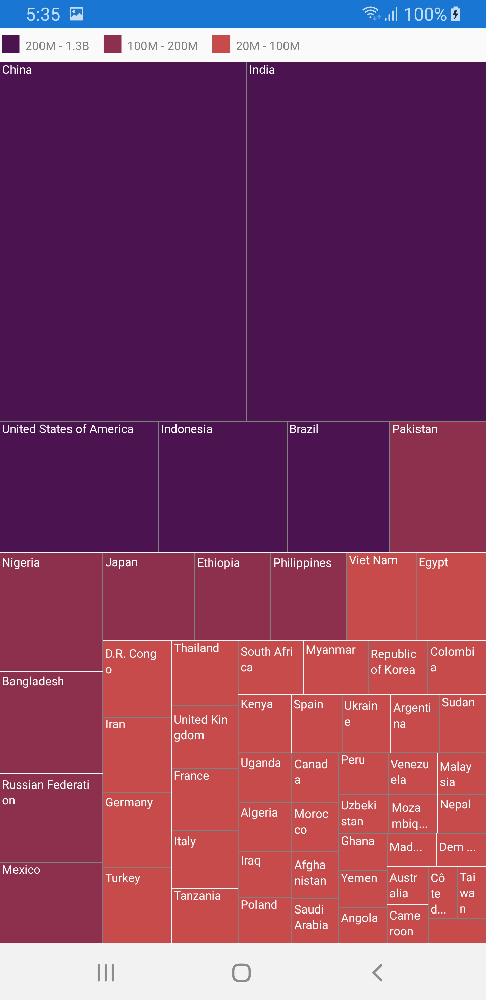
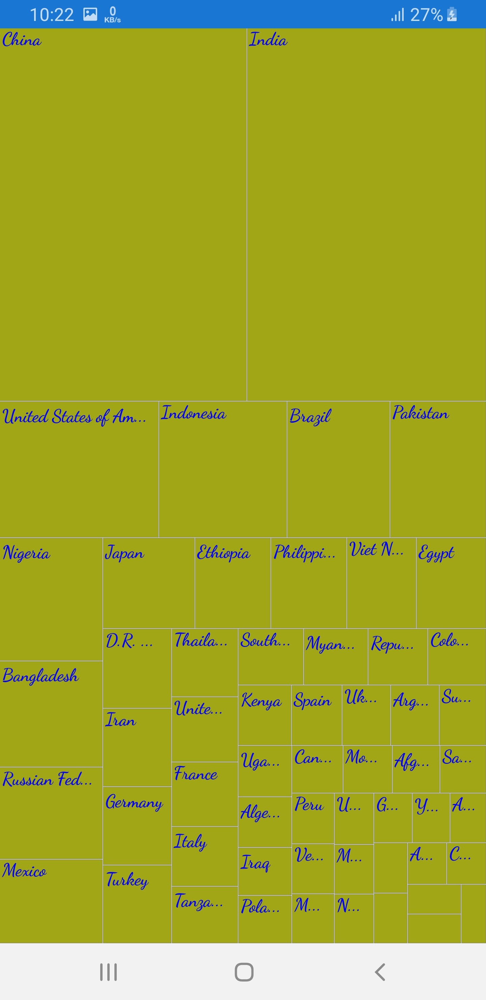

# TreeMap Elements

The TreeMap contains the following elements:

* Legend
* Headers
* Labels

## Legend

You can set the color value of **leaf nodes** using the `LegendSettings` property. This legend is appropriate only for the **TreeMap** whose leaf nodes are colored using `RangeColorMapping`.

The visibility of legend can be enabled by setting the `ShowLegend` property to **“True”**.

### TreeMap legend

You can set the size of the legend icons by setting the `IconSize` property of the `LegendSettings` property in **TreeMap**.

### Label for legend

You can customize the labels of the **legend items** using the `LegendLabel` property of `RangeColorMapping`. 



    LegendSettings legendSettings = new LegendSettings();
    legendSettings.ShowLegend= true;
    legendSettings.IconSize = new Size(15, 15);
    legendSettings.Size = new Size (350, 100);
    legendSettings.LabelStyle.Color = Color.Black;
    treeMap.LegendSettings= legendSettings;



## Header

You can set headers for each level by setting the `ShowHeader` property of each **TreeMap** level. The `HeaderHeight` property helps you set the height of the header and the `GroupPath` value determines the header value. 



            TreeMapFlatLevel level = new TreeMapFlatLevel()
            {
                HeaderStyle = new Syncfusion.SfTreeMap.XForms.Style() { Color = Color.Black },
                GroupPath = "Continent",
                HeaderHeight = 20,
                GroupGap = 5,
                ShowHeader = true
            };
            treeMap.Levels.Add(level);     

 

## Data labels

The `ShowLabels` property is used to enable or disable the labels in leaf nodes. The `LabelPath` property allows you to set values for labels.





            <treeMap:SfTreeMap.LeafItemSettings>
                <treeMap:LeafItemSettings  LabelPath="Country" ShowLabels="True">
                </treeMap:LeafItemSettings>
            </treeMap:SfTreeMap.LeafItemSettings>





            treeMap.LeafItemSettings.ShowLabels = true;
            treeMap.LeafItemSettings.LabelPath = "Country";
 

 

### Avoid overlap in data labels

The `OverflowMode` property aligns data labels within leaf node boundaries using the `Trim`, `Wrap`, and `Hide` options. The default value of the `OverflowMode` property is Trim.

#### Trim
You can trim the data labels inside the leaf node boundaries using the `Trim` option.





            <treeMap:SfTreeMap.LeafItemSettings>
                <treeMap:LeafItemSettings  LabelPath="Country" OverFlowMode="Trim">
                </treeMap:LeafItemSettings>
            </treeMap:SfTreeMap.LeafItemSettings>





    treeMap.LeafItemSettings.OverFlowMode = LabelOverflowMode.Trim;
 



#### Wrap
You can wrap the data labels inside the leaf node boundaries using the `Wrap` option.





            <treeMap:SfTreeMap.LeafItemSettings>
                <treeMap:LeafItemSettings  LabelPath="Country" OverFlowMode="Wrap">
                </treeMap:LeafItemSettings>
            </treeMap:SfTreeMap.LeafItemSettings>





    treeMap.LeafItemSettings.OverFlowMode = LabelOverflowMode.Wrap;
 



#### Hide
You can hide the data labels inside the leaf node boundaries using the `Hide` option. 





            <treeMap:SfTreeMap.LeafItemSettings>
                <treeMap:LeafItemSettings  LabelPath="Country" OverFlowMode="Hide">
                </treeMap:LeafItemSettings>
            </treeMap:SfTreeMap.LeafItemSettings>





    treeMap.LeafItemSettings.OverFlowMode = LabelOverflowMode.Hide;
 



### Customize data labels

You can customize the data labels using the `LabelStyle` property of LeafItemSettings. The font color, size, attribute, and family can be customized using the `FontSize, FontAttributes, FontFamily, and Color` properties.





            <treeMap:SfTreeMap.LeafItemSettings>
                <treeMap:LeafItemSettings  LabelPath="Country" OverFlowMode="Trim">
                    <treeMap:LeafItemSettings.LabelStyle>
                        <treeMap:Style Color="Blue" FontSize="15" FontAttributes="Bold">
                            <treeMap:Style.FontFamily>
                                <OnPlatform x:TypeArguments="x:String" iOS="Chalkduster" Android="cursive" WinPhone="Chiller" />
                            </treeMap:Style.FontFamily>
                        </treeMap:Style>
                    </treeMap:LeafItemSettings.LabelStyle>
                </treeMap:LeafItemSettings>
            </treeMap:SfTreeMap.LeafItemSettings>





            treeMap.LeafItemSettings.LabelStyle.FontSize = 15;
            treeMap.LeafItemSettings.LabelStyle.FontAttributes = FontAttributes.Bold;
            treeMap.LeafItemSettings.LabelStyle.FontFamily = Device.RuntimePlatform == Device.iOS ? "Chalkduster" : Device.RuntimePlatform == Device.Android ? "cursive" : "Chiller";
            treeMap.LeafItemSettings.LabelStyle.Color = Color.Blue;
 




