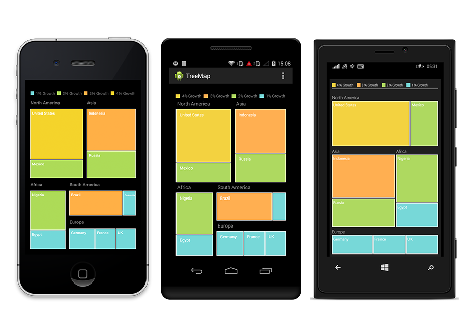
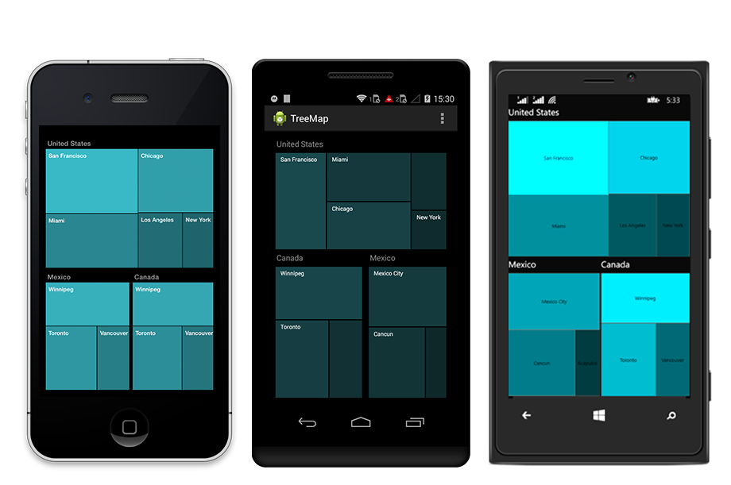

# TreeMapLevels

The levels of **TreeMap** can be categorized into two types as,

* FlatLevel
* Hierarchical Level

## Flat Level

### GroupPath

You can use `groupPath` property for every flat level of the **TreeMap** control. It is a path to a field on the source object that serves as the **“Group”** for the level specified. You can group the data based on the `groupPath` in the **TreeMap** control. When the `groupPath` is not specified, then the items are not grouped and the data is displayed in the order specified in the `dataSource`.

### GroupGap

You can use `groupGap` property to separate the items from every flat level and to differentiate the levels mentioned in the **TreeMap** control.

  

     TreeMapFlatLevel level = new TreeMapFlatLevel() { HeaderStyle = new Syncfusion.SfTreeMap.XForms.Style() { Color= Device.OnPlatform(iOS: Color.Gray, Android: Color.Gray, WinPhone: Color.White) }, GroupPath = "Continent", HeaderHeight = 20, GroupGap = 5, ShowHeader = true };



## Hierarchical Level

**TreeMap** Hierarchical level is used to define levels for hierarchical data collection that contains tree-structured data.

  

                     SfTreeMap tree = new SfTreeMap ();
		             tree.WeightValuePath = "Sales";
                     tree.DataSource = new CountrySalesCollection ();
                     
       public CountrySalesCollection()
		{
			this.Add(new CountrySale() { Name = "United States", Sales = 98456, Expense = 87000 });
			this.Add(new CountrySale() { Name = "Canada", Sales = 43523, Expense = 40000 });
			this.Add(new CountrySale() { Name = "Mexico", Sales = 45634, Expense = 46000 });

			this[0].RegionalSales.Add(new RegionSale() { Country = "United States", Name = "New York", Sales = 2353, Expense = 2000 });
			this[0].RegionalSales.Add(new RegionSale() { Country = "United States", Name = "Los Angeles", Sales = 3453, Expense = 3000 });
			this[0].RegionalSales.Add(new RegionSale() { Country = "United States", Name = "San Francisco", Sales = 8456, Expense = 8000 });
			this[0].RegionalSales.Add(new RegionSale() { Country = "United States", Name = "Chicago", Sales = 6785, Expense = 7000 });
			this[0].RegionalSales.Add(new RegionSale() { Country = "United States", Name = "Miami", Sales = 7045, Expense = 6000 });

			this[1].RegionalSales.Add(new RegionSale() { Country = "Canada", Name = "Toronto", Sales = 7045, Expense = 7000 });
			this[1].RegionalSales.Add(new RegionSale() { Country = "Canada", Name = "Vancouver", Sales = 4352, Expense = 4000 });
			this[1].RegionalSales.Add(new RegionSale() { Country = "Canada", Name = "Winnipeg", Sales = 7843, Expense = 7500 });

			this[2].RegionalSales.Add(new RegionSale() { Country = "Mexico", Name = "Mexico City", Sales = 7843, Expense = 6500 });
			this[2].RegionalSales.Add(new RegionSale() { Country = "Mexico", Name = "Cancun", Sales = 6683, Expense = 6000 });
			this[2].RegionalSales.Add(new RegionSale() { Country = "Mexico", Name = "Acapulco", Sales = 2454, Expense = 2000 });
		}



