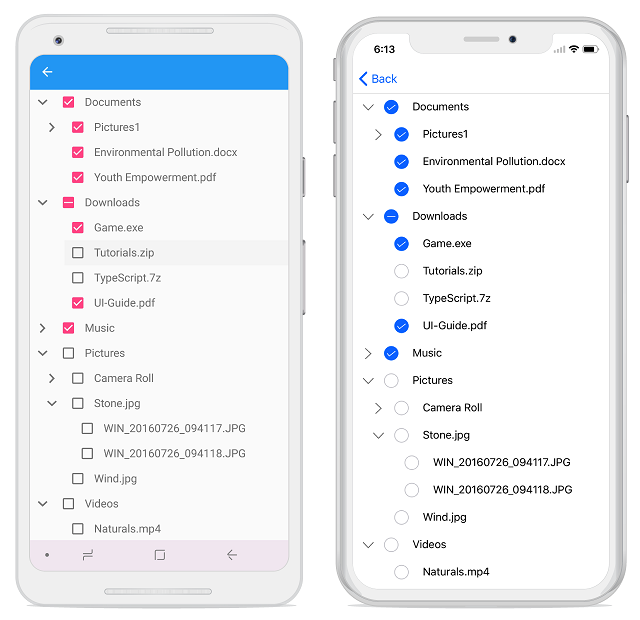

# Checkbox

SfTreeView provides support for loading [CheckBox](https://help.syncfusion.com/xamarin/sfcheckbox/getting-started) in each node, and allows users check/uncheck the corresponding node. There is no built-in support to enable or disable the check box. So, you should add checkbox in the `ItemTemplate` of the `SfTreeView` and bind the `IsChecked` property of the node.



<syncfusion:SfTreeView 
    x:Name="TreeView"  
    CheckBoxMode="Recursive"
    ItemsSource="{Binding NodeCollection}"
    ItemTemplateContextType="Node">
    <syncfusion:SfTreeView.ItemTemplate>
        <DataTemplate>
            <ViewCell>
                <ViewCell.View>
                    <Grid>
                        <Grid Padding="5">
                            <SfCheckBox:SfCheckBox 
                                x:Name="CheckBox"
                                IsChecked="{Binding IsChecked, Mode=TwoWay}"/>
                        </Grid>
                    </Grid>
                </ViewCell.View>
            </ViewCell>
        </DataTemplate>
    </syncfusion:SfTreeView.ItemTemplate>
</syncfusion:SfTreeView>



N> Set `ItemTemplateContextType` to Node for bound mode to use check box in SfTreeView.
For UnBound mode, you can directly set the IsChecked property when creating nodes.



<syncfusion:SfTreeView x:Name="treeView"
                       CheckBoxMode="Recursive">
    <syncfusion:SfTreeView.ItemTemplate>
        <DataTemplate>
            <ViewCell>
                <ViewCell.View>
                    <Grid>
                        <Grid Padding="5">
                            <SfCheckBox:SfCheckBox 
                                x:Name="CheckBox"
                                IsChecked="{Binding IsChecked, Mode=TwoWay}"/>
                        </Grid>
                    </Grid>
                </ViewCell.View>
            </ViewCell>
        </DataTemplate>
    </syncfusion:SfTreeView.ItemTemplate>
    <syncfusion:SfTreeView.Nodes>
        <treeviewengine:TreeViewNode Content="Australia" IsChecked="True" IsExpanded="True">
            <treeviewengine:TreeViewNode.ChildNodes>
                <treeviewengine:TreeViewNode Content="New South Wales">
                    <treeviewengine:TreeViewNode.ChildNodes>
                        <treeviewengine:TreeViewNode Content="Sydney"/>
                    </treeviewengine:TreeViewNode.ChildNodes>
                </treeviewengine:TreeViewNode>
            </treeviewengine:TreeViewNode.ChildNodes>
        </treeviewengine:TreeViewNode>
    </syncfusion:SfTreeView.Nodes>
</syncfusion:SfTreeView>



## CheckBox state

SfTreeView also provides support to process the selection state of the checkbox based on the [CheckBoxMode](https://help.syncfusion.com/cr/xamarin/Syncfusion.SfTreeView.XForms~Syncfusion.XForms.TreeView.SfTreeView~CheckBoxMode.html) property. By default, its value is `None`.
Check box contains the following three states:

* `None`: Check and uncheck are updated in view, but it will not affect the CheckedItems collection.
* `Individual`: CheckBox state affects individual node only, and it does not affect the parent node property value.
* `Recursive`: CheckBox state of the child nodes affect the parent node property value. If all the child nodes are checked within the parent node, then parent node will be checked. If all the child nodes are not checked, then the parent node will not be checked. If any of the child node is checked, then the parent node will be in intermediate state.



<syncfusion:SfTreeView x:Name="TreeView" CheckBoxMode="Recursive"/>


TreeView.CheckBoxMode = CheckBoxMode.Recursive;



N> In recursive mode, the parent nodes checked property is updated only in UI interaction.

## Events

### NodeChecked event

The [NodeChecked](https://help.syncfusion.com/cr/cref_files/xamarin/Syncfusion.SfTreeView.XForms~Syncfusion.XForms.TreeView.SfTreeView~NodeChecked_EV.html) event raised when checking and unchecking the check box at run time. The [NodeCheckedEventArgs](https://help.syncfusion.com/cr/cref_files/xamarin/Syncfusion.SfTreeView.XForms~Syncfusion.XForms.TreeView.NodeCheckedEventArgs.html) has the following members, which provide information for the `NodeChecked` event.

* `Node`: Gets the `TreeViewNode` and data associated with the checked item as its arguments.



treeView.NodeChecked += TreeView_NodeChecked;

private void TreeView_NodeChecked(object sender, Syncfusion.XForms.TreeView.NodeCheckedEventArgs e)
{
     
}



N> `NodeChecked` event occurs only in UI interactions.

## Method

### GetCheckedNodes

Gets all the checked nodes in tree view. When binding `ItemsSource`, you can get the checked nodes list using [CheckedItems](https://help.syncfusion.com/cr/xamarin/Syncfusion.SfTreeView.XForms~Syncfusion.XForms.TreeView.SfTreeView~CheckedItems.html).



treeView.GetCheckedNodes();



## CheckedItems collection

SfTreeView exposes a collection of all checked items. You can select the items while loading.



<syncfusion:SfTreeView 
    x:Name="TreeView"  
    CheckBoxMode="Recursive"
    ItemsSource="{Binding NodeCollection}"
    CheckedItems="{Binding CheckedNodeInfo}"
    ItemTemplateContextType="Node">
    <syncfusion:SfTreeView.ItemTemplate>
        <DataTemplate>
            <ViewCell>
                <ViewCell.View>
                    <Grid>
                        <Grid Padding="5">
                            <SfCheckBox:SfCheckBox 
                                x:Name="CheckBox"
                                IsChecked="{Binding IsChecked, Mode=TwoWay}"/>
                        </Grid>
                    </Grid>
                </ViewCell.View>
            </ViewCell>
        </DataTemplate>
    </syncfusion:SfTreeView.ItemTemplate>
</syncfusion:SfTreeView>


public class ViewModel
{
    private ObservableCollection<object> checkedNodeInfo;
    public ObservableCollection<object> CheckedNodeInfo
    {
        get
        {
            return checkedNodeInfo;
        }
        set
        {
            this.checkedNodeInfo = value;
        }
    }

    public ViewModel()
    {
        checkedNodeInfo = new ObservableCollection<object>();
        checkedNodeInfo.Add(NodeCollection[1]);
    }
}



Now, run the application to render the following output:

You can download the entire source code of this [demo](http://www.syncfusion.com/downloads/support/directtrac/general/ze/CheckBox1906051678).