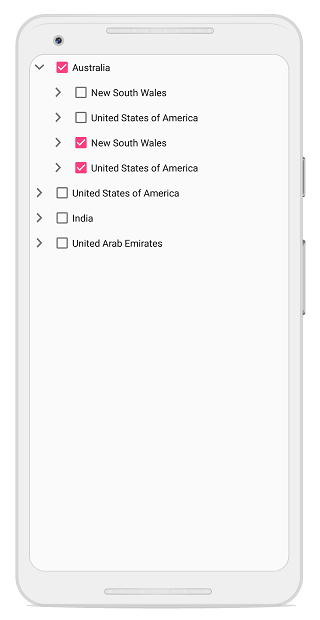

# Checkbox

SfTreeView provides support for loading [CheckBox](https://help.syncfusion.com/xamarin/sfcheckbox/getting-started) in each node, and allows users check/uncheck the corresponding node. So, you should add checkbox in the [ItemTemplate](https://help.syncfusion.com/cr/xamarin/Syncfusion.SfTreeView.XForms~Syncfusion.XForms.TreeView.SfTreeView~ItemTemplate.html) of the `SfTreeView` and bind the [IsChecked](https://help.syncfusion.com/cr/xamarin/Syncfusion.SfTreeView.XForms~Syncfusion.TreeView.Engine.TreeViewNode~IsChecked.html) property of the TreeViewNode.

## Working with Checkbox in BoundMode

When you are populating treeview nodes from [ItemsSource](https://help.syncfusion.com/cr/xamarin/Syncfusion.SfTreeView.XForms~Syncfusion.XForms.TreeView.SfTreeView~ItemsSource.html), then you can get or set the checked items by using [CheckedItems](https://help.syncfusion.com/cr/xamarin/Syncfusion.SfTreeView.XForms~Syncfusion.XForms.TreeView.SfTreeView~CheckedItems.html) property.

N> Set [ItemTemplateContextType](https://help.syncfusion.com/cr/xamarin/Syncfusion.SfTreeView.XForms~Syncfusion.XForms.TreeView.SfTreeView~ItemTemplateContextType.html) as `Node` to bind the `TreeViewNode.IsChecked` property to CheckBox in `ItemTemplate`. To know more about ItemTemplateContextType click [here](https://help.syncfusion.com/xamarin/sftreeview/apperance#bindingcontext-for-itemtemplate).



<?xml version="1.0" encoding="utf-8" ?>
<ContentPage xmlns="http://xamarin.com/schemas/2014/forms"
             xmlns:x="http://schemas.microsoft.com/winfx/2009/xaml"
             xmlns:local="clr-namespace:BoundMode_CheckBox"
             x:Class="BoundMode_CheckBox.MainPage"
             xmlns:TreeView="clr-namespace:Syncfusion.XForms.TreeView;assembly=Syncfusion.SfTreeView.XForms"
             xmlns:SfButtons="clr-namespace:Syncfusion.XForms.Buttons;assembly=Syncfusion.Buttons.XForms"
             xmlns:TreeViewEngine="clr-namespace:Syncfusion.TreeView.Engine;assembly=Syncfusion.SfTreeView.XForms">

    <ContentPage.BindingContext>
        <local:FileManagerViewModel />
    </ContentPage.BindingContext>

    <TreeView:SfTreeView x:Name="SfTreeView"
                         ItemsSource="{Binding Folders}"
                         AutoExpandMode="RootNodesExpanded"
                         ItemTemplateContextType="Node"
                         CheckBoxMode="Recursive"
                         CheckedItems="{Binding CheckedItems}">
        
        <TreeView:SfTreeView.HierarchyPropertyDescriptors>
            <TreeViewEngine:HierarchyPropertyDescriptor TargetType="{x:Type local:Folder}" ChildPropertyName="Files"/>
            <TreeViewEngine:HierarchyPropertyDescriptor TargetType="{x:Type local:File}" ChildPropertyName="SubFiles"/>
        </TreeView:SfTreeView.HierarchyPropertyDescriptors>
        
        <TreeView:SfTreeView.ItemTemplate>
            <DataTemplate>
                <ViewCell>
                    <ViewCell.View>
                        <Grid Padding="5">
                            <SfButtons:SfCheckBox 
                            x:Name="CheckBox"
                            Text="{Binding Content.FileName}"
                            IsChecked="{Binding IsChecked, Mode=TwoWay}"/>
                        </Grid>
                    </ViewCell.View>
                </ViewCell>
            </DataTemplate>
        </TreeView:SfTreeView.ItemTemplate>
    </TreeView:SfTreeView>
</ContentPage>


public class ViewModel
{
    private ObservableCollection<object> checkedItems;
    public ObservableCollection<object> CheckedItems
    {
        get
        {
            return checkedItems;
        }
        set
        {
            checkedItems = value;
        }
    }

    public ViewModel()
    {
        var doc = new Folder() { FileName = "Documents" };
        var typeScript = new File() { FileName = "TypeScript.7z" };
        var uiGuide = new File() { FileName = "UI-Guide.pdf" };
        var song = new File() { FileName = "Gouttes" };
        var stone = new File() { FileName = "Stone.jpg" };
        var wind = new File() { FileName = "Wind.jpg" };

        checkedItems = new ObservableCollection<object>();
        checkedItems.Add(doc);
        checkedItems.Add(typeScript);
        checkedItems.Add(uiGuide);
        checkedItems.Add(stone);
        checkedItems.Add(wind);
        checkedItems.Add(song);
    }
}


You can download the entire source of this demo [here](https://github.com/SyncfusionExamples/checkbox_bound_mode)

## Working with Checkbox in UnBoundMode

You can directly set the [IsChecked](https://help.syncfusion.com/cr/xamarin/Syncfusion.SfTreeView.XForms~Syncfusion.TreeView.Engine.TreeViewNode~IsChecked.html) property when creating nodes.



<?xml version="1.0" encoding="utf-8" ?>
<ContentPage xmlns="http://xamarin.com/schemas/2014/forms"
             xmlns:x="http://schemas.microsoft.com/winfx/2009/xaml"
             xmlns:local="clr-namespace:UnBoundMode_CheckBox"
             x:Class="UnBoundMode_CheckBox.MainPage"
             xmlns:treeviewengine="clr-namespace:Syncfusion.TreeView.Engine;assembly=Syncfusion.SfTreeView.XForms"
             xmlns:SfCheckBox="clr-namespace:Syncfusion.XForms.Buttons;assembly=Syncfusion.Buttons.XForms"
             xmlns:syncfusion="clr-namespace:Syncfusion.XForms.TreeView;assembly=Syncfusion.SfTreeView.XForms">

    <ContentPage.Content>
            <syncfusion:SfTreeView CheckBoxMode="Recursive">
            <syncfusion:SfTreeView.Nodes>
                <treeviewengine:TreeViewNode Content="Australia" IsChecked="True" IsExpanded="True">
                    <treeviewengine:TreeViewNode.ChildNodes>
                        <treeviewengine:TreeViewNode x:Name="newSouthWales" Content="New South Wales"/>
                        <treeviewengine:TreeViewNode Content="United States of America"/>
                        <treeviewengine:TreeViewNode Content="New South Wales" IsChecked="True"/>
                        <treeviewengine:TreeViewNode Content="United States of America" IsChecked="True"/>
                    </treeviewengine:TreeViewNode.ChildNodes>
                </treeviewengine:TreeViewNode>
            </syncfusion:SfTreeView.Nodes>
                
            <syncfusion:SfTreeView.ItemTemplate>
                    <DataTemplate>
                        <ViewCell>
                        <ViewCell.View>
                            <Grid Padding="5">
                                <SfCheckBox:SfCheckBox 
                                    Text="{Binding Content}"
                                    IsChecked="{Binding IsChecked, Mode=TwoWay}" />
                            </Grid>
                        </ViewCell.View>
                        </ViewCell>
                    </DataTemplate>
                </syncfusion:SfTreeView.ItemTemplate>
            </syncfusion:SfTreeView>
    </ContentPage.Content>
</ContentPage>



You can download the entire source of this demo [here](https://github.com/SyncfusionExamples/checkbox_unbound_mode)

## CheckBox state

SfTreeView provides support to process the selection state of the checkbox based on the [CheckBoxMode](https://help.syncfusion.com/cr/xamarin/Syncfusion.SfTreeView.XForms~Syncfusion.XForms.TreeView.SfTreeView~CheckBoxMode.html) property. By default, its value is `None`.
Check box contains the following three states:

* `None`: Check and uncheck are updated only in view, but it will not affect the CheckedItems collection.
* `Individual`: CheckBox state affects individual node only, and it does not affect the parent node or child nodes property value.
* `Recursive`: Check and uncheck the node value affected the parent and child nodes checkBox state. For example If parent nodes checkbox state is check/uncheck then the all of its child nodes checkbox state is check/uncheck. If all the child nodes are checked within the parent node, then parent node will be checked. If all the child nodes are not checked, then the parent node will not be checked. If any of the child node is checked, then the parent node will be in intermediate state.



<syncfusion:SfTreeView x:Name="TreeView" CheckBoxMode="Recursive"/>


TreeView.CheckBoxMode = CheckBoxMode.Recursive;



N> In recursive mode, the parent nodes checked property is updated only in UI interaction.

## Programmatic Check and Uncheck

When the `CheckBoxMode` is other than `None`, the individual `TreeViewNode` or collection of `TreeViewNode`can be checked from the code by setting the  `CheckedItems`, or adding items to the `CheckedItems` property based on the `CheckBoxMode`.

## Checkbox items binding in MVVM

SfTreeView exposes a collection of all checked items. You can select the items while loading.

N> It is only applicable for bound mode cases.



<syncfusion:SfTreeView 
    x:Name="TreeView"  
    CheckBoxMode="Recursive"
    ItemsSource="{Binding NodeCollection}"
    CheckedItems="{Binding CheckedNodeInfo}"
    ItemTemplateContextType="Node">
    <syncfusion:SfTreeView.ItemTemplate>
        <DataTemplate>
            <ViewCell>
                <ViewCell.View>
                        <Grid Padding="5">
                            <SfCheckBox:SfCheckBox
                                x:Name="CheckBox"
                                Text="{Binding Content.FileName}"
                                IsChecked="{Binding IsChecked, Mode=TwoWay}"/>
                        </Grid>
                </ViewCell.View>
            </ViewCell>
        </DataTemplate>
    </syncfusion:SfTreeView.ItemTemplate>
</syncfusion:SfTreeView>


public class ViewModel
{
    private ObservableCollection<object> checkedNodeInfo;
    public ObservableCollection<object> CheckedNodeInfo
    {
        get
        {
            return checkedNodeInfo;
        }
        set
        {
            this.checkedNodeInfo = value;
        }
    }

    public ViewModel()
    {
        var doc = new Folder() { FileName = "Documents" };
        checkedNodeInfo = new ObservableCollection<object>();
        checkedNodeInfo.Add(doc);
    }
}



## Get checked nodes

Gets all the checked nodes in tree view. When binding `ItemsSource`, you can get the checked nodes list using [CheckedItems](https://help.syncfusion.com/cr/xamarin/Syncfusion.SfTreeView.XForms~Syncfusion.XForms.TreeView.SfTreeView~CheckedItems.html).



treeView.GetCheckedNodes();



## Events

### NodeChecked event

The [NodeChecked](https://help.syncfusion.com/cr/cref_files/xamarin/Syncfusion.SfTreeView.XForms~Syncfusion.XForms.TreeView.SfTreeView~NodeChecked_EV.html) event raised when checking and unchecking the check box at run time. The [NodeCheckedEventArgs](https://help.syncfusion.com/cr/cref_files/xamarin/Syncfusion.SfTreeView.XForms~Syncfusion.XForms.TreeView.NodeCheckedEventArgs.html) has the following members, which provide information for the `NodeChecked` event.

* `Node`: Gets the `TreeViewNode` and data associated with the checked item as its arguments.



treeView.NodeChecked += TreeView_NodeChecked;

private void TreeView_NodeChecked(object sender, Syncfusion.XForms.TreeView.NodeCheckedEventArgs e)
{
     
}



N> `NodeChecked` event occurs only in UI interactions.
