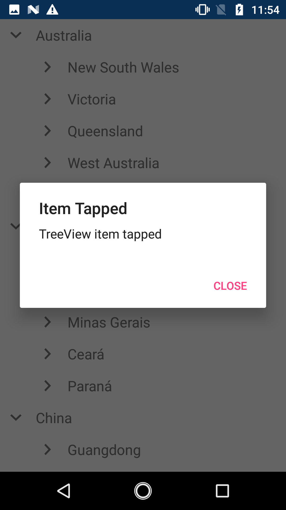
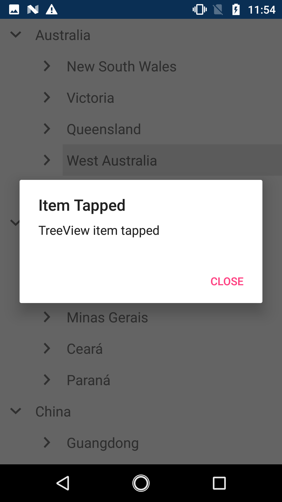
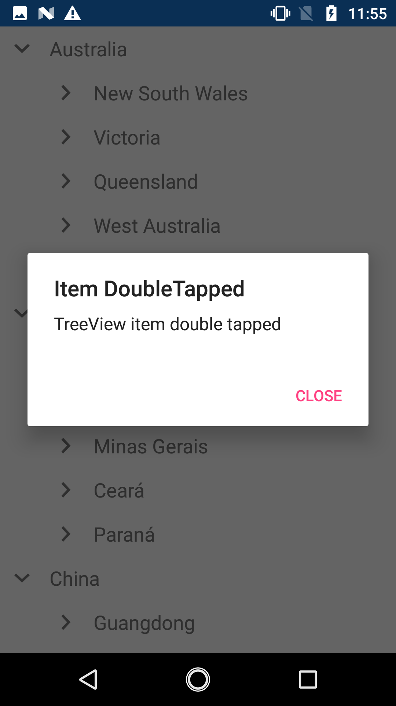
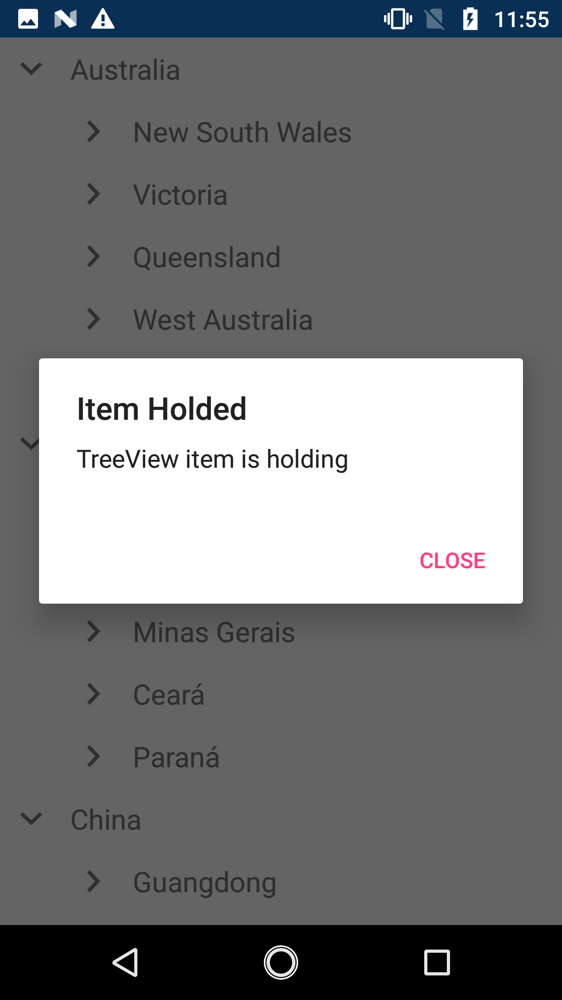

# Interactivity

 This section explains how to work with `TreeView` items.

## Loading
The [Loaded](https://help.syncfusion.com/cr/cref_files/xamarin/Syncfusion.SfTreeView.XForms~Syncfusion.XForms.TreeView.SfTreeView~Loaded_EV.html) event is raised when the TreeView is loading in view for the first time.




treeView.Loaded += TreeView_Loaded;

private void TreeView_Loaded(object sender, TreeViewLoadedEventArgs e)
{
   DisplayAlert("TreeView", "TreeView Loaded", "Close");
}




The `Loaded` event used for the following use cases:

* To scroll the desired item by using the [BringIntoView](https://help.syncfusion.com/cr/cref_files/xamarin/Syncfusion.SfTreeView.XForms~Syncfusion.XForms.TreeView.SfTreeView~NodeCollapsed_EV.html) 
* To expand particular Items or all items after loaded.
* To add selected items.

## Item Tapped, Double Tapped, Hold
TreeView allows to working on with the particular item by following events
* [ItemTapped](https://help.syncfusion.com/cr/cref_files/xamarin/Syncfusion.SfTreeView.XForms~Syncfusion.XForms.TreeView.SfTreeView~ItemTapped_EV.html)
* [ItemDoubleTapped](https://help.syncfusion.com/cr/cref_files/xamarin/Syncfusion.SfTreeView.XForms~Syncfusion.XForms.TreeView.SfTreeView~ItemDoubleTapped_EV.html)
* [ItemHolding](https://help.syncfusion.com/cr/cref_files/xamarin/Syncfusion.SfTreeView.XForms~Syncfusion.XForms.TreeView.SfTreeView~ItemHolding_EV.html)

### Tapped event

The [ItemTapped](https://help.syncfusion.com/cr/cref_files/xamarin/Syncfusion.SfTreeView.XForms~Syncfusion.XForms.TreeView.SfTreeView~ItemTapped_EV.html) event will be triggered whenever tapping the item.  [ItemTappedEventArgs](https://help.syncfusion.com/cr/cref_files/xamarin/Syncfusion.SfTreeView.XForms~Syncfusion.XForms.TreeView.ItemTappedEventArgs.html) has the following members which provides the information for `ItemTapped` event:

 * `Node`: Gets the [TreeViewNode](https://help.syncfusion.com/cr/cref_files/xamarin/Syncfusion.SfTreeView.XForms~Syncfusion.TreeView.Engine.TreeViewNode.html) and data associated with the tapped item as its arguments.
 * `Position`: Gets the touch position in the tapped item.
 * `Handled`: Gets or sets whether the event is handled or not.




treeView.ItemTapped += TreeView_ItemTapped;

private void TreeView_ItemTapped(object sender, Syncfusion.ListView.XForms.ItemTappedEventArgs e)
{
    DisplayAlert("Item Tapped", "TreeView item tapped", "Close");
}




### ItemDoubleTapped event

The [ItemDoubleTapped](https://help.syncfusion.com/cr/cref_files/xamarin/Syncfusion.SfTreeView.XForms~Syncfusion.XForms.TreeView.SfTreeView~ItemDoubleTapped_EV.html) event will be triggered whenever double tapping the item. The [ItemDoubleTappedEventArgs](https://help.syncfusion.com/cr/cref_files/xamarin/Syncfusion.SfTreeView.XForms~Syncfusion.XForms.TreeView.ItemDoubleTappedEventArgs.html) has the following members providing information for the `ItemDoubleTapped` event:

 * `Node`: Gets the [TreeViewNode](https://help.syncfusion.com/cr/cref_files/xamarin/Syncfusion.SfTreeView.XForms~Syncfusion.TreeView.Engine.TreeViewNode.html) and data associated with the double tapped item as its arguments.
 * `Position`: Gets the touch position in the double tapped item.
 * `Handled`: Gets or sets whether the event is handled or not.




treeView.ItemDoubleTapped += TreeView_ItemDoubleTapped;

private void TreeView_ItemDoubleTapped(object sender, ItemDoubleTappedEventArgs e)
{
    DisplayAlert("Item DoubleTapped", "TreeView item double tapped", "Close");
}




### ItemHolding event

The [ItemHolding](https://help.syncfusion.com/cr/cref_files/xamarin/Syncfusion.SfTreeView.XForms~Syncfusion.XForms.TreeView.SfTreeView~ItemHolding_EV.html) event will be triggered whenever long pressing the item.
 [ItemHoldingEventArgs](https://help.syncfusion.com/cr/cref_files/xamarin/Syncfusion.SfTreeView.XForms~Syncfusion.XForms.TreeView.ItemHoldingEventArgs.html) has the following members which provides the information for `ItemHolding` event:

 * `Node`: Gets the [TreeViewNode](https://help.syncfusion.com/cr/cref_files/xamarin/Syncfusion.SfTreeView.XForms~Syncfusion.TreeView.Engine.TreeViewNode.html) and data associated with the hold item as its arguments.
 * `Position`: Gets the touch position in the hold item.
 * `Handled`: Gets or sets whether the event is handled or not.




treeView.ItemHolding += TreeView_ItemHolding;
private void TreeView_ItemHolding(object sender, ItemHoldingEventArgs e)
{
    DisplayAlert("Item Hold", "TreeView item is holding","Close");   
}




