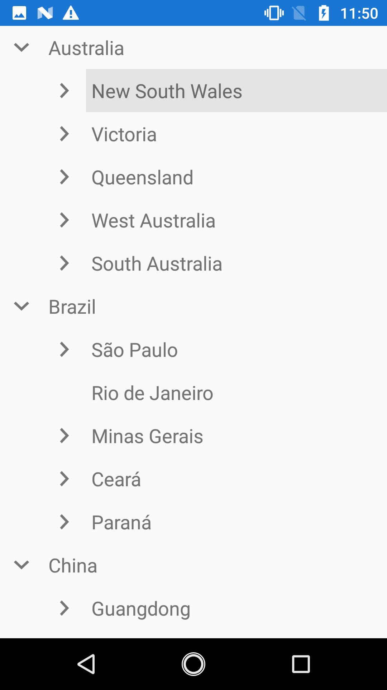
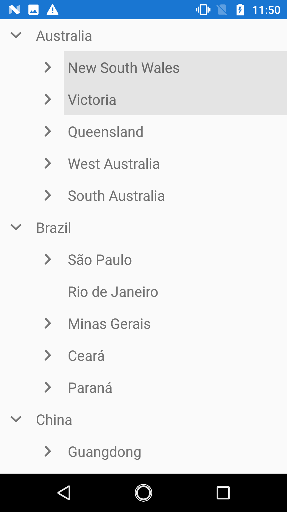

# MVVM

This section explains about how to work with MVVM pattern in TreeView.

## Binding properties in MVVM pattern

### Binding SelectedItem

TreeView support to select the items through binding the [SelectedItem](https://help.syncfusion.com/cr/xamarin/Syncfusion.SfTreeView.XForms~Syncfusion.XForms.TreeView.SfTreeView~SelectedItem.html) property from view model by implementing the `INotifyPropertyChanged` interface that gives the call back notification to UI.



<syncfusion:SfTreeView x:Name="treeView" 
                       SelectedItem="{Binding SelectedPlace}"
                       ChildPropertyName="States"
                       ItemsSource="{Binding CountriesInfo}"/>


treeView.SetBinding(SfTreeView.SelectedItemProperty, new Binding("SelectedPlace", BindingMode.TwoWay));






// CountriesViewModel.cs
public class CountriesViewModel
{
    public CountriesViewModel()
    {
        GenerateCountriesInfo();
    }
    public ObservableCollection<Countries> CountriesInfo { get; set; }

    public object SelectedPlace { get; set; }

    private void GenerateCountriesInfo()
    {
        var australia = new Countries() { Name = "Australia" };
        var _NSW = new Countries() { Name = "New South Wales" };
        var _Sydney = new Countries() { Name = "Sydney" };
        australia.States = new ObservableCollection<Countries>();
        australia.States.Add(_NSW);
        _NSW.States = new ObservableCollection<Countries>();
        _NSW.States.Add(_Sydney);
        var usa = new Countries() { Name = "United States of America" };
        var _California = new Countries() { Name = "California" };
        var _LosAngeles = new Countries() { Name = "Los Angeles" };
        usa.States = new ObservableCollection<Countries>();
        usa.States.Add(_California);
        _California.States = new ObservableCollection<Countries>();
        _California.States.Add(_LosAngeles);
         
        this.CountriesInfo = new ObservableCollection<Countries>();
        CountriesInfo.Add(australia);
        CountriesInfo.Add(usa);

        SelectedPlace=_NSW
    }
}



### Binding SelectedItems

TreeView support to select multiple items through binding the [SelectedItems](https://help.syncfusion.com/cr/xamarin/Syncfusion.SfTreeView.XForms~Syncfusion.XForms.TreeView.SfTreeView~SelectedItems.html) property from view model with `ObservableCollection<object>` type. 



<syncfusion:SfTreeView x:Name="treeView"
                       SelectionMode="Multiple"
                       SelectedItems="{Binding SelectedCountries}"
                       ChildPropertyName="States"
                       ItemsSource="{Binding CountriesInfo}"/>


treeView.SelectionMode = SelectionMode.Multiple;
treeView.SetBinding(SfTreeView.SelectedItemsProperty, new Binding("SelectedCountries", BindingMode.TwoWay));





// CountriesViewModel.cs
// CountriesViewModel.cs
public class CountriesViewModel
{
    public CountriesViewModel()
    {
        GenerateCountriesInfo();
    }

    public ObservableCollection<Countries> CountriesInfo { get; set; }

    public ObservableCollection<object> SelectedCountries { get; set; }

    private void GenerateCountriesInfo()
    {
        var australia = new Countries() { Name = "Australia" };
        var _NSW = new Countries() { Name = "New South Wales" };
        var _Sydney = new Countries() { Name = "Sydney" };
        var _Victoria = new Countries() { Name = "Victoria" };
        australia.States = new ObservableCollection<Countries>();
        australia.States.Add(_NSW);
        australia.States.Add(_Victoria);
        _NSW.States = new ObservableCollection<Countries>();
        _NSW.States.Add(_Sydney);
        var usa = new Countries() { Name = "United States of America" };
        var _California = new Countries() { Name = "California" };
        usa.States = new ObservableCollection<Countries>();
        usa.States.Add(_California);
      
        this.CountriesInfo = new ObservableCollection<Countries>();
        CountriesInfo.Add(australia);
        CountriesInfo.Add(usa);

        SelectedCountries = new ObservableCollection<object>();
        SelectedCountries.Add(_NSW);
        SelectedCountries.Add(_Victoria);
    }
}



You can download the entire sample [here](http://www.syncfusion.com/downloads/support/directtrac/general/ze/Selection148873057).

## Commands

### Tap command

The [TapCommand](https://help.syncfusion.com/cr/cref_files/xamarin/Syncfusion.SfTreeView.XForms~Syncfusion.XForms.TreeView.SfTreeView~TapCommand.html) will be triggered whenever tapping the item and passing the [ItemTappedEventArgs](https://help.syncfusion.com/cr/cref_files/xamarin/Syncfusion.SfTreeView.XForms~Syncfusion.XForms.TreeView.ItemTappedEventArgs.html) as parameter.




treeView.TapCommand = viewModel.TappedCommand;

public class CommandViewModel
{
    private Command<Object> tappedCommand;

    public Command<object> TappedCommand
    {
        get { return tappedCommand; }
        set { tappedCommand = value; }
    }

    public CommandViewModel()
    {            
        TappedCommand = new Command<object>(TappedCommandMethod);
    }

    private void TappedCommandMethod(object obj)
    {
            App.Current.MainPage.DisplayAlert("Alert", (obj.AddedItems[0] as Countries).Name + " is Tapped", "OK");            
    }   
}



### Hold command

The [HoldCommand](https://help.syncfusion.com/cr/cref_files/xamarin/Syncfusion.SfTreeView.XForms~Syncfusion.XForms.TreeView.SfTreeView~HoldCommand.html) will be triggered whenever an item is long pressed and passing the [ItemHoldingEventArgs](https://help.syncfusion.com/cr/cref_files/xamarin/Syncfusion.SfTreeView.XForms~Syncfusion.XForms.TreeView.ItemHoldingEventArgs.html) as parameter.
 



treeView.HoldCommand = viewModel.HoldingCommand;

public class CommandViewModel
{
    private Command<Object> holdingCommand;

    public Command<object> HoldingCommand
    {
        get { return holdingCommand; }
        set { holdingCommand = value; }
    }

    public CommandViewModel()
    {            
        HoldingCommand = new Command<object>(HoldingCommandMethod);
    }

    private void HoldingCommandMethod(object obj)
    {
            App.Current.MainPage.DisplayAlert("Alert", (obj.AddedItems[0] as Countries).Name + " is Holding", "OK");            
    }   
}



### Expand command

The `ExpandCommand` will be triggered while expanding the node and passing the [TreeViewNode](https://help.syncfusion.com/cr/cref_files/xamarin/Syncfusion.SfTreeView.XForms~Syncfusion.TreeView.Engine.TreeViewNode.html) as command parameter. TreeView expands the node based on the return value of `CanExecute` method implementation of ExpandCommand. If you return false, then expand action will be canceled. `Execute` method implementation of `ExpandCommand` will get called after expanding of node.




<ContentPage xmlns="http://xamarin.com/schemas/2014/forms"
             xmlns:x="http://schemas.microsoft.com/winfx/2009/xaml"
             xmlns:local="clr-namespace:Selection"
             xmlns:syncfusion="clr-namespace:Syncfusion.XForms.TreeView;assembly=Syncfusion.SfTreeView.XForms"
             x:Class="Selection.MainPage">
    <ContentPage.BindingContext>
        <local:CountriesViewModel x:Name="viewModel"/>
    </ContentPage.BindingContext>
    <ContentPage.Content>
        <syncfusion:SfTreeView x:Name="treeView"
                               ExpandCommand="ExpandingCommand"/> 
    </ContentPage.Content>
</ContentPage>




/// 

/// CommandViewModel class that implements [Command](https://docs.microsoft.com/en-us/dotnet/api/xamarin.forms.command?view=xamarin-forms). 
/// 

public class CommandViewModel
{
    private Command<Object> expandingCommand;

    public Command<object> ExpandingCommand
    {
        get { return expandingCommand; }
        set { expandingCommand = value; }
    }

    public CommandViewModel()
    {            
        ExpandingCommand = new Command<object>(ExpandCommandAction, CanExecute);
    }

    /// 

    /// CanExecute method is called before expanding of node.
    /// 

    /// <returns>Handle expand action by returning true or false. </returns>
    /// <param name="obj">TreeViewNode is passed as command parameter. </param>
    public bool CanExecute(object obj)
    {
        //You can also return false to skip the execution of expand command action.
        return true;
    }

    /// 

    /// Method gets called after expanding action performed.
    /// 

    /// <param name="obj">TreeViewNode is passed as command parameter. </param>
    private void ExpandCommandAction(object obj)
    {
        App.Current.MainPage.DisplayAlert("Alert", "TreeView node is Expanded", "OK");
    }   
}



### Collapse command

The `CollapseCommand` will be triggered while collapsing the node and passing the [TreeViewNode](https://help.syncfusion.com/cr/cref_files/xamarin/Syncfusion.SfTreeView.XForms~Syncfusion.TreeView.Engine.TreeViewNode.html) as command parameter. TreeView collapses the node based on the return value of `CanExecute` method implementation of CollapseCommand. If you return false, then collapse action will be canceled. `Execute` method implementation of `CollapseCommand` will get called after collapsing of node.



<ContentPage xmlns="http://xamarin.com/schemas/2014/forms"
             xmlns:x="http://schemas.microsoft.com/winfx/2009/xaml"
             xmlns:local="clr-namespace:Selection"
             xmlns:syncfusion="clr-namespace:Syncfusion.XForms.TreeView;assembly=Syncfusion.SfTreeView.XForms"
             x:Class="Selection.MainPage">
    <ContentPage.BindingContext>
        <local:CountriesViewModel x:Name="viewModel"/>
    </ContentPage.BindingContext>
    <ContentPage.Content>
        <syncfusion:SfTreeView x:Name="treeView"
                               CollapseCommand="CollapsingCommand"/> 
    </ContentPage.Content>
</ContentPage>



/// 

/// CommandViewModel class that implements [Command](https://docs.microsoft.com/en-us/dotnet/api/xamarin.forms.command?view=xamarin-forms). 
/// 

public class CommandViewModel
{
	private Command<object> collapsingCommand;
	
	public Command<object> CollapsingCommand
	{
		get { return collapsingCommand; }
		set { collapsingCommand = value; }
	}
	
	public CommandViewModel()
	{
		CollapsingCommand = new Command<object>(CollapseCommandAction, CanExecute);
	}
    
	/// 

    /// CanExecute method is called before collapsing of node. 
    /// 

    /// <returns>Handle collapse action by returning true or false. </returns>
    /// <param name="obj">TreeViewNode is passed as command parameter. </param>
    public bool CanExecute(object obj)
    {
        //You can also return false to skip the execution of collapse command action.
        return true;
    }

    /// 

    /// Method gets called after collapsing action performed.
    /// 

    /// <param name="obj">TreeViewNode is passed as command parameter. </param>
	private void CollapseCommandAction(object obj)
	{
		App.Current.MainPage.DisplayAlert("Alert", "TreeView node is Collapsed", "OK");
	}
}



## Event to command

The `TreeView` event can be converted into commands using [Behaviors](https://developer.xamarin.com/guides/xamarin-forms/behaviors/). To achieve this, create a command in the ViewModel class and associate it to the TreeView event using `Behaviors`.



<syncfusion:SfTreeView x:Name="treeView"
                       SelectionMode="Multiple"
                       SelectedItems="{Binding SelectedCountries}"
                       ChildPropertyName="States"
                       ItemsSource="{Binding CountriesInfo}">
    <syncfusion:SfTreeView.Behaviors>
        <local:EventToCommandBehavior EventName="SelectionChanged" Command="{Binding SelectionChangedCommand}"/>
    </syncfusion:SfTreeView.Behaviors>
</syncfusion:SfTreeView>


public class CountriesViewModel : INotifyPropertyChanged
{
    public Command<ItemSelectionChangedEventArgs> selectionChangedCommand;

    public CountriesViewModel()
    {
        SelectionChangedCommand = new Command<Syncfusion.XForms.TreeView.ItemSelectionChangedEventArgs>(OnSelectionChanged);
        GenerateCountriesInfo();
    }

    public ObservableCollection<Countries> CountriesInfo { get; set; }

    public ObservableCollection<object> SelectedCountries { get; set; }

    public Command<ItemSelectionChangedEventArgs> SelectionChangedCommand
    {
        get { return selectionChangedCommand; }
        protected set { selectionChangedCommand = value; }
    }

    private void OnSelectionChanged(ItemSelectionChangedEventArgs obj)
    {
        App.Current.MainPage.DisplayAlert("Alert", (obj.AddedItems[0] as Countries).Name + " is selected", "OK");
    }

    public event PropertyChangedEventHandler PropertyChanged;

    public void OnPropertyChanged(string name)
    {
        if (this.PropertyChanged != null)
            this.PropertyChanged(this, new PropertyChangedEventArgs(name));
    }

    private void GenerateCountriesInfo()
    {
        var australia = new Countries() { Name = "Australia" };
        var _NSW = new Countries() { Name = "New South Wales" };
        var _Victoria = new Countries() { Name = "Victoria" };
        australia.States = new ObservableCollection<Countries>();
        australia.States.Add(_NSW);
        australia.States.Add(_Victoria);
        var usa = new Countries() { Name = "United States of America" };
        var _California = new Countries() { Name = "California" };
        usa.States = new ObservableCollection<Countries>();
        usa.States.Add(_California);
      
        this.CountriesInfo = new ObservableCollection<Countries>();
        CountriesInfo.Add(australia);
        CountriesInfo.Add(usa);
    }
}



You can download the example sample [here](http://www.syncfusion.com/downloads/support/directtrac/general/ze/EventToCommand839299289.zip).

For more information regarding the event to command behavior in Xamarin.Forms, you can refer [this](https://developer.xamarin.com/samples/xamarin-forms/Behaviors/EventToCommandBehavior/) link.