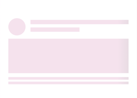

# Customization of Shimmer

The Shimmer control supports options to customize the wave color, shimmer color, wave direction, wave animation duration, and more. This section explains how to customize the shimmer control.

## WaveDirection

The [`WaveDirection`](https://help.syncfusion.com/cr/xamarin/Syncfusion.XForms.Shimmer.WaveDirection.html) property of [`SfShimmer`](https://help.syncfusion.com/cr/xamarin/Syncfusion.XForms.Shimmer.SfShimmer.html) is used to change the direction of shimmer wave. The following different wave directions are available in [`SfShimmer`](https://help.syncfusion.com/cr/xamarin/Syncfusion.XForms.Shimmer.SfShimmer.html):

* `Default`
* `LeftToRight`
* `TopToBottom`
* `RightToLeft`
* `BottomToTop`

 

 

        <shimmer:SfShimmer x:Name="shimmer" VerticalOptions="FillAndExpand" WaveDirection="LeftToRight">
                <shimmer:SfShimmer.Content>
                     <StackLayout>
                        <Label Text="Content is loaded!"/>
                      </StackLayout>
                </shimmer:SfShimmer.Content>
        </shimmer:SfShimmer>



 

            shimmer = new SfShimmer()
            {
                WaveDirection = WaveDirection.LeftToRight,
                VerticalOptions = LayoutOptions.FillAndExpand,
                Content = new Label
                {
                    Text = "Content is loaded!"
                }
            };
            this.Content = shimmer;





## Color

The [`Color`](https://help.syncfusion.com/cr/xamarin/Syncfusion.XForms.Shimmer.SfShimmer.html#Syncfusion_XForms_Shimmer_SfShimmer_Color) property of [`SfShimmer`](https://help.syncfusion.com/cr/xamarin/Syncfusion.XForms.Shimmer.SfShimmer.html) is used to customize the color of shimmer.

 

 

        <shimmer:SfShimmer x:Name="shimmer" VerticalOptions="FillAndExpand" Color="#F4E2EE">
                <shimmer:SfShimmer.Content>
                     <StackLayout>
                        <Label Text="Content is loaded!"/>
                      </StackLayout>
                </shimmer:SfShimmer.Content>
        </shimmer:SfShimmer>



 

            shimmer = new SfShimmer()
            {
                Color = Color.FromHex("#F4E2EE"),
                VerticalOptions = LayoutOptions.FillAndExpand,
                Content = new Label
                {
                    Text = "Content is loaded!"
                }
            };
            this.Content = shimmer;





## WaveColor

The [`WaveColor`](https://help.syncfusion.com/cr/xamarin/Syncfusion.XForms.Shimmer.SfShimmer.html#Syncfusion_XForms_Shimmer_SfShimmer_WaveColor) property of [`SfShimmer`](https://help.syncfusion.com/cr/xamarin/Syncfusion.XForms.Shimmer.SfShimmer.html) is used to customize the color of wave.

 

 

        <shimmer:SfShimmer x:Name="shimmer" VerticalOptions="FillAndExpand" WaveColor="#B8D4F2">
                <shimmer:SfShimmer.Content>
                     <StackLayout>
                        <Label Text="Content is loaded!"/>
                      </StackLayout>
                </shimmer:SfShimmer.Content>
        </shimmer:SfShimmer>



 

            shimmer = new SfShimmer()
            {
                WaveColor = Color.FromHex("#B8D4F2"),
                VerticalOptions = LayoutOptions.FillAndExpand,
                Content = new Label
                {
                    Text = "Content is loaded!"
                }
            };
            this.Content = shimmer;





## WaveWidth

The [`WaveWidth`](https://help.syncfusion.com/cr/xamarin/Syncfusion.XForms.Shimmer.SfShimmer.html#Syncfusion_XForms_Shimmer_SfShimmer_WaveWidth) property of [`SfShimmer`](https://help.syncfusion.com/cr/xamarin/Syncfusion.XForms.Shimmer.SfShimmer.html) is used to customize the width of wave.

 

 

        <shimmer:SfShimmer x:Name="shimmer" VerticalOptions="FillAndExpand" WaveColor="#B8D4F2" WaveWidth ="100">
                <shimmer:SfShimmer.Content>
                     <StackLayout>
                        <Label Text="Content is loaded!"/>
                      </StackLayout>
                </shimmer:SfShimmer.Content>
        </shimmer:SfShimmer>



 

            shimmer = new SfShimmer()
            {
                WaveWidth = 100,
                WaveColor = Color.FromHex("#B8D4F2"),
                VerticalOptions = LayoutOptions.FillAndExpand,
                Content = new Label
                {
                    Text = "Content is loaded!"
                }
            };
            this.Content = shimmer;





## AnimationDuration

You can control the duration of wave animation using the [`AnimationDuration`](https://help.syncfusion.com/cr/xamarin/Syncfusion.XForms.Shimmer.SfShimmer.html#Syncfusion_XForms_Shimmer_SfShimmer_AnimationDuration) property of [`SfShimmer`](https://help.syncfusion.com/cr/xamarin/Syncfusion.XForms.Shimmer.SfShimmer.html). The default value of [`AnimationDuration`](https://help.syncfusion.com/cr/xamarin/Syncfusion.XForms.Shimmer.SfShimmer.html#Syncfusion_XForms_Shimmer_SfShimmer_AnimationDuration) is 1000 ms.

 

 

        <shimmer:SfShimmer x:Name="shimmer" VerticalOptions="FillAndExpand" AnimationDuration ="2000">
                <shimmer:SfShimmer.Content>
                     <StackLayout>
                        <Label Text="Content is loaded!"/>
                      </StackLayout>
                </shimmer:SfShimmer.Content>
        </shimmer:SfShimmer>



 

            shimmer = new SfShimmer()
            {
                AnimationDuration = 2000,
                VerticalOptions = LayoutOptions.FillAndExpand,
                Content = new Label
                {
                    Text = "Content is loaded!"
                }
            };
            this.Content = shimmer;





## See also

[How to set the custom view in SfShimmer using style](https://www.syncfusion.com/kb/11851/how-to-set-the-custom-view-in-xamarin-forms-shimmer-using-style)
