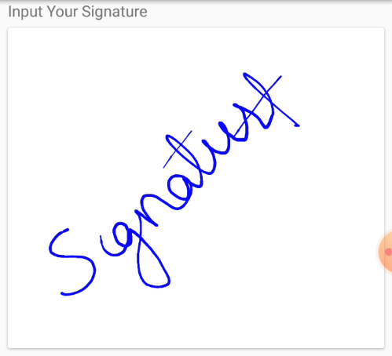

# Customization in Signature Pad

The Signature Pad control supports to customize the stroke color and stroke width using the following API.

## Stroke color

The color of the stroke drawn can be customized using the `StrokeColor` API.





    <signature:SfSignaturePad HeightRequest="250" StrokeColor="Red"/>





    SfSignaturePad signature = new SfSignaturePad();
    signature.StrokeColor = Color.Red;
    signature.HeightRequest = 250;
    this.Content = signature;
    




## Stroke width

The width of the stroke drawn can be customized by setting the `MinimumStrokeWidth` and `MaximumStrokeWidth` API. The `MinimumStrokeWidth` defines the minimum thickness of the stroke that can be drawn and the `MaximumStrokeWidth` defines the maximum thickness the stroke can draw based on the speed and impression we provide through gesture.

N> The default value of `MinimumStrokeWidth` is 0.08 and `MaximumStrokeWidth` is 5.





     <signature:SfSignaturePad HeightRequest="250" 
                          MinimumStrokeWidth="1" 
                          MaximumStrokeWidth="15"/>





    SfSignaturePad signature = new SfSignaturePad();
    signature.MinimumStrokeWidth = 1;
    signature.MaximumStrokeWidth = 4;
    signature.HeightRequest = 250;
    this.Content = signature;
    




N> View [sample](https://github.com/SyncfusionExamples/xamarin-sfsignaturepad-examples/tree/master/Samples/SfSignaturePadCustomization) in GitHub