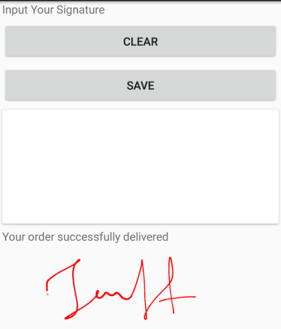

---

layout: post
title: Export of Syncfusion SfSignaturePad control for Xamarin.Forms
description: This section explains the details about the export information of Syncfusion SfSignaturePad control for Xamarin.Forms
platform: xamarin
control: SfSignaturePad
documentation: ug

---

# Export types in SfSignaturePad

You can export the signature as an image. You have to manually call `Save` method to export the sign as an image.

The `Clear` method is used to clear the sign on the view.





     <StackLayout Padding="10,40,10,10">
        <Label Text="Input Your Signature"/>
        <Button Text="Clear" x:Name="clear" Clicked="clear_Clicked"/>
        <Button Text="Save" x:Name="save" Clicked="save_Clicked"/>
        <Frame>
            <sign:SfSignaturePad x:Name="signaturePad"
                                 HeightRequest="250" 
                                 StrokeColor="Red"
                                 MinimumStrokeWidth="1" 
                                 MaximumStrokeWidth="4"/>
        </Frame>
        <Label Text="Your order successfully delivered" x:Name="orderLabel" IsVisible="False"/>
        <Image x:Name="image"/>
    </StackLayout>





    public partial class MainPage : ContentPage
    {
        public MainPage()
        {
            InitializeComponent();
        }
        private void clear_Clicked(object sender, EventArgs e)
        {
            signaturePad.Clear();
        }

        private void save_Clicked(object sender, EventArgs e)
        {
            signaturePad.Save();
            orderLabel.IsVisible = true;
            if (this.signaturePad.ImageSource!=null)
            {
                image.Source = this.signaturePad.ImageSource;
            }
        }





[Sample link](https://www.syncfusion.com/downloads/support/directtrac/general/ze/Signature_Export-1275754159)