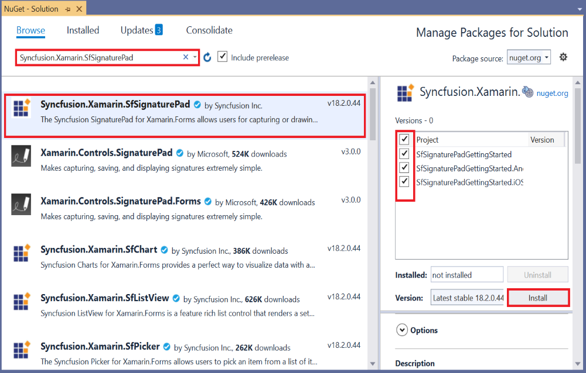

# Getting Started with Xamarin Signature Pad (SfSignaturePad)

This section explains the steps required to configure the Signature Pad.

## Adding SfSignaturePad reference

You can add the Signature Pad reference using one of the following methods:

**Method 1: Adding SfSignaturePad reference from nuget.org**

Syncfusion Xamarin components are available in [nuget.org](https://www.nuget.org/). To add Signature Pad to your project, open the NuGet package manager in Visual Studio, search for [Syncfusion.Xamarin.SfSignaturePad](https://www.nuget.org/packages/Syncfusion.Xamarin.SfSignaturePad), and then install it.

N> Install the same version of `SfSignaturePad` Nuget in all the projects.

**Method 2: Adding SfSignaturePad reference from toolbox**

Syncfusion also provides Xamarin Toolbox. Using this toolbox, you can drag the `SfSignaturePad` control to the XAML page. It will automatically install the required NuGet packages and add the namespace to the page. To install Syncfusion Xamarin Toolbox, refer to this [Toolbox](https://help.syncfusion.com/xamarin/utility#toolbox).

**Method 3: Adding SfSignaturePad assemblies manually from the installed location**

If you prefer to manually reference the assemblies instead of referencing from NuGet, add the following assemblies in respective projects.

Location: {Installed location}/{version}/Xamarin/lib

<table>
<tr>
<td>PCL</td>
<td>Syncfusion.SfSignaturePad.XForms.dll Syncfusion.Core.XForms.dll </td>
</tr>
<tr>
<td>Android</td>
<td>Syncfusion.SfSignaturePad.XForms.dll Syncfusion.SfSignaturePad.XForms.Android.dll Syncfusion.Core.XForms.dll
 Syncfusion.Core.XForms.Android.dll </td>
</tr>
<tr>
<td>iOS</td>
<td>Syncfusion.SfSignaturePad.XForms.dll Syncfusion.SfSignaturePad.XForms.iOS.dll Syncfusion.Core.XForms.dll Syncfusion.Core.XForms.iOS.dll </td>
</tr>
</table>

**Method 4: Adding SfSignaturePad dependency package**

In addition, you need to install the 1.68.0 version of [SkiaSharp](https://www.nuget.org/packages/SkiaSharp.Views.Forms/1.68.0) nuget in all projects

N> To know more about obtaining our components, refer to these links for [Mac](https://help.syncfusion.com/xamarin/introduction/download-and-installation/mac/) and [Windows](https://help.syncfusion.com/xamarin/introduction/download-and-installation/windows/).

## Launching the application on each platform with SfSignaturePad

To use the Signature Pad in an application, each platform requires some additional configurations. The configurations vary from platform to platform and is discussed in the following sections:

N> If you are adding the references from toolbox, this step is not needed.

### iOS

To launch the SfSignaturePad in iOS, call the `SfSignaturePadRenderer.Init()` in the `FinishedLaunching` method of the AppDelegate class after the Xamarin.Forms framework has been initialized and before the LoadApplication is called as demonstrated in the following code sample.

 

 public override bool FinishedLaunching(UIApplication app, NSDictionary options)
 {
            global::Xamarin.Forms.Forms.Init();
            LoadApplication(new App());
            // Add below line if you are using Signature Pad.
            Syncfusion.XForms.iOS.SignaturePad.SfSignaturePadRenderer.Init();
            return base.FinishedLaunching(app, options);
 }



### Android

The Android platform does not require any additional configurations to render the Signature Pad.

N> Signature Pad support has not been provided for UWP Platform.

## Adding a namespace

Add the following namespace.





    xmlns:signature="clr-namespace:Syncfusion.XForms.SignaturePad;assembly=Syncfusion.SfSignaturePad.XForms"





    using Syncfusion.XForms.SignaturePad;





## Creating an SfSignaturePad control

Create an instance for the Signature Pad control, and add it as content.





<signature:SfSignaturePad>        
</signature:SfSignaturePad>





// Creating an Signature Pad control.
SfSignaturePad signature = new SfSignaturePad();
Content = signature;
	




## Getting Started with a Signature Pad control

The Signature Pad control is configured entirely in C# code or in XAML markup. The following steps explain how to create a Signature Pad and configure their elements.





<?xml version="1.0" encoding="utf-8" ?>
<ContentPage xmlns="http://xamarin.com/schemas/2014/forms"
             xmlns:x="http://schemas.microsoft.com/winfx/2009/xaml"
             xmlns:d="http://xamarin.com/schemas/2014/forms/design"
             xmlns:mc="http://schemas.openxmlformats.org/markup-compatibility/2006"
             mc:Ignorable="d"
             xmlns:signature="clr-namespace:Syncfusion.XForms.SignaturePad;assembly=Syncfusion.SfSignaturePad.XForms"
             x:Class="SfSignaturePadGettingStarted.MainPage">

    <StackLayout>
        <Label Text="Input Your Signature"/>
        <Frame>
            <signature:SfSignaturePad HeightRequest="250"/>
        </Frame>
    </StackLayout>

</ContentPage>





using System.ComponentModel;
using Xamarin.Forms;
using Syncfusion.XForms.SignaturePad;

namespace SfSignaturePadGettingStarted
{
    // Learn more about making custom code visible in the Xamarin.Forms previewer
    // by visiting https://aka.ms/xamarinforms-previewer
    [DesignTimeVisible(false)]
    public partial class MainPage : ContentPage
    {
        public MainPage()
        {
            InitializeComponent();

            StackLayout stack = new StackLayout();
            Label text = new Label() { Text = "Input Your Signature" };
            Frame frame = new Frame();
            SfSignaturePad signature = new SfSignaturePad();
            signature.HeightRequest = 250;
            frame.Content = signature;
            stack.Children.Add(text);
            stack.Children.Add(frame);
            this.Content = stack;
        }
    }
}
	




N> View [sample](https://github.com/SyncfusionExamples/xamarin-sfsignaturepad-examples/tree/master/Samples/SfSignaturePadGettingStarted) in GitHub