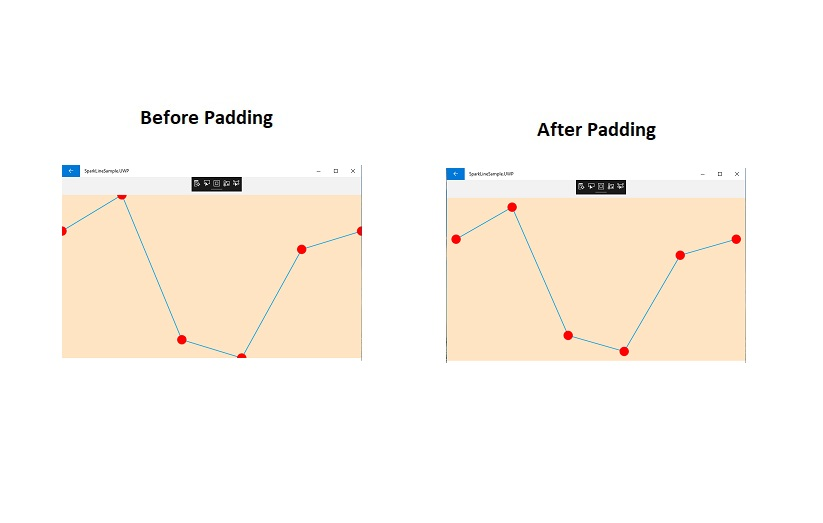

# Customize data points

Color of the first, last, high, low and negative data points can be customized using the following properties.

* [`FirstPointColor`](https://help.syncfusion.com/cr/xamarin/Syncfusion.SfSparkline.XForms.SfColumnSparkline.html#Syncfusion_SfSparkline_XForms_SfColumnSparkline_FirstPointColor) - used to change the first point color of the sparkline.
* [`LastPointColor`](https://help.syncfusion.com/cr/xamarin/Syncfusion.SfSparkline.XForms.SfColumnSparkline.html#Syncfusion_SfSparkline_XForms_SfColumnSparkline_LastPointColor) - used to change the last point color of the sparkline.
* [`HighPointColor`](https://help.syncfusion.com/cr/xamarin/Syncfusion.SfSparkline.XForms.SfColumnSparkline.html#Syncfusion_SfSparkline_XForms_SfColumnSparkline_HighPointColor) - used to change the high point color of the sparkline.
* [`LowPointColor`](https://help.syncfusion.com/cr/xamarin/Syncfusion.SfSparkline.XForms.SfColumnSparkline.html#Syncfusion_SfSparkline_XForms_SfColumnSparkline_LowPointColor) - used to change the low point color of the sparkline.
* [`NegativePointsColor`](https://help.syncfusion.com/cr/xamarin/Syncfusion.SfSparkline.XForms.SfColumnSparkline.html#Syncfusion_SfSparkline_XForms_SfColumnSparkline_NegativePointsColor) - used to change the negative point color of the sparkline.

N> [`NegativePointsColor`](https://help.syncfusion.com/cr/xamarin/Syncfusion.SfSparkline.XForms.SfColumnSparkline.html#Syncfusion_SfSparkline_XForms_SfColumnSparkline_NegativePointsColor) is applicable for [`SfColumnSparkline`](https://help.syncfusion.com/cr/xamarin/Syncfusion.SfSparkline.XForms.SfColumnSparkline.html) and [`SfWinLossSparkline`](https://help.syncfusion.com/cr/xamarin/Syncfusion.SfSparkline.XForms.SfWinLossSparkline.html) alone.

Code snippet to customize the markers

 



<sparkline:SfLineSparkline ItemsSource = "{Binding Data}" 
                            YBindingPath = "Performance"
                            FirstPointColor="Green"
                            LastPointColor="Blue"
                            HighPointColor="Purple"
                            LowPointColor="Red">  
    <sparkline:SfLineSparkline.Marker>
        <sparkline:MarkerBase IsVisible="True" 
                              Width= "15"
                              Height= "15"/>
    </sparkline:SfLineSparkline.Marker> 
</sparkline:SfLineSparkline>





SfLineSparkline lineSparkline = new SfLineSparkline()
{
    YBindingPath = "Performance",
    ItemsSource = viewModel.Data,
    Marker = new MarkerBase()
    {
        IsVisible = true,
        Width = 15,
        Height = 15
    },

    FirstPointColor = Color.Green,
    LastPointColor = Color.Blue,
    HighPointColor = Color.Purple,
    LowPointColor = Color.Red
};





Code snippet to customize the segments

 



 <sparkline:SfColumnSparkline ItemsSource="{Binding Data}" 
                              YBindingPath="Performance"
                              FirstPointColor="Green"
                              LastPointColor="Purple"
                              HighPointColor="Maroon"
                              LowPointColor="Blue"
                              NegativePointsColor="Red">    
  
</sparkline:SfColumnSparkline>





SfColumnSparkline columnSparkline = new SfColumnSparkline()
{
    YBindingPath = "Performance",
    ItemsSource = viewModel.Data,
    FirstPointColor = Color.Green,
    LastPointColor = Color.Purple,
    HighPointColor = Color.Maroon,
    LowPointColor = Color.Blue,
    NegativePointsColor = Color.Red
};





## Padding

The `padding` property represents the distance between an element and its child elements. Padding can be applied in specific direction or in all directions. Padding can be applied for all sparkline types.

 



 <sparkline:SfLineSparkline ItemsSource="{Binding Data}" 
                              YBindingPath="Performance"
                              BackgroundColor="Bisque"
                              Padding="25"
                              >   
<sparkline:SfLineSparkline.Marker>
	       <sparkline:MarkerBase                                      IsVisible="True" 
                                Color = "Red"
                                 Width="15"
                                 Height="15"/>
     </sparkline:SfLineSparkline.Marker>                                
  
</sparkline:SfLineSparkline>





SfLineSparkline lineSparkline = new SfLineSparkline()
{
    YBindingPath = "Performance",
    ItemsSource = viewModel.Data,
    BackgroundColor = Color.Bisque,
    Padding = new Thickness(25),
    Marker = new MarkerBase()
    {
        IsVisible = true,
        Color = Color.Red,
        Width = 15,
        Height = 15
    }
};





