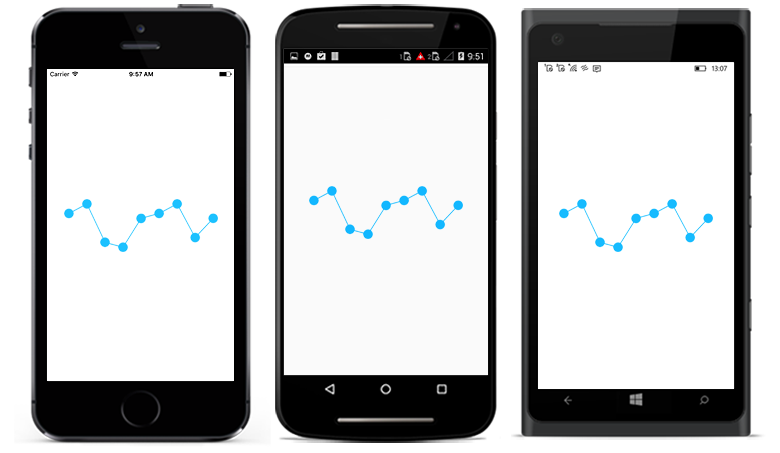

# Markers

[`Markers`](https://help.syncfusion.com/cr/xamarin/Syncfusion.SfSparkline.XForms.SfLineSparkline.html#Syncfusion_SfSparkline_XForms_SfLineSparkline_Marker) are used to highlight the data point in [`SfLineSparkline`](https://help.syncfusion.com/cr/xamarin/Syncfusion.SfSparkline.XForms.SfLineSparkline.html) and [`SfAreaSparkline`](https://help.syncfusion.com/cr/xamarin/Syncfusion.SfSparkline.XForms.SfAreaSparkline.html). You can use the following properties to customize the appearance.

* [`IsVisible`](https://help.syncfusion.com/cr/xamarin/Syncfusion.SfSparkline.XForms.MarkerBase.html#Syncfusion_SfSparkline_XForms_MarkerBase_IsVisible) - used to change the visibility of the marker.
* [`Width`](https://help.syncfusion.com/cr/xamarin/Syncfusion.SfSparkline.XForms.MarkerBase.html#Syncfusion_SfSparkline_XForms_MarkerBase_Width) - used to change the width of the marker.
* [`Height`](https://help.syncfusion.com/cr/xamarin/Syncfusion.SfSparkline.XForms.MarkerBase.html#Syncfusion_SfSparkline_XForms_MarkerBase_Height) - used to change the height of the marker.
* [`Color`](https://help.syncfusion.com/cr/xamarin/Syncfusion.SfSparkline.XForms.MarkerBase.html#Syncfusion_SfSparkline_XForms_MarkerBase_Color) - used to change the color of the marker.

 



<sparkline:SfLineSparkline ItemsSource="{Binding Data}" 
                           YBindingPath="Performance">  
     <sparkline:SfLineSparkline.Marker>
	       <sparkline:MarkerBase IsVisible="True" 
                                 Width="15"
                                 Height="15"/>
     </sparkline:SfLineSparkline.Marker> 
</sparkline:SfLineSparkline>





SfLineSparkline lineSparkline = new SfLineSparkline()
{
    YBindingPath = "Performance",
    ItemsSource = viewModel.Data,
    Marker = new MarkerBase()
    {
        IsVisible = true,
        Width = 15,
        Height = 15
    }
};





