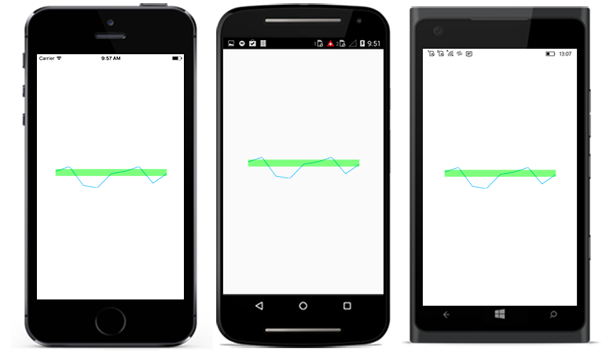

# Range Band in Xamarin Sparkline (SfSparkline)

This feature is used to highlight a particular region in the sparkline along Y axis.

* [`RangeBandStart`](https://help.syncfusion.com/cr/xamarin/Syncfusion.SfSparkline.XForms.SfSparklineBase.html#Syncfusion_SfSparkline_XForms_SfSparklineBase_RangeBandStart) - used to configure the start range band value in Y axis.
* [`RangeBandEnd`](https://help.syncfusion.com/cr/xamarin/Syncfusion.SfSparkline.XForms.SfSparklineBase.html#Syncfusion_SfSparkline_XForms_SfSparklineBase_RangeBandEnd) - used to configure the end range band values in Y axis.
* [`RangeBandColor`](https://help.syncfusion.com/cr/xamarin/Syncfusion.SfSparkline.XForms.SfSparklineBase.html#Syncfusion_SfSparkline_XForms_SfSparklineBase_RangeBandColor) - used to change the color for range band.

 



  <sparkline:SfLineSparkline ItemsSource="{Binding Data}" 
                             YBindingPath="Performance" 
                             RangeBandStart="4000" 
                             RangeBandEnd="1000"
                             RangeBandColor="Green"> 
  </sparkline:SfLineSparkline>





SfLineSparkline lineSparkline = new SfLineSparkline()
{
    YBindingPath = "Performance",
    ItemsSource = viewModel.Data,
    RangeBandStart = 4000,
    RangeBandEnd = 1000,
    RangeBandColor = Color.FromRgba(0, 255, 0, 100)
};





