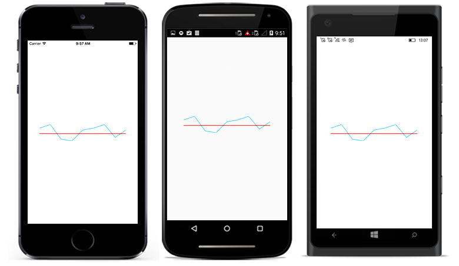

# Sparkline Axis

Axis of the sparkline can be configured and customized using following properties. This feature is applicable for all the sparkline types except [`SfWinLossSparkline`](https://help.syncfusion.com/cr/xamarin/Syncfusion.SfSparkline.XForms.SfWinLossSparkline.html).

* [`IsVisible`](https://help.syncfusion.com/cr/xamarin/Syncfusion.SfSparkline.XForms.SparklineAxis.html#Syncfusion_SfSparkline_XForms_SparklineAxis_IsVisible) - used to change the visibility of the axis.
* [`StrokeColor`](https://help.syncfusion.com/cr/xamarin/Syncfusion.SfSparkline.XForms.SparklineAxis.html#Syncfusion_SfSparkline_XForms_SparklineAxis_StrokeColor) - used to change the color of the axis.
* [`StrokeWidth`](https://help.syncfusion.com/cr/xamarin/Syncfusion.SfSparkline.XForms.SparklineAxis.html#Syncfusion_SfSparkline_XForms_SparklineAxis_StrokeWidth) - used to change the width of the axis.
* [`AxisOrigin`](https://help.syncfusion.com/cr/xamarin/Syncfusion.SfSparkline.XForms.SparklineAxis.html#Syncfusion_SfSparkline_XForms_SparklineAxis_AxisOrigin) - used to change the origin (positive or negative) of the axis.

 



<sparkline:SfLineSparkline ItemsSource="{Binding Data}" 
                           YBindingPath="Performance">  
  <sparkline:SfLineSparkline.Axis>
    <sparkline:SparklineAxis IsVisible="true"
                             StrokeColor="Red"/>

  </sparkline:SfLineSparkline.Axis>
</sparkline:SfLineSparkline>





SfLineSparkline lineSparkline = new SfLineSparkline()
{
    YBindingPath = "Performance",
    ItemsSource = viewModel.Data,
    Axis = new SparklineAxis()
    {
        IsVisible = true,
        StrokeColor = Color.Red,
    }
};





