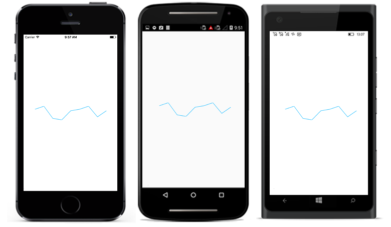
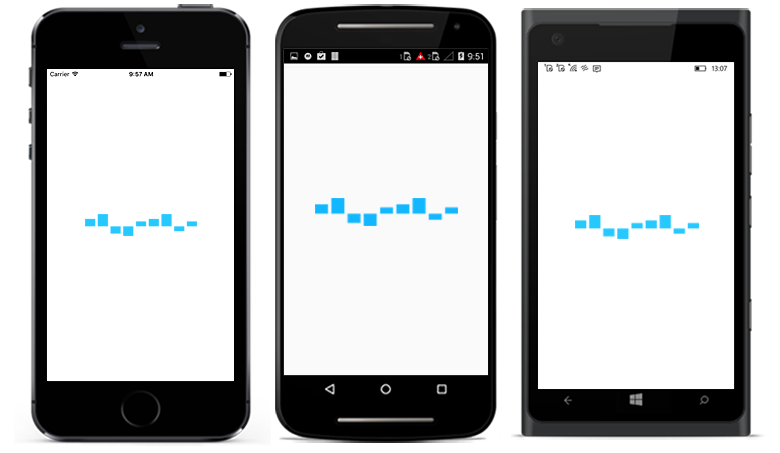
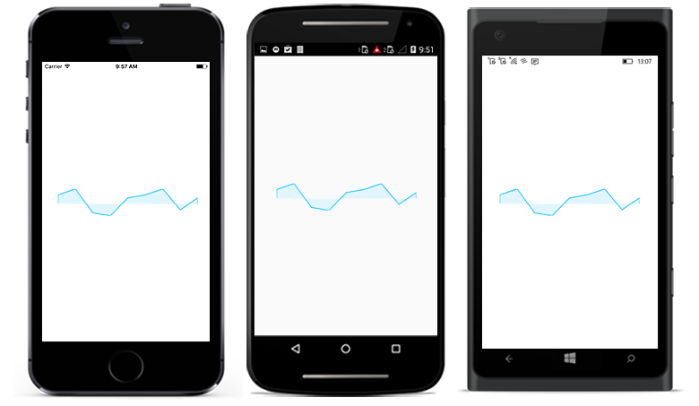
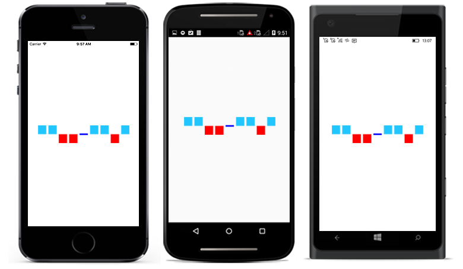

# Sparkline Types

## Line Sparkline

[`SfLineSparkline`](https://help.syncfusion.com/cr/xamarin/Syncfusion.SfSparkline.XForms.SfLineSparkline.html) is used for identifying patterns and trends in the data such as seasonal effects, large changes and turning points over a period of time.

* [`StrokeWidth`](https://help.syncfusion.com/cr/xamarin/Syncfusion.SfSparkline.XForms.SfSparklineBase.html#Syncfusion_SfSparkline_XForms_SfSparklineBase_StrokeWidth) - used to change the stroke width of the sparkline.
* [`StrokeColor`](https://help.syncfusion.com/cr/xamarin/Syncfusion.SfSparkline.XForms.SfSparklineBase.html#Syncfusion_SfSparkline_XForms_SfSparklineBase_StrokeColor) - used to change the stroke color of the sparkline.

* [`MinimumYValue`](https://help.syncfusion.com/cr/xamarin/Syncfusion.SfSparkline.XForms.SfSparklineBase.html#Syncfusion_SfSparkline_XForms_SfSparklineBase_MinimumYValue) - used to set the minimum value of the y-axis in sparkline.

* [`MaximumYValue`](https://help.syncfusion.com/cr/xamarin/Syncfusion.SfSparkline.XForms.SfSparklineBase.html#Syncfusion_SfSparkline_XForms_SfSparklineBase_MaximumYValue) - used to set the maximum value of the y-axis in sparkline.

The following code is used to create the [`SfLineSparkline`](https://help.syncfusion.com/cr/xamarin/Syncfusion.SfSparkline.XForms.SfLineSparkline.html).

 



<sparkline:SfLineSparkline ItemsSource = "{Binding Data}" 
                           YBindingPath = "Performance"> 
</sparkline:SfLineSparkline>





SfLineSparkline lineSparkline = new SfLineSparkline()
{
   ItemsSource = viewModel.Data,
   YBindingPath = "Performance"           
};





## Column Sparkline

[`SfColumnSparkline`](https://help.syncfusion.com/cr/xamarin/Syncfusion.SfSparkline.XForms.SfColumnSparkline.html) is very similar to a line sparkline in the sense that it is designed to show different values of two or more subjects but instead of using lines it is using horizontal and vertical bars that represent a different value.

* [`StrokeWidth`](https://help.syncfusion.com/cr/xamarin/Syncfusion.SfSparkline.XForms.SfSparklineBase.html#Syncfusion_SfSparkline_XForms_SfSparklineBase_StrokeWidth) - used to change the stroke width of the sparkline.
* [`StrokeColor`](https://help.syncfusion.com/cr/xamarin/Syncfusion.SfSparkline.XForms.SfSparklineBase.html#Syncfusion_SfSparkline_XForms_SfSparklineBase_StrokeColor) - used to change the stroke color of the sparkline.

* [`MinimumYValue`](https://help.syncfusion.com/cr/xamarin/Syncfusion.SfSparkline.XForms.SfSparklineBase.html#Syncfusion_SfSparkline_XForms_SfSparklineBase_MinimumYValue) - used to set the minimum value of the y-axis in sparkline.

* [`MaximumYValue`](https://help.syncfusion.com/cr/xamarin/Syncfusion.SfSparkline.XForms.SfSparklineBase.html#Syncfusion_SfSparkline_XForms_SfSparklineBase_MaximumYValue) - used to set the maximum value of the y-axis in sparkline.

* [`Color`](https://help.syncfusion.com/cr/xamarin/Syncfusion.SfSparkline.XForms.SfColumnSparkline.html#Syncfusion_SfSparkline_XForms_SfColumnSparkline_Color) - used to change the interior color of the column.

The following code is used to create the [`SfColumnSparkline`](https://help.syncfusion.com/cr/xamarin/Syncfusion.SfSparkline.XForms.SfColumnSparkline.html).

 



<sparkline:SfColumnSparkline ItemsSource = "{Binding Data}" 
                             YBindingPath = "Performance"> 
</sparkline:SfColumnSparkline>





SfColumnSparkline columnSparkline = new SfColumnSparkline()
{
   ItemsSource = viewModel.Data,
   YBindingPath = "Performance"            
};





## Area Sparkline

[`SfAreaSparkline`](https://help.syncfusion.com/cr/xamarin/Syncfusion.SfSparkline.XForms.SfAreaSparkline.html) is used to emphasize a change in values. This is primarily used when the magnitude of the trend is to be communicated rather than individual data values.

* [`StrokeWidth`](https://help.syncfusion.com/cr/xamarin/Syncfusion.SfSparkline.XForms.SfSparklineBase.html#Syncfusion_SfSparkline_XForms_SfSparklineBase_StrokeWidth) - used to change the stroke width of the sparkline.
* [`StrokeColor`](https://help.syncfusion.com/cr/xamarin/Syncfusion.SfSparkline.XForms.SfSparklineBase.html#Syncfusion_SfSparkline_XForms_SfSparklineBase_StrokeColor) - used to change the stroke color of the sparkline.

* [`MinimumYValue`](https://help.syncfusion.com/cr/xamarin/Syncfusion.SfSparkline.XForms.SfSparklineBase.html#Syncfusion_SfSparkline_XForms_SfSparklineBase_MinimumYValue) - used to set the minimum value of the y-axis in sparkline.

* [`MaximumYValue`](https://help.syncfusion.com/cr/xamarin/Syncfusion.SfSparkline.XForms.SfSparklineBase.html#Syncfusion_SfSparkline_XForms_SfSparklineBase_MaximumYValue) - used to set the maximum value of the y-axis in sparkline.

* [`Color`](https://help.syncfusion.com/cr/xamarin/Syncfusion.SfSparkline.XForms.SfAreaSparkline.html#Syncfusion_SfSparkline_XForms_SfAreaSparkline_Color) - used to change the color of interior area.

The following code is used to create the [`SfAreaSparkline`](https://help.syncfusion.com/cr/xamarin/Syncfusion.SfSparkline.XForms.SfAreaSparkline.html).

 



<sparkline:SfAreaSparkline ItemsSource = "{Binding Data}"
                           YBindingPath = "Performance"> 
</sparkline:SfAreaSparkline>





SfAreaSparkline areaSparkline = new SfAreaSparkline()
{
   ItemsSource = viewModel.Data,
   YBindingPath = "Performance"            
};





## WinLoss Sparkline

[`SfWinLossSparkline`](https://help.syncfusion.com/cr/xamarin/Syncfusion.SfSparkline.XForms.SfWinLossSparkline.html) is used to show whether each value is positive or negative visualizing a Win/Loss scenario. You can use the following properties to customize the appearance.

* [`StrokeWidth`](https://help.syncfusion.com/cr/xamarin/Syncfusion.SfSparkline.XForms.SfSparklineBase.html#Syncfusion_SfSparkline_XForms_SfSparklineBase_StrokeWidth) - used to change the stroke width of the sparkline.
* [`StrokeColor`](https://help.syncfusion.com/cr/xamarin/Syncfusion.SfSparkline.XForms.SfSparklineBase.html#Syncfusion_SfSparkline_XForms_SfSparklineBase_StrokeColor) - used to change the stroke color of the sparkline.

* [`MinimumYValue`](https://help.syncfusion.com/cr/xamarin/Syncfusion.SfSparkline.XForms.SfSparklineBase.html#Syncfusion_SfSparkline_XForms_SfSparklineBase_MinimumYValue) - used to set the minimum value of the y-axis in sparkline.

* [`MaximumYValue`](https://help.syncfusion.com/cr/xamarin/Syncfusion.SfSparkline.XForms.SfSparklineBase.html#Syncfusion_SfSparkline_XForms_SfSparklineBase_MaximumYValue) - used to set the maximum value of the y-axis in sparkline.

* [`Color`](https://help.syncfusion.com/cr/xamarin/Syncfusion.SfSparkline.XForms.SfWinLossSparkline.html#Syncfusion_SfSparkline_XForms_SfWinLossSparkline_Color) - used to change the interior color of the positive columns.

* [`NeutralPointColor`](https://help.syncfusion.com/cr/xamarin/Syncfusion.SfSparkline.XForms.SfWinLossSparkline.html#Syncfusion_SfSparkline_XForms_SfWinLossSparkline_NeutralPointColor) - used to change the interior color of the neutral columns.

The following code is used to create the [`SfWinLossSparkline`](https://help.syncfusion.com/cr/xamarin/Syncfusion.SfSparkline.XForms.SfWinLossSparkline.html).

 



<sparkline:SfWinLossSparkline ItemsSource = "{Binding Data}" 
                              YBindingPath = "Performance"> 
</sparkline:SfWinLossSparkline >





SfWinLossSparkline winLossSparkline = new SfWinLossSparkline()
{
   ItemsSource = viewModel.Data,
   YBindingPath = "Performance"
};





