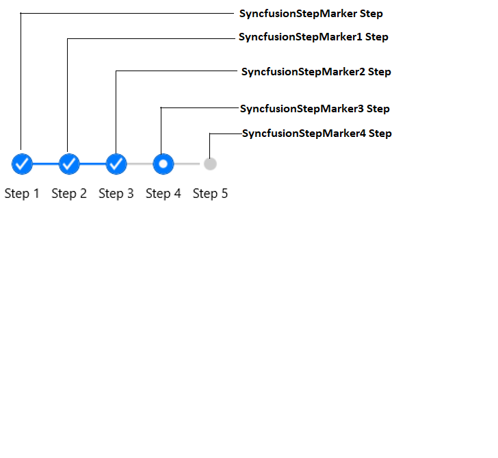

# AutomationId

StepProgressBar supports built-in [AutomationId](https://docs.microsoft.com/en-gb/dotnet/api/xamarin.forms.element.automationid?view=xamarin-forms#Xamarin_Forms_Element_AutomationId) for its markers element. These `AutomationId` values allow the automation framework to find and interact with the marker element when the test scripts are run. A unique `AutomationId` is maintained for each marker element by prefixing the StepView's `AutomationId` with the marker element's Id.

## StepProgressBar

The predefined automation value `Step` is set internally to identify the StepProgressBar's marker element. The following screenshots illustrate the `AutomationId` values of markers elements for StepProgressBar.

The following code snippet demonstrates how to set the `AutomationId` to StepProgressBar's marker element.




    <Grid>
        <progressBar:SfStepProgressBar HorizontalOptions="Center" VerticalOptions="Center">
            <progressBar:StepView PrimaryText="Step 1" AutomationId="SyncfusionStepMarker"/>
            <progressBar:StepView PrimaryText="Step 2" AutomationId="SyncfusionStepMarker1"/>
            <progressBar:StepView PrimaryText="Step 3" AutomationId="SyncfusionStepMarker2"/>
            <progressBar:StepView PrimaryText="Step 4" AutomationId="SyncfusionStepMarker3" Status="InProgress" />
            <progressBar:StepView PrimaryText="Step 5" AutomationId="SyncfusionStepMarker4" />
        </progressBar:SfStepProgressBar>
    </Grid>





            Grid mainGrid = new Grid();

            // Create StepProgressBar control
            SfStepProgressBar stepProgressBar = new SfStepProgressBar();
            stepProgressBar.VerticalOptions = LayoutOptions.Center;
            stepProgressBar.HorizontalOptions = LayoutOptions.Center;

            stepProgressBar.Children.Add(new StepView() { PrimaryText = "Step 1", AutomationId = "SyncfusionStepMarker" });
            stepProgressBar.Children.Add(new StepView() { PrimaryText = "Step 2", AutomationId = "SyncfusionStepMarker1" });
            stepProgressBar.Children.Add(new StepView() { PrimaryText = "Step 3", AutomationId = "SyncfusionStepMarker2" });
            stepProgressBar.Children.Add(new StepView() { PrimaryText = "Step 4", AutomationId = "SyncfusionStepMarker3", Status = StepStatus.InProgress });
            stepProgressBar.Children.Add(new StepView() { PrimaryText = "Step 5", AutomationId = "SyncfusionStepMarker4" });

            mainGrid.Children.Add(stepProgressBar);
            this.Content = mainGrid;




Refer to the following code snippet to access the marker elements of StepProgressBar from the automation script.




[Test]
[Description("StepProgressBar Automation Id")]
public void StepProgressBar_AutomationId()
{

   // To tap the first step marker.
   App.Tap("SyncfusionStepMarker Step");

   // To tap the second step marker.
   App.Tap("SyncfusionStepMarker1 Step");

}




