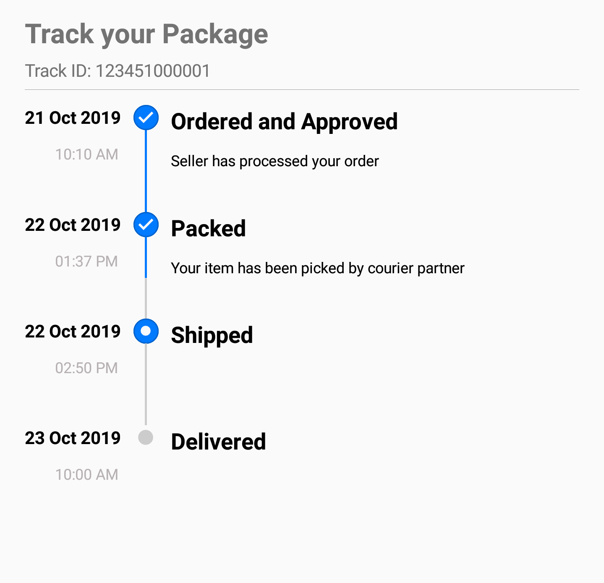

From version 3.5, Xamarin.Forms has introduced a new approach called BindableLayout that works with all the layouts derived from Layout&lt;T&gt;. By simply setting ItemTemplate and ItemsSource, BindableLayout will create a group of UI (for the given ItemTemplate) for every data in the ItemsSource and add them as children.

# Bindable Layout

The [SfStepProgressBar](https://help.syncfusion.com/cr/xamarin/Syncfusion.XForms.ProgressBar.SfStepProgressBar.html) allows to set a collection of items by setting `BindableLayout.ItemsSource` and `BindableLayout.ItemTemplate` properties. The StepProgressBar supports Bindable Layout in Xamarin.Forms version 3.5 and above.

## Initialize view model



    public class ShipmentDetails 
    {
        public string Title { get; set; }
        public string Description { get; set; }
        public string Date { get; set; }
        public string Time { get; set; }
        public StepStatus Status { get; set; }
        public int ProgressValue { get; set; }
    }

 

Next, create a view model class and initialize a model object as demonstrated in the following code sample.



    public class ShipmentViewModel : INotifyPropertyChanged
    {
        public ObservableCollection<ShipmentDetails> ShipmentInfoCollection { get; set; }

        public ShipmentViewModel()
        {
            ShipmentInfoCollection = new ObservableCollection<ShipmentDetails>();
            ShipmentInfoCollection.Add(CreateShipmentInfo("Ordered and Approved", "Seller has processed your order", DateTime.Now.ToString("dd MMM yyyy"), "10:10 AM", StepStatus.Completed, 100));
            ShipmentInfoCollection.Add(CreateShipmentInfo("Packed", "Your item has been picked by courier partner", DateTime.Now.AddDays(1).ToString("dd MMM yyyy"), "01:37 PM", StepStatus.Completed, 100));
            ShipmentInfoCollection.Add(CreateShipmentInfo("Shipped", "", DateTime.Now.AddDays(1).ToString("dd MMM yyyy"), "02:50 PM", StepStatus.InProgress, 50));
            ShipmentInfoCollection.Add(CreateShipmentInfo("Delivered", "", DateTime.Now.AddDays(2).ToString("dd MMM yyyy"), "10:00 AM", StepStatus.NotStarted, 0));
        }

        public ShipmentDetails CreateShipmentInfo(string title, string description, string date, string time, StepStatus status, int progress)
        {
            ShipmentDetails shipment = new ShipmentDetails()
            {
                Title = title,
                Description = description,
                Date = date,
                Time = time,
                Status = status,
                ProgressValue = progress
            };

            return shipment;
        }

        public event PropertyChangedEventHandler PropertyChanged;
    }

 

N> Add namespace of ViewModel class in your XAML page if you prefer to set BindingContext in XAML. 

 



    <ContentPage.BindingContext>
        <local:ShipmentViewModel/>
    </ContentPage.BindingContext>





this.BindingContext = new ShipmentViewModel();





## Populate StepProgressBar with data

 



<progressBar:SfStepProgressBar x:Name="stepProgress" BindableLayout.ItemsSource="{Binding ShipmentInfoCollection}" >
…
</progressBar:SfStepProgressBar>





SfStepProgressBar sfStepProgressBar = new SfStepProgressBar();
BindableLayout.SetItemsSource(sfStepProgressBar, ShipmentViewModel.ShipmentInfoCollection);





## Define the appearance of StepView



               <progressBar:SfStepProgressBar BindableLayout.ItemsSource="{Binding ShipmentInfoCollection}" TitleAlignment="Start" BackgroundColor="Transparent" TitleSpace="10" Orientation="Vertical" x:Name="stepProgress">
                    <BindableLayout.ItemTemplate>
                        <DataTemplate>
                            <progressBar:StepView x:Name="stepView" ProgressValue="{Binding ProgressValue}" Status="{Binding Status}">
                                <progressBar:StepView.PrimaryFormattedText>
                                    <FormattedString>
                                        
                                        
                                        
                                    </FormattedString>
                                </progressBar:StepView.PrimaryFormattedText>
                                <progressBar:StepView.SecondaryFormattedText>
                                    <FormattedString>
                                        
                                        
                                        
                                        
                                    </FormattedString>
                                </progressBar:StepView.SecondaryFormattedText>
                            </progressBar:StepView>
                        </DataTemplate>
                    </BindableLayout.ItemTemplate>
                </progressBar:SfStepProgressBar>



You can download the entire source of this demo from [here](https://www.syncfusion.com/downloads/support/directtrac/general/ze/Shipment_Tracking-237228452.zip)