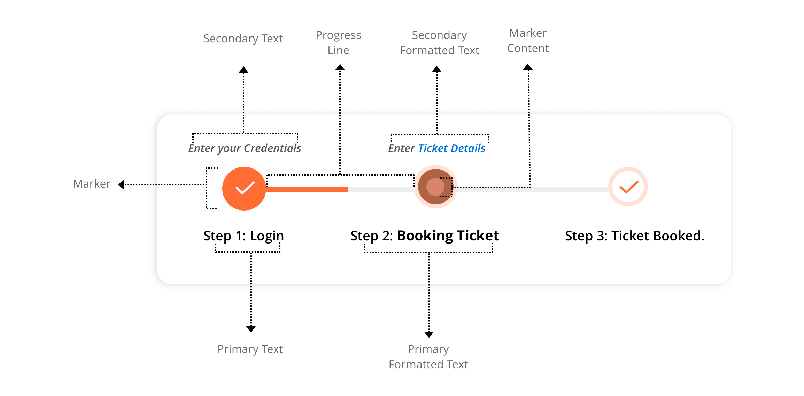
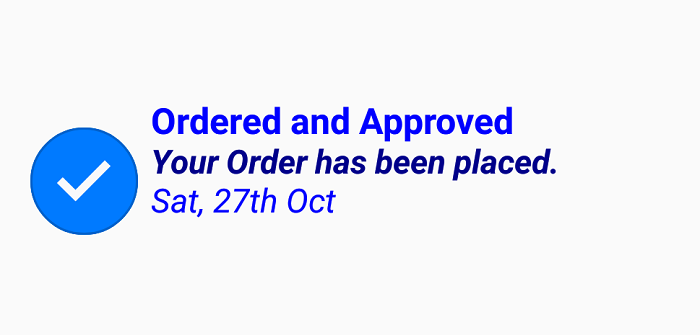

# Description

Each step in a multi-step process has a different operation. To provide self-explanatory information about a step, description can be shown on either side. A primary description will be on the right or bottom of the step, and a secondary description will be on the left or top of the step.

## StepProgressBar overview

The following overview image illustrates the major elements presented in StepProgressBar.

## Text 

The primary and secondary description for a step view can be set using the PrimaryText and SecondaryText properties as demonstrated in the following code example.




	<progressBar:SfStepProgressBar Orientation="Horizontal" HorizontalOptions="Center" VerticalOptions="Center">
		<progressBar:StepView PrimaryText="Completed" SecondaryText="Task" Status="Completed"/>
	</progressBar:SfStepProgressBar>




	SfStepProgressBar stepProgress = new SfStepProgressBar();
	stepProgress.Orientation = StepOrientation.Vertical;
	StepView step1 = new StepView();
    step1.SecondaryText = "Task";
    step1.PrimaryText = "Completed";
	step1.Status = StepStatus.Completed;
	stepProgress.Children.Add(step1);





## Formatted text

To customize the description with different formatting style, PrimaryFormattedText and SecondaryFormattedText can be used. The following code example explains how to set PrimaryFormattedText and SecondaryFormattedText to a step view.





<progressBar:SfStepProgressBar Orientation="Vertical" >
	<progressBar:StepView Status="Completed">
		<progressBar:StepView.PrimaryFormattedText>
			<FormattedString>
				
				
				
			</FormattedString>
		</progressBar:StepView.PrimaryFormattedText>
	</progressBar:StepView>
 </progressBar:SfStepProgressBar>
 




	SfStepProgressBar stepProgress = new SfStepProgressBar();
	stepProgress.Orientation = StepOrientation.Vertical;            
	StepView step1 = new StepView();            
	step1.Status = StepStatus.Completed;
	
	stepProgress.CompletedStepStyle.MarkerSize = 50;
	stepProgress.CompletedStepStyle.MarkerContentSize = 25;
	
	step1.PrimaryFormattedText = new FormattedString();
	step1.PrimaryFormattedText.Spans.Add(new Span { Text = "Ordered and Approved", FontSize = 13, FontAttributes = FontAttributes.Bold, TextColor = Color.Blue });
	step1.PrimaryFormattedText.Spans.Add(new Span { Text = "\nYour Order has been placed", FontSize = 12, FontAttributes = FontAttributes.Italic | FontAttributes.Bold, TextColor = Color.DarkBlue });
	step1.PrimaryFormattedText.Spans.Add(new Span { Text = "\nSat, 27th Oct", FontSize = 12, FontAttributes = FontAttributes.Italic, TextColor = Color.Blue });
	
	stepProgress.Children.Add(step1);
	



N> To learn more about defining formats for different span in a text, refer to [FormattedString](https://docs.microsoft.com/en-us/dotnet/api/xamarin.forms.formattedstring?view=xamarin-forms).

## Customize description
Using `TitleAlignment` and `TitleSpace`, the description alignment and space between the description and marker can be customized, respectively. The following code example explains how to customize the TitleSpace and TitleAlignment properties.




<progressBar:SfStepProgressBar x:Name="stepProgress" Orientation="Horizontal" TitleAlignment="Center" TitleSpace="50">
    <progressBar:SfStepProgressBar.CompletedStepStyle>
        <progressBar:StepStyle x:TypeArguments ="progressBar:CompletedStepState" MarkerSize="50" MarkerContentSize="25" />
    </progressBar:SfStepProgressBar.CompletedStepStyle>
    <progressBar:StepView Status="Completed" PrimaryText="Completed"  SecondaryText="Task">
    </progressBar:StepView>
</progressBar:SfStepProgressBar>
 




    SfStepProgressBar stepProgress = new SfStepProgressBar();
    stepProgress.Orientation = StepOrientation.Horizontal;
	stepProgress.TitleSpace = 50;
	stepProgress.TitleAlignment = StepTitleAlignment.Center;
	
	stepProgress.CompletedStepStyle.MarkerSize = 50;
	stepProgress.CompletedStepStyle.MarkerContentSize = 25;
	
	StepView step1 = new StepView();            
	step1.Status = StepStatus.Completed;
	step1.SecondaryText = "Task";
	step1.PrimaryText = "Completed";
	stepProgress.Children.Add(step1);
	



