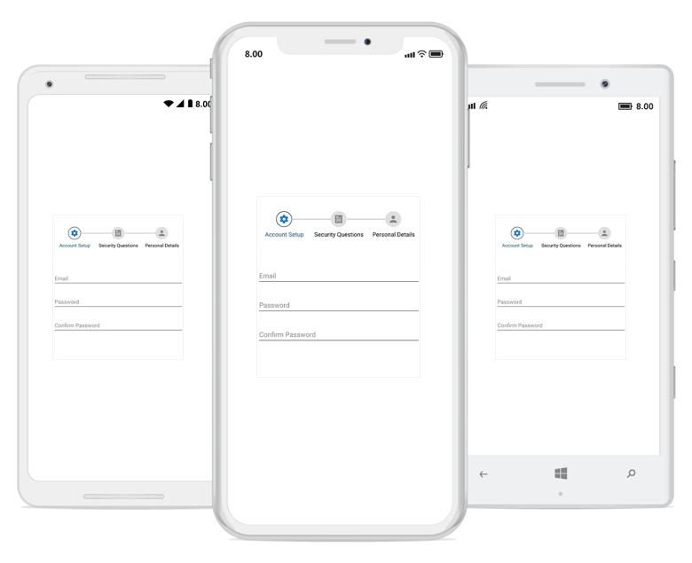

# Orientation

The StepProgressBar control provides options to change the default orientation, so a multi-step process can be visualized in horizontal or vertical orientation.

## Horizontal 

By default, StepProgressBar step views are displayed horizontally. You can also define the orientation as demonstrated in the following code example.





    <progressBar:SfStepProgressBar Orientation="Horizontal" />





SfStepProgressBar stepProgress = new SfStepProgressBar();
stepProgress.Orientation = StepOrientation.Horizontal;





## Vertical

To view the step progress bar control vertically, you can define the vertical orientation as demonstrated in the following code example.





    <progressBar:SfStepProgressBar Orientation="Vertical" />





SfStepProgressBar stepProgress = new SfStepProgressBar();
stepProgress.Orientation = StepOrientation.Vertical;





