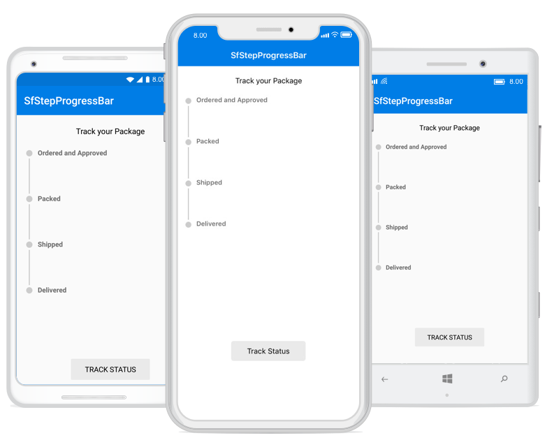

# Overview

The Xamarin StepProgressBar is a control that indicates the progress of a multiple step (state) process. This control can be used to track the progress of an online purchase, new user registration, live location tracking of buses, trains, flights, and more. 

## Key features

* Display the progress in horizontal or vertical orientation.
* Provides three-state progress indication: Not Started, In Progress, and Completed.
* Customize the shape of the state or step as a circle or a square.
* Add descriptions to each state on both sides.
* Customize the step content with numbers, ticks, crosses, dots, or images.
* Allows initializing the state and progress value.

