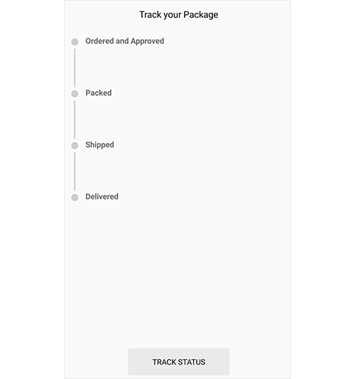
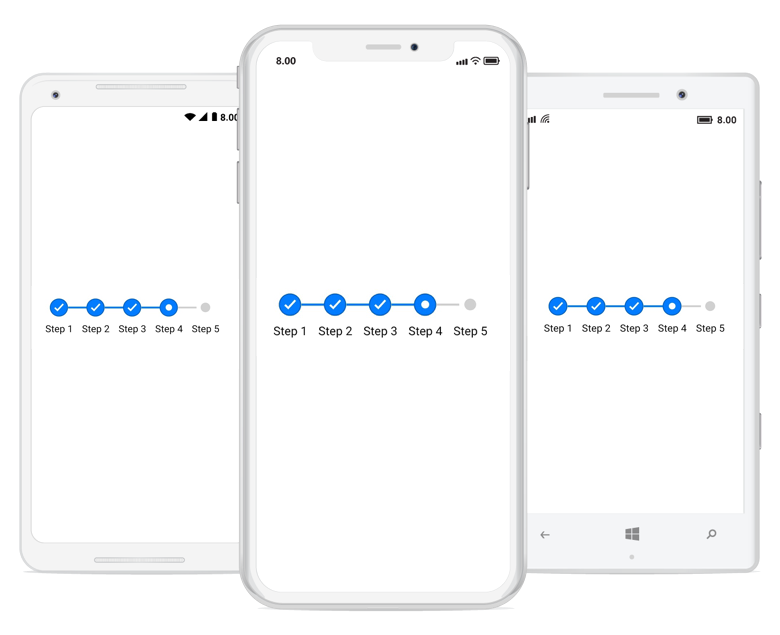
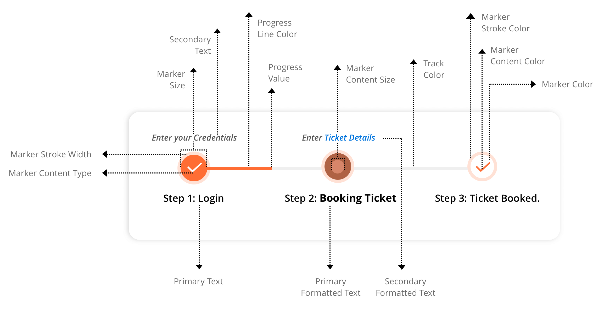
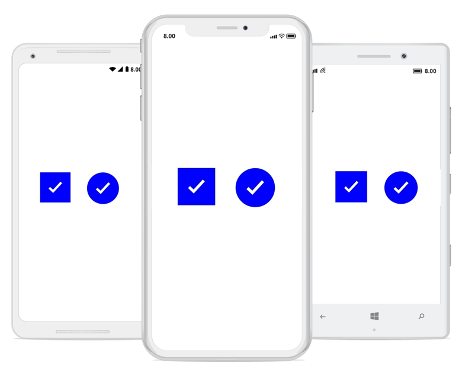
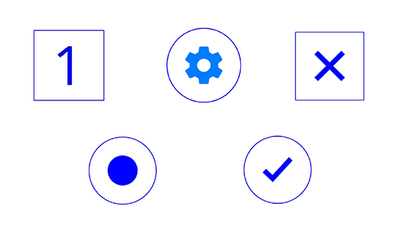
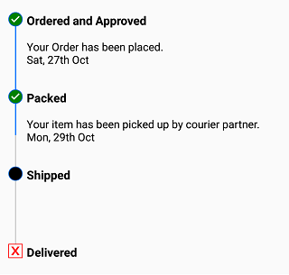

# Status
	
A step has three statuses: not started, in progress, and completed. Based on the status, you can format a step with different styles, which means whenever the status of a step changes, the style of the visual will change synchronously. Refer the following GIF in which the status of step is updated dynamically.

The following code example explains how to set a status for a step view.
 

 

<progressBar:SfStepProgressBar HorizontalOptions="Center" VerticalOptions="Center">
    <progressBar:StepView PrimaryText="Step 1" />
    <progressBar:StepView PrimaryText="Step 2" />
    <progressBar:StepView PrimaryText="Step 3" />
	<progressBar:StepView PrimaryText="Step 4" Status="InProgress" />
    <progressBar:StepView PrimaryText="Step 5" />
</progressBar:SfStepProgressBar>        



 

//Create StepProgressBar control
SfStepProgressBar stepProgressBar = new SfStepProgressBar();
stepProgressBar.VerticalOptions = LayoutOptions.Center;
stepProgressBar.HorizontalOptions = LayoutOptions.Center;

stepProgressBar.Children.Add(new StepView() { PrimaryText = "Step 1" });
stepProgressBar.Children.Add(new StepView() { PrimaryText = "Step 2" });
stepProgressBar.Children.Add(new StepView() { PrimaryText = "Step 3" });
stepProgressBar.Children.Add(new StepView() { PrimaryText = "Step 4", Status = StepStatus.InProgress });
stepProgressBar.Children.Add(new StepView() { PrimaryText = "Step 5" });



 

## Customizing Step view style based on their status

The Xamarin.Forms StepProgressBar control allows you to customize a step based on its status. Define an individual style for each status to achieve this. Marker color, marker shape type, marker content color, marker content type, marker stroke color, marker stroke width, marker size, marker content size, progress line color, and font can be defined for a style. The following overview image explains different properties available in StepProgressBar.

### Marker shape

The shape of a step marker can be a circle or a square.

### Content type

You can customize the step content with numbers, ticks, crosses, dots or images.

The following code example explains how to customize a step view based on their status.

 

 
<progressBar:SfStepProgressBar TitleAlignment="Start" BackgroundColor="Transparent" Orientation="Vertical" x:Name="stepProgress" Margin="16,16,0,0">
        <progressBar:SfStepProgressBar.NotStartedStepStyle>
            <progressBar:StepStyle x:TypeArguments="progressBar:NotStartedStepState" MarkerShapeType="Square" MarkerStrokeColor="Red" MarkerContentType="Cross" MarkerContentFillColor="Red"/>
        </progressBar:SfStepProgressBar.NotStartedStepStyle>

        <progressBar:SfStepProgressBar.InProgressStepStyle>
            <progressBar:StepStyle x:TypeArguments="progressBar:InProgressStepState" MarkerShapeType="Circle" MarkerContentType="None" MarkerFillColor="Black"/>
        </progressBar:SfStepProgressBar.InProgressStepStyle>

        <progressBar:SfStepProgressBar.CompletedStepStyle>
            <progressBar:StepStyle x:TypeArguments="progressBar:CompletedStepState" MarkerShapeType="Circle" MarkerContentType="Tick" MarkerContentFillColor="White" MarkerFillColor="Green"/>
        </progressBar:SfStepProgressBar.CompletedStepStyle>
       
        <progressBar:StepView x:Name="stepView1">
            <progressBar:StepView.PrimaryFormattedText>
                <FormattedString>
                    
                    
                    
                </FormattedString>
            </progressBar:StepView.PrimaryFormattedText>
        </progressBar:StepView>

        <progressBar:StepView x:Name="stepView2">
            <progressBar:StepView.PrimaryFormattedText>
                <FormattedString>
                    
                    
                    
                </FormattedString>
            </progressBar:StepView.PrimaryFormattedText>
        </progressBar:StepView>

        <progressBar:StepView x:Name="stepView3" Status="InProgress" ProgressValue="50">
            <progressBar:StepView.PrimaryFormattedText>
                <FormattedString>
                    
                </FormattedString>
            </progressBar:StepView.PrimaryFormattedText>
        </progressBar:StepView>

        <progressBar:StepView x:Name="stepView4">
            <progressBar:StepView.PrimaryFormattedText>
                <FormattedString>
                    
                </FormattedString>
            </progressBar:StepView.PrimaryFormattedText>
        </progressBar:StepView>

    </progressBar:SfStepProgressBar>


 

//Initialize the StepProgressBar
SfStepProgressBar stepProgress = new SfStepProgressBar();
stepProgress.Orientation = StepOrientation.Vertical;            
stepProgress.TitleAlignment = StepTitleAlignment.Start;

//Modify NotStartedStepStyle
stepProgress.NotStartedStepStyle.MarkerShapeType = StepShapeType.Square;
stepProgress.NotStartedStepStyle.MarkerStrokeColor = Color.Red;
stepProgress.NotStartedStepStyle.MarkerContentType = StepContentType.Cross;
stepProgress.NotStartedStepStyle.MarkerContentFillColor = Color.Red;

//Modify InProgressStepStyle
stepProgress.InProgressStepStyle.MarkerContentType = StepContentType.None;
stepProgress.InProgressStepStyle.MarkerFillColor = Color.Black;
stepProgress.InProgressStepStyle.MarkerShapeType = StepShapeType.Circle;

//Modify CompletedStepStyle
stepProgress.CompletedStepStyle.MarkerShapeType = StepShapeType.Circle;            
stepProgress.CompletedStepStyle.MarkerContentType = StepContentType.Tick;
stepProgress.CompletedStepStyle.MarkerContentFillColor = Color.White;
stepProgress.CompletedStepStyle.MarkerFillColor = Color.Green;

//Define StepView
StepView step1 = new StepView();
step1.PrimaryFormattedText = new FormattedString();
step1.PrimaryFormattedText.Spans.Add(new Span { Text = "Ordered and Approved", FontSize = 13, FontAttributes = FontAttributes.Bold, TextColor = Color.Blue });
step1.PrimaryFormattedText.Spans.Add(new Span { Text = "\nYour Order has been placed", FontSize = 12, FontAttributes = FontAttributes.Italic | FontAttributes.Bold, TextColor = Color.DarkBlue });
step1.PrimaryFormattedText.Spans.Add(new Span { Text = "\nSat, 27th Oct\n", FontSize = 12, FontAttributes = FontAttributes.Italic, TextColor = Color.Blue });
stepProgress.Children.Add(step1);
          
StepView step2 = new StepView();
step2.PrimaryFormattedText = new FormattedString();
step2.PrimaryFormattedText.Spans.Add(new Span { Text = "Packed", FontSize = 13, FontAttributes = FontAttributes.Bold, TextColor = Color.Blue });
step2.PrimaryFormattedText.Spans.Add(new Span { Text = "\nYour item has been picked up by courier partner.", FontSize = 12, FontAttributes = FontAttributes.Italic | FontAttributes.Bold, TextColor = Color.DarkBlue });
step2.PrimaryFormattedText.Spans.Add(new Span { Text = "\nMon, 29th Oct\n", FontSize = 12, FontAttributes = FontAttributes.Italic, TextColor = Color.Blue });
stepProgress.Children.Add(step2);

StepView step3 = new StepView();
step3.Status = StepStatus.InProgress;
step3.ProgressValue = 50;
step3.PrimaryFormattedText = new FormattedString();
step3.PrimaryFormattedText.Spans.Add(new Span { Text = "Shipped", FontSize = 13, FontAttributes = FontAttributes.Bold, TextColor = Color.Blue });
stepProgress.Children.Add(step3);

StepView step4 = new StepView();	
step4.PrimaryFormattedText = new FormattedString();
step4.PrimaryFormattedText.Spans.Add(new Span { Text = "Delivered", FontSize = 13, FontAttributes = FontAttributes.Bold, TextColor = Color.Blue });
stepProgress.Children.Add(step4);


 

