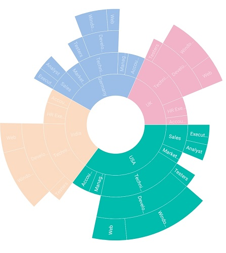
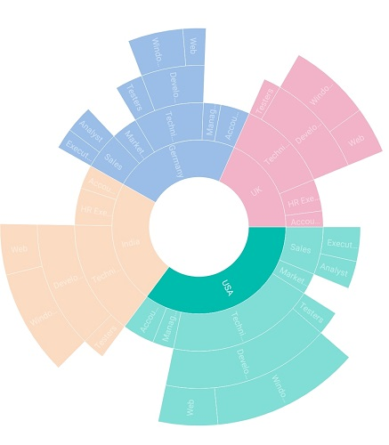
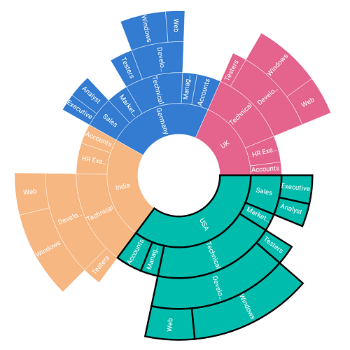
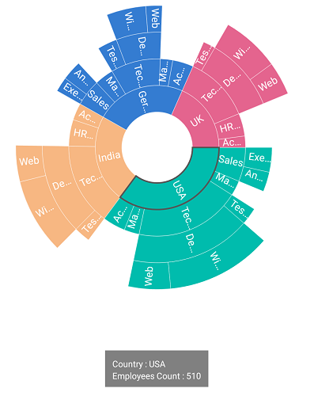

# Selection

The sunburst chart provides support to select or highlight the segments. Selection can be enabled with the help of [`EnableSelection`](https://help.syncfusion.com/cr/xamarin/Syncfusion.SfSunburstChart.XForms.SelectionSettings.html#Syncfusion_SfSunburstChart_XForms_SelectionSettings_EnableSelection) property.

## Selection type

The [`SelectionType`](https://help.syncfusion.com/cr/xamarin/Syncfusion.SfSunburstChart.XForms.SelectionSettings.html#Syncfusion_SfSunburstChart_XForms_SelectionSettings_SelectionType) property allows you to select a segment based on the following categories:

* Child: Highlights the selected segment along with its children in all levels.
* Group: Highlights the entire group of the selected segment in a hierarchy.
* Parent: Highlights the parent of the selected segment in the hierarchy.
* Single: Highlights the selected segment alone.

The following code shows the `Child` selection type.

 



  <sunburst:SfSunburstChart.SelectionSettings>
         <sunburst:SelectionSettings  Opacity="0.5" EnableSelection="True" SelectionType="Child"></sunburst:SelectionSettings>
  </sunburst:SfSunburstChart.SelectionSettings>





  SelectionSettings selection = new SelectionSettings();
  selection.Opacity = 0.5;
  selection.EnableSelection = true;
  selection.SelectionType = SelectionType.Child;
  sunburstChart.SelectionSettings = selection;



 

The following code shows the `Group` selection type.

 



  <sunburst:SfSunburstChart.SelectionSettings>
      <sunburst:SelectionSettings  Opacity="0.5" EnableSelection="True" 
                 SelectionType="Group"></sunburst:SelectionSettings>
  </sunburst:SfSunburstChart.SelectionSettings>





  SelectionSettings selection = new SelectionSettings();
  selection.Opacity = 0.5;
  selection.EnableSelection = true;
  selection.SelectionType = SelectionType.Group;
  sunburstChart.SelectionSettings = selection;



 

The following code shows the `Parent` selection type.

 



  <sunburst:SfSunburstChart.SelectionSettings>
        <sunburst:SelectionSettings  Opacity="0.5" EnableSelection="True" 
                  SelectionType="Parent"></sunburst:SelectionSettings>
  </sunburst:SfSunburstChart.SelectionSettings>





  SelectionSettings selection = new SelectionSettings();
  selection.Opacity = 0.5;
  selection.EnableSelection = true;
  selection.SelectionType = SelectionType.Parent;
  sunburstChart.SelectionSettings = selection;



 

The following code shows the `Single` selection type.

 



  <sunburst:SfSunburstChart.SelectionSettings>
        <sunburst:SelectionSettings  Opacity="0.5" EnableSelection="True"
                  SelectionType="Single"></sunburst:SelectionSettings>
  </sunburst:SfSunburstChart.SelectionSettings>





  SelectionSettings selection = new SelectionSettings();
  selection.Opacity = 0.5;
  selection.EnableSelection = true;
  selection.SelectionType = SelectionType.Single;
  sunburstChart.SelectionSettings = selection;



 

## Selection display mode

The [`SelectionDisplayMode`](https://help.syncfusion.com/cr/xamarin/Syncfusion.SfSunburstChart.XForms.SelectionSettings.html#Syncfusion_SfSunburstChart_XForms_SelectionSettings_SelectionDisplayMode) property provides the following selection options to highlight the segments:

* By stroke
* By Color
* By opacity

### Opacity

This mode highlights the selected segment with the opacity specified in the [`Opacity`](https://help.syncfusion.com/cr/xamarin/Syncfusion.SfSunburstChart.XForms.SelectionSettings.html#Syncfusion_SfSunburstChart_XForms_SelectionSettings_Opacity) property.

 



  <sunburst:SfSunburstChart.SelectionSettings>
      <sunburst:SelectionSettings  Opacity="0.5" EnableSelection="True" SelectionDisplayMode="HighlightByOpacity"
                SelectionType="Group"></sunburst:SelectionSettings>
  </sunburst:SfSunburstChart.SelectionSettings>





  SelectionSettings selection = new SelectionSettings();
  selection.EnableSelection = true;
  selection.Opacity = 0.5;
  selection.SelectionDisplayMode = SelectionDisplayMode.HighlightByOpacity;
  selection.SelectionType = SelectionType.Group;
  sunburstChart.SelectionSettings = selection;



 

### Color

This mode highlights the selected segment using the brush specified in the [`SelectionBrush`](https://help.syncfusion.com/cr/xamarin/Syncfusion.SfSunburstChart.XForms.SelectionSettings.html#Syncfusion_SfSunburstChart_XForms_SelectionSettings_SelectionBrush) property.

 



  <sunburst:SfSunburstChart.SelectionSettings>
        <sunburst:SelectionSettings  EnableSelection="True" SelectionBrush="Black" 
                 SelectionDisplayMode="HighlightByColor" SelectionType="Group"></sunburst:SelectionSettings>
  </sunburst:SfSunburstChart.SelectionSettings>





  SelectionSettings selection = new SelectionSettings();
  selection.EnableSelection = true;
  selection.SelectionDisplayMode = SelectionDisplayMode.HighlightByColor;
  selection.SelectionBrush = Color.Black;
  selection.SelectionType = SelectionType.Group;
  sunburstChart.SelectionSettings = selection;



 

### Stroke

This mode highlights the selected segment by applying stroke to it. The color and thickness of the stroke can be customized using the [`SelectionStrokeBrush`](https://help.syncfusion.com/cr/xamarin/Syncfusion.SfSunburstChart.XForms.SelectionSettings.html#Syncfusion_SfSunburstChart_XForms_SelectionSettings_SelectionStrokeBrush) and [`SelectionStrokeWidth`](https://help.syncfusion.com/cr/xamarin/Syncfusion.SfSunburstChart.XForms.SelectionSettings.html#Syncfusion_SfSunburstChart_XForms_SelectionSettings_SelectionStrokeWidth) properties.

 



  <sunburst:SfSunburstChart.SelectionSettings>
        <sunburst:SelectionSettings  EnableSelection="True" SelectionStrokeBrush="Black"
                  SelectionDisplayMode="HighlightByStrokeColor"
                 SelectionType="Group"></sunburst:SelectionSettings>
  </sunburst:SfSunburstChart.SelectionSettings>





  SelectionSettings selection = new SelectionSettings();
  selection.EnableSelection = true;
  selection.SelectionDisplayMode = SelectionDisplayMode.HighlightByStrokeColor;
  selection.SelectionStrokeBrush = Color.Black;
  selection.SelectionType = SelectionType.Group;
  sunburstChart.SelectionSettings = selection;



 

## Events

### Selection Changed

This event occurs whenever you select the segment. You can get the [`SelectedSegment`](https://help.syncfusion.com/cr/xamarin/Syncfusion.SfSunburstChart.XForms.SelectionChangedEventArgs.html#Syncfusion_SfSunburstChart_XForms_SelectionChangedEventArgs_SelectedSegment) and [`IsSelected`](https://help.syncfusion.com/cr/xamarin/Syncfusion.SfSunburstChart.XForms.SelectionChangedEventArgs.html#Syncfusion_SfSunburstChart_XForms_SelectionChangedEventArgs_IsSelected) properties details as argument from [`SelectionChangedEventArgs`](https://help.syncfusion.com/cr/xamarin/Syncfusion.SfSunburstChart.XForms.SelectionChangedEventArgs.html) handler.

 



  <sunburst:SfSunburstChart x:Name="sunburstChart" ItemsSource="{Binding DataSource}"
            ValueMemberPath="EmployeesCount" SelectionChanged="SunburstChart_SelectionChanged">

     <sunburst:SfSunburstChart.SelectionSettings>
          <sunburst:SelectionSettings  EnableSelection="True" SelectionDisplayMode="HighlightByStrokeColor"                                                 
                        SelectionType="Single"></sunburst:SelectionSettings>
          </sunburst:SfSunburstChart.SelectionSettings>

  </sunburst:SfSunburstChart>

     <StackLayout  x:Name="stackLayout" IsVisible="false" Orientation="Vertical" Spacing="0" Opacity="0.5" BackgroundColor="Black" 
                          Grid.Row="1" Padding="10" HorizontalOptions="Center" VerticalOptions="End" >
        <Label  x:Name="countryLabel"  FontSize="12"  TextColor="White"/>
        <Label x:Name="populationLabel"  FontSize="12"  TextColor="White"/>
     </StackLayout>




       
private void SunburstChart_SelectionChanged(object sender, SelectionChangedEventArgs e)
{
    if (e.SelectedSegment != null)
    {
       stackLayout.IsVisible = true;

       if (!e.IsSelected)
       {
          stackLayout.IsVisible = false;
       }
       if (e.SelectedSegment.CurrentLevel == 0)
       {
          countryLabel.Text = "Country : " + e.SelectedSegment.Category;
          populationLabel.Text = "Employees Count : " + e.SelectedSegment.Value;
       }
       else if (e.SelectedSegment.CurrentLevel == 1)
       {
          countryLabel.Text = "JobDescription : " + e.SelectedSegment.Category;
          populationLabel.Text = "Employees Count : " + e.SelectedSegment.Value;
       }
       else if (e.SelectedSegment.CurrentLevel == 2)
       {
          countryLabel.Text = "JobGroup : " + e.SelectedSegment.Category;
          populationLabel.Text = "Employees Count : " + e.SelectedSegment.Value;
       }
       else
       {
          countryLabel.Text = "JobRole : " + e.SelectedSegment.Category;
          populationLabel.Text = "Employees Count : " + e.SelectedSegment.Value;
      }  

    }            
}        



 

