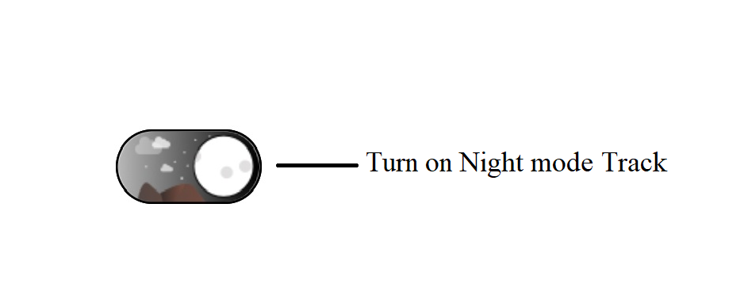

## AutomationId 

The SfSwitch control has built-in `AutomationId` for inner elements. The `AutomationId` API allows the automation framework to find and interact with the inner elements of the SfSwitch control. To keep unique AutomationId, these inner elements' AutomationIds are updated based on the control's `AutomationId`.

For example, if you set SfSwitch's `AutomationId` as "Turn on Night mode", then the automation framework will interact the SfSwitch as "Turn on Night mode Track".
 
When you enable the Indeterminate state, then the Automation framework will interact the Off state as "Turn on Night mode Off Track", Indeterminate state as "Turn on Night mode Indeterminate Track" and the On state as "Turn on Night mode On Track".

N> AutomationId support works on Android only.

