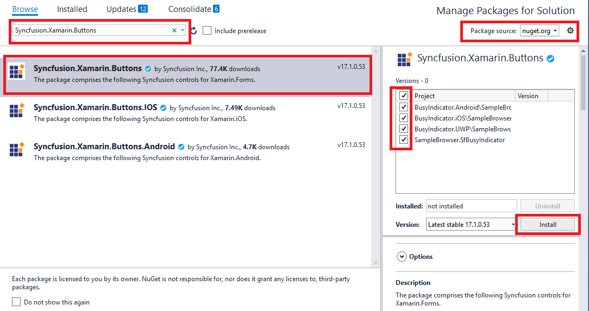

# Getting Started with Xamarin Switch (SfSwitch)

This section provides step-by-step instructions to add the SfSwitch control with basic functionalities in Xamarin.Forms.

## Assembly Deployment

After installing [Essential Studio for Xamarin](https://www.syncfusion.com/downloads/xamarin), you can find all the required assemblies in the installation directory: `{Syncfusion Essential Studio Installed location}\Essential Studio\{Version #}\Xamarin\lib`.

E.g.: C:\Program Files (x86) \Syncfusion\Essential Studio\19.1.0.54\Xamarin\lib

> **Note:** Assemblies can be found in the unzipped package location (`Documents/Syncfusion/{Version #}/Xamarin/lib`) on a Mac.

## Adding SfSwitch Reference

You can add the [`SfSwitch`](https://help.syncfusion.com/cr/xamarin/Syncfusion.XForms.Buttons.SfSwitch.html) reference using the following methods:

**Method 1: Adding SfSwitch Reference from nuget.org**

Syncfusion Xamarin components are available on [nuget.org](https://www.nuget.org/). To add [`SfSwitch`](https://help.syncfusion.com/cr/xamarin/Syncfusion.XForms.Buttons.SfSwitch.html) to your project, open the NuGet package manager in Visual Studio, search for [Syncfusion.Xamarin.Core](https://www.nuget.org/packages/Syncfusion.Xamarin.Core), and install it.

**Method 2: Adding SfSwitch Reference from Toolbox**

Syncfusion provides a Xamarin Toolbox. You can drag the [`SfSwitch`](https://help.syncfusion.com/cr/xamarin/Syncfusion.XForms.Buttons.SfSwitch.html) control to the XAML page using this toolbox. It automatically installs the required NuGet packages and adds the namespace to the page. To install Syncfusion Xamarin Toolbox, refer to [`Toolbox`](https://help.syncfusion.com/xamarin/utility#toolbox).

**Method 3: Adding SfSwitch Assemblies Manually from the Installed Location**

If you prefer to manually reference the assemblies, add the following assemblies to your respective projects.

Location: {Installed location}/{version}/Xamarin/lib

<table>
<tr>
<td>
PCL  </td><td>
Syncfusion.Buttons.XForms.dll Syncfusion.Core.XForms.dll Syncfusion.Licensing.dll  </td></tr>
<tr>
<td>
Android  </td><td>
Syncfusion.Buttons.XForms.dll Syncfusion.Buttons.XForms.Android.dll Syncfusion.Core.XForms.dll Syncfusion.Core.XForms.Android.dll Syncfusion.Licensing.dll  </td></tr>
<tr>
<td>
iOS  </td><td>
Syncfusion.Buttons.XForms.dll Syncfusion.Buttons.XForms.iOS.dll Syncfusion.Core.XForms.dll Syncfusion.Core.XForms.iOS.dll Syncfusion.Licensing.dll  </td></tr>
<tr>
<td>
UWP  </td><td>
Syncfusion.Buttons.XForms.dll Syncfusion.Buttons.XForms.UWP.dll Syncfusion.Core.XForms.dll Syncfusion.Core.XForms.UWP.dll Syncfusion.Licensing.dll  </td></tr>
</table>

N> To know more about obtaining our components, refer to these links for [Mac](https://help.syncfusion.com/xamarin/installation/mac-installer/how-to-download) and [Windows](https://help.syncfusion.com/xamarin/installation/web-installer/how-to-download).

I> Starting with v16.2.0.x, if you reference Syncfusion assemblies from the trial setup or from the NuGet feed, you also have to include a license key in your projects. Please refer to [Syncfusion license key](https://help.syncfusion.com/common/essential-studio/licensing/overview) to know about registering Syncfusion license key in your Xamarin application to use our components.

## Launching an application on each platform with SfSwitch

To use the [`SfSwitch`](https://help.syncfusion.com/cr/xamarin/Syncfusion.XForms.Buttons.SfSwitch.html) inside an application, each platform application requires some additional configurations. The configurations vary from platform to platform and is discussed in the following sections:

N> If you are adding the references from toolbox, below steps are not needed.   

**iOS**

To launch the switch in iOS, call the SfSwitchRenderer.Init() method in the FinishedLaunching overridden method of the AppDelegate class after the Xamarin.Forms framework initialization and before the LoadApplication method is called as demonstrated in the following code sample:





public override bool FinishedLaunching(UIApplication app, NSDictionary options)

{

global::Xamarin.Forms.Forms.Init();

Syncfusion.XForms.iOS.Buttons.SfSwitchRenderer.Init();

LoadApplication(new App());

return base.FinishedLaunching(app, options);

}





> **Note:** This step is not necessary if references are added from the toolbox.

### Universal Windows Platform (UWP)

To deploy the switch in release mode, initialize the button assemblies in `App.xaml.cs` in the UWP project as shown below:




protected override void OnLaunched(LaunchActivatedEventArgs e) 

{ 

..... 

rootFrame.NavigationFailed += OnNavigationFailed; 

// Add using System.Reflection;

List<Assembly> assembliesToInclude = new List<Assembly>(); 
//Now, add all the assemblies that your app uses.
assembliesToInclude.Add(typeof(SfBorderRenderer).GetTypeInfo().Assembly); 
// replaces Xamarin.Forms.Forms.Init(e); 

Xamarin.Forms.Forms.Init(e, assembliesToInclude);

..... 

}





### Android
The Android platform does not require any additional configuration to render the switch.

## Initializing SfSwitch

Import the button namespace as shown below into your respective Page:





xmlns:syncfusion="clr-namespace:Syncfusion.XForms.Buttons;assembly=Syncfusion.Buttons.XForms"





using Syncfusion.XForms.Buttons;





Then, initialize the switch control as shown in the following code example:





    <syncfusion:SfSwitch /> 





SfSwitch sfSwitch = new SfSwitch();





## Performing an Action Based on State

You can switch between states. When the state changes, the [`StateChanging`](https://help.syncfusion.com/cr/xamarin/Syncfusion.XForms.Buttons.SfSwitch.html#Syncfusion_XForms_Buttons_SfSwitch_StateChanging) and [`StateChanged`](https://help.syncfusion.com/cr/xamarin/Syncfusion.XForms.Buttons.SfSwitch.html#Syncfusion_XForms_Buttons_SfSwitch_StateChanged) events are triggered. These events allow actions based on the current state. The [`StateChanging`](https://help.syncfusion.com/cr/xamarin/Syncfusion.XForms.Buttons.SfSwitch.html#Syncfusion_XForms_Buttons_SfSwitch_StateChanging) event allows canceling the transition to a new state.

The following code example shows a message box when switched to the "off" state after work is completed:





    <syncfusion:SfSwitch StateChanged="SfSwitch_StateChanged" />





sfSwitch.StateChanged += SfSwitch_StateChanged;









 private void SfSwitch_StateChanged(object sender, SwitchStateChangedEventArgs e)
{
     DisplayAlert("Message", "SUCCESS", "OK");
}





You can find the complete getting started sample from this [link](https://github.com/SyncfusionExamples/xamarin-forms-sfswitch).
