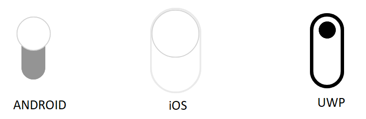

# Orientation

The switch control provides options to change the default orientation.

## Horizontal 

By default, it is displayed horizontally. You can also define the orientation as demonstrated in the following code example.





    <syncfusion:SfSwitch Orientation="Horizontal" />





SfSwitch sfSwitch = new SfSwitch();

sfSwitch.Orientation = SwitchOrientation.Horizontal;





## Vertical

To view the switch control vertically, you can define the vertical orientation as demonstrated in the following code example.





    <syncfusion:SfSwitch Orientation="Vertical" />





SfSwitch sfSwitch = new SfSwitch();

sfSwitch.Orientation = SwitchOrientation.Vertical;





