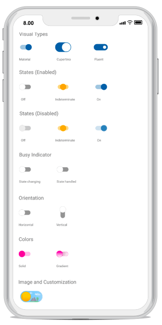

# Xamarin Switch (SfSwitch) Overview

The Switch control for Xamarin.Forms provides an efficient way to select between the states based on the toggled value.

## Key features

* Provides support for inbuilt visual types like Material, Cupertino or fluent type. 
* Customizable visual based on device platforms.
* Provides options to visualize indeterminate state.
* Performs async action with busy indicator.
* Supports horizontal and vertical orientation.
* Allows you to add the images to enhance the look and feel.