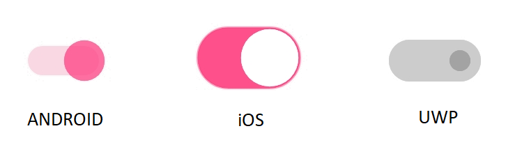

# States

Switch allows you to configure the states as explained in the following sections.

## On

You can switch to on state by tapping the switch button or by setting a value as demonstrated in the following code example.





    <syncfusion:SfSwitch IsOn="True" />





SfSwitch sfSwitch=new SfSwitch();

sfSwitch.IsOn=true;





## Off

This is the default state. You can switch to off state by tapping the switch button or by defining as demonstrated in the following code example.





    <syncfusion:SfSwitch IsOn="False" />





SfSwitch sfSwitch = new SfSwitch();

sfSwitch.IsOn = false;





## Indeterminate

The indeterminate state can be enabled when you need to display the work progress. The following code example demonstrates how to load the switch in indeterminate state by setting the IsOn property to null.





    <syncfusion:SfSwitch IsOn="{x:Null}" AllowIndeterminateState="True" />    





SfSwitch sfSwitch = new SfSwitch();

sfSwitch.IsOn = null;

sfSwitch.AllowIndeterminateState = true;





N> By default, the switch control has only two states: on and off.

## Disabled On

You can switch to disabled on state by setting the `IsOn` property as true and `IsEnabled` property as false.





    <syncfusion:SfSwitch IsOn="True" IsEnabled="False" />





SfSwitch sfSwitch = new SfSwitch();
sfSwitch.IsOn = true;
sfSwitch.IsEnabled = false;





## Disabled Off

You can switch to disabled off state by setting the `IsOn` property as false and `IsEnabled` property as false.





    <syncfusion:SfSwitch IsOn="False" IsEnabled="False" />





SfSwitch sfSwitch = new SfSwitch();
sfSwitch.IsOn = false;
sfSwitch.IsEnabled = false;





## Disabled Indeterminate

The disabled indeterminate state can be enabled when you need to display the work progress .The below code example demonstrates loading the switch in disabled indeterminate state by setting `IsOn` property value as null and `IsEnabled` property as false.





    <syncfusion:SfSwitch AllowIndeterminateState="True" IsOn="{x:Null}" IsEnabled="False"/>      





SfSwitch sfSwitch = new SfSwitch();
sfSwitch.AllowIndeterminateState = true;
sfSwitch.IsOn = null;          
sfSwitch.IsEnabled = false;





