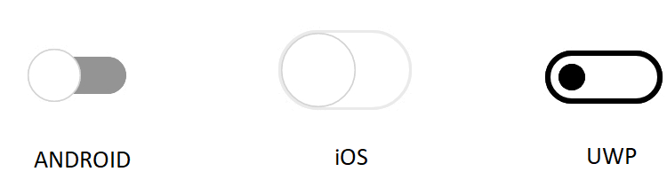

# Visual Types in Xamarin Switch (SfSwitch)

[`SfSwitch`](https://help.syncfusion.com/cr/xamarin/Syncfusion.XForms.Buttons.SfSwitch.html) supports customization using built-in [`visual types`](https://help.syncfusion.com/cr/xamarin/Syncfusion.XForms.Buttons.SfSwitch.html#Syncfusion_XForms_Buttons_SfSwitch_VisualType). The [`visual types`](https://help.syncfusion.com/cr/xamarin/Syncfusion.XForms.Buttons.SfSwitch.html#Syncfusion_XForms_Buttons_SfSwitch_VisualType) based on device platform are listed as follows.

* Android – [`Material`](https://help.syncfusion.com/cr/xamarin/Syncfusion.XForms.Buttons.VisualType.html#Syncfusion_XForms_Buttons_VisualType_Material) 
* iOS – [`Cupertino`](https://help.syncfusion.com/cr/xamarin/Syncfusion.XForms.Buttons.VisualType.html#Syncfusion_XForms_Buttons_VisualType_Cupertino)
* Windows – [`Fluent`](https://help.syncfusion.com/cr/xamarin/Syncfusion.XForms.Buttons.VisualType.html#Syncfusion_XForms_Buttons_VisualType_Fluent)

## Default

This is the default value set for visual type.

N> If you set [`default`](https://help.syncfusion.com/cr/xamarin/Syncfusion.XForms.Buttons.VisualType.html#Syncfusion_XForms_Buttons_VisualType_Default), the visual type will be internally changed based on the device platform.

## Material

[`Material`](https://help.syncfusion.com/cr/xamarin/Syncfusion.XForms.Buttons.VisualType.html#Syncfusion_XForms_Buttons_VisualType_Material) visual type brings the appearance based on [`material`](https://help.syncfusion.com/cr/xamarin/Syncfusion.XForms.Buttons.VisualType.html#Syncfusion_XForms_Buttons_VisualType_Material) guidelines. The following code example demonstrates how to define [`material`](https://help.syncfusion.com/cr/xamarin/Syncfusion.XForms.Buttons.VisualType.html#Syncfusion_XForms_Buttons_VisualType_Material) visual type.





    <syncfusion:SfSwitch VisualType="Material" />





SfSwitch sfSwitch=new SfSwitch();

sfSwitch.VisualType = VisualType.Material;





## Cupertino

[`Cupertino`](https://help.syncfusion.com/cr/xamarin/Syncfusion.XForms.Buttons.VisualType.html#Syncfusion_XForms_Buttons_VisualType_Cupertino) visual type brings the appearance based on [`Cupertino`](https://help.syncfusion.com/cr/xamarin/Syncfusion.XForms.Buttons.VisualType.html#Syncfusion_XForms_Buttons_VisualType_Cupertino) guidelines. The following code example demonstrates how to define [`Cupertino`](https://help.syncfusion.com/cr/xamarin/Syncfusion.XForms.Buttons.VisualType.html#Syncfusion_XForms_Buttons_VisualType_Cupertino) visual type.





    <syncfusion:SfSwitch VisualType="Cupertino" />





SfSwitch sfSwitch=new SfSwitch();

sfSwitch.VisualType = VisualType.Cupertino;





## Fluent

[`Fluent`](https://help.syncfusion.com/cr/xamarin/Syncfusion.XForms.Buttons.VisualType.html#Syncfusion_XForms_Buttons_VisualType_Fluent) visual type brings the appearance based on[`Fluent`](https://help.syncfusion.com/cr/xamarin/Syncfusion.XForms.Buttons.VisualType.html#Syncfusion_XForms_Buttons_VisualType_Fluent) guidelines. The following code example demonstrates how to define [`Fluent`](https://help.syncfusion.com/cr/xamarin/Syncfusion.XForms.Buttons.VisualType.html#Syncfusion_XForms_Buttons_VisualType_Fluent) visual type.





    <syncfusion:SfSwitch VisualType="Fluent" />





SfSwitch sfSwitch=new SfSwitch();

sfSwitch.VisualType = VisualType.Fluent;





## Custom

[`Custom`](https://help.syncfusion.com/cr/xamarin/Syncfusion.XForms.Buttons.VisualType.html#Syncfusion_XForms_Buttons_VisualType_Custom) type will allow you to customize the control, where you can handle the size, colors, images etc. of the control. Refer to this [`documentation`](https://help.syncfusion.com/xamarin/sfswitch/customization).

