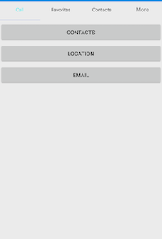

# Display Type

By default, the tab view control displays the title of each tab item. It can be changed to any of the following types:

* Text only
* Image only
* Image with text
* No header

The tab view can be changed by setting the `DisplayMode` property of `SfTabView`.





<ContentPage xmlns="http://xamarin.com/schemas/2014/forms"
             xmlns:x="http://schemas.microsoft.com/winfx/2009/xaml"
             xmlns:tabView="clr-namespace:Syncfusion.XForms.TabView;assembly=Syncfusion.SfTabView.XForms"
             x:Class="TabView.TabView">
    <ContentPage.Content>
         <tabView:SfTabView OverflowMode="DropDown"
                            EnableSwiping="false" 
                            VisibleHeaderCount="3"
                            DisplayMode="ImageWithText">
            <tabView:SfTabItem Title="Call"
                               SelectionColor="Aqua">
                <tabView:SfTabItem.Content>
                    <StackLayout>
                        <Grid BackgroundColor="Green"/>
                        <Button Text="Contacts" WidthRequest="300" />
                        <Button Text="Location" WidthRequest="300" />
                        <Button Text="Email" WidthRequest="300" />
                    </StackLayout>
                </tabView:SfTabItem.Content>
            </tabView:SfTabItem>
            <tabView:SfTabItem Title="Favorites">
                <tabView:SfTabItem.Content>
                    <Grid BackgroundColor="Green" x:Name="FavoritesGrid"/>
                </tabView:SfTabItem.Content>
            </tabView:SfTabItem>
            <tabView:SfTabItem Title="Contacts">
                <tabView:SfTabItem.Content>
                    <Grid BackgroundColor="Blue" x:Name="ContactsGrid" />
                </tabView:SfTabItem.Content>
            </tabView:SfTabItem>
            <tabView:SfTabItem Title="Location">
                <tabView:SfTabItem.Content>
                    <Grid BackgroundColor="Pink" x:Name="LocationGrid" />
                </tabView:SfTabItem.Content>
            </tabView:SfTabItem>
            <tabView:SfTabItem Title="Email">
                <tabView:SfTabItem.Content>
                    <Grid BackgroundColor="Navy" x:Name="EmailGrid" />
                </tabView:SfTabItem.Content>
            </tabView:SfTabItem>
            <tabView:SfTabItem Title="Alternative">
                <tabView:SfTabItem.Content>
                    <Grid BackgroundColor="Blue" x:Name="AlternativeGrid" />
                </tabView:SfTabItem.Content>
            </tabView:SfTabItem>
        </tabView:SfTabView>
    </ContentPage.Content>
</ContentPage>





using Syncfusion.XForms.TabView;
using Xamarin.Forms;
using Xamarin.Forms.Xaml;

namespace TabView
{
    [XamlCompilation(XamlCompilationOptions.Compile)]
	public partial class TabView : ContentPage
	{
        SfTabView tabView;
		public TabView ()
		{
			InitializeComponent ();
            tabView = new SfTabView();
            var allContactsGrid = new Grid { BackgroundColor = Color.Red };
            var favoritesGrid = new Grid { BackgroundColor = Color.Green };
            var contactsGrid = new Grid { BackgroundColor = Color.Blue };
            var overflowButtonSettings = new OverflowButtonSettings();
            overflowButtonSettings.BackgroundColor = Color.Yellow;
            overflowButtonSettings.DisplayMode = OverflowButtonDisplayMode.Text;
            overflowButtonSettings.Title = "OverFlow";
            overflowButtonSettings.TitleFontSize = 10;
            overflowButtonSettings.TitleFontColor = Color.Blue;
            tabView.OverflowButtonSettings = overflowButtonSettings;
            tabView.EnableSwiping = false;
            tabView.DisplayMode = TabDisplayMode.ImageWithText;
            var tabItems = new TabItemCollection
            {
                new SfTabItem()
                {
                    Title = "Calls",
                    Content = allContactsGrid,
                    SelectionColor = Color.Aqua
                },
                new SfTabItem()
                {
                    Title = "Favorites",
                    Content = favoritesGrid
                },
                new SfTabItem()
                {
                    Title = "Contacts",
                    Content = contactsGrid
                },
                new SfTabItem()
                {
                    Title = "Location",
                    Content = contactsGrid
                },
                new SfTabItem()
                {
                    Title = "Email",
                    Content = contactsGrid
                },
                new SfTabItem()
                {
                    Title = "Alternative",
                    Content = contactsGrid
                }
            };
            tabView.Items = tabItems;
            tabView.BackgroundColor = Color.Aqua;
            tabView.OverflowMode = OverflowMode.DropDown;
            this.Content = tabView;
		}
	}
}





The "no header" type can be used when the header is not needed for the tab view control. So, the content space will be occupied to the entire available height.

N> Image appearance in the header can be achieved through font icons.

## How to change the selection color for text and font icons?

The selected index can be differentiated by setting the `SelectionColor` property of `SfTabItem`.





<ContentPage xmlns="http://xamarin.com/schemas/2014/forms"
             xmlns:x="http://schemas.microsoft.com/winfx/2009/xaml"
             xmlns:tabView="clr-namespace:Syncfusion.XForms.TabView;assembly=Syncfusion.SfTabView.XForms"
             x:Class="TabView.TabView">
    <ContentPage.Content>
         <tabView:SfTabView OverflowMode="DropDown"
                            EnableSwiping="false" 
                            VisibleHeaderCount="3">
            <tabView:SfTabItem Title="Call"
                               SelectionColor="Aqua">
                <tabView:SfTabItem.Content>
                    <StackLayout>
                        <Grid BackgroundColor="Green"/>
                        <Button Text="Contacts" WidthRequest="300" />
                        <Button Text="Location" WidthRequest="300" />
                        <Button Text="Email" WidthRequest="300" />
                    </StackLayout>
                </tabView:SfTabItem.Content>
            </tabView:SfTabItem>
            <tabView:SfTabItem Title="Favorites">
                <tabView:SfTabItem.Content>
                    <Grid BackgroundColor="Green" x:Name="FavoritesGrid"/>
                </tabView:SfTabItem.Content>
            </tabView:SfTabItem>
            <tabView:SfTabItem Title="Contacts">
                <tabView:SfTabItem.Content>
                    <Grid BackgroundColor="Blue" x:Name="ContactsGrid" />
                </tabView:SfTabItem.Content>
            </tabView:SfTabItem>
            <tabView:SfTabItem Title="Location">
                <tabView:SfTabItem.Content>
                    <Grid BackgroundColor="Pink" x:Name="LocationGrid" />
                </tabView:SfTabItem.Content>
            </tabView:SfTabItem>
            <tabView:SfTabItem Title="Email">
                <tabView:SfTabItem.Content>
                    <Grid BackgroundColor="Navy" x:Name="EmailGrid" />
                </tabView:SfTabItem.Content>
            </tabView:SfTabItem>
            <tabView:SfTabItem Title="Alternative">
                <tabView:SfTabItem.Content>
                    <Grid BackgroundColor="Blue" x:Name="AlternativeGrid" />
                </tabView:SfTabItem.Content>
            </tabView:SfTabItem>
        </tabView:SfTabView>
    </ContentPage.Content>
</ContentPage>
			




using Syncfusion.XForms.TabView;
using Xamarin.Forms;
using Xamarin.Forms.Xaml;

namespace TabView
{
    [XamlCompilation(XamlCompilationOptions.Compile)]
	public partial class TabView : ContentPage
	{
        SfTabView tabView;
		public TabView ()
		{
			InitializeComponent ();
            tabView = new SfTabView();
            var allContactsGrid = new Grid { BackgroundColor = Color.Red };
            var favoritesGrid = new Grid { BackgroundColor = Color.Green };
            var contactsGrid = new Grid { BackgroundColor = Color.Blue };
            var overflowButtonSettings = new OverflowButtonSettings();
            overflowButtonSettings.DisplayMode = OverflowButtonDisplayMode.Text;
            overflowButtonSettings.Title = "OverFlow";
            overflowButtonSettings.TitleFontSize = 10;
            tabView.OverflowButtonSettings = overflowButtonSettings;
            tabView.EnableSwiping = false;
            var tabItems = new TabItemCollection
            {
                new SfTabItem()
                {
                    Title = "Calls",
                    Content = allContactsGrid,
                    SelectionColor = Color.Aqua
                },
                new SfTabItem()
                {
                    Title = "Favorites",
                    Content = favoritesGrid
                },
                new SfTabItem()
                {
                    Title = "Contacts",
                    Content = contactsGrid
                },
                new SfTabItem()
                {
                    Title = "Location",
                    Content = contactsGrid
                },
                new SfTabItem()
                {
                    Title = "Email",
                    Content = contactsGrid
                },
                new SfTabItem()
                {
                    Title = "Alternative",
                    Content = contactsGrid
                }
            };
            tabView.Items = tabItems;
            tabView.OverflowMode = OverflowMode.DropDown;
            this.Content = tabView;
		}
	}
}
	




The further customizations of header are discussed in the following sections:

## How to customize text appearance of the header title?





<ContentPage xmlns="http://xamarin.com/schemas/2014/forms"
             xmlns:x="http://schemas.microsoft.com/winfx/2009/xaml"
             xmlns:tabView="clr-namespace:Syncfusion.XForms.TabView;assembly=Syncfusion.SfTabView.XForms"
             x:Class="TabView.TabView">
    <ContentPage.Content>
         <tabView:SfTabView OverflowMode="DropDown"
                            EnableSwiping="false" 
                            VisibleHeaderCount="3">
            <tabView:SfTabItem Title="Call"
                               SelectionColor="Aqua">
                <tabView:SfTabItem.Content>
                    <StackLayout>
                        <Grid BackgroundColor="Green"/>
                        <Button Text="Contacts" WidthRequest="300" />
                        <Button Text="Location" WidthRequest="300" />
                        <Button Text="Email" WidthRequest="300" />
                    </StackLayout>
                </tabView:SfTabItem.Content>
            </tabView:SfTabItem>
            <tabView:SfTabItem Title="Favorites">
                <tabView:SfTabItem.Content>
                    <Grid BackgroundColor="Green" x:Name="FavoritesGrid"/>
                </tabView:SfTabItem.Content>
            </tabView:SfTabItem>
            <tabView:SfTabItem Title="Contacts" 
                               TitleFontAttributes="Bold" 
                               TitleFontColor="Red" 
                               TitleFontSize="22">
                <tabView:SfTabItem.Content>
                    <Grid BackgroundColor="Blue" x:Name="ContactsGrid" />
                </tabView:SfTabItem.Content>
            </tabView:SfTabItem>
            <tabView:SfTabItem Title="Location" 
                               TitleFontAttributes="Bold" 
                               TitleFontColor="Red" 
                               TitleFontSize="22">
                <tabView:SfTabItem.Content>
                    <Grid BackgroundColor="Pink" x:Name="LocationGrid" />
                </tabView:SfTabItem.Content>
            </tabView:SfTabItem>
            <tabView:SfTabItem Title="Email" 
                               TitleFontAttributes="Bold" 
                               TitleFontColor="Red" 
                               TitleFontSize="22">
                <tabView:SfTabItem.Content>
                    <Grid BackgroundColor="Navy" x:Name="EmailGrid" />
                </tabView:SfTabItem.Content>
            </tabView:SfTabItem>
            <tabView:SfTabItem Title="Alternative" 
                               TitleFontAttributes="Bold" 
                               TitleFontColor="Red" 
                               TitleFontSize="22">
                <tabView:SfTabItem.Content>
                    <Grid BackgroundColor="Blue" x:Name="AlternativeGrid" />
                </tabView:SfTabItem.Content>
            </tabView:SfTabItem>
        </tabView:SfTabView>
    </ContentPage.Content>
</ContentPage>
			




using Syncfusion.XForms.TabView;
using Xamarin.Forms;
using Xamarin.Forms.Xaml;

namespace TabView
{
    [XamlCompilation(XamlCompilationOptions.Compile)]
	public partial class TabView : ContentPage
	{
        SfTabView tabView;
		public TabView ()
		{
			InitializeComponent ();
            tabView = new SfTabView();
            var allContactsGrid = new Grid { BackgroundColor = Color.Red };
            var favoritesGrid = new Grid { BackgroundColor = Color.Green };
            var contactsGrid = new Grid { BackgroundColor = Color.Blue };
            var overflowButtonSettings = new OverflowButtonSettings();
            overflowButtonSettings.BackgroundColor = Color.Yellow;
            overflowButtonSettings.DisplayMode = OverflowButtonDisplayMode.Text;
            overflowButtonSettings.Title = "OverFlow";
            overflowButtonSettings.TitleFontSize = 10;
            overflowButtonSettings.TitleFontColor = Color.Blue;
            tabView.OverflowButtonSettings = overflowButtonSettings;
            tabView.EnableSwiping = false;
            var tabItems = new TabItemCollection
            {
                new SfTabItem()
                {
                    Title = "Calls",
                    Content = allContactsGrid,
                    SelectionColor = Color.Aqua
                },
                new SfTabItem()
                {
                    Title = "Favorites",
                    Content = favoritesGrid,
                    TitleFontAttributes = FontAttributes.Bold,
		            TitleFontColor = Color.Red,
		            TitleFontSize = 22
                },
                new SfTabItem()
                {
                    Title = "Contacts",
                    Content = contactsGrid,
                    TitleFontAttributes = FontAttributes.Bold,
		            TitleFontColor = Color.Red,
		            TitleFontSize = 22
                },
                new SfTabItem()
                {
                    Title = "Location",
                    Content = contactsGrid,
                    TitleFontAttributes = FontAttributes.Bold,
		            TitleFontColor = Color.Red,
		            TitleFontSize = 22
                },
                new SfTabItem()
                {
                    Title = "Email",
                    Content = contactsGrid,
                    TitleFontAttributes = FontAttributes.Bold,
		            TitleFontColor = Color.Red,
		            TitleFontSize = 22
                },
                new SfTabItem()
                {
                    Title = "Alternative",
                    Content = contactsGrid,
                    TitleFontAttributes = FontAttributes.Bold,
		            TitleFontColor = Color.Red,
		            TitleFontSize = 22
                }
            };
            tabView.Items = tabItems;
            tabView.BackgroundColor = Color.Aqua;
            tabView.OverflowMode = OverflowMode.DropDown;
            this.Content = tabView;
		}
	}
}
			




## How to set and customize the font icons' appearance in the header?

You can refer this [link](https://help.syncfusion.com/metro-studio/export-font-icon) for getting the font icons. Add the font file to your application by using the following steps for each platform:

**Adding font file for iOS**

1. Add the font family inside `Resource` folder iOS project.
2. Add the font file with the following build action: `BundleResource`.
3. Update the `Info.plist` file (fonts that are provided by application, UIAppFonts, or key).

**Adding font file for Android**

Add the font file to the `Assets` folder in the application project, and set the following build action: `AndroidAsset`.

**Adding font file for UWP**

Add the font family inside the application project of UWP.

N> For iOS alone, FontFamily property is declared without succeeding with .ttf and for android and UWP platform font family name is defined followed by .ttf.

**Setting font file for font icons**





<ContentPage xmlns="http://xamarin.com/schemas/2014/forms"
             xmlns:x="http://schemas.microsoft.com/winfx/2009/xaml"
             xmlns:local="clr-namespace:TabViewFontSample"
             xmlns:tabview="clr-namespace:Syncfusion.XForms.TabView;assembly=Syncfusion.SfTabView.XForms"
             x:Class="TabViewFontSample.TabViewFontSamplePage">
    <ContentPage.Resources>
        <ResourceDictionary>
            <OnPlatform x:TypeArguments="x:String" 
                        x:Key="fonts"
                        iOS="OpenTypeFont" 
                        Android="Fonts/OpenTypeFont.ttf" />
            <OnPlatform x:TypeArguments="x:String" 
                        x:Key="fonts" 
                        iOS="Fonts/fa-regular-400" 
                        Android="Fonts/fa-regular-400.ttf" />
        </ResourceDictionary>
    </ContentPage.Resources>
    <ContentPage.Content>
        <Grid BackgroundColor="White" Padding="0,20,0,0">
            <Grid.RowDefinitions>
                <RowDefinition Height="30" />
                <RowDefinition Height="*" />
            </Grid.RowDefinitions>
            <Label Text="Welcome to the Xamarin forms" Grid.Row="0" />
            <tabview:SfTabView Margin="0,0,0,2" 
                               x:Name="SimTab" 
                               VisibleHeaderCount="4" 
                               TabHeaderPosition="Bottom" 
                               DisplayMode="ImageWithText"
                               EnableSwiping="true" 
                               Grid.Row="1" >
                <tabview:SfTabView.Items>
                    <tabview:SfTabItem Title="Chat"   
                                       TitleFontSize="14"
                                       IconFont="A"
                                       FontIconFontFamily="{StaticResource fonts}"
                                       SelectionColor="#FF00AFF0"
                                       FontIconFontColor="#FF00AFF0"
                                       TitleFontColor="#FF00AFF0">
                        <tabview:SfTabItem.Content>
                            <Label Text="Hai" />
                        </tabview:SfTabItem.Content>
                    </tabview:SfTabItem>
                    <tabview:SfTabItem Title="Chat2"   
                                       TitleFontSize="14"
                                       IconFont="&#xf000;"
                                       FontIconFontFamily="{StaticResource fonts}"
                                       SelectionColor="#FF00AFF0"
                                       FontIconFontColor="#FF00AFF0"
                                       TitleFontColor="#FF00AFF0">
                        <tabview:SfTabItem.Content>
                            <Label Text="Hai" />
                        </tabview:SfTabItem.Content>
                    </tabview:SfTabItem>
                    <tabview:SfTabItem Title="like"   
                                       TitleFontSize="14"
                                       IconFont="&#0041;"
                                       FontIconFontFamily="{StaticResource fonts}"
                                       SelectionColor="#FF00AFF0"
                                       FontIconFontColor="#FF00AFF0"
                                       TitleFontColor="#FF00AFF0">
                        <tabview:SfTabItem.Content>
                            <Label Text="Hello"/>
                        </tabview:SfTabItem.Content>
                    </tabview:SfTabItem>
                    <tabview:SfTabItem Title="dislike"   
                                       TitleFontSize="14"
                                       IconFont="&#0041;"
                                       FontIconFontFamily="Fonts/OpenTypeFont.ttf"
                                       SelectionColor="#FF00AFF0"
                                       FontIconFontColor="#FF00AFF0"
                                       TitleFontColor="#FF00AFF0">
                        <tabview:SfTabItem.Content>
                            <Label Text="How are"/>
                        </tabview:SfTabItem.Content>
                    </tabview:SfTabItem>
                    <tabview:SfTabItem Title="status"
                                       TitleFontSize="14"
                                       IconFont="C"
                                       FontIconFontFamily="{StaticResource fonts}"
                                       SelectionColor="#FF00AFF0"
                                       FontIconFontColor="#FF00AFF0"
                                       TitleFontColor="#FF00AFF0">
                        <tabview:SfTabItem.Content>
                            <Label Text="You"/>
                        </tabview:SfTabItem.Content>
                    </tabview:SfTabItem>
                </tabview:SfTabView.Items>
            </tabview:SfTabView>
        </Grid>
    </ContentPage.Content>
</ContentPage>
			




using Syncfusion.XForms.TabView;
using Xamarin.Forms;
using Xamarin.Forms.Xaml;

namespace TabViewFontSample
{
    [XamlCompilation(XamlCompilationOptions.Compile)]
	public partial class TabView : ContentPage
	{
        SfTabView tabView;
		public TabView ()
		{
			InitializeComponent ();
            tabView = new SfTabView();
            var allContactsGrid = new Grid { BackgroundColor = Color.Red };
            var favoritesGrid = new Grid { BackgroundColor = Color.Green };
            var contactsGrid = new Grid { BackgroundColor = Color.Blue };
            var overflowButtonSettings = new OverflowButtonSettings();
            overflowButtonSettings.BackgroundColor = Color.Yellow;
            overflowButtonSettings.DisplayMode = OverflowButtonDisplayMode.Text;
            overflowButtonSettings.Title = "OverFlow";
            overflowButtonSettings.TitleFontSize = 10;
            overflowButtonSettings.TitleFontColor = Color.Blue;
            tabView.OverflowButtonSettings = overflowButtonSettings;
            tabView.EnableSwiping = false;
            var tabItems = new TabItemCollection
            {
                new SfTabItem()
                {
                    Title = "Calls",
                    Content = allContactsGrid,
                    IconFont = "A", // setting value for font icons as mentioned in *.ttf.
	                FontIconFontFamily = Device.RuntimePlatform == "iOS" ? "TabIcons" : Device.RuntimePlatform == "Android" ? "TabIcons.ttf" : "TabIcons.ttf#TabIcons",
	                FontIconFontColor = Color.LightBlue,
	                FontIconFontSize =  20
                },
                new SfTabItem()
                {
                    Title = "Favorites",
                    Content = favoritesGrid,
                    IconFont = "B", // setting value for font icons as mentioned in *.ttf.
	                FontIconFontFamily = Device.RuntimePlatform == "iOS" ? "TabIcons" : Device.RuntimePlatform == "Android" ? "TabIcons.ttf" : "TabIcons.ttf#TabIcons",
	                FontIconFontColor = Color.LightBlue,
	                FontIconFontSize =  20
                },
                new SfTabItem()
                {
                    Title = "Contacts",
                    Content = contactsGrid,
                    IconFont = "C", // setting value for font icons as mentioned in *.ttf.
	                FontIconFontFamily = Device.RuntimePlatform == "iOS" ? "TabIcons" : Device.RuntimePlatform == "Android" ? "TabIcons.ttf" : "TabIcons.ttf#TabIcons",
	                FontIconFontColor = Color.LightBlue,
	                FontIconFontSize =  20
                },
                new SfTabItem()
                {
                    Title = "Alternative",
                    Content = contactsGrid,
                    IconFont = "D", // setting value for font icons as mentioned in *.ttf.
	                FontIconFontFamily = Device.RuntimePlatform == "iOS" ? "TabIcons" : Device.RuntimePlatform == "Android" ? "TabIcons.ttf" : "TabIcons.ttf#TabIcons",
	                FontIconFontColor = Color.LightBlue,
	                FontIconFontSize =  20
                }
            };
            tabView.Items = tabItems;
            tabView.BackgroundColor = Color.Aqua;
            tabView.OverflowMode = OverflowMode.DropDown;
            this.Content = tabView;
		}
	}
}





You can refer this [link](http://www.syncfusion.com/downloads/support/directtrac/general/ze/TabViewFontSample192389450) for the simple sample defining the tab view items with font icons.