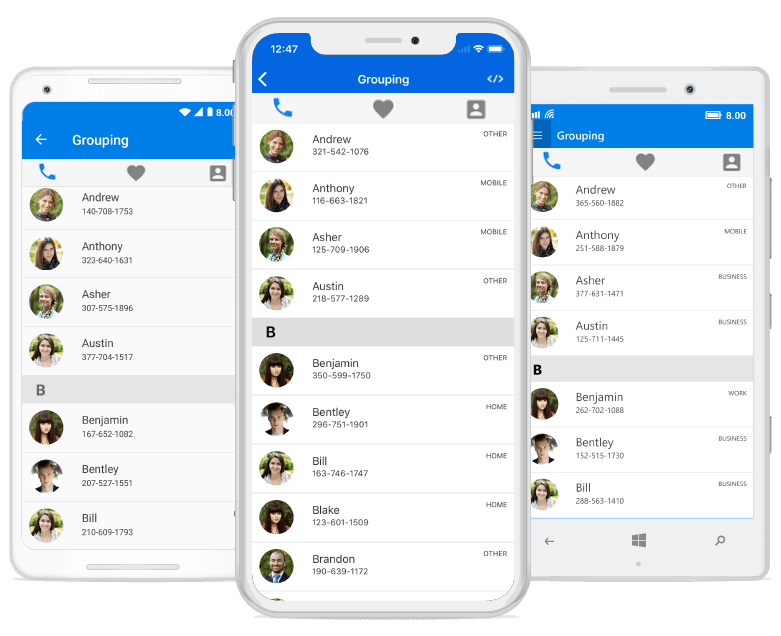

# Xamarin Tabbed View (SfTabView) Overview

The Tabbed View control is available in Xamarin.Forms, Xamarin.Android, Xamarin.iOS and Xamarin.UWP. It helps you to create the customizable features that are used to explore and switch among the different views. The key features of tab view control in Xamarin.Forms, Xamarin.Android, Xamarin.iOS and Xamarin.UWP are given as follows.

## Key features

* Tab header type with text, font icons, and no header.  
* Scrollable content and header.
* Top and bottom placements of header.
* Layout option for overflow tabs.

