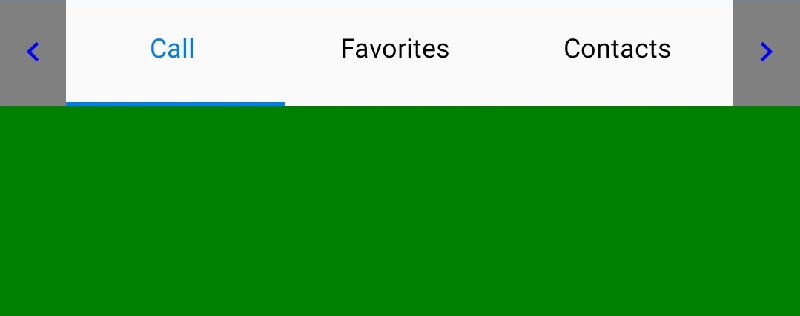

# Scroll Buttons on Tab Header

Buttons can be used to scroll the items in the header of the tab view by setting the `IsScrollEnabled` property of [SfTabView](https://help.syncfusion.com/cr/xamarin/Syncfusion.XForms.TabView.SfTabView.html). This also helps to indicate that there are tabs beyond the visible area if more tabs are present.

N> The `IsScrollEnabled` is working only when [OverFlowMode](https://help.syncfusion.com/cr/xamarin/Syncfusion.XForms.TabView.SfTabView.html#Syncfusion_XForms_TabView_SfTabView_OverflowMode) is set to `Scroll`.





<ContentPage xmlns="http://xamarin.com/schemas/2014/forms"
             xmlns:x="http://schemas.microsoft.com/winfx/2009/xaml"
             xmlns:tabView="clr-namespace:Syncfusion.XForms.TabView;assembly=Syncfusion.SfTabView.XForms"
             x:Class="TabView.TabView">
    <ContentPage.Content>
       <tabView:SfTabView OverflowMode="Scroll" 
                          IsScrollButtonEnabled="True">
                <tabView:SfTabItem Title="Call">
                    <tabView:SfTabItem.Content>
                        <Grid BackgroundColor="Green"/>
                    </tabView:SfTabItem.Content>
                </tabView:SfTabItem>
                <tabView:SfTabItem Title="Favorites">
                    <tabView:SfTabItem.Content>
                        <Grid BackgroundColor="Green"/>
                    </tabView:SfTabItem.Content>
                </tabView:SfTabItem>
                <tabView:SfTabItem Title="Contacts">
                    <tabView:SfTabItem.Content>
                        <Grid BackgroundColor="Blue" />
                    </tabView:SfTabItem.Content>
                </tabView:SfTabItem>
                <tabView:SfTabItem Title="Location">
                    <tabView:SfTabItem.Content>
                        <Grid BackgroundColor="Pink" />
                    </tabView:SfTabItem.Content>
                </tabView:SfTabItem>
                <tabView:SfTabItem Title="Email">
                    <tabView:SfTabItem.Content>
                        <Grid BackgroundColor="Navy"/>
                    </tabView:SfTabItem.Content>
                </tabView:SfTabItem>
                <tabView:SfTabItem Title="Alternative">
                    <tabView:SfTabItem.Content>
                        <Grid BackgroundColor="Blue"/>
                    </tabView:SfTabItem.Content>
                </tabView:SfTabItem>
            </tabView:SfTabView>
    </ContentPage.Content>
</ContentPage>
			




using Syncfusion.XForms.TabView;
using Xamarin.Forms;
using Xamarin.Forms.Xaml;

namespace TabView
{
    [XamlCompilation(XamlCompilationOptions.Compile)]
    public partial class TabView : ContentPage
    {
        SfTabView tabView;
        public TabView()
        {
            InitializeComponent();
            tabView = new SfTabView();
            var tabItems = new TabItemCollection
            {
               new tabview.SfTabItem()
                {
                Title = "Calls",
                Content = allContactsGrid
                },
                new tabview.SfTabItem()
                {
                    Title = "Favorites",
                    Content = favoritesGrid
                },
                new tabview.SfTabItem()
                {
                    Title = "Contacts",
                    Content = contactsGrid
                },
                new tabview.SfTabItem()
                {
                    Title = "Location",
                    Content = allContactsGrid
                },
                new tabview.SfTabItem()
                {
                    Title = "Email",
                    Content = contactsGrid
                },
                new tabview.SfTabItem()
                {
                    Title = "Alternative",
                    Content = allContactsGrid
                }
            };
            tabView.Items = tabItems;
            tabView.OverflowMode = OverflowMode.Scroll;
            tabView.IsScrollButtonEnabled = true;
            this.Content = tabView;
        }
    }
}
			




## ScrollButtonBackgroundColor and ScrollButtonForegroundColor

Change the color of the Scroll buttons foreground and background color by using the `ScrollButtonBackgroundColor` and `ScrollButtonForegroundColor` properties.





<ContentPage xmlns="http://xamarin.com/schemas/2014/forms"
             xmlns:x="http://schemas.microsoft.com/winfx/2009/xaml"
             xmlns:tabView="clr-namespace:Syncfusion.XForms.TabView;assembly=Syncfusion.SfTabView.XForms"
             x:Class="TabView.TabView">
    <ContentPage.Content>
       <tabView:SfTabView OverflowMode="Scroll"   
                          IsScrollButtonEnabled="True"
                          ScrollButtonBackgroundColor="Gray" ScrollButtonForegroundColor="Blue">
                <tabView:SfTabItem Title="Call">
                    <tabView:SfTabItem.Content>
                        <Grid BackgroundColor="Green"/>
                    </tabView:SfTabItem.Content>
                </tabView:SfTabItem>
                <tabView:SfTabItem Title="Favorites">
                    <tabView:SfTabItem.Content>
                        <Grid BackgroundColor="Green" />
                    </tabView:SfTabItem.Content>
                </tabView:SfTabItem>
                <tabView:SfTabItem Title="Contacts">
                    <tabView:SfTabItem.Content>
                        <Grid BackgroundColor="Blue" />
                    </tabView:SfTabItem.Content>
                </tabView:SfTabItem>
                <tabView:SfTabItem Title="Location">
                    <tabView:SfTabItem.Content>
                        <Grid BackgroundColor="Pink"  />
                    </tabView:SfTabItem.Content>
                </tabView:SfTabItem>
                <tabView:SfTabItem Title="Email">
                    <tabView:SfTabItem.Content>
                        <Grid BackgroundColor="Navy"  />
                    </tabView:SfTabItem.Content>
                </tabView:SfTabItem>
                <tabView:SfTabItem Title="Alternative">
                    <tabView:SfTabItem.Content>
                        <Grid BackgroundColor="Blue"  />
                    </tabView:SfTabItem.Content>
                </tabView:SfTabItem>
            </tabView:SfTabView>
    </ContentPage.Content>
</ContentPage>





using Syncfusion.XForms.TabView;
using Xamarin.Forms;
using Xamarin.Forms.Xaml;

namespace TabView
{
    [XamlCompilation(XamlCompilationOptions.Compile)]
    public partial class TabView : ContentPage
    {
        SfTabView tabView;
        public TabView()
        {
            InitializeComponent();
            tabView = new SfTabView();
            var tabItems = new TabItemCollection
            {
               new tabview.SfTabItem()
                {
                Title = "Calls",
                Content = allContactsGrid
                },
                new tabview.SfTabItem()
                {
                    Title = "Favorites",
                    Content = favoritesGrid
                },
                new tabview.SfTabItem()
                {
                    Title = "Contacts",
                    Content = contactsGrid
                },
                new tabview.SfTabItem()
                {
                    Title = "Location",
                    Content = allContactsGrid
                },
                new tabview.SfTabItem()
                {
                    Title = "Email",
                    Content = contactsGrid
                },
                new tabview.SfTabItem()
                {
                    Title = "Alternative",
                    Content = allContactsGrid
                }
            };
            tabView.Items = tabItems;
            tabView.OverflowMode = OverflowMode.Scroll;
            tabView.IsScrollButtonEnabled = true;
            tabView.ScrollButtonBackgroundColor = Color.Gray;
            tabView.ScrollButtonForegroundColor = Color.Blue;
            this.Content = tabView;
        }
    }
}
	



