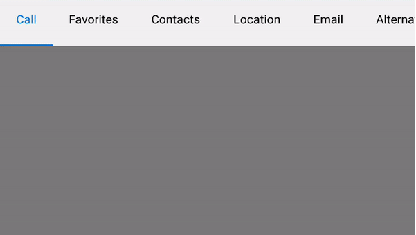
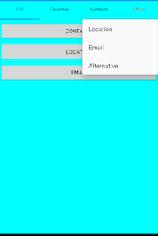

# TabView Header Customization in Xamarin Tabbed View (SfTabView)

## Tab header arrangement

### Share the header space equally

To share the header space to the tabs equally, set the number of tabs that can be distributed in the available space though the [VisibleHeaderCount](https://help.syncfusion.com/cr/xamarin/Syncfusion.XForms.TabView.SfTabView.html#Syncfusion_XForms_TabView_SfTabView_VisibleHeaderCount) of [`SfTabView`](https://help.syncfusion.com/cr/xamarin/Syncfusion.XForms.TabView.SfTabView.html).





<ContentPage xmlns="http://xamarin.com/schemas/2014/forms"
             xmlns:x="http://schemas.microsoft.com/winfx/2009/xaml"
             xmlns:tabView="clr-namespace:Syncfusion.XForms.TabView;assembly=Syncfusion.SfTabView.XForms"
             x:Class="TabViewAutomationSample.TabViewAutomationSample">
        <ContentPage.Content>
            <tabView:SfTabView BackgroundColor="White" VisibleHeaderCount="3">
                <tabView:SfTabItem Title="Call">
                    <tabView:SfTabItem.Content>
                        <Grid BackgroundColor="Gray" x:Name="AllContactsGrid" />
                    </tabView:SfTabItem.Content>
                </tabView:SfTabItem>
                <tabView:SfTabItem Title="Favorites">
                    <tabView:SfTabItem.Content>
                        <Grid BackgroundColor="Green" x:Name="FavoritesGrid" />
                    </tabView:SfTabItem.Content>
                </tabView:SfTabItem>
                <tabView:SfTabItem Title="Contacts">
                    <tabView:SfTabItem.Content>
                        <Grid BackgroundColor="Blue" x:Name="ContactsGrid" />
                    </tabView:SfTabItem.Content>
                </tabView:SfTabItem>
                <tabView:SfTabItem Title="Email">
                    <tabView:SfTabItem.Content>
                        <Grid BackgroundColor="Olive" x:Name="EmailGrid" />
                    </tabView:SfTabItem.Content>
                </tabView:SfTabItem>
            </tabView:SfTabView>
        </ContentPage.Content>
    </ContentPage>
	




using Syncfusion.XForms.TabView;
using Xamarin.Forms;
using Xamarin.Forms.Xaml;

namespace TabViewAutomationSample
{
    [XamlCompilation(XamlCompilationOptions.Compile)]
    public partial class TabView : ContentPage
    {
        SfTabView tabView;
        public TabView()
        {
            InitializeComponent();
            var tabView = new SfTabView();
            var allContactsGrid = new Grid { BackgroundColor = Color.Red };
            var favoritesGrid = new Grid { BackgroundColor = Color.Green };
            var contactsGrid = new Grid { BackgroundColor = Color.Blue };
            var emailGrid = new Grid { BackgroundColor = Color.Olive };
            tabView.VisibleHeaderCount = 3;
            var tabItems = new TabItemCollection
            {
                new SfTabItem()
                {
                    Title = "Calls",
                    Content = allContactsGrid
                },
                new SfTabItem()
                {
                    Title = "Favorites",
                    Content = favoritesGrid
                },
                new SfTabItem()
                {
                    Title = "Contacts",
                    Content = contactsGrid
                },
                new SfTabItem()
                {
                    Title = "Email",
                    Content = emailGrid
                }
            };
            tabView.Items = tabItems;
            this.Content = tabView;
        }
    }
}





### Add all tab items in a single view 

When you set the [VisibleHeaderCount](https://help.syncfusion.com/cr/xamarin/Syncfusion.XForms.TabView.SfTabView.html#Syncfusion_XForms_TabView_SfTabView_VisibleHeaderCount) to -1, you get all the tab items in a single view based on the width of the visible area in the control and tab count.





 <ContentPage xmlns="http://xamarin.com/schemas/2014/forms"
             xmlns:x="http://schemas.microsoft.com/winfx/2009/xaml"
             xmlns:tabView="clr-namespace:Syncfusion.XForms.TabView;assembly=Syncfusion.SfTabView.XForms"
             x:Class="TabViewAutomationSample.TabViewAutomationSample">
        <ContentPage.Content>
            <tabView:SfTabView BackgroundColor="White" VisibleHeaderCount="-1">
                <tabView:SfTabItem Title="Call">
                    <tabView:SfTabItem.Content>
                        <Grid BackgroundColor="Gray" x:Name="AllContactsGrid" />
                    </tabView:SfTabItem.Content>
                </tabView:SfTabItem>
                <tabView:SfTabItem Title="Favorites">
                    <tabView:SfTabItem.Content>
                        <Grid BackgroundColor="Green" x:Name="FavoritesGrid" />
                    </tabView:SfTabItem.Content>
                </tabView:SfTabItem>
                <tabView:SfTabItem Title="Contacts">
                    <tabView:SfTabItem.Content>
                        <Grid BackgroundColor="Blue" x:Name="ContactsGrid" />
                    </tabView:SfTabItem.Content>
                </tabView:SfTabItem>
                <tabView:SfTabItem Title="Location">
                    <tabView:SfTabItem.Content>
                        <Grid BackgroundColor="Aqua" x:Name="Location" />
                    </tabView:SfTabItem.Content>
                    <tabView:SfTabItem Title="Email">
                        <tabView:SfTabItem.Content>
                            <Grid BackgroundColor="Olive" x:Name="EmailGrid" />
                        </tabView:SfTabItem.Content>
                    </tabView:SfTabItem>
                    <tabView:SfTabItem Title="Alternative">
                        <tabView:SfTabItem.Content>
                            <Grid BackgroundColor="Blue" x:Name="AlternativeGrid" />
                        </tabView:SfTabItem.Content>
                    </tabView:SfTabItem>
            </tabView:SfTabView>
        </ContentPage.Content>
    </ContentPage>




using Syncfusion.XForms.TabView;
using Xamarin.Forms;
using Xamarin.Forms.Xaml;

namespace TabViewAutomationSample
{
    public partial class TabView : ContentPage
    {
        SfTabView tabView;
        public TabView()
        {
            InitializeComponent();
            var tabView = new SfTabView();
            var allContactsGrid = new Grid { BackgroundColor = Color.Red };
            var favoritesGrid = new Grid { BackgroundColor = Color.Green };
            var contactsGrid = new Grid { BackgroundColor = Color.Blue };
            var emailGrid = new Grid { BackgroundColor = Color.Olive };
            tabView.VisibleHeaderCount = -1;
            var tabItems = new TabItemCollection
            {
                new SfTabItem()
                {
                    Title = "Calls",
                    Content = allContactsGrid
                },
                new SfTabItem()
                {
                    Title = "Favorites",
                    Content = favoritesGrid
                },
                new SfTabItem()
                {
                    Title = "Contacts",
                    Content = contactsGrid
                },
                new SfTabItem()
                {
                    Title = "Location",
                    Content = favoritesGrid
                },
                new SfTabItem()
                {
                    Title = "Email",
                    Content = emailGrid
                },
                new tabview.SfTabItem()
                {
                    Title = "Alternative",
                    Content = allContactsGrid
                }
            };
            tabView.Items = tabItems;
            this.Content = tabView;
        }
    }
}





N> The nullable support for [VisibleHeaderCount](https://help.syncfusion.com/cr/xamarin/Syncfusion.XForms.TabView.SfTabView.html#Syncfusion_XForms_TabView_SfTabView_VisibleHeaderCount) only works when [OverFlowMode](https://help.syncfusion.com/cr/xamarin/Syncfusion.XForms.TabView.SfTabView.html#Syncfusion_XForms_TabView_SfTabView_OverflowMode) is set to [`Scroll`](https://help.syncfusion.com/cr/xamarin/Syncfusion.XForms.TabView.OverflowMode.html#Syncfusion_XForms_TabView_OverflowMode_Scroll) or [`DropDown`](https://help.syncfusion.com/cr/xamarin/Syncfusion.XForms.TabView.OverflowMode.html#Syncfusion_XForms_TabView_OverflowMode_DropDown). 

### Add tab items at auto size

When setting the [`TabWidthMode`](https://help.syncfusion.com/cr/xamarin/Syncfusion.XForms.TabView.SfTabView.html#Syncfusion_XForms_TabView_SfTabView_TabWidthMode) property as [`BasedOnText`](https://help.syncfusion.com/cr/xamarin/Syncfusion.XForms.TabView.TabWidthMode.html#Syncfusion_XForms_TabView_TabWidthMode_BasedOnText) option, tab width is calculated based on the length of the tab item [`Title`](https://help.syncfusion.com/cr/xamarin/Syncfusion.XForms.TabView.SfTabItem.html#Syncfusion_XForms_TabView_SfTabItem_Title) string.

The default option of [`TabWidthMode`](https://help.syncfusion.com/cr/xamarin/Syncfusion.XForms.TabView.SfTabView.html#Syncfusion_XForms_TabView_SfTabView_TabWidthMode) property is [`Default`](https://help.syncfusion.com/cr/xamarin/Syncfusion.XForms.TabView.TabWidthMode.html#Syncfusion_XForms_TabView_TabWidthMode_Default). 





<ContentPage xmlns="http://xamarin.com/schemas/2014/forms"
             xmlns:x="http://schemas.microsoft.com/winfx/2009/xaml"
             xmlns:tabView="clr-namespace:Syncfusion.XForms.TabView;assembly=Syncfusion.SfTabView.XForms"
             x:Class="TabViewAutomationSample.TabViewAutomationSample">
    <ContentPage.Content>
        <tabView:SfTabView BackgroundColor="White" TabWidthMode="BasedOnText">
            <tabView:SfTabItem Title="Call">
                <tabView:SfTabItem.Content>
                    <Grid BackgroundColor="Gray"/>
                </tabView:SfTabItem.Content>
            </tabView:SfTabItem>
            <tabView:SfTabItem Title="Favorites">
                <tabView:SfTabItem.Content>
                    <Grid BackgroundColor="Green" />
                </tabView:SfTabItem.Content>
            </tabView:SfTabItem>
            <tabView:SfTabItem Title="Contacts">
                <tabView:SfTabItem.Content>
                    <Grid BackgroundColor="Blue"/>
                </tabView:SfTabItem.Content>
            </tabView:SfTabItem>
            <tabView:SfTabItem Title="Location">
                <tabView:SfTabItem.Content>
                    <Grid BackgroundColor="Aqua"/>
                </tabView:SfTabItem.Content>
                <tabView:SfTabItem Title="Email">
                    <tabView:SfTabItem.Content>
                        <Grid BackgroundColor="Olive"/>
                    </tabView:SfTabItem.Content>
                </tabView:SfTabItem>
                <tabView:SfTabItem Title="Alternative">
                    <tabView:SfTabItem.Content>
                        <Grid BackgroundColor="Blue" />
                    </tabView:SfTabItem.Content>
                </tabView:SfTabItem>
        </tabView:SfTabView>
    </ContentPage.Content>
</ContentPage>
	



using Syncfusion.XForms.TabView;
using Xamarin.Forms;
using Xamarin.Forms.Xaml;

namespace TabViewAutomationSample
{
    public partial class TabView : ContentPage
    {
        SfTabView tabView;
        public TabView()
        {
            InitializeComponent();
            var tabView = new SfTabView();
            var allContactsGrid = new Grid { BackgroundColor = Color.Red };
            var favoritesGrid = new Grid { BackgroundColor = Color.Green };
            var contactsGrid = new Grid { BackgroundColor = Color.Blue };
            var emailGrid = new Grid { BackgroundColor = Color.Olive };
            tabView.TabWidthMode = TabWidthMode.BasedOnText;
            var tabItems = new TabItemCollection
            {
                new SfTabItem()
                {
                    Title = "Calls",
                    Content = allContactsGrid
                },
                new SfTabItem()
                {
                    Title = "Favorites",
                    Content = favoritesGrid
                },
                new SfTabItem()
                {
                    Title = "Contacts",
                    Content = contactsGrid
                },
                new SfTabItem()
                {
                    Title = "Location",
                    Content = favoritesGrid
                },
                new SfTabItem()
                {
                    Title = "Email",
                    Content = emailGrid
                },
                new tabview.SfTabItem()
                {
                    Title = "Alternative",
                    Content = allContactsGrid
                }
            };

            tabView.Items = tabItems;
            this.Content = tabView;
        }
    }
}




N> The [`TabWidthMode`](https://help.syncfusion.com/cr/xamarin/Syncfusion.XForms.TabView.SfTabView.html#Syncfusion_XForms_TabView_SfTabView_TabWidthMode) for [`BasedOnText`](https://help.syncfusion.com/cr/xamarin/Syncfusion.XForms.TabView.TabWidthMode.html#Syncfusion_XForms_TabView_TabWidthMode_BasedOnText) is supported only when the [VisibleHeaderCount](https://help.syncfusion.com/cr/xamarin/Syncfusion.XForms.TabView.SfTabView.html#Syncfusion_XForms_TabView_SfTabView_VisibleHeaderCount) is not set and [OverFlowMode](https://help.syncfusion.com/cr/xamarin/Syncfusion.XForms.TabView.SfTabView.html#Syncfusion_XForms_TabView_SfTabView_OverflowMode) is set to [`Scroll`](https://help.syncfusion.com/cr/xamarin/Syncfusion.XForms.TabView.OverflowMode.html#Syncfusion_XForms_TabView_OverflowMode_Scroll). 

## Position of Header in Xamarin Tabbed View (SfTabView)

Tab headers can be positioned either above the content or below the content. This can be done by setting the [`TabHeaderPosition`](https://help.syncfusion.com/cr/xamarin/Syncfusion.XForms.TabView.SfTabView.html#Syncfusion_XForms_TabView_SfTabView_TabHeaderPosition) property of [`SfTabView`](https://help.syncfusion.com/cr/xamarin/Syncfusion.XForms.TabView.SfTabView.html).





<ContentPage xmlns="http://xamarin.com/schemas/2014/forms"
             xmlns:x="http://schemas.microsoft.com/winfx/2009/xaml"
             xmlns:tabView="clr-namespace:Syncfusion.XForms.TabView;assembly=Syncfusion.SfTabView.XForms"
             x:Class="TabView.TabView">
    <ContentPage.Content>
        <tabView:SfTabView VisibleHeaderCount="3"
                           TabHeaderPosition="Bottom"  
                           OverflowMode="DropDown">
            <tabView:SfTabItem Title="CEO">
                <tabView:SfTabItem.Content>
                    <StackLayout>
                        <Grid BackgroundColor="Green"/>
                        <Button Text="Contacts" WidthRequest="300" />
                        <Button Text="Location" WidthRequest="300" />
                        <Button Text="Email" WidthRequest="300" />
                    </StackLayout>
                </tabView:SfTabItem.Content>
            </tabView:SfTabItem>
            <tabView:SfTabItem Title="Patients">
                <tabView:SfTabItem.Content>
                    <Grid BackgroundColor="Blue" x:Name="FavoritesGrid"/>
                </tabView:SfTabItem.Content>
            </tabView:SfTabItem>
            <tabView:SfTabItem Title="Staff">
                <tabView:SfTabItem.Content>
                    <Grid BackgroundColor="Green" x:Name="ContactsGrid" />
                </tabView:SfTabItem.Content>
            </tabView:SfTabItem>
            <tabView:SfTabItem Title="Alternative">
                <tabView:SfTabItem.Content>
                    <Grid BackgroundColor="Olive" x:Name="AlternativeGrid" />
                </tabView:SfTabItem.Content>
            </tabView:SfTabItem>
        </tabView:SfTabView>
    </ContentPage.Content>
</ContentPage>





using Syncfusion.XForms.TabView;
using Xamarin.Forms;
using Xamarin.Forms.Xaml;

namespace TabView
{
    [XamlCompilation(XamlCompilationOptions.Compile)]
    public partial class TabView : ContentPage
    {
        SfTabView tabView;
        public TabView()
        {
            InitializeComponent();
            tabView = new SfTabView();
            var allContactsGrid = new Grid { BackgroundColor = Color.Red };
            var favoritesGrid = new Grid { BackgroundColor = Color.Blue };
            var contactsGrid = new Grid { BackgroundColor = Color.Green };
            var alternativeGrid = new Grid { BackgroundColor = Color.Olive };
            tabView.TabHeaderPosition = TabHeaderPosition.Bottom;
            tabView.OverflowMode = OverflowMode.DropDown;
            var tabItems = new TabItemCollection
            {
                new SfTabItem()
                {
                    Title = "CEO",
                    Content = allContactsGrid
                },
                new SfTabItem()
                {
                    Title = "Patients",
                    Content = favoritesGrid
                },
                new SfTabItem()
                {
                    Title = "Staff",
                    Content = contactsGrid
                }

                new SfTabItem()
                {
                    Title = "Alternative",
                    Content = alternativeGrid
                }
            };
            tabView.Items = tabItems;
            this.Content = tabView;
        }
    }
}




When the header is not needed, set the [`DisplayMode`](https://help.syncfusion.com/cr/xamarin/Syncfusion.XForms.TabView.SfTabView.html#Syncfusion_XForms_TabView_SfTabView_DisplayMode) property of [`SfTabView`](https://help.syncfusion.com/cr/xamarin/Syncfusion.XForms.TabView.SfTabView.html) to [`NoHeader`](https://help.syncfusion.com/cr/xamarin/Syncfusion.XForms.TabView.TabDisplayMode.html#Syncfusion_XForms_TabView_TabDisplayMode_NoHeader).

## Customize header background color

 To change the header background color of tabbed view, set [TabHeaderBackgroundColor]("https://help.syncfusion.com/cr/xamarin/Syncfusion.XForms.TabView.SfTabView.html#Syncfusion_XForms_TabView_SfTabView_TabHeaderBackgroundColor") property in tabbed view.




   
     <ContentPage xmlns="http://xamarin.com/schemas/2014/forms"
             xmlns:x="http://schemas.microsoft.com/winfx/2009/xaml"
             xmlns:tabView="clr-namespace:Syncfusion.XForms.TabView;assembly=Syncfusion.SfTabView.XForms"
             x:Class="TabView.TabView">
        <ContentPage.Content>
            <tabView:SfTabView TabHeaderBackgroundColor="SkyBlue">
                <tabView:SfTabItem Title="Call">
                    <tabView:SfTabItem.Content>
                        <Grid BackgroundColor="Red" x:Name="allContactsGrid"/>
                    </tabView:SfTabItem.Content>
                </tabView:SfTabItem>
                <tabView:SfTabItem Title="Favorites">
                    <tabView:SfTabItem.Content>
                        <Grid BackgroundColor="Green"    x:Name="FavoritesGrid"/>
                    </tabView:SfTabItem.Content>
                </tabView:SfTabItem>
                <tabView:SfTabItem Title="Contacts">
                    <tabView:SfTabItem.Content>
                        <Grid BackgroundColor="Blue" x:Name="ContactsGrid"/>
                    </tabView:SfTabItem.Content>
                </tabView:SfTabItem>
            </tabView:SfTabView>
        </ContentPage.Content>
    </ContentPage>





    using Syncfusion.XForms.TabView;
    using Xamarin.Forms;
    using Xamarin.Forms.Xaml;
    
    namespace TabView
{
    [XamlCompilation(XamlCompilationOptions.Compile)]
    public partial class TabView : ContentPage
    {
        SfTabView tabView;
        public TabView()
        {
            InitializeComponent();
            tabView = new SfTabView();
            var allContactsGrid = new Grid { BackgroundColor = Color.Red };
            var favoritesGrid = new Grid { BackgroundColor = Color.Blue };
            var contactsGrid = new Grid { BackgroundColor = Color.Green };
            var tabItems = new TabItemCollection
            {
                new SfTabItem()
                {
                    Title = "Call",
                    Content = allContactsGrid
                },
                new SfTabItem()
                {
                    Title = "Favorites",
                    Content = favoritesGrid
                },
                new SfTabItem()
                {
                    Title = "Contacts",
                    Content = contactsGrid
                }
           };

            tabView.TabHeaderBackgroundColor = Color.SkyBlue;
            tabView.Items = tabItems;
            this.Content = tabView;
        }
    }
}





## Selection Indicator in Xamarin Tabbed View (SfTabView)

The selection indicator strip can be used to indicate the selected index of the tab view control. It can be customized with the built-in APIs that are available in the [SelectionIndicatorSettings](https://help.syncfusion.com/cr/xamarin/Syncfusion.XForms.TabView.SfTabView.html#Syncfusion_XForms_TabView_SfTabView_SelectionIndicatorSettings) property of [SfTabView](https://help.syncfusion.com/cr/xamarin/Syncfusion.XForms.TabView.SfTabView.html).

The selection indicator can be positioned below the title or above the title, or else it can be filled in the entire selected header space.





  <ContentPage xmlns="http://xamarin.com/schemas/2014/forms"
             xmlns:x="http://schemas.microsoft.com/winfx/2009/xaml"
             xmlns:tabView="clr-namespace:Syncfusion.XForms.TabView;assembly=Syncfusion.SfTabView.XForms"
             x:Class="TabView.TabView">
        <ContentPage.Content>
            <tabView:SfTabView VisibleHeaderCount="3"
                           TabHeaderPosition="Bottom"  
                           OverflowMode="DropDown">
                <tabView:SfTabView.SelectionIndicatorSettings>
                    <tabView:SelectionIndicatorSettings
                    Color="Aqua" 
                    Position="Top" 
                    StrokeThickness="10"/>
                </tabView:SfTabView.SelectionIndicatorSettings>
                <tabView:SfTabItem Title="CEO">
                    <tabView:SfTabItem.Content>
                        <StackLayout>
                            <Grid BackgroundColor="Green"/>
                            <Button Text="Contacts" WidthRequest="300" />
                            <Button Text="Location" WidthRequest="300" />
                            <Button Text="Email" WidthRequest="300" />
                        </StackLayout>
                    </tabView:SfTabItem.Content>
                </tabView:SfTabItem>
                <tabView:SfTabItem Title="Patients">
                    <tabView:SfTabItem.Content>
                        <Grid BackgroundColor="Blue" x:Name="FavoritesGrid"/>
                    </tabView:SfTabItem.Content>
                </tabView:SfTabItem>
                <tabView:SfTabItem Title="Staff">
                    <tabView:SfTabItem.Content>
                        <Grid BackgroundColor="Green" x:Name="ContactsGrid" />
                    </tabView:SfTabItem.Content>
                </tabView:SfTabItem>
                <tabView:SfTabItem Title="Alternative">
                    <tabView:SfTabItem.Content>
                        <Grid BackgroundColor="Olive" x:Name="AlternativeGrid" />
                    </tabView:SfTabItem.Content>
                </tabView:SfTabItem>
            </tabView:SfTabView>
        </ContentPage.Content>
    </ContentPage>





using Syncfusion.XForms.TabView;
using Xamarin.Forms;
using Xamarin.Forms.Xaml;

namespace TabView
{
    [XamlCompilation(XamlCompilationOptions.Compile)]
    public partial class TabView : ContentPage
    {
        SfTabView tabView;
        public TabView()
        {
            InitializeComponent();
            tabView = new SfTabView();
            var allContactsGrid = new Grid { BackgroundColor = Color.Red };
            var favoritesGrid = new Grid { BackgroundColor = Color.Blue };
            var contactsGrid = new Grid { BackgroundColor = Color.Green };
            var alternativeGrid = new Grid { BackgroundColor = Color.Olive };
            var selectionIndicatorSettings = new SelectionIndicatorSettings();
            selectionIndicatorSettings.Color = Color.Red;
            selectionIndicatorSettings.Position = SelectionIndicatorPosition.Top;
            selectionIndicatorSettings.StrokeThickness = 10;
            tabView.SelectionIndicatorSettings = selectionIndicatorSettings;
            tabView.TabHeaderPosition = TabHeaderPosition.Bottom;
            tabView.OverflowMode = OverflowMode.DropDown;
            var tabItems = new TabItemCollection
            {
                new SfTabItem()
                {
                    Title = "CEO",
                    Content = allContactsGrid
                },
                new SfTabItem()
                {
                    Title = "Patients",
                    Content = favoritesGrid
                },
                new SfTabItem()
                {
                    Title = "Staff",
                    Content = contactsGrid
                }
                new SfTabItem()
                {
                    Title = "Alternative",
                    Content = alternativeGrid
                }
            };
            tabView.Items = tabItems;
            this.Content = tabView;
        }
    }
}





N> Stroke thickness will not be applicable when the selection indicator’s position is set to "Fill".

## Scroll buttons on Header in Xamarin Tabbed View (SfTabView)

Buttons can be used to scroll the items in the header of the tab view by setting the [`IsScrollEnabled`](https://help.syncfusion.com/cr/xamarin/Syncfusion.XForms.TabView.SfTabView.html#Syncfusion_XForms_TabView_SfTabView_IsScrollButtonEnabled) property of [SfTabView](https://help.syncfusion.com/cr/xamarin/Syncfusion.XForms.TabView.SfTabView.html). This also helps to indicate that there are tabs beyond the visible area if more tabs are present.

N> The `IsScrollEnabled` is working only when [OverFlowMode](https://help.syncfusion.com/cr/xamarin/Syncfusion.XForms.TabView.SfTabView.html#Syncfusion_XForms_TabView_SfTabView_OverflowMode) is set to `Scroll`.





 <ContentPage xmlns="http://xamarin.com/schemas/2014/forms"
             xmlns:x="http://schemas.microsoft.com/winfx/2009/xaml"
             xmlns:tabView="clr-namespace:Syncfusion.XForms.TabView;assembly=Syncfusion.SfTabView.XForms"
             x:Class="TabView.TabView">
        <ContentPage.Content>
            <tabView:SfTabView OverflowMode="Scroll" 
                          IsScrollButtonEnabled="True">
                <tabView:SfTabItem Title="Call">
                    <tabView:SfTabItem.Content>
                        <Grid BackgroundColor="Green"/>
                    </tabView:SfTabItem.Content>
                </tabView:SfTabItem>
                <tabView:SfTabItem Title="Favorites">
                    <tabView:SfTabItem.Content>
                        <Grid BackgroundColor="Green"/>
                    </tabView:SfTabItem.Content>
                </tabView:SfTabItem>
                <tabView:SfTabItem Title="Contacts">
                    <tabView:SfTabItem.Content>
                        <Grid BackgroundColor="Blue" />
                    </tabView:SfTabItem.Content>
                </tabView:SfTabItem>
                <tabView:SfTabItem Title="Location">
                    <tabView:SfTabItem.Content>
                        <Grid BackgroundColor="Pink" />
                    </tabView:SfTabItem.Content>
                </tabView:SfTabItem>
                <tabView:SfTabItem Title="Email">
                    <tabView:SfTabItem.Content>
                        <Grid BackgroundColor="Navy"/>
                    </tabView:SfTabItem.Content>
                </tabView:SfTabItem>
                <tabView:SfTabItem Title="Alternative">
                    <tabView:SfTabItem.Content>
                        <Grid BackgroundColor="Blue"/>
                    </tabView:SfTabItem.Content>
                </tabView:SfTabItem>
            </tabView:SfTabView>
        </ContentPage.Content>
    </ContentPage>





using Syncfusion.XForms.TabView;
using Xamarin.Forms;
using Xamarin.Forms.Xaml;

namespace TabView
{
    [XamlCompilation(XamlCompilationOptions.Compile)]
    public partial class TabView : ContentPage
    {
        SfTabView tabView;
        public TabView()
        {
            InitializeComponent();
            tabView = new SfTabView();
            var tabItems = new TabItemCollection
            {
               new tabview.SfTabItem()
                {
                Title = "Calls",
                Content = allContactsGrid
                },
                new tabview.SfTabItem()
                {
                    Title = "Favorites",
                    Content = favoritesGrid
                },
                new tabview.SfTabItem()
                {
                    Title = "Contacts",
                    Content = contactsGrid
                },
                new tabview.SfTabItem()
                {
                    Title = "Location",
                    Content = allContactsGrid
                },
                new tabview.SfTabItem()
                {
                    Title = "Email",
                    Content = contactsGrid
                },
                new tabview.SfTabItem()
                {
                    Title = "Alternative",
                    Content = allContactsGrid
                }
            };
            tabView.Items = tabItems;
            tabView.OverflowMode = OverflowMode.Scroll;
            tabView.IsScrollButtonEnabled = true;
            this.Content = tabView;
        }
    }
}





### ScrollButtonBackgroundColor and ScrollButtonForegroundColor

Change the color of the Scroll buttons foreground and background color by using the [`ScrollButtonBackgroundColor`](https://help.syncfusion.com/cr/xamarin/Syncfusion.XForms.TabView.SfTabView.html#Syncfusion_XForms_TabView_SfTabView_ScrollButtonBackgroundColor) and [`ScrollButtonForegroundColor`](https://help.syncfusion.com/cr/xamarin/Syncfusion.XForms.TabView.SfTabView.html#Syncfusion_XForms_TabView_SfTabView_ScrollButtonForegroundColor) properties.





<ContentPage xmlns="http://xamarin.com/schemas/2014/forms"
             xmlns:x="http://schemas.microsoft.com/winfx/2009/xaml"
             xmlns:tabView="clr-namespace:Syncfusion.XForms.TabView;assembly=Syncfusion.SfTabView.XForms"
             x:Class="TabView.TabView">
        <ContentPage.Content>
            <tabView:SfTabView OverflowMode="Scroll"   
                          IsScrollButtonEnabled="True"
                          ScrollButtonBackgroundColor="Gray" ScrollButtonForegroundColor="Blue">
                <tabView:SfTabItem Title="Call">
                    <tabView:SfTabItem.Content>
                        <Grid BackgroundColor="Green"/>
                    </tabView:SfTabItem.Content>
                </tabView:SfTabItem>
                <tabView:SfTabItem Title="Favorites">
                    <tabView:SfTabItem.Content>
                        <Grid BackgroundColor="Green" />
                    </tabView:SfTabItem.Content>
                </tabView:SfTabItem>
                <tabView:SfTabItem Title="Contacts">
                    <tabView:SfTabItem.Content>
                        <Grid BackgroundColor="Blue" />
                    </tabView:SfTabItem.Content>
                </tabView:SfTabItem>
                <tabView:SfTabItem Title="Location">
                    <tabView:SfTabItem.Content>
                        <Grid BackgroundColor="Pink"  />
                    </tabView:SfTabItem.Content>
                </tabView:SfTabItem>
                <tabView:SfTabItem Title="Email">
                    <tabView:SfTabItem.Content>
                        <Grid BackgroundColor="Navy"  />
                    </tabView:SfTabItem.Content>
                </tabView:SfTabItem>
                <tabView:SfTabItem Title="Alternative">
                    <tabView:SfTabItem.Content>
                        <Grid BackgroundColor="Blue"  />
                    </tabView:SfTabItem.Content>
                </tabView:SfTabItem>
            </tabView:SfTabView>
        </ContentPage.Content>
    </ContentPage>





using Syncfusion.XForms.TabView;
using Xamarin.Forms;
using Xamarin.Forms.Xaml;

namespace TabView
{
    [XamlCompilation(XamlCompilationOptions.Compile)]
    public partial class TabView : ContentPage
    {
        SfTabView tabView;
        public TabView()
        {
            InitializeComponent();
            tabView = new SfTabView();
            var tabItems = new TabItemCollection
            {
               new tabview.SfTabItem()
                {
                Title = "Calls",
                Content = allContactsGrid
                },
                new tabview.SfTabItem()
                {
                    Title = "Favorites",
                    Content = favoritesGrid
                },
                new tabview.SfTabItem()
                {
                    Title = "Contacts",
                    Content = contactsGrid
                },
                new tabview.SfTabItem()
                {
                    Title = "Location",
                    Content = allContactsGrid
                },
                new tabview.SfTabItem()
                {
                    Title = "Email",
                    Content = contactsGrid
                },
                new tabview.SfTabItem()
                {
                    Title = "Alternative",
                    Content = allContactsGrid
                }
            };
            tabView.Items = tabItems;
            tabView.OverflowMode = OverflowMode.Scroll;
            tabView.IsScrollButtonEnabled = true;
            tabView.ScrollButtonBackgroundColor = Color.Gray;
            tabView.ScrollButtonForegroundColor = Color.Blue;
            this.Content = tabView;
        }
    }
}
	




## Handling of Overflow Tabs in Xamarin Tabbed View (SfTabView)

When you have large number of tabs, by default, the scroller will be enabled to view the overflow of headers, if needed. It can be selected from the pop-up by setting the [`OverflowMode`](https://help.syncfusion.com/cr/xamarin/Syncfusion.XForms.TabView.OverflowMode.html) property of [`SfTabView`](https://help.syncfusion.com/cr/xamarin/Syncfusion.XForms.TabView.SfTabView.html) to [`DropDown`](https://help.syncfusion.com/cr/xamarin/Syncfusion.XForms.TabView.OverflowMode.html#Syncfusion_XForms_TabView_OverflowMode_DropDown).





 <ContentPage xmlns="http://xamarin.com/schemas/2014/forms"
             xmlns:x="http://schemas.microsoft.com/winfx/2009/xaml"
             xmlns:tabView="clr-namespace:Syncfusion.XForms.TabView;assembly=Syncfusion.SfTabView.XForms"
             x:Class="TabView.TabView">
        <ContentPage.Content>
            <tabView:SfTabView OverflowMode="DropDown" VisibleHeaderCount="3" BackgroundColor="Aqua">
                <tabView:SfTabItem Title="Call">
                    <tabView:SfTabItem.Content>
                        <StackLayout>
                            <Grid BackgroundColor="Green" />
                            <Button Text="Contacts" WidthRequest="300" />
                            <Button Text="Location" WidthRequest="300" />
                            <Button Text="Email" WidthRequest="300" />
                        </StackLayout>
                    </tabView:SfTabItem.Content>
                </tabView:SfTabItem>
                <tabView:SfTabItem Title="Favorites">
                    <tabView:SfTabItem.Content>
                        <Grid BackgroundColor="Green" x:Name="FavoritesGrid"/>
                    </tabView:SfTabItem.Content>
                </tabView:SfTabItem>
                <tabView:SfTabItem Title="Contacts">
                    <tabView:SfTabItem.Content>
                        <Grid BackgroundColor="Blue" x:Name="ContactsGrid" />
                    </tabView:SfTabItem.Content>
                </tabView:SfTabItem>
                <tabView:SfTabItem Title="Location">
                    <tabView:SfTabItem.Content>
                        <Grid BackgroundColor="Pink" x:Name="LocationGrid" />
                    </tabView:SfTabItem.Content>
                </tabView:SfTabItem>
                <tabView:SfTabItem Title="Email">
                    <tabView:SfTabItem.Content>
                        <Grid BackgroundColor="Navy" x:Name="EmailGrid" />
                    </tabView:SfTabItem.Content>
                </tabView:SfTabItem>
                <tabView:SfTabItem Title="Alternative">
                    <tabView:SfTabItem.Content>
                        <Grid BackgroundColor="Blue" x:Name="AlternativeGrid" />
                    </tabView:SfTabItem.Content>
                </tabView:SfTabItem>
            </tabView:SfTabView>
        </ContentPage.Content>
    </ContentPage>





using System;
using System.Collections.Generic;
using System.Linq;
using System.Text;
using System.Threading.Tasks;
using Syncfusion.XForms.TabView;
using Xamarin.Forms;
using Xamarin.Forms.Xaml;

namespace TabView
{
    [XamlCompilation(XamlCompilationOptions.Compile)]
    public partial class TabView : ContentPage
    {
        SfTabView tabView;
        public TabView()
        {
            InitializeComponent();
            tabView = new SfTabView();
            var allContactsGrid = new Grid { BackgroundColor = Color.Red };
            var favoritesGrid = new Grid { BackgroundColor = Color.Green };
            var contactsGrid = new Grid { BackgroundColor = Color.Blue };
            var tabItems = new TabItemCollection
            {
                new SfTabItem()
                {
                    Title = "Calls",
                    Content = allContactsGrid
                },
                new SfTabItem()
                {
                    Title = "Favorites",
                    Content = favoritesGrid
                },
                new SfTabItem()
                {
                    Title = "Contacts",
                    Content = contactsGrid
                },
                new SfTabItem()
                {
                    Title = "Location",
                    Content = contactsGrid
                },
                new SfTabItem()
                {
                    Title = "Email",
                    Content = contactsGrid
                },
                new SfTabItem()
                {
                    Title = "Alternative",
                    Content = contactsGrid
                }
            };
            tabView.Items = tabItems;
            tabView.BackgroundColor = Color.Aqua;
            tabView.OverflowMode = OverflowMode.DropDown;
            this.Content = tabView;
        }
    }
}




By selecting the drop-down option for tab view control, The `“Overflow button”` (or `“More button”`) will be added to the header. When you click this button, a pop-up will be displayed to navigate the other indices.

N> The title of the corresponding tab item will be displayed in the pop-up. Set [TabHeaderBackgroundColor]("https://help.syncfusion.com/cr/xamarin/Syncfusion.XForms.TabView.SfTabView.html#Syncfusion_XForms_TabView_SfTabView_TabHeaderBackgroundColor") in [`SfTabView`](https://help.syncfusion.com/cr/xamarin/Syncfusion.XForms.TabView.SfTabView.html) to change the pop-up background color.

## How to customize the more button?

Appearance of the text can be customized through the APIs that are available on the [`OverflowButtonSettings`](https://help.syncfusion.com/cr/xamarin/Syncfusion.XForms.TabView.SfTabView.html#Syncfusion_XForms_TabView_SfTabView_OverflowButtonSettings) property of [`SfTabView`](https://help.syncfusion.com/cr/xamarin/Syncfusion.XForms.TabView.SfTabView.html). This property has APIs to customize the both text and font icons available in the more button. 





<ContentPage xmlns="http://xamarin.com/schemas/2014/forms"
             xmlns:x="http://schemas.microsoft.com/winfx/2009/xaml"
             xmlns:tabView="clr-namespace:Syncfusion.XForms.TabView;assembly=Syncfusion.SfTabView.XForms"
             x:Class="TabView.TabView">
        <ContentPage.Content>
            <tabView:SfTabView OverflowMode="DropDown" VisibleHeaderCount="3" BackgroundColor="Aqua">
                <tabView:SfTabView.OverflowButtonSettings>
                    <tabView:OverflowButtonSettings 
                    BackgroundColor="Yellow" 
                    DisplayMode="Text"
                    Title="OverFlow"
                    TitleFontSize="10"
                    TitleFontColor="Blue"/>
                </tabView:SfTabView.OverflowButtonSettings>
                <tabView:SfTabItem Title="Call">
                    <tabView:SfTabItem.Content>
                        <StackLayout>
                            <Grid BackgroundColor="Green" x:Name="CotactsGrid" />
                            <Button Text="Contacts" WidthRequest="300" />
                            <Button Text="Location" WidthRequest="300" />
                            <Button Text="Email" WidthRequest="300" />
                        </StackLayout>
                    </tabView:SfTabItem.Content>
                </tabView:SfTabItem>
                <tabView:SfTabItem Title="Favorites">
                    <tabView:SfTabItem.Content>
                        <Grid BackgroundColor="Green" x:Name="FavoritesGrid"/>
                    </tabView:SfTabItem.Content>
                </tabView:SfTabItem>
                <tabView:SfTabItem Title="Contacts">
                    <tabView:SfTabItem.Content>
                        <Grid BackgroundColor="Blue" x:Name="ContactsGrid" />
                    </tabView:SfTabItem.Content>
                </tabView:SfTabItem>
                <tabView:SfTabItem Title="Location">
                    <tabView:SfTabItem.Content>
                        <Grid BackgroundColor="Pink" x:Name="ConttsGrid" />
                    </tabView:SfTabItem.Content>
                </tabView:SfTabItem>
                <tabView:SfTabItem Title="Email">
                    <tabView:SfTabItem.Content>
                        <Grid BackgroundColor="Navy" x:Name="Contactrid" />
                    </tabView:SfTabItem.Content>
                </tabView:SfTabItem>
                <tabView:SfTabItem Title="Alternative">
                    <tabView:SfTabItem.Content>
                        <Grid BackgroundColor="Blue" x:Name="ContGrid" />
                    </tabView:SfTabItem.Content>
                </tabView:SfTabItem>
            </tabView:SfTabView>
        </ContentPage.Content>
    </ContentPage>





using Syncfusion.XForms.TabView;
using Xamarin.Forms;
using Xamarin.Forms.Xaml;

namespace TabView
{
    [XamlCompilation(XamlCompilationOptions.Compile)]
    public partial class TabView : ContentPage
    {
        SfTabView tabView;
        public TabView()
        {
            InitializeComponent();
            tabView = new SfTabView();
            var allContactsGrid = new Grid { BackgroundColor = Color.Red };
            var favoritesGrid = new Grid { BackgroundColor = Color.Green };
            var contactsGrid = new Grid { BackgroundColor = Color.Blue };
            var overflowButtonSettings = new OverflowButtonSettings();
            overflowButtonSettings.BackgroundColor = Color.Yellow;
            overflowButtonSettings.DisplayMode = OverflowButtonDisplayMode.Text;
            overflowButtonSettings.Title = "OverFlow";
            overflowButtonSettings.TitleFontSize = 10;
            overflowButtonSettings.TitleFontColor = Color.Blue;
            tabView.OverflowButtonSettings = overflowButtonSettings;
            var tabItems = new TabItemCollection
            {
                new SfTabItem()
                {
                    Title = "Calls",
                    Content = allContactsGrid
                },
                new SfTabItem()
                {
                    Title = "Favorites",
                    Content = favoritesGrid
                },
                new SfTabItem()
                {
                    Title = "Contacts",
                    Content = contactsGrid
                },
                new SfTabItem()
                {
                    Title = "Location",
                    Content = contactsGrid
                },
                new SfTabItem()
                {
                    Title = "Email",
                    Content = contactsGrid
                },
                new SfTabItem()
                {
                    Title = "Alternative",
                    Content = contactsGrid
                }
            };
            tabView.Items = tabItems;
            tabView.BackgroundColor = Color.Aqua;
            tabView.OverflowMode = OverflowMode.DropDown;
            this.Content = tabView;
        }
    }
}
			




## Custom Header in Xamarin Tabbed View (SfTabView)

When built-in view is not needed, it can be overridden by adding custom views to the header in tabs. The tab view header can be customized by adding different views such as image, button, and label inside the header content. The following code sample demonstrates how to customize the header content as needed.

N> The selection indicator setting properties will not work when using custom header.





 <ContentPage xmlns="http://xamarin.com/schemas/2014/forms"
             xmlns:x="http://schemas.microsoft.com/winfx/2009/xaml"
             xmlns:tabView="clr-namespace:Syncfusion.XForms.TabView;assembly=Syncfusion.SfTabView.XForms"
             x:Class="TabView.TabView">
        <ContentPage.Content>
            <tabView:SfTabView BackgroundColor="Aqua">
                <tabView:SfTabItem Title="Call"
                               SelectionColor="Aqua">
                    <tabView:SfTabItem.HeaderContent>
                        <Button
                        Text="All Calls" 
                        BackgroundColor="Yellow"
                        FontSize="10"
                        Clicked="Handle_Clicked"/>
                    </tabView:SfTabItem.HeaderContent>
                    <tabView:SfTabItem.Content>
                        <StackLayout>
                            <Grid BackgroundColor="Green"/>
                            <Button Text="Contacts" WidthRequest="300" />
                            <Button Text="Location" WidthRequest="300" />
                            <Button Text="Email" WidthRequest="300" />
                        </StackLayout>
                    </tabView:SfTabItem.Content>
                </tabView:SfTabItem>
                <tabView:SfTabItem Title="Favorites">
                    <tabView:SfTabItem.Content>
                        <Grid BackgroundColor="Green" x:Name="FavoritesGrid"/>
                    </tabView:SfTabItem.Content>
                </tabView:SfTabItem>
                <tabView:SfTabItem Title="Contacts">
                    <tabView:SfTabItem.Content>
                        <Grid BackgroundColor="Blue" x:Name="ContactsGrid" />
                    </tabView:SfTabItem.Content>
                </tabView:SfTabItem>
            </tabView:SfTabView>
        </ContentPage.Content>
    </ContentPage>





using Syncfusion.XForms.TabView;
using Xamarin.Forms;
using Xamarin.Forms.Xaml;

namespace TabView
{
    [XamlCompilation(XamlCompilationOptions.Compile)]
    public partial class TabView : ContentPage
    {
        SfTabView tabView;
        public TabView()
        {
            InitializeComponent();
            tabView = new SfTabView();
            var allContactsGrid = new Grid { BackgroundColor = Color.Red };
            var favoritesGrid = new Grid { BackgroundColor = Color.Green };
            var contactsGrid = new Grid { BackgroundColor = Color.Blue };
            var overflowButtonSettings = new OverflowButtonSettings();
            overflowButtonSettings.BackgroundColor = Color.Yellow;
            overflowButtonSettings.DisplayMode = OverflowButtonDisplayMode.Text;
            overflowButtonSettings.TitleFontSize = 10;
            overflowButtonSettings.TitleFontColor = Color.Blue;
            tabView.OverflowButtonSettings = overflowButtonSettings;
            tabView.EnableSwiping = false;
            var allCallsButton = new Button();
            Xamarin.Forms.Button button = new Xamarin.Forms.Button()
            {
                Text = "All Calls",
                BackgroundColor = Color.Yellow,
                FontSize = 10
            };

            var tabItems = new TabItemCollection
            {
                new SfTabItem()
                {
                    HeaderContent = button,
                    Content = allContactsGrid,
                    SelectionColor = Color.Red
                },
                new SfTabItem()
                {
                    Title = "Favorites",
                    Content = favoritesGrid
                },
                new SfTabItem()
                {
                    Title = "Contacts",
                    Content = contactsGrid
                }
            };
            tabView.Items = tabItems;
            tabView.BackgroundColor = Color.Aqua;
            this.Content = tabView;
        }
        void Handle_Clicked(object sender, System.EventArgs e)
        {
        }
    }
}





The following code sample demonstrates customizing the header by adding image and label as the header content of the tab view.



 <ContentPage xmlns="http://xamarin.com/schemas/2014/forms"
             xmlns:x="http://schemas.microsoft.com/winfx/2009/xaml"
             xmlns:syncfusion="clr-namespace:Syncfusion.XForms.TabView;assembly=Syncfusion.SfTabView.XForms"
             x:Class="TabView.TabView">
        <ContentPage.BindingContext>
            <local:ContactsViewModel x:Name="viewModel"/>
        </ContentPage.BindingContext>
        <ContentPage.Content>
            <syncfusion:SfTabView x:Name="tabView" 
                              TabHeight="80" 
                              BackgroundColor="#BEBEBE" 
                              EnableSwiping="False" 
                              VisibleHeaderCount="3"
                              Margin="0,40,0,0">
                <syncfusion:SfTabView.SelectionIndicatorSettings>
                    <syncfusion:SelectionIndicatorSettings Color="Green" Position="Fill" StrokeThickness="4"/>
                </syncfusion:SfTabView.SelectionIndicatorSettings>
                <syncfusion:SfTabItem>
                    <syncfusion:SfTabItem.HeaderContent>
                        <Grid VerticalOptions="Center"
                          BackgroundColor="#eea782" 
                          HeightRequest="400"
                          WidthRequest="500" 
                          x:Name="ChatsHeader" 
                          StyleId="ChatsHeader"
                          HorizontalOptions="Center">
                            <Grid.RowDefinitions>
                                <RowDefinition Height="Auto" />
                                <RowDefinition Height="Auto" />
                            </Grid.RowDefinitions>
                            <Label Text="James"
                               TextColor="Black"
                               FontSize="23"
                               Grid.Row="0"
                               WidthRequest="80"
                               HeightRequest="50"
                               VerticalOptions="Center"
                               HorizontalOptions="Center"/>
                            <Grid Grid.Row="1">
                                <Image HeightRequest="100"  
                                   WidthRequest="70" 
                                   Source="a0.png"/>
                            </Grid>
                        </Grid>
                    </syncfusion:SfTabItem.HeaderContent>
                    <syncfusion:SfTabItem.Content>
                        <Grid BackgroundColor="Yellow" x:Name="FavoritesGrid" />
                    </syncfusion:SfTabItem.Content>
                </syncfusion:SfTabItem>
                <syncfusion:SfTabItem >
                    <syncfusion:SfTabItem.HeaderContent>
                        <Grid VerticalOptions="Center" 
                          BackgroundColor="#C9EE82"
                          HeightRequest="400"
                          WidthRequest="500" 
                          x:Name="ChatsHeader2"
                          StyleId="ChatsHeader"
                          HorizontalOptions="Center">
                            <Grid.RowDefinitions>
                                <RowDefinition Height="Auto" />
                                <RowDefinition Height="Auto" />
                            </Grid.RowDefinitions>
                            <Label Text="Jacob"
                               TextColor="Black"
                               FontSize="23"
                               Grid.Row="0"
                               WidthRequest="80"
                               HeightRequest="50"
                               VerticalOptions="Center"
                               HorizontalOptions="Center"/>
                            <Grid Grid.Row="1">
                                <Image HeightRequest="100" 
                                   WidthRequest="70" 
                                   Source="a2.png"/>
                            </Grid>
                        </Grid>
                    </syncfusion:SfTabItem.HeaderContent>
                    <syncfusion:SfTabItem.Content>
                        <Grid BackgroundColor="Blue"
                          x:Name="ContactsGrid" />
                    </syncfusion:SfTabItem.Content>
                </syncfusion:SfTabItem>
                <syncfusion:SfTabItem>
                    <syncfusion:SfTabItem.HeaderContent>
                        <Grid VerticalOptions="Center" 
                          BackgroundColor="#eedd82"
                          HeightRequest="400" 
                          WidthRequest="500"
                          x:Name="ChatsHeader3"
                          StyleId="ChatsHeader"
                          HorizontalOptions="Center">
                            <Grid.RowDefinitions>
                                <RowDefinition Height="Auto" />
                                <RowDefinition Height="Auto" />
                            </Grid.RowDefinitions>
                            <Label Text="John"  
                               TextColor="Black"
                               FontSize="23" 
                               Grid.Row="0"
                               WidthRequest="80"
                               HeightRequest="50"
                               VerticalOptions="Center"
                               HorizontalOptions="Center"/>
                            <Grid Grid.Row="1">
                                <Image HeightRequest="100" 
                                   WidthRequest="70" 
                                   Source="a1.png"/>
                            </Grid>
                        </Grid>
                    </syncfusion:SfTabItem.HeaderContent>
                    <syncfusion:SfTabItem.Content>
                        <ListView x:Name="ContactListView" 
                              ItemsSource="{Binding ContactList}"
                              BackgroundColor="#cfead9"
                              RowHeight="100">
                            <ListView.BindingContext>
                                <local:ContactsViewModel />
                            </ListView.BindingContext>
                            <ListView.ItemTemplate>
                                <DataTemplate>
                                    <ViewCell>
                                        <StackLayout Orientation="Vertical">
                                            <Label Text="{Binding Name}"
                                               FontSize="24" 
                                               TextColor="Blue" />
                                            <Label Text="{Binding Number}" 
                                               FontSize="20" 
                                               TextColor="LightSlateGray" />
                                        </StackLayout>
                                    </ViewCell>
                                </DataTemplate>
                            </ListView.ItemTemplate>
                        </ListView>
                    </syncfusion:SfTabItem.Content>
                </syncfusion:SfTabItem>
            </syncfusion:SfTabView>
        </ContentPage.Content>
    </ContentPage>



## How to handle the events for custom view with tab view

When you use the button or similar control with the clicked event, it can be handled directly and set to the [`SelectedIndex`](https://help.syncfusion.com/cr/xamarin/Syncfusion.XForms.TabView.SfTabView.html#Syncfusion_XForms_TabView_SfTabView_SelectedIndex) property to navigate the clicked view.



private void Button_Clicked(object sender, System.EventArgs e)
{
 tabView.SelectedIndex = 0;
}
			


N> If the click event is not available, it can be achieved by setting the `TapGestureRecognizer` to the custom view.
