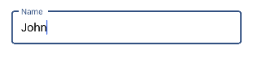

# Container Type in Xamarin Text Input Layout (SfTextInputLayout)

Containers improve the discoverability of input view by creating a contrast between the input view and assistive elements.

## Filled

The background of the input view will be filled with container color, and its stroke (at the bottom edge) color and thickness will be changed based on its states. It can be enabled by setting the [ContainerType](https://help.syncfusion.com/cr/xamarin/Syncfusion.XForms.TextInputLayout.SfTextInputLayout.html#Syncfusion_XForms_TextInputLayout_SfTextInputLayout_ContainerType) property to [Filled](https://help.syncfusion.com/cr/xamarin/Syncfusion.XForms.TextInputLayout.ContainerType.html).

 

 

<inputLayout:SfTextInputLayout
    Hint="Name" 
    ContainerType="Filled">
    <Entry Text="John" />
</inputLayout:SfTextInputLayout>  



 

var inputLayout = new SfTextInputLayout();
inputLayout.Hint = "Name";
inputLayout.ContainerType = ContainerType.Filled;
inputLayout.InputView = new Entry() { Text = "John" }; 





## Outlined

When setting the [ContainerType](https://help.syncfusion.com/cr/xamarin/Syncfusion.XForms.TextInputLayout.SfTextInputLayout.html#Syncfusion_XForms_TextInputLayout_SfTextInputLayout_ContainerType) property to [Outlined](https://help.syncfusion.com/cr/xamarin/Syncfusion.XForms.TextInputLayout.ContainerType.html), the container will be covered with a rounded-corner border.

 

 

<inputLayout:SfTextInputLayout
    Hint="Name" 
    ContainerType="Outlined">
    <Entry Text="John" />
</inputLayout:SfTextInputLayout>  
 



 

var inputLayout = new SfTextInputLayout();
inputLayout.Hint = "Name";
inputLayout.ContainerType = ContainerType.Outlined;
inputLayout.InputView = new Entry() { Text = "John" }; 





### Customize the corner radius of the outline border 

When setting the [OutlineCornerRadius](https://help.syncfusion.com/cr/xamarin/Syncfusion.XForms.TextInputLayout.SfTextInputLayout.html#Syncfusion_XForms_TextInputLayout_SfTextInputLayout_OutlineCornerRadiusProperty) property to double value, the corner radius of the container will be changed.





<inputLayout:SfTextInputLayout
    Hint="Name" 
    ContainerType="Outlined"
    OutlineCornerRadius="8">
    <Entry />
</inputLayout:SfTextInputLayout>  
			




var inputLayout = new SfTextInputLayout();
inputLayout.Hint = "Name";
inputLayout.ContainerType = ContainerType.Outlined;
inputLayout.OutlineCornerRadius = 8;
inputLayout.InputView = new Entry(); 





>**NOTE**
It is applicable for the outline border when setting the container type to outlined.

### Custom Padding

Spaces around the input view can be customized by setting the InputViewPadding property to [thickness](https://docs.microsoft.com/en-us/dotnet/api/xamarin.forms.thickness?view=xamarin-forms) value.

 

 

<inputLayout:SfTextInputLayout
    Hint="Name"
    InputViewPadding="5" 
    ContainerType="Outlined"
    HelperText="Enter your name">
    <Entry />
 </inputLayout:SfTextInputLayout> 



 

var inputLayout = new SfTextInputLayout();
inputLayout.Hint = "Name";
inputLayout.InputViewPadding = new Thickness(5);
inputLayout.ContainerType = ContainerType.Outlined;
inputLayout.HelperText = "Enter your name";
inputLayout.InputView = new Entry(); 





#### See Also

[InputViewPadding](https://www.syncfusion.com/kb/11039/how-to-reduce-the-space-inside-sftextinputlayout)

## None

When setting the [ContainerType](https://help.syncfusion.com/cr/xamarin/Syncfusion.XForms.TextInputLayout.SfTextInputLayout.html#Syncfusion_XForms_TextInputLayout_SfTextInputLayout_ContainerType) property to [None](https://help.syncfusion.com/cr/xamarin/Syncfusion.XForms.TextInputLayout.ContainerType.html), the container will have empty background and enough spacing.

 

 

<inputLayout:SfTextInputLayout
    Hint="Name" 
    ContainerType="None">
    <Entry Text="John" />
</inputLayout:SfTextInputLayout>  
 



 

var inputLayout = new SfTextInputLayout();
inputLayout.Hint = "Name";
inputLayout.ContainerType = ContainerType.None;
inputLayout.InputView = new Entry() { Text = "John" }; 





## See also

[How to customize the properties of outline border colors, hint name, helper text, error text, and char count](https://www.syncfusion.com/kb/11659/how-to-customize-the-properties-of-outline-border-colors-hint-name-helper-text-error-text)

[How to create a rounded corner SfTextInputLayout](https://www.syncfusion.com/kb/11649/how-to-create-a-rounded-corner-sftextinputlayout-in-xamarin-forms)

[How to reduce the inner padding of SfTextInputLayout](https://www.syncfusion.com/kb/11039/how-to-reduce-the-inner-padding-of-xamarin-forms-text-input-layout)

[How to customize the color of border and labels in SfTextInputLayout](https://www.syncfusion.com/kb/10466/how-to-customize-the-color-of-border-and-labels-in-sftextinputlayout)
