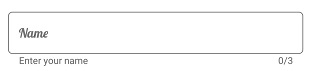
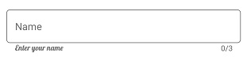

# Font Customization in Xamarin Text Input Layout (SfTextInputLayout)

You can customize the appearance (size, attributes, and family) of font by setting the FontFamily, FontSize, and FontAttributes properties of the LabelStyle property.

Refer to this [documentation](https://docs.microsoft.com/en-us/xamarin/xamarin-forms/user-interface/text/fonts#use-a-custom-font) to configure the custom fonts in Xamarin.Forms.

## Hint

You can customize the font of [hint](https://help.syncfusion.com/cr/xamarin/Syncfusion.XForms.TextInputLayout.SfTextInputLayout.html#Syncfusion_XForms_TextInputLayout_SfTextInputLayout_HintProperty) label  by setting the FontFamily, FontSize, and FontAttributes properties of HintLabelStyle in SfTextInputLayout.

 



<inputLayout:SfTextInputLayout
    Hint="Name"
    ContainerType="Outlined"
    CharMaxLength="3"
    ShowCharCount="True"
    HelperText="Enter your name">
    <Entry />
    <inputLayout:SfTextInputLayout.HintLabelStyle>
                <inputLayout:LabelStyle FontSize="16">
                    <inputLayout:LabelStyle.FontFamily>
                        <OnPlatform x:TypeArguments="x:String" iOS="Lobster-Regular" Android="Lobster-Regular.ttf#Lobster-Regular" WinPhone="Assets/Fonts/Lobster-Regular.ttf#Lobster" />
                    </inputLayout:LabelStyle.FontFamily>
                </inputLayout:LabelStyle>
    </inputLayout:SfTextInputLayout.HintLabelStyle>
</inputLayout:SfTextInputLayout> 



 

var inputLayout = new SfTextInputLayout();
inputLayout.Hint = "Name";
inputLayout.ContainerType = ContainerType.Outlined;
inputLayout.HelperText = "Enter your name";
inputLayout.CharMaxLength = 3;
inputLayout.ShowCharCount = true;
inputLayout.HintLabelStyle = new LabelStyle() { FontFamily = Device.OnPlatform("Lobster-Regular", "Lobster-Regular.ttf#Lobster-Regular", "Assets/Fonts/Lobster-Regular.ttf#Lobster"), FontSize = 16};
inputLayout.InputView = new Entry(); 





## Helper text

You can customize the font of [helper text](https://help.syncfusion.com/cr/xamarin/Syncfusion.XForms.TextInputLayout.SfTextInputLayout.html#Syncfusion_XForms_TextInputLayout_SfTextInputLayout_HelperTextProperty) label by setting the FontFamily, FontSize, and FontAttributes properties of HelperLabelStyle in SfTextInputLayout.

 



<inputLayout:SfTextInputLayout
    Hint="Name"
    ContainerType="Outlined"
    CharMaxLength="3"
    ShowCharCount="True"
    HelperText="Enter your name">
    <Entry />
    <inputLayout:SfTextInputLayout.HelperLabelStyle>
                <inputLayout:LabelStyle FontSize="12">
                    <inputLayout:LabelStyle.FontFamily>
                        <OnPlatform x:TypeArguments="x:String" iOS="Lobster-Regular" Android="Lobster-Regular.ttf#Lobster-Regular" WinPhone="Assets/Fonts/Lobster-Regular.ttf#Lobster" />
                    </inputLayout:LabelStyle.FontFamily>
                </inputLayout:LabelStyle>
    </inputLayout:SfTextInputLayout.HelperLabelStyle>
</inputLayout:SfTextInputLayout> 



 

var inputLayout = new SfTextInputLayout();
inputLayout.Hint = "Name";
inputLayout.ContainerType = ContainerType.Outlined;
inputLayout.HelperText = "Enter your name";
inputLayout.CharMaxLength = 3;
inputLayout.ShowCharCount = true;
inputLayout.HelperLabelStyle = new LabelStyle() { FontFamily = Device.OnPlatform("Lobster-Regular", "Lobster-Regular.ttf#Lobster-Regular", "Assets/Fonts/Lobster-Regular.ttf#Lobster"), FontSize = 12};
inputLayout.InputView = new Entry(); 





## Error text

You can customize the font of [error text](https://help.syncfusion.com/cr/xamarin/Syncfusion.XForms.TextInputLayout.SfTextInputLayout.html#Syncfusion_XForms_TextInputLayout_SfTextInputLayout_ErrorTextProperty) label by setting the FontFamily, FontSize, and FontAttributes properties of ErrorLabelStyle in SfTextInputLayout.

 



<inputLayout:SfTextInputLayout
    Hint="Name"
    ContainerType="Outlined"
    CharMaxLength="3"
    ShowCharCount="True"
    HelperText="Enter your name"
    HasError="True"
    ErrorText="Enter valid name">
    <Entry />
    <inputLayout:SfTextInputLayout.ErrorLabelStyle>
                <inputLayout:LabelStyle FontSize="12">
                    <inputLayout:LabelStyle.FontFamily>
                        <OnPlatform x:TypeArguments="x:String" iOS="Lobster-Regular" Android="Lobster-Regular.ttf#Lobster-Regular" WinPhone="Assets/Fonts/Lobster-Regular.ttf#Lobster" />
                    </inputLayout:LabelStyle.FontFamily>
                </inputLayout:LabelStyle>
    </inputLayout:SfTextInputLayout.ErrorLabelStyle>
</inputLayout:SfTextInputLayout> 



 

var inputLayout = new SfTextInputLayout();
inputLayout.Hint = "Name";
inputLayout.ContainerType = ContainerType.Outlined;
inputLayout.HelperText = "Enter your name";
inputLayout.CharMaxLength = 3;
inputLayout.ShowCharCount = true;
inputLayout.HasError = true;
inputLayout.ErrorText = "Enter valid name";
inputLayout.ErrorLabelStyle = new LabelStyle() { FontFamily = Device.OnPlatform("Lobster-Regular", "Lobster-Regular.ttf#Lobster-Regular", "Assets/Fonts/Lobster-Regular.ttf#Lobster"), FontSize = 12};
inputLayout.InputView = new Entry(); 





## Counter label

You can customize the font of [counter label](https://help.syncfusion.com/cr/xamarin/Syncfusion.XForms.TextInputLayout.SfTextInputLayout.html#Syncfusion_XForms_TextInputLayout_SfTextInputLayout_CharMaxLengthProperty) by setting the FontFamily, FontSize, and FontAttributes properties of CounterLabelStyle in SfTextInputLayout.

 



<inputLayout:SfTextInputLayout
    Hint="Name"
    ContainerType="Outlined"
    CharMaxLength="3"
    ShowCharCount="True"
    HelperText="Enter your name">
    <Entry />
    <inputLayout:SfTextInputLayout.CounterLabelStyle>
                <inputLayout:LabelStyle FontSize="12">
                    <inputLayout:LabelStyle.FontFamily>
                        <OnPlatform x:TypeArguments="x:String" iOS="Lobster-Regular" Android="Lobster-Regular.ttf#Lobster-Regular" WinPhone="Assets/Fonts/Lobster-Regular.ttf#Lobster" />
                    </inputLayout:LabelStyle.FontFamily>
                </inputLayout:LabelStyle>
    </inputLayout:SfTextInputLayout.CounterLabelStyle>
</inputLayout:SfTextInputLayout> 



 

var inputLayout = new SfTextInputLayout();
inputLayout.Hint = "Name";
inputLayout.ContainerType = ContainerType.Outlined;
inputLayout.HelperText = "Enter your name";
inputLayout.CharMaxLength = 3;
inputLayout.ShowCharCount = true;
inputLayout.CounterLabelStyle = new LabelStyle() { FontFamily = Device.OnPlatform("Lobster-Regular", "Lobster-Regular.ttf#Lobster-Regular", "Assets/Fonts/Lobster-Regular.ttf#Lobster"), FontSize = 12};
inputLayout.InputView = new Entry(); 





 

## See also

[How to customize the properties of outline border colors, hint name, helper text, error text, and char count](https://www.syncfusion.com/kb/11659/how-to-customize-the-properties-of-outline-border-colors-hint-name-helper-text-error-text)

[How to apply LineBreakMode for labels in SfTextInputLayout](https://www.syncfusion.com/kb/11043/how-to-apply-linebreakmode-for-labels-in-sftextinputlayout)

[How to customize the color of border and labels in SfTextInputLayout](https://www.syncfusion.com/kb/10466/how-to-customize-the-color-of-border-and-labels-in-sftextinputlayout)

