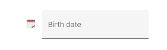
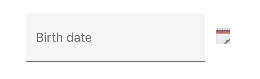
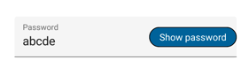

# Custom Icons in Xamarin Text Input Layout (SfTextInputLayout)

Any custom icons can be added to the leading edge or the trailing edge of input view in the text input layout control. The events and commands related to the custom icons should be handled at the application level.

Unicode or font icons for the labels can be displayed as icons.

N> Refer to the following links to learn more about font icons:
* [How to create font icons using our metro studio and export as ttf?](https://help.syncfusion.com/metro-studio/export-icon-font)
* [How to set font family for the custom fonts in labels?](https://docs.microsoft.com/en-us/xamarin/xamarin-forms/user-interface/text/fonts#using-a-custom-font)

## Leading view

A label can be added as a leading icon for the input view by setting the [LeadingView](https://help.syncfusion.com/cr/xamarin/Syncfusion.XForms.TextInputLayout.SfTextInputLayout.html#Syncfusion_XForms_TextInputLayout_SfTextInputLayout_LeadingView) property. It can be positioned either inside or outside the container by setting the [LeadingViewPosition](https://help.syncfusion.com/cr/xamarin/Syncfusion.XForms.TextInputLayout.SfTextInputLayout.html#Syncfusion_XForms_TextInputLayout_SfTextInputLayout_LeadingViewPosition) property. By default, it is positioned [Outside](https://help.syncfusion.com/cr/xamarin/Syncfusion.XForms.TextInputLayout.ViewPosition.html).

 

 

<inputLayout:SfTextInputLayout
    Hint="Birth date"
    LeadingViewPosition="Inside" >
    <Entry />
    <inputLayout:SfTextInputLayout.LeadingView>
       <Label
           Text="&#x1F5D3;">     
       </Label>
    </inputLayout:SfTextInputLayout.LeadingView>
 </inputLayout:SfTextInputLayout> 



 

var inputLayout = new SfTextInputLayout();
inputLayout.Hint = "Birth date";
inputLayout.LeadingViewPosition = ViewPosition.Inside;
inputLayout.LeadingView = new Label() { Text = "\U0001F5D3" };
inputLayout.InputView = new Entry(); 





## Trailing  view

A label can be added as a trailing icon for the input view by setting the [TrailingView](https://help.syncfusion.com/cr/xamarin/Syncfusion.XForms.TextInputLayout.SfTextInputLayout.html#Syncfusion_XForms_TextInputLayout_SfTextInputLayout_TrailingView) property. It can be positioned either inside or outside  the container of input view by setting the [TrailingViewPosition](https://help.syncfusion.com/cr/xamarin/Syncfusion.XForms.TextInputLayout.SfTextInputLayout.html#Syncfusion_XForms_TextInputLayout_SfTextInputLayout_TrailingViewPosition) property. By default, it is positioned [Inside](https://help.syncfusion.com/cr/xamarin/Syncfusion.XForms.TextInputLayout.ViewPosition.html).



 

<inputLayout:SfTextInputLayout
    Hint="Birth date"
    TrailingViewPosition="Outside">
    <Entry  />
    <inputLayout:SfTextInputLayout.TrailingView>
      <Label
         Text="&#x1F5D3;">     
      </Label>
    </inputLayout:SfTextInputLayout.TrailingView>
 </inputLayout:SfTextInputLayout> 



 

var inputLayout = new SfTextInputLayout();
inputLayout.Hint = "Birth date";
inputLayout.TrailingViewPosition = ViewPosition.Outside; 
inputLayout. TrailingView = new Label() { Text = "\U0001F5D3" };
inputLayout.InputView = new Entry(); 





## Leading and trailing view customization

The height and width of the leading and trailing view's direct child can be customized inside the text input layout. The leading and trailing view's height can be customized up to 48px, but there is no limit on width.



 

  <inputLayout:SfTextInputLayout Padding="15"
                                 Hint="Password" 
                                 TrailingViewPosition="Inside" 
                                 EnablePasswordVisibilityToggle="false">
   <Entry />
   <inputLayout:SfTextInputLayout.TrailingView>
      <border:SfBorder WidthRequest="130"
                       CornerRadius="20" 
                       HeightRequest="30"  
                       BackgroundColor="#00619e">
        <Label TextColor="White"
               VerticalTextAlignment="Center" 
               HorizontalTextAlignment="Center" 
               Text="Show password"/>
      </border:SfBorder>
   </inputLayout:SfTextInputLayout.TrailingView>
   </inputLayout:SfTextInputLayout>



 

var inputLayout = new SfTextInputLayout();
var border = new SfBorder();
var label = new Label();
inputLayout.Hint = "Password";
inputLayout.EnablePasswordVisibilityToggle = false;
border.WidthRequest = 130;
border.HeightRequest = 30;
border.CornerRadius = 20;
border.BackgroundColor = Color.FromHex("#00619e");
label.TextColor= Color.White;
label.VerticalTextAlignment = TextAlignment.Center;
label.HorizontalTextAlignment = TextAlignment.Center;
label.Text = "Show password";
border.Content = label;
inputLayout.TrailingView = border;
inputLayout.InputView = new Entry(); 





## See also

[How to align leading and trailing views](http://www.syncfusion.com/support/kb/11046/how-to-vertically-center-align-icons-in-leading-and-trailing-views)