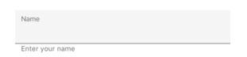
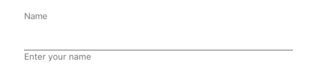

# Fixed Hint Position in Xamarin Text Input Layout (SfTextInputLayout)

Hint label for the text input layout is fixed always at the top position. This helps users make the hint label floating even when the input view is not focused. It can be enabled by setting the `IsHintAlwaysFloated` property.

>**NOTE**
The default value of the `IsHintAlwaysFloated` is `false`.

## Filled

The hint label position of the input view will be set always at the top for the [Filled](https://help.syncfusion.com/cr/xamarin/Syncfusion.XForms.TextInputLayout.ContainerType.html) container type. 

 

 

 <inputLayout:SfTextInputLayout 
    Hint="Name"
    IsHintAlwaysFloated="true" 
    ContainerType="Filled"
    HelperText="Enter your name">
    <Entry />
</inputLayout:SfTextInputLayout>



 

var inputLayout = new SfTextInputLayout();
inputLayout.Hint = "Name";
inputLayout.IsHintAlwaysFloated = true;
inputLayout.ContainerType = ContainerType.Filled;
inputLayout.HelperText= "Enter your name";
inputLayout.InputView = new Entry(); 





## Outlined

The hint label position of the input view will be set always at the top for the [Outlined](https://help.syncfusion.com/cr/xamarin/Syncfusion.XForms.TextInputLayout.ContainerType.html) container type.

 

 

<inputLayout:SfTextInputLayout 
    Hint="Name"
    IsHintAlwaysFloated="true" 
    ContainerType="Outlined"
    HelperText="Enter your name">
    <Entry />
</inputLayout:SfTextInputLayout>
 


 

var inputLayout = new SfTextInputLayout();
inputLayout.Hint = "Name";
inputLayout.IsHintAlwaysFloated = true;
inputLayout.ContainerType = ContainerType.Outlined;
inputLayout.HelperText= "Enter your name";
inputLayout.InputView = new Entry(); 





## None

The hint label position of the input view will be set always at the top for the [None](https://help.syncfusion.com/cr/xamarin/Syncfusion.XForms.TextInputLayout.ContainerType.html) container type.

 

 

<inputLayout:SfTextInputLayout 
    Hint="Name"
    IsHintAlwaysFloated="true" 
    ContainerType="None"
    HelperText="Enter your name">
    <Entry />
</inputLayout:SfTextInputLayout> 
 



 

var inputLayout = new SfTextInputLayout();
inputLayout.Hint = "Name";
inputLayout.IsHintAlwaysFloated = true;
inputLayout.ContainerType = ContainerType.None;
inputLayout.HelperText= "Enter your name";
inputLayout.InputView = new Entry(); 





## See also

[How to customize the properties of outline border colors, hint name, helper text, error text, and char count](https://support.syncfusion.com/kb/article/10194/how-to-customize-the-properties-of-outline-border-colors-hint-name-helper-text-error-text)

[How to customize the color of border and labels in SfTextInputLayout](https://support.syncfusion.com/kb/article/9248/how-to-customize-the-color-of-border-and-labels-in-sftextinputlayout)

