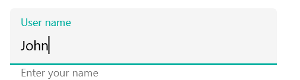
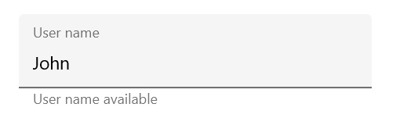
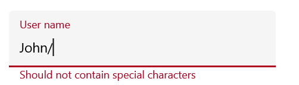
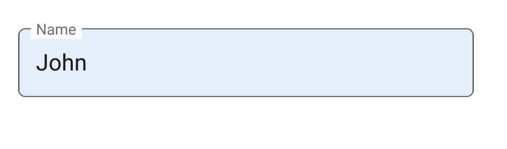

# States and Colors in Xamarin Text Input Layout (SfTextInputLayout)

The `SfTextInputLayout` control allows customization of hint labels and borders based on different states. For example, when the input view is in a focused state, the focused color is applied; similar behavior occurs in other states. The current hint color or active color can be accessed from the [CurrentActiveColor](https://help.syncfusion.com/cr/xamarin/Syncfusion.XForms.TextInputLayout.SfTextInputLayout.html#Syncfusion_XForms_TextInputLayout_SfTextInputLayout_CurrentActiveColor) property.

> **Note:** Since error is not a state, the error color will not be set to `CurrentActiveColor` when the [HasError](https://help.syncfusion.com/cr/xamarin/Syncfusion.XForms.TextInputLayout.SfTextInputLayout.html#Syncfusion_XForms_TextInputLayout_SfTextInputLayout_HasError) property is `true`.

## Focused Color
When the input view is focused, the [FocusedColor](https://help.syncfusion.com/cr/xamarin/Syncfusion.XForms.TextInputLayout.SfTextInputLayout.html#Syncfusion_XForms_TextInputLayout_SfTextInputLayout_FocusedColor) property value is applied to the hint label and border.

> **Info:** The cursor color of the input view will match the `Accent` color of the application on each platform.

 

 

<inputLayout:SfTextInputLayout
    Hint="User name" 
    FocusedColor="#00AFA0"
    HelperText="Enter your name"
    <Entry Text="John" />
</inputLayout:SfTextInputLayout>  
 


 

var inputLayout = new SfTextInputLayout();
inputLayout.Hint = "User name";
inputLayout.FocusedColor = Color.FromHex("#00AFA0");
inputLayout.ErrorText = "User name available";
inputLayout.InputView = new Entry() { Text = "John" }; 





## Unfocused Color
When the input view is unfocused, the [UnfocusedColor](https://help.syncfusion.com/cr/xamarin/Syncfusion.XForms.TextInputLayout.SfTextInputLayout.html#Syncfusion_XForms_TextInputLayout_SfTextInputLayout_UnfocusedColor) property value is applied to the hint label and border.

> **Note:** The thickness of the border also varies between the focused and unfocused states.

 

 

<inputLayout:SfTextInputLayout
    Hint="User name" 
    UnfocusedColor="Silver"
    HelperText="User name available">
    <Entry Text="John" />
</inputLayout:SfTextInputLayout>  
 


 

var inputLayout = new SfTextInputLayout();
inputLayout.Hint = "User name";
inputLayout.UnfocusedColor = Color.Silver;
inputLayout.ErrorText = "User name available";
inputLayout.InputView = new Entry() { Text = "John" }; 





## Error Color
The error color can be customized by setting the [ErrorColor](https://help.syncfusion.com/cr/xamarin/Syncfusion.XForms.TextInputLayout.SfTextInputLayout.html#Syncfusion_XForms_TextInputLayout_SfTextInputLayout_ErrorColor) property.

 

 

<inputLayout:SfTextInputLayout
    Hint="Name" 
    ErrorColor="#B00020"
    ErrorText="Should not contain special characters"
    HasError="true">
    <Entry Text="John/" />
</inputLayout:SfTextInputLayout>  
 


 

var inputLayout = new SfTextInputLayout();
inputLayout.Hint = "Name";
inputLayout.ErrorColor = Color.FromHex("#B00020");
inputLayout.ErrorText = "Should not contain special characters";
inputLayout.HasError = true;
inputLayout.InputView = new Entry() { Text = "John/" }; 





## Container Color
The container color can be customized by setting the [ContainerBackgroundColor](https://help.syncfusion.com/cr/xamarin/Syncfusion.XForms.TextInputLayout.SfTextInputLayout.html#Syncfusion_XForms_TextInputLayout_SfTextInputLayout_ContainerBackgroundColor) property. This applies when the [ContainerType](https://help.syncfusion.com/cr/xamarin/Syncfusion.XForms.TextInputLayout.SfTextInputLayout.html#Syncfusion_XForms_TextInputLayout_SfTextInputLayout_ContainerType) is set to [Filled](https://help.syncfusion.com/cr/xamarin/Syncfusion.XForms.TextInputLayout.ContainerType.html) or [Outlined](https://help.syncfusion.com/cr/xamarin/Syncfusion.XForms.TextInputLayout.ContainerType.html).

### Filled

Customize the container color when the [ContainerType](https://help.syncfusion.com/cr/xamarin/Syncfusion.XForms.TextInputLayout.ContainerType.html) is [Filled](https://help.syncfusion.com/cr/xamarin/Syncfusion.XForms.TextInputLayout.ContainerType.html).

 

 

<inputLayout:SfTextInputLayout
    Hint="Name" 
    FocusedColor="#0450C2"
    ContainerType="Filled"
    ContainerBackgroundColor="#E6EEF9">
    <Entry Text="John" />
</inputLayout:SfTextInputLayout>  
 


 

var inputLayout = new SfTextInputLayout();
inputLayout.Hint = "Name";
inputLayout.FocusedColor = Color.FromHex("#0450C2");
inputLayout.ContainerBackgroundColor = Color.FromHex("#E6EEF9");
inputLayout.ContainerType = ContainerType.Filled;
inputLayout.InputView = new Entry() { Text = "John" }; 





### Outlined

Customize the container color when the [ContainerType](https://help.syncfusion.com/cr/xamarin/Syncfusion.XForms.TextInputLayout.ContainerType.html) is [Outlined](https://help.syncfusion.com/cr/xamarin/Syncfusion.XForms.TextInputLayout.ContainerType.html).

 

 

<inputLayout:SfTextInputLayout
    Hint="Name" 
    FocusedColor="#0450C2"
    ContainerType="Outlined"
    ContainerBackgroundColor="#E6EEF9">
    <Entry Text="John" />
</inputLayout:SfTextInputLayout>  
 


 

var inputLayout = new SfTextInputLayout();
inputLayout.Hint = "Name";
inputLayout.ContainerType = ContainerType.Outlined;
inputLayout.FocusedColor = Color.FromHex("#0450C2");
inputLayout.ContainerBackgroundColor = Color.FromHex("#E6EEF9");
inputLayout.InputView = new Entry() { Text = "John" }; 





## Disabled State

The text input layout can be disabled by setting the [IsEnabled](https://help.syncfusion.com/cr/xamarin/Syncfusion.XForms.TextInputLayout.SfTextInputLayout.html#Syncfusion_XForms_TextInputLayout_SfTextInputLayout_IsEnabled) property to `false`. The color of the container and other UI elements will change to the disabled state, but these colors cannot be customized.

 

 

<inputLayout:SfTextInputLayout
    Hint="Name" 
    IsEnabled="false">
    <Entry />
</inputLayout:SfTextInputLayout>  
 


 

var inputLayout = new SfTextInputLayout();
inputLayout.Hint = "Name";
inputLayout.IsEnabled = false;
inputLayout.InputView = new Entry(); 





## Customizing the Text Color of Labels

The text color of the [`hint`](https://help.syncfusion.com/cr/xamarin/Syncfusion.XForms.TextInputLayout.SfTextInputLayout.html#Syncfusion_XForms_TextInputLayout_SfTextInputLayout_Hint) label, counter label, [`helper`](https://help.syncfusion.com/cr/xamarin/Syncfusion.XForms.TextInputLayout.SfTextInputLayout.html#Syncfusion_XForms_TextInputLayout_SfTextInputLayout_HelperText) label, and [`error`](https://help.syncfusion.com/cr/xamarin/Syncfusion.XForms.TextInputLayout.SfTextInputLayout.html#Syncfusion_XForms_TextInputLayout_SfTextInputLayout_ErrorText) label can be customized using the `Color` property of the [`LabelStyle`](https://help.syncfusion.com/cr/xamarin/Syncfusion.XForms.TextInputLayout.LabelStyle.html).

 

 

<inputLayout:SfTextInputLayout 
    Hint="Name" ContainerType="Outlined" HelperText="Enter your name"
    ErrorText="Invalid text" ErrorColor="#B00020"
    ShowCharCount="true" CharMaxLength="3">
        
    <inputLayout:SfTextInputLayout.HintLabelStyle>
        <inputLayout:LabelStyle Color="Green"/>
    </inputLayout:SfTextInputLayout.HintLabelStyle>
    <inputLayout:SfTextInputLayout.HelperLabelStyle>
        <inputLayout:LabelStyle Color="Blue"/>
    </inputLayout:SfTextInputLayout.HelperLabelStyle>
    <inputLayout:SfTextInputLayout.CounterLabelStyle>
        <inputLayout:LabelStyle Color="Brown"/>
    </inputLayout:SfTextInputLayout.CounterLabelStyle>
    <inputLayout:SfTextInputLayout.ErrorLabelStyle>
        <inputLayout:LabelStyle Color="Maroon"/>
    </inputLayout:SfTextInputLayout.ErrorLabelStyle>
        
    <Entry Text="John" />
        
</inputLayout:SfTextInputLayout>  
 


 

    SfTextInputLayout inputLayout = new SfTextInputLayout();
    inputLayout.Hint = "Name";
    inputLayout.ContainerType = ContainerType.Outlined;
    inputLayout.HelperText = "Enter your name";
    inputLayout.ErrorColor = Color.FromHex("#B00020");
    inputLayout.CharMaxLength = 3;
    inputLayout.ShowCharCount = true;
    inputLayout.ErrorText = "Invalid text";
    inputLayout.InputView = new Entry();

    inputLayout.HintLabelStyle = new LabelStyle() { Color = Color.Green };
    inputLayout.HelperLabelStyle = new LabelStyle() { Color = Color.Blue };
    inputLayout.CounterLabelStyle = new LabelStyle() { Color = Color.Brown };
    inputLayout.ErrorLabelStyle = new LabelStyle() { Color = Color.Maroon };
    this.Content = inputLayout;





## See Also

- [How to validate with required verification in SfTextInputLayout](https://www.syncfusion.com/kb/11788/how-to-validate-with-required-verification-in-text-input-layout-in-xamarin-forms)
- [How to customize the properties of outline border colors, hint name, helper text, error text, and char count](https://www.syncfusion.com/kb/11659/how-to-customize-the-properties-of-outline-border-colors-hint-name-helper-text-error-text)
- [How to change the cursor color in SfTextInputLayout](https://www.syncfusion.com/kb/11608/how-to-change-the-cursor-color-in-xamarin-forms-text-input-layout)
- [How to customize the color of border and labels in SfTextInputLayout](https://www.syncfusion.com/kb/10466/how-to-customize-the-color-of-border-and-labels-in-sftextinputlayout)
