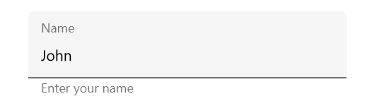
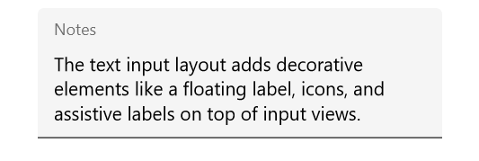
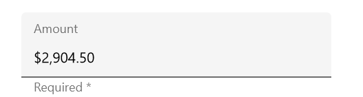

# Supported input views

Input views can be added to the text input layout control by setting the [InputView](https://help.syncfusion.com/cr/xamarin/Syncfusion.XForms.TextInputLayout.SfTextInputLayout.html#Syncfusion_XForms_TextInputLayout_SfTextInputLayout_InputView) property. To reduce the XAML syntax, [InputView](https://help.syncfusion.com/cr/xamarin/Syncfusion.XForms.TextInputLayout.SfTextInputLayout.html#Syncfusion_XForms_TextInputLayout_SfTextInputLayout_InputView) property is applied with [ContentPropertyAttribute](https://docs.microsoft.com/en-us/dotnet/api/xamarin.forms.contentpropertyattribute?view=xamarin-forms).

## Entry

To enter a single line text input, add [Entry](https://docs.microsoft.com/en-us/xamarin/xamarin-forms/user-interface/text/entry).

 

 

<inputLayout:SfTextInputLayout
   Hint="Name"
   HelperText="Enter your name">
   <Entry />
</inputLayout:SfTextInputLayout>  



 

var inputLayout = new SfTextInputLayout();
inputLayout.Hint = "Name"; 
inputLayout.HelperText = "Enter your name"
inputLayout.InputView = new Entry(); 





## Editor

To enter multi-line text input, add [Editor](https://docs.microsoft.com/en-us/xamarin/xamarin-forms/user-interface/text/editor), and then set the `AutoSize` property to `TextChanges`.

 

 

<inputLayout:SfTextInputLayout
   Hint="Notes">
   <Editor AutoSize="TextChanges" />
</inputLayout:SfTextInputLayout>  



 

var inputLayout = new SfTextInputLayout();
inputLayout.Hint = "Notes"; 
inputLayout.InputView = new Editor(); 





## Masked edit

To initialize the masked edit control and launch it in each platform, refer to the [getting started with masked edit](https://help.syncfusion.com/xamarin/sfmaskededit/getting-started) documentation.

 

 

<inputLayout:SfTextInputLayout
   Hint="Card number"
   HelperText="Required *">
   <maskededit:SfMaskedEdit
        Keyboard="Numeric"
        Mask="0000 0000 0000 0000" />
</inputLayout:SfTextInputLayout>  



 

var inputLayout = new SfTextInputLayout();
inputLayout.Hint = "Card number"; 
inputLayout.HelperText = "Required *"
inputLayout.InputView = new SfMaskedEdit() { Keyboard = Keyboard.Numeric, Mask = "0000 0000 0000 0000" }; 





## Numeric text box

To initialize the numeric text box control and launch it in each platform, refer to the [getting started with numeric text box](https://help.syncfusion.com/xamarin/sfnumerictextbox/getting-started) documentation.

 

 

<inputLayout:SfTextInputLayout
   Hint="Amount"
   HelperText="Required *">
   <numericBox:SfNumericTextBox 
      Value="123.45"
      FormatString="c" />
</inputLayout:SfTextInputLayout>  



 

var inputLayout = new SfTextInputLayout();
inputLayout.Hint = "Amount"; 
inputLayout.HelperText = "Required *"
inputLayout.InputView = new SfNumericTextBox() { Value = 123.45, FormatString="c" }; 





## Numeric up down

To initialize the numeric up down control and launch it in each platform, refer to the [getting started with numeric up down](https://help.syncfusion.com/xamarin/sfnumericupdown/getting-started) documentation.

 

 

<inputLayout:SfTextInputLayout
   Hint="Amount"
   HelperText="Maximum limit is $10,000.">
   <numeric:SfNumericUpDown 
   x:Name="numericUpDown" 
   Value="5"/>
</inputLayout:SfTextInputLayout>  



 

var inputLayout = new SfTextInputLayout();
inputLayout.Hint = "Amount"; 
inputLayout.HelperText = "Maximum limit is $10,000."
inputLayout.InputView = new SfNumericUpDown() { Value = 5}; 





## Autocomplete

To initialize the Autocomplete control and launch it in each platform, refer to the [getting started with auto complete](https://help.syncfusion.com/xamarin/sfautocomplete/getting-started) documentation.

 

 

<inputLayout:SfTextInputLayout Hint="Country" ContainerType="Outlined">
   <autocomplete:SfAutoComplete  AutoCompleteMode="SuggestAppend">
      <autocomplete:SfAutoComplete.AutoCompleteSource>
         <ListCollection:List x:TypeArguments="x:String">
         	<x:String> United Kingdom </x:String>
            <x:String> United States </x:String>
            <x:String> United Republic of Tanzania </x:String>
         </ListCollection:List>
      </autocomplete:SfAutoComplete.AutoCompleteSource>
   </autocomplete:SfAutoComplete>
</inputLayout:SfTextInputLayout>



 

var autoComplete = new SfAutoComplete();
var inputLayout = new SfTextInputLayout();
inputLayout.Hint = "Country"; 
inputLayout.ContainerType = ContainerType.Outlined;
List<String> countryNames = new List<String>();
countryNames.Add("United Kingdom");
countryNames.Add("United States");
countryNames.Add("United Republic of Tanzania");
autoComplete.AutoCompleteMode = AutoCompleteMode.SuggestAppend;
autoComplete.DataSource = countryNames;
inputLayout.InputView = autoComplete; 





## Combo box

To initialize the ComboBox control and launch it in each platform, refer to the [getting started with combo box](https://help.syncfusion.com/xamarin/sfcombobox/getting-started) documentation.

 

 

<inputLayout:SfTextInputLayout Hint="Country" ContainerType="Outlined">
   <combobox:SfComboBox>
      <combobox:SfComboBox.ComboBoxSource>
         <ListCollection:List x:TypeArguments="x:String">
         	<x:String> Afghanistan </x:String>
            <x:String> Akrotiri </x:String>
            <x:String> Albania </x:String>
         </ListCollection:List>
      </combobox:SfComboBox.ComboBoxSource>
   </combobox:SfComboBox>
</inputLayout:SfTextInputLayout> 



 

var combobox = new SfComboBox();
var inputLayout = new SfTextInputLayout();
inputLayout.Hint = "Country"; 
inputLayout.ContainerType = ContainerType.Outlined;
List<String> countryNames = new List<String>();
countryNames.Add("Afghanistan");
countryNames.Add("Akrotiri");
countryNames.Add("Albania");
combobox.DataSource = countryNames;
inputLayout.InputView = combobox; 





N> Entry and Editor are the only input views supported by [`SfTextInputLayout`](https://help.syncfusion.com/cr/xamarin/Syncfusion.XForms.TextInputLayout.SfTextInputLayout.html) in WPF platform.

## Picker

To pick an item from the list, add [Picker](https://docs.microsoft.com/en-us/xamarin/xamarin-forms/user-interface/picker/).

 

 

<inputLayout:SfTextInputLayout Hint="Picker"
                               HelperText="Select a color">
<Picker>
  <Picker.ItemsSource>
     <x:Array Type="{x:Type x:String}">
     <x:String>Red</x:String>
     <x:String>Blue</x:String>
     <x:String>Green</x:String>
     <x:String>Purple</x:String>
     <x:String>Yellow</x:String>
     </x:Array>
   </Picker.ItemsSource>
</Picker>
</inputLayout:SfTextInputLayout>



 

var inputLayout = new SfTextInputLayout();
inputLayout.Hint = "Picker"; 
inputLayout.HelperText = "Select a color";
var picker = new Picker();
List<string> colors = new List<string>();
colors.Add("Red");
colors.Add("Blue");
colors.Add("Green");
colors.Add("Purple");
colors.Add("Yellow");
picker.ItemsSource = colors;
inputLayout.InputView = picker; 





N> UWP and WPF will not support [`Xamarin.Forms Picker`](https://docs.microsoft.com/en-us/xamarin/xamarin-forms/user-interface/picker/) as input view of the text input layout. 

## Date picker

To select a date, add [DatePicker](https://docs.microsoft.com/en-us/xamarin/xamarin-forms/user-interface/datepicker).

 

 

<inputLayout:SfTextInputLayout ContainerType="None"
                               Hint="Date" 
                               HelperText="Select a date">
<DatePicker MinimumDate="01/01/2019"
            MaximumDate="12/31/2019" 
            Date="11/12/2019"/>
</inputLayout:SfTextInputLayout>



 

var inputLayout = new SfTextInputLayout();
var datePicker = new DatePicker();
inputLayout.Hint = "Date";
inputLayout.HelperText = "Select a date from a calender";
datePicker.MinimumDate = new DateTime(2019, 1, 1);
datePicker.MaximumDate = new DateTime(2019, 12, 31);
datePicker.Date = new DateTime(2019, 11, 12);
inputLayout.InputView = datePicker;
         





N> UWP and WPF will not support [`Xamarin.Forms DatePicker`](https://docs.microsoft.com/en-us/xamarin/xamarin-forms/user-interface/datepicker) as input view of the text input layout.

## Time picker

To select a time, add [TimePicker](https://docs.microsoft.com/en-us/xamarin/xamarin-forms/user-interface/timepicker).

 

 

<inputLayout:SfTextInputLayout Hint="Time"
                               HelperText="Select a time">
<TimePicker Time="12:00:00"/>
</inputLayout:SfTextInputLayout>



 

var inputLayout = new SfTextInputLayout();
var timePicker = new TimePicker();
inputLayout.Hint = "Time";
inputLayout.HelperText = "Select a time";
timePicker.Time = new TimeSpan(12, 00, 00) 
inputLayout.InputView = timePicker;
         





N> UWP and WPF will not support [`Xamarin.Forms TimePicker`](https://docs.microsoft.com/en-us/xamarin/xamarin-forms/user-interface/timepicker) as input view of the text input layout.
