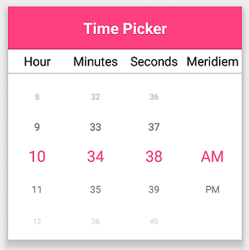

# Format

Format is a way to represent the value of the time in a different string format.

By default, the TimePicker’s format is "TimeFormat.HH_mm_ss".

The following example demonstrates the TimePicker with the custom format TimeFormat.hh_mm_ss_tt





<?xml version="1.0" encoding="utf-8" ?>
<ContentPage xmlns="http://xamarin.com/schemas/2014/forms"
             xmlns:x="http://schemas.microsoft.com/winfx/2009/xaml"
             xmlns:local="clr-namespace:TimePickerSample"
             xmlns:syncfusion="clr-namespace:Syncfusion.XForms.Pickers;assembly=Syncfusion.SfPicker.XForms"
             x:Class="TimePickerSample.MainPage">
    <ContentPage.Content>
        <syncfusion:SfTimePicker x:Name="timePicker"
                                 Format="h_mm_ss_tt"/>
    </ContentPage.Content>
</ContentPage>



  

using Syncfusion.XForms.Pickers;
using System;
using Xamarin.Forms;

namespace TimePickerSample
{
    public partial class MainPage : ContentPage
    {
        public MainPage()
        {
            InitializeComponent();
            SfTimePicker timePicker = new SfTimePicker()
            {
                Format = TimeFormat.hh_mm_ss_tt
            };

            this.Content = timePicker;
        }
    }
}





