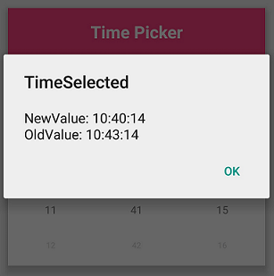
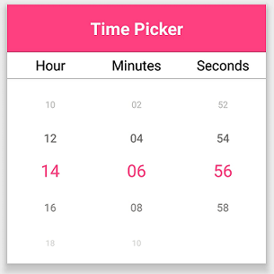

# How to

## How to show as a Dialog

TimePicker can be rendered as a dialog by setting the`SfTimePicker.PickerMode` property to Dialog. Default value of the `SfTimePicker.PickerMode` property is "Default". 





<?xml version="1.0" encoding="utf-8" ?>
<ContentPage xmlns="http://xamarin.com/schemas/2014/forms"
             xmlns:x="http://schemas.microsoft.com/winfx/2009/xaml"
             xmlns:local="clr-namespace:TimePickerSample"
             xmlns:syncfusion="clr-namespace:Syncfusion.XForms.Pickers;assembly=Syncfusion.SfPicker.XForms"
             x:Class="TimePickerSample.MainPage">
    <ContentPage.Content>
        <syncfusion:SfTimePicker x:Name="timePicker"
                                 PickerMode="Dialog"/>
    </ContentPage.Content>
</ContentPage>





using Syncfusion.XForms.Pickers;
using Xamarin.Forms;

namespace TimePickerSample
{
    public partial class MainPage : ContentPage
    {
        public MainPage()
        {
            InitializeComponent();
            SfTimePicker timePicker = new SfTimePicker()
            {
                PickerMode = timePickerMode.Dialog
            };

            this.Content = timePicker;
        }
    }
}





The TimePicker can be opened programmatically by setting the `SfTimePicker.IsOpen` property to true. Default value of `SfTimePicker.IsOpen` is "false".

Note: This property is automatically changed to false when you close the dialog by clicking outside of the dialog.





<?xml version="1.0" encoding="utf-8" ?>
<ContentPage xmlns="http://xamarin.com/schemas/2014/forms"
             xmlns:x="http://schemas.microsoft.com/winfx/2009/xaml"
             xmlns:local="clr-namespace:TimePickerSample"
             xmlns:syncfusion="clr-namespace:Syncfusion.XForms.Pickers;assembly=Syncfusion.SfPicker.XForms"
             x:Class="TimePickerSample.MainPage">
    <ContentPage.Content>
        <Grid>
        <syncfusion:SfTimePicker x:Name="timePicker"
                                 PickerMode="Dialog"/>
        <Button Text="Open Picker" 
                x:Name="pickerButton"
                Clicked="Button_Clicked"
                HorizontalOptions="Center"
                VerticalOptions="Center"
                HeightRequest="50" 
                WidthRequest="100"/>
        </Grid>
    </ContentPage.Content>
</ContentPage>





using Xamarin.Forms;

namespace TimePickerSample
{
    public partial class MainPage : ContentPage
    {
        public MainPage()
        {
            InitializeComponent();
        }

        private void Button_Clicked(object sender, System.EventArgs e)
        {
            timePicker.IsOpen = true;
        }
    }
}





## How to handle time changed using the TimeSelected event
You can perform an operation when selecting time using the `TimeSelected` event. The TimeSelected event returns the following arguments:

<table>
<tr>
<th>Members</th>
<th>Description</th>
</tr>
<tr>
<td>NewValue</td>
<td>Shows recently selected time in TimePicker.</td>
</tr>
<tr>
<td>OldValue</td>
<td>Shows previously selected time in TimePicker.</td>
</tr>
</table>





<?xml version="1.0" encoding="utf-8" ?>
<ContentPage xmlns="http://xamarin.com/schemas/2014/forms"
             xmlns:x="http://schemas.microsoft.com/winfx/2009/xaml"
             xmlns:local="clr-namespace:TimePickerSample"
             xmlns:syncfusion="clr-namespace:Syncfusion.XForms.Pickers;assembly=Syncfusion.SfPicker.XForms"
             x:Class="TimePickerSample.MainPage">
    <ContentPage.Content>
        <syncfusion:SfTimePicker x:Name="timePicker"
                                 TimeSelected="TimePicker_TimeSelected"/>
    </ContentPage.Content>
</ContentPage>



  

using Syncfusion.XForms.Pickers;
using Xamarin.Forms;

namespace TimePickerSample
{
    public partial class MainPage : ContentPage
    {
        SfTimePicker TimePicker;
        public MainPage()
        {
            InitializeComponent();
            TimePicker = new SfTimePicker();
            TimePicker.TimeSelected += TimePicker_TimeSelected;
            this.Content = TimePicker;
        }

        private void TimePicker_TimeSelected(object sender, TimeChangedEventArgs e)
        {
           DisplayAlert("TimeSelected", "NewValue: " + e.NewValue + "\n" + "OldValue: " + e.OldValue, "Ok");
        }
    }
}





## How to set an interval

### How to set an interval between hours

TimePicker provides an option to give an interval between hours using the `SfTimePicker.HourInterval` property.





<?xml version="1.0" encoding="utf-8" ?>
<ContentPage xmlns="http://xamarin.com/schemas/2014/forms"
             xmlns:x="http://schemas.microsoft.com/winfx/2009/xaml"
             xmlns:local="clr-namespace:TimePickerSample"
             xmlns:syncfusion="clr-namespace:Syncfusion.XForms.Pickers;assembly=Syncfusion.SfPicker.XForms"
             x:Class="TimePickerSample.MainPage">
    <ContentPage.Content>
        <syncfusion:SfTimePicker x:Name="timePicker"
                                 HourInterval="2"/>
    </ContentPage.Content>
</ContentPage>



  

using Syncfusion.XForms.Pickers;
using Xamarin.Forms;

namespace TimePickerSample
{
    public partial class MainPage : ContentPage
    {
        public MainPage()
        {
            InitializeComponent();
            SfTimePicker timePicker = new SfTimePicker()
            {
                HourInterval = 2
            };

            this.Content = timePicker;
        }
    }
}





### How to set an interval between minutes

TimePicker provides an option to give an interval between minutes using the `SfTimePicker.MinuteInterval` property.





<?xml version="1.0" encoding="utf-8" ?>
<ContentPage xmlns="http://xamarin.com/schemas/2014/forms"
             xmlns:x="http://schemas.microsoft.com/winfx/2009/xaml"
             xmlns:local="clr-namespace:TimePickerSample"
             xmlns:syncfusion="clr-namespace:Syncfusion.XForms.Pickers;assembly=Syncfusion.SfPicker.XForms"
             x:Class="TimePickerSample.MainPage">
    <ContentPage.Content>
        <syncfusion:SfTimePicker x:Name="timePicker"
                                 MinuteInterval="2"/>
    </ContentPage.Content>
</ContentPage>



  

using Syncfusion.XForms.Pickers;
using Xamarin.Forms;

namespace TimePickerSample
{
    public partial class MainPage : ContentPage
    {
        public MainPage()
        {
            InitializeComponent();
            SfTimePicker timePicker = new SfTimePicker()
            {
                MinuteInterval = 2
            };

            this.Content = timePicker;
        }
    }
}





### How to set an interval between seconds

TimePicker provides an option to give an interval between seconds using the `SfTimePicker.SecondInterval` property.





<?xml version="1.0" encoding="utf-8" ?>
<ContentPage xmlns="http://xamarin.com/schemas/2014/forms"
             xmlns:x="http://schemas.microsoft.com/winfx/2009/xaml"
             xmlns:local="clr-namespace:TimePickerSample"
             xmlns:syncfusion="clr-namespace:Syncfusion.XForms.Pickers;assembly=Syncfusion.SfPicker.XForms"
             x:Class="TimePickerSample.MainPage">
    <ContentPage.Content>
        <syncfusion:SfTimePicker x:Name="timePicker"
                                 SecondInterval="2"/>
    </ContentPage.Content>
</ContentPage>



  

using Syncfusion.XForms.Pickers;
using Xamarin.Forms;

namespace TimePickerSample
{
    public partial class MainPage : ContentPage
    {
        public MainPage()
        {
            InitializeComponent();
            SfTimePicker timePicker = new SfTimePicker()
            {
                SecondInterval = 2
            };

            this.Content = timePicker;
        }
    }
}





