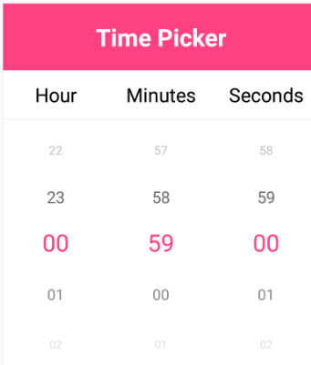

# Looping Support in SfTimePicker

The Looping support is used to automatically navigate the first item to repeat the list of items after reached the last item. Each forward iteration is followed by a backward iteration in the time picker control. This can be achieved by using the `EnableLooping` property.

## EnableLooping

The looping support is achieved by setting the `EnableLooping` property to true.





<ContentPage.Content>

<syncfusion:SfTimePicker

x:Name="timePicker" EnableLooping="True" />

</ContentPage.Content>

</ContentPage>





SfDatePicker datePicker = new SfDatePicker();

datePicker.EnableLooping = true;





