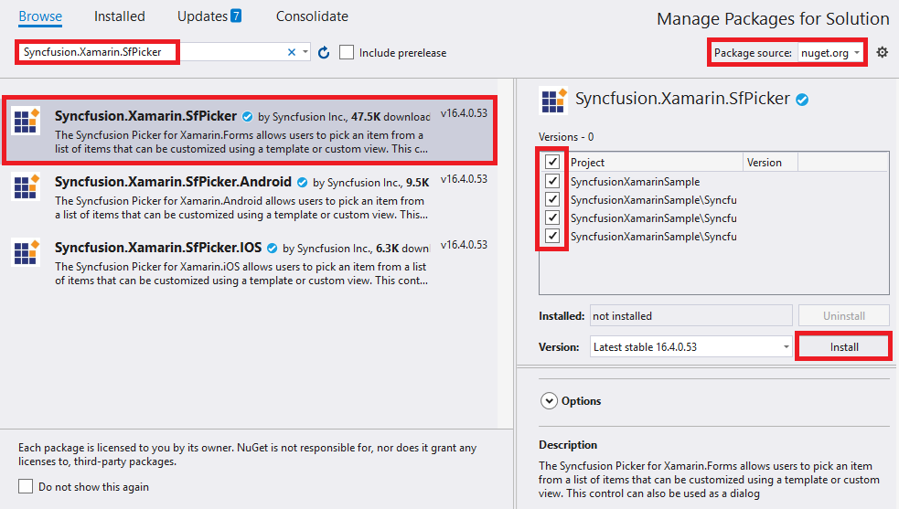
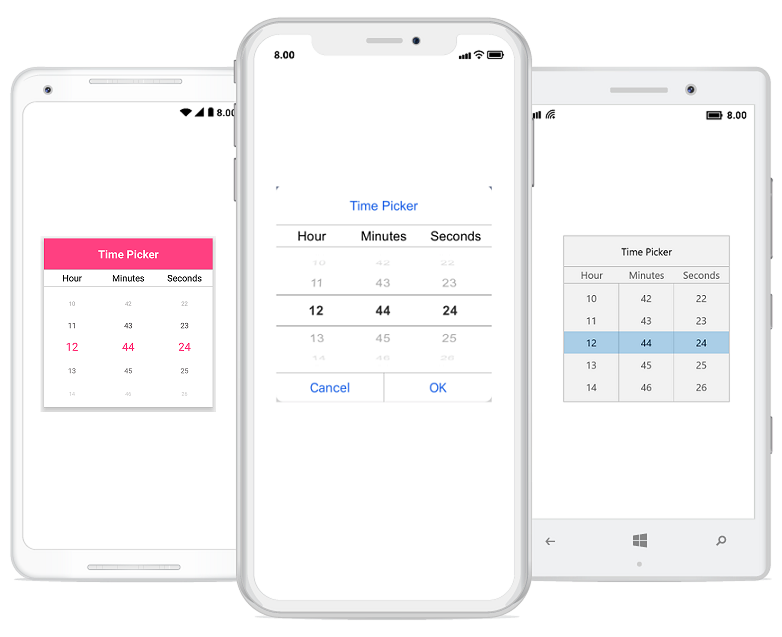

# Getting Started

This section explains the steps required to work with the TimePicker control for Xamarin.Forms.

## Adding SfTimePicker reference

You can add SfTimePicker reference using one of the following methods:

**Method 1: Adding SfTimePicker reference from nuget.org**

Syncfusion Xamarin components are available in [nuget.org](https://www.nuget.org/). To add SfTimePicker to your project, open the NuGet package manager in Visual Studio, search for [Syncfusion.Xamarin.SfPicker](https://www.nuget.org/packages/Syncfusion.Xamarin.SfPicker), and then install it.

N> Install the same version of SfPicker NuGet in all the projects.

**Method 2: Adding SfTimePicker reference from toolbox**

Syncfusion also provides Xamarin Toolbox. Using this toolbox, you can drag the SfTimePicker control to the XAML page. It will automatically install the required NuGet packages and add the namespace to the page. To install Syncfusion Xamarin Toolbox, refer to [Toolbox](https://help.syncfusion.com/xamarin/utility#toolbox).

**Method 3: Adding SfTimePicker assemblies manually from the installed location**

If you prefer to manually reference the assemblies instead referencing from NuGet, add the following assemblies in respective projects.

Location: {Installed location}/{version}/Xamarin/lib

<table>
<tr>
<td>PCL</td>
<td>Syncfusion.SfPicker.XForms.dll Syncfusion.Core.XForms.dll Syncfusion.Licensing.dll </td>
</tr>
<tr>
<td>Android</td>
<td>Syncfusion.SfPicker.Android.dll Syncfusion.SfPicker.XForms.Android.dll Syncfusion.SfPicker.XForms.dll Syncfusion.Core.XForms.dll Syncfusion.Core.XForms.Android.dll Syncfusion.Licensing.dll </td>
</tr>
<tr>
<td>iOS</td>
<td>Syncfusion.SfPicker.iOS.dll Syncfusion.SfPicker.XForms.iOS.dll Syncfusion.SfPicker.XForms.dll Syncfusion.Core.XForms.dll Syncfusion.Core.XForms.iOS.dll Syncfusion.Licensing.dll </td>
</tr>
<tr>
<td>UWP</td>
<td>Syncfusion.SfInput.UWP.dll Syncfusion.SfShared.UWP.dll Syncfusion.SfPicker.XForms.UWP.dll Syncfusion.SfPicker.XForms.dll Syncfusion.Core.XForms.dll Syncfusion.Core.XForms.UWP.dll Syncfusion.Licensing.dll </td>
</tr>
</table>

N> To know more about obtaining our components, refer to these links for [Mac](https://help.syncfusion.com/xamarin/introduction/download-and-installation/mac/) and [Windows](https://help.syncfusion.com/xamarin/introduction/download-and-installation/windows/).

I> Starting with v16.2.0.x, if you reference Syncfusion assemblies from the trial setup or from the NuGet feed, you also have to include a license key in your projects. Please refer to [Syncfusion license key](https://help.syncfusion.com/common/essential-studio/licensing/license-key/) to know about registering Syncfusion license key in your Xamarin application to use our components.

N> After adding the reference, an additional step is required for iOS and UWP projects. If you are adding the references from toolbox, this step is not needed.

### Additional step for iOS

To launch [`SfTimePicker`] in iOS, call the `SfTimePickerRenderer.Init()` in the FinishedLaunching overridden method of the `AppDelegate` class in iOS Project as demonstrated in the following code example.



public override bool FinishedLaunching(UIApplication app, NSDictionary options)
{
    global::Xamarin.Forms.Forms.Init();
    LoadApplication(new App());
    SfTimePickerRenderer.Init();
    return base.FinishedLaunching(app, options);
}



### Additional step for UWP

This step is required only if the application is deployed in Release mode with .NET native tool chain enabled. It is needed for resolving the known Framework issue “Custom controls not rendering in Release mode” in UWP platform. Initializing the [`SfTimePicker`] assembly at the `OnLaunched` overridden method of the `App` class in UWP project is the suggested work around. The following code example demonstrates initializing the [`SfTimePicker`] assembly.



protected override void OnLaunched(LaunchActivatedEventArgs e)
{
    ..... 
    rootFrame.NavigationFailed += OnNavigationFailed;
    // Add `using System.Reflection;` 
    List<Assembly> assembliesToInclude = new List<Assembly>();
    //Now, add all the assemblies that your app uses 
    assembliesToInclude.Add(typeof(SfTimePickerRenderer).GetTypeInfo().Assembly);
    // replaces Xamarin.Forms.Forms.Init(e);
    Xamarin.Forms.Forms.Init(e, assembliesToInclude);
    ..... 
}



### Create a simple TimePicker

The [`SfTimePicker`] control is configured entirely in C# code or in XAML markup. The following steps explain how to create a [`SfTimePIcker`] and configure its elements.

### Adding namespace for referred assemblies



xmlns:syncfusion="clr-namespace:Syncfusion.XForms.Pickers;assembly=Syncfusion.SfPicker.XForms"


using Syncfusion.XForms.Pickers;



### Referring SfTimePicker control with declared suffix name for namespace




<?xml version="1.0" encoding="utf-8" ?>
<ContentPage xmlns="http://xamarin.com/schemas/2014/forms"
             xmlns:x="http://schemas.microsoft.com/winfx/2009/xaml"
             xmlns:local="clr-namespace:TimePickerSample"
             xmlns:syncfusion="clr-namespace:Syncfusion.XForms.Pickers;assembly=Syncfusion.SfPicker.XForms"
             x:Class="TimePickerSample.MainPage">
    <ContentPage.Content>
        <syncfusion:SfTimePicker x:Name="timePicker"/>
    </ContentPage.Content>
</ContentPage>




using Syncfusion.XForms.Pickers;
using Xamarin.Forms;

namespace TimePickerSample
{
    public partial class MainPage : ContentPage
    {
        public MainPage()
        {
            InitializeComponent();
            SfTimePicker timePicker = new SfTimePicker();
            this.Content = timePicker;
        }
    }
}




### Set header to the TimePicker

The SfTimePicker control allows you to the define header text by setting the `SfTimePicker.HeaderText`, and enable SfTimePicker header by setting the `SfTimePicker.ShowHeader` property to true. Default value of `SfTimePicker.ShowHeader` is "true".




<?xml version="1.0" encoding="utf-8" ?>
<ContentPage xmlns="http://xamarin.com/schemas/2014/forms"
             xmlns:x="http://schemas.microsoft.com/winfx/2009/xaml"
             xmlns:local="clr-namespace:TimePickerSample"
             xmlns:syncfusion="clr-namespace:Syncfusion.XForms.Pickers;assembly=Syncfusion.SfPicker.XForms"
             x:Class="TimePickerSample.MainPage">
    <ContentPage.Content>
        <syncfusion:SfTimePicker x:Name="timePicker"
                                 HeaderText = "Select a time"/>
    </ContentPage.Content>
</ContentPage>




using Syncfusion.XForms.Pickers;
using Xamarin.Forms;

namespace TimePickerSample
{
    public partial class MainPage : ContentPage
    {
        public MainPage()
        {
            InitializeComponent();
            SfTimePicker timePicker = new SfTimePicker()
            {
                HeaderText = "Select a time"
            };

            this.Content = timePicker;
        }
    }
}




### Enable validation button in footer

In SfTimePicker control, validation buttons (OK and Cancel) can be enabled by setting the `SfTimePicker.ShowFooter` property to true. Default value of `SfTimePicker.ShowFooter` property is "false".




<?xml version="1.0" encoding="utf-8" ?>
<ContentPage xmlns="http://xamarin.com/schemas/2014/forms"
             xmlns:x="http://schemas.microsoft.com/winfx/2009/xaml"
             xmlns:local="clr-namespace:TimePickerSample"
             xmlns:syncfusion="clr-namespace:Syncfusion.XForms.Pickers;assembly=Syncfusion.SfPicker.XForms"
             x:Class="TimePickerSample.MainPage">
    <ContentPage.Content>
        <syncfusion:SfTimePicker ShowFooter="True"/>
    </ContentPage.Content>
</ContentPage>


  

using Syncfusion.XForms.Pickers;
using Xamarin.Forms;

namespace TimePickerSample
{
    public partial class MainPage : ContentPage
    {
        public MainPage()
        {
            InitializeComponent();
            SfTimePicker timePicker = new SfTimePicker()
            {
                ShowFooter = true
            };

            this.Content = timePicker;
        }
    }
}




### PickerHeight and PickerWidth

The SfTimePicker control allows you to the change the height and the width of the picker using the `SfTimePicker.PickerHeight` and `SfTimePicker.PickerWidth` properties.




<?xml version="1.0" encoding="utf-8" ?>
<ContentPage xmlns="http://xamarin.com/schemas/2014/forms"
             xmlns:x="http://schemas.microsoft.com/winfx/2009/xaml"
             xmlns:local="clr-namespace:TimePickerSample"
             xmlns:syncfusion="clr-namespace:Syncfusion.XForms.Pickers;assembly=Syncfusion.SfPicker.XForms"
             x:Class="TimePickerSample.MainPage">
    <ContentPage.Content>
        <Grid>
            <syncfusion:SfTimePicker x:Name="timePicker"
                                     PickerMode="Dialog"
                                     PickerHeight="300"
                                     PickerWidth="300"/> >
            <Button Text="Open Picker" 
                    x:Name="pickerButton"
                    Clicked="Button_Clicked"
                    HorizontalOptions="Center"
                    VerticalOptions="Center"
                    HeightRequest="50" 
                    WidthRequest="100"/>
        </Grid>
    </ContentPage.Content>
</ContentPage>




using Syncfusion.XForms.Pickers;
using System;
using System.ComponentModel;
using System.Runtime.CompilerServices;
using System.Windows.Input;
using Xamarin.Forms;

namespace TimePickerSample
{
    public partial class MainPage : ContentPage
    {
        SfTimePicker timePicker;
        public MainPage()
        {
            InitializeComponent();
            Grid grid = new Grid();
            timePicker = new SfTimePicker()
            {
                PickerMode = timePickerMode.Dialog,
                PickerHeight = 300,
                PickerWidth = 300
            };

            Button pickerButton = new Button()
            {
                Text = "Open Picker",
                HeightRequest = 50,
                WidthRequest = 100,
                HorizontalOptions = LayoutOptions.Center,
                VerticalOptions = LayoutOptions.Center
            };

            pickerButton.Clicked += Button_Clicked;

            grid.Children.Add(timePicker);
            grid.Children.Add(pickerButton);
            this.Content = grid;
        }

        private void Button_Clicked(object sender, System.EventArgs e)
        {
            timePicker.IsOpen = true;
        }
    }
}




### Time

The time can be selected by using the Time property. The default value of Time is current time.




<?xml version="1.0" encoding="utf-8" ?>
<ContentPage xmlns="http://xamarin.com/schemas/2014/forms"
             xmlns:x="http://schemas.microsoft.com/winfx/2009/xaml"
             xmlns:local="clr-namespace:TimePickerSample"
             xmlns:syncfusion="clr-namespace:Syncfusion.XForms.Pickers;assembly=Syncfusion.SfPicker.XForms"
             x:Class="TimePickerSample.MainPage">
    <ContentPage.Content>
        <syncfusion:SfTimePicker x:Name="timePicker"
                                 Time="4:15:26"/>
    </ContentPage.Content>
</ContentPage>




using Syncfusion.XForms.Pickers;
using System;
using Xamarin.Forms;

namespace TimePickerSample
{
    public partial class MainPage : ContentPage
    {
        public MainPage()
        {
            InitializeComponent();
            SfTimePicker timePicker = new SfTimePicker()
            {
                Time = new TimeSpan(4, 15, 26)
            };

            this.Content = timePicker;
        }
    }
}




We have attached sample for reference. You can download the sample from the following link.

You can find the complete getting started sample here: [GettingStarted](https://www.syncfusion.com/downloads/support/directtrac/general/ze/TimePickerSample211616816)