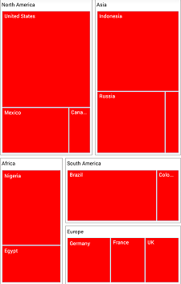
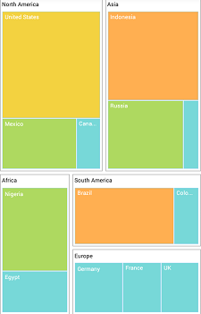
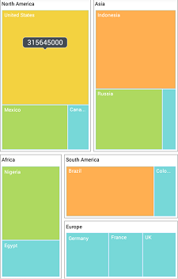
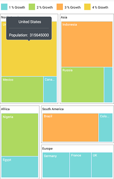

# Customization

The TreeMap control supports color customization to determine the exact combination of colors for the tree nodes displayed and provides tooltip support to display additional information of TreeMap data.

## Color

You can customize the colors of leaf nodes using the [`ColorMapping`](https://help.syncfusion.com/cr/xamarin/Syncfusion.SfTreeMap.XForms.ColorMapping.html) support.

The `ColorMapping` is categorized into the following three different types:

* UniColorMapping
* RangeColorMapping
* DesaturationColorMapping

### UniColorMapping

You can color all the leaf nodes with the same color by setting value to the [`Color`](https://help.syncfusion.com/cr/xamarin/Syncfusion.SfTreeMap.XForms.UniColorMapping.html#Syncfusion_SfTreeMap_XForms_UniColorMapping_Color) property of [`UniColorMapping`](https://help.syncfusion.com/cr/xamarin/Syncfusion.SfTreeMap.XForms.UniColorMapping.html).

  



  <treemap:SfTreeMap x:Name="treeMap"  DataSource="{Binding PopulationDetails}" 
        WeightValuePath="Population" ColorValuePath="Growth" LayoutType="Squarified">
            <treemap:SfTreeMap.LeafItemSettings>
                <treemap:LeafItemSettings  Gap="2" BorderColor="#A9D9F7" LabelPath="Country" >
                </treemap:LeafItemSettings>
            </treemap:SfTreeMap.LeafItemSettings>
            <treemap:SfTreeMap.Levels>
                <treemap:TreeMapFlatLevel  HeaderHeight="20" GroupPath = "Continent" GroupGap =" 5" ShowHeader = "true">
                    <treemap:TreeMapFlatLevel.HeaderStyle>
                        <treemap:Style Color= "Black"/>
                    </treemap:TreeMapFlatLevel.HeaderStyle>
                </treemap:TreeMapFlatLevel>
            </treemap:SfTreeMap.Levels>

            <treemap:SfTreeMap.LeafItemColorMapping>
                <treemap:UniColorMapping Color="Red"></treemap:UniColorMapping>
            </treemap:SfTreeMap.LeafItemColorMapping>

        </treemap:SfTreeMap>



 

 PopulationViewModel viewModel = new PopulationViewModel();

            SfTreeMap treeMap = new SfTreeMap();
            treeMap.BackgroundColor = Color.White;
            treeMap.ColorValuePath = "Growth";
            treeMap.WeightValuePath = "Population";
           
            LeafItemSettings leafSetting = new LeafItemSettings();
            leafSetting.Gap = 2;
            leafSetting.BorderColor = Color.FromHex("#A9D9F7");
            leafSetting.LabelPath = "Country";
            treeMap.LeafItemSettings = leafSetting;

            TreeMapFlatLevel flatLevel = new TreeMapFlatLevel();
            flatLevel.HeaderHeight = 20;
            flatLevel.GroupPath = "Continent";
            flatLevel.GroupGap = 5;
            flatLevel.ShowHeader = true;
            flatLevel.HeaderStyle = new Syncfusion.SfTreeMap.XForms.Style() { Color = Color.Black };
            treeMap.Levels.Add(flatLevel);            

            UniColorMapping uniColorMapping = new UniColorMapping();
            uniColorMapping.Color = Color.Red;

            treeMap.LeafItemColorMapping = uniColorMapping;

            treeMap.DataSource = viewModel.PopulationDetails;
            this.Content = treeMap;



  

### RangeColorMapping

You can group the leaf nodes based on the range of color values of data. You can set a unique color for every range. To achieve this, specify the [`To`](https://help.syncfusion.com/cr/xamarin/Syncfusion.SfTreeMap.XForms.Range.html#Syncfusion_SfTreeMap_XForms_Range_To) and [`From`](https://help.syncfusion.com/cr/xamarin/Syncfusion.SfTreeMap.XForms.Range.html#Syncfusion_SfTreeMap_XForms_Range_From) values as range bound, and specify the `Color` value to fill the leaf nodes of particular range using the `RangeColorMapping` property of TreeMap. You must specify value to ColorValuePath since the ranges `From` and `To` depend on the under bound value of [`ColorValuePath`](https://help.syncfusion.com/cr/xamarin/Syncfusion.SfTreeMap.XForms.SfTreeMap.html#Syncfusion_SfTreeMap_XForms_SfTreeMap_ColorValuePath).

  



 <treemap:SfTreeMap x:Name="treeMap"  DataSource="{Binding PopulationDetails}" 
        WeightValuePath="Population" ColorValuePath="Growth" LayoutType="Squarified" ShowTooltip="True">
            <treemap:SfTreeMap.LeafItemSettings>
                <treemap:LeafItemSettings  Gap="2" BorderColor="#A9D9F7" LabelPath="Country" >
                </treemap:LeafItemSettings>
            </treemap:SfTreeMap.LeafItemSettings>
            <treemap:SfTreeMap.Levels>
                <treemap:TreeMapFlatLevel  HeaderHeight="20" GroupPath = "Continent" GroupGap =" 5" ShowHeader = "true">
                    <treemap:TreeMapFlatLevel.HeaderStyle>
                        <treemap:Style Color= "Black"/>
                    </treemap:TreeMapFlatLevel.HeaderStyle>
                </treemap:TreeMapFlatLevel>
            </treemap:SfTreeMap.Levels>

            <treemap:SfTreeMap.LegendSettings>
                <treemap:LegendSettings ShowLegend="True"  Size="700,45">
                    <treemap:LegendSettings.LabelStyle>
                        <treemap:Style Color="Black"></treemap:Style>
                    </treemap:LegendSettings.LabelStyle>
                </treemap:LegendSettings>
            </treemap:SfTreeMap.LegendSettings>

            <treemap:SfTreeMap.LeafItemColorMapping>
                <treemap:RangeColorMapping>
                    <treemap:RangeColorMapping.Ranges>
                        <treemap:Range LegendLabel = "1 % Growth" From = "0" To = "1" Color =  "#77D8D8"  />
                        <treemap:Range LegendLabel = "2 % Growth" From = "0" To = "2" Color =  "#AED960"  />
                        <treemap:Range LegendLabel = "3 % Growth" From = "0" To = "3" Color =  "#FFAF51"  />
                        <treemap:Range LegendLabel = "4 % Growth" From = "0" To = "4" Color =  "#F3D240"  />
                    </treemap:RangeColorMapping.Ranges>
                </treemap:RangeColorMapping>
            </treemap:SfTreeMap.LeafItemColorMapping>

        </treemap:SfTreeMap>





 PopulationViewModel viewModel = new PopulationViewModel();

            SfTreeMap treeMap = new SfTreeMap();
            treeMap.BackgroundColor = Color.White;
            treeMap.ColorValuePath = "Growth";
            treeMap.WeightValuePath = "Population";           

            LeafItemSettings leafSetting = new LeafItemSettings();
            leafSetting.Gap = 2;
            leafSetting.BorderColor = Color.FromHex("#A9D9F7");
            leafSetting.LabelPath = "Country";
            treeMap.LeafItemSettings = leafSetting;

            TreeMapFlatLevel flatLevel = new TreeMapFlatLevel();
            flatLevel.HeaderHeight = 20;
            flatLevel.GroupPath = "Continent";
            flatLevel.GroupGap = 5;
            flatLevel.ShowHeader = true;
            flatLevel.HeaderStyle = new Syncfusion.SfTreeMap.XForms.Style() { Color = Color.Black };
            treeMap.Levels.Add(flatLevel);

            LegendSettings legendSettings = new LegendSettings();
            legendSettings.ShowLegend = true;
            legendSettings.Size = new Size(700, 45);
            legendSettings.LabelStyle = new Syncfusion.SfTreeMap.XForms.Style() { Color = Color.Black };
            treeMap.LegendSettings = legendSettings;

            RangeColorMapping rangeColorMapping = new RangeColorMapping();

            Range range1 = new Range();
            range1.From = 0;
            range1.To = 1;
            range1.Color = Color.FromHex("#77D8D8");
            range1.LegendLabel = "1 % Growth";

            Range range2 = new Range();
            range2.From = 0;
            range2.To = 2;
            range2.Color = Color.FromHex("#AED960");
            range2.LegendLabel = "2 % Growth";

            Range range3 = new Range();
            range3.From = 0;
            range3.To = 3;
            range3.Color = Color.FromHex("#FFAF51");
            range3.LegendLabel = "3 % Growth";

            Range range4 = new Range();
            range4.From = 0;
            range4.To = 4;
            range4.Color = Color.FromHex("#F3D240");
            range4.LegendLabel = "4 % Growth";

            rangeColorMapping.Ranges.Add(range1);
            rangeColorMapping.Ranges.Add(range2);
            rangeColorMapping.Ranges.Add(range3);
            rangeColorMapping.Ranges.Add(range4);

            treeMap.LeafItemColorMapping = rangeColorMapping;

            treeMap.DataSource = viewModel.PopulationDetails;
            this.Content = treeMap;



  

### DesaturationColorMapping

You can differentiate all the leaf nodes using the [`DesaturationColorMapping`](https://help.syncfusion.com/cr/xamarin/Syncfusion.SfTreeMap.XForms.DesaturationColorMapping.html) property of TreeMap. Differentiation can be achieved even though the same color is applied for all the leaf nodes by varying the opacity of the leaf nodes based on the [`Color`](https://help.syncfusion.com/cr/xamarin/Syncfusion.SfTreeMap.XForms.DesaturationColorMapping.html#Syncfusion_SfTreeMap_XForms_DesaturationColorMapping_Color) value specified in the color value range using the [`RangeMinimum`](https://help.syncfusion.com/cr/xamarin/Syncfusion.SfTreeMap.XForms.DesaturationColorMapping.html#Syncfusion_SfTreeMap_XForms_DesaturationColorMapping_RangeMinimum) and [`RangeMaximum`](https://help.syncfusion.com/cr/xamarin/Syncfusion.SfTreeMap.XForms.DesaturationColorMapping.html#Syncfusion_SfTreeMap_XForms_DesaturationColorMapping_RangeMaximum) values of data collection. You can also bind the opacity range by setting the [`From`](https://help.syncfusion.com/cr/xamarin/Syncfusion.SfTreeMap.XForms.DesaturationColorMapping.html#Syncfusion_SfTreeMap_XForms_DesaturationColorMapping_From) and [`To`](https://help.syncfusion.com/cr/xamarin/Syncfusion.SfTreeMap.XForms.DesaturationColorMapping.html#Syncfusion_SfTreeMap_XForms_DesaturationColorMapping_To) properties of `DesaturationColorMapping`.

  



 <treemap:SfTreeMap x:Name="treeMap"  DataSource="{Binding PopulationDetails}" 
        WeightValuePath="Population" ColorValuePath="Growth" LayoutType="Squarified" ShowTooltip="True">
            <treemap:SfTreeMap.LeafItemSettings>
                <treemap:LeafItemSettings  Gap="2" BorderColor="#A9D9F7" LabelPath="Country" >
                </treemap:LeafItemSettings>
            </treemap:SfTreeMap.LeafItemSettings>
            <treemap:SfTreeMap.Levels>
                <treemap:TreeMapFlatLevel  HeaderHeight="20" GroupPath = "Continent" GroupGap =" 5" ShowHeader = "true">
                    <treemap:TreeMapFlatLevel.HeaderStyle>
                        <treemap:Style Color= "Black"/>
                    </treemap:TreeMapFlatLevel.HeaderStyle>
                </treemap:TreeMapFlatLevel>
            </treemap:SfTreeMap.Levels>

            <treemap:SfTreeMap.LegendSettings>
                <treemap:LegendSettings ShowLegend="True"  Size="700,45">
                    <treemap:LegendSettings.LabelStyle>
                        <treemap:Style Color="Black"></treemap:Style>
                    </treemap:LegendSettings.LabelStyle>
                </treemap:LegendSettings>
            </treemap:SfTreeMap.LegendSettings>

            <treemap:SfTreeMap.LeafItemColorMapping>
                <treemap:DesaturationColorMapping From="1" To="0.1" Color="#41B8C4"/>
            </treemap:SfTreeMap.LeafItemColorMapping>

        </treemap:SfTreeMap>





PopulationViewModel viewModel = new PopulationViewModel();

            SfTreeMap treeMap = new SfTreeMap();
            treeMap.BackgroundColor = Color.White;
            treeMap.ColorValuePath = "Growth";
            treeMap.WeightValuePath = "Population";           

            LeafItemSettings leafSetting = new LeafItemSettings();
            leafSetting.Gap = 2;
            leafSetting.BorderColor = Color.FromHex("#A9D9F7");
            leafSetting.LabelPath = "Country";
            treeMap.LeafItemSettings = leafSetting;

            TreeMapFlatLevel flatLevel = new TreeMapFlatLevel();
            flatLevel.HeaderHeight = 20;
            flatLevel.GroupPath = "Continent";
            flatLevel.GroupGap = 5;
            flatLevel.ShowHeader = true;
            flatLevel.HeaderStyle = new Syncfusion.SfTreeMap.XForms.Style() { Color = Color.Black };
            treeMap.Levels.Add(flatLevel);

            LegendSettings legendSettings = new LegendSettings();
            legendSettings.ShowLegend = true;
            legendSettings.Size = new Size(700, 45);
            legendSettings.LabelStyle = new Syncfusion.SfTreeMap.XForms.Style() { Color = Color.Black };
            treeMap.LegendSettings = legendSettings;

            DesaturationColorMapping desaturationColor = new DesaturationColorMapping();
            desaturationColor.From = 1;
            desaturationColor.To = 0.2;
            desaturationColor.Color = Color.FromHex("#41B8C4");

            treeMap.LeafItemColorMapping = desaturationColor;

            treeMap.DataSource = viewModel.PopulationDetails;
            this.Content = treeMap;



  

## Tooltip

You can enable the tooltip support for TreeMap by setting the [`ShowTooltip`](https://help.syncfusion.com/cr/xamarin/Syncfusion.SfTreeMap.XForms.SfTreeMap.html#Syncfusion_SfTreeMap_XForms_SfTreeMap_ShowTooltip) property to true. By default, it takes the property of bound object that is referenced in [`GroupPath`](https://help.syncfusion.com/cr/xamarin/Syncfusion.SfTreeMap.XForms.TreeMapFlatLevel.html#Syncfusion_SfTreeMap_XForms_TreeMapFlatLevel_GroupPath) and displays its content when the corresponding node is tapped.

### Tooltip customization

You can customize the tooltip to show more details by specifying [`TooltipTemplate`](https://help.syncfusion.com/cr/xamarin/Syncfusion.SfTreeMap.XForms.TooltipSetting.html#Syncfusion_SfTreeMap_XForms_TooltipSetting_TooltipTemplate) to tooltip.

  



 <treemap:SfTreeMap x:Name="treeMap"  DataSource="{Binding PopulationDetails}" 
        WeightValuePath="Population" ColorValuePath="Growth" LayoutType="Squarified" ShowTooltip="True">
            <treemap:SfTreeMap.LeafItemSettings>
                <treemap:LeafItemSettings  Gap="2" BorderColor="#A9D9F7" LabelPath="Country" >
                </treemap:LeafItemSettings>
            </treemap:SfTreeMap.LeafItemSettings>
            <treemap:SfTreeMap.Levels>
                <treemap:TreeMapFlatLevel  HeaderHeight="20" GroupPath = "Continent" GroupGap =" 5" ShowHeader = "true">
                    <treemap:TreeMapFlatLevel.HeaderStyle>
                        <treemap:Style Color= "Black"/>
                    </treemap:TreeMapFlatLevel.HeaderStyle>
                </treemap:TreeMapFlatLevel>
            </treemap:SfTreeMap.Levels>

            <treemap:SfTreeMap.LegendSettings>
                <treemap:LegendSettings ShowLegend="True"  Size="700,45">
                    <treemap:LegendSettings.LabelStyle>
                        <treemap:Style Color="Black"></treemap:Style>
                    </treemap:LegendSettings.LabelStyle>
                </treemap:LegendSettings>
            </treemap:SfTreeMap.LegendSettings>         

            <treemap:SfTreeMap.LeafItemColorMapping>
                <treemap:RangeColorMapping>
                    <treemap:RangeColorMapping.Ranges>
                        <treemap:Range LegendLabel = "1 % Growth" From = "0" To = "1" Color =  "#77D8D8"  />
                        <treemap:Range LegendLabel = "2 % Growth" From = "0" To = "2" Color =  "#AED960"  />
                        <treemap:Range LegendLabel = "3 % Growth" From = "0" To = "3" Color =  "#FFAF51"  />
                        <treemap:Range LegendLabel = "4 % Growth" From = "0" To = "4" Color =  "#F3D240"  />
                    </treemap:RangeColorMapping.Ranges>
                </treemap:RangeColorMapping>
            </treemap:SfTreeMap.LeafItemColorMapping>

            <treemap:SfTreeMap.TooltipSettings>
                <treemap:TooltipSetting>
                    <treemap:TooltipSetting.TooltipTemplate>
                        <DataTemplate>
                            <StackLayout>
                                <Label Text="{Binding Country}" HorizontalTextAlignment="Center" VerticalTextAlignment="Center" 
                                       TextColor="#FFFFFF"  Margin="6,0,0,0" FontSize="12"/>
                                <BoxView Color="#888C91" HeightRequest="1" VerticalOptions="FillAndExpand" 
                                         HorizontalOptions="FillAndExpand" Margin="0,6,0,6" Opacity="0.4"/>
                                <StackLayout HorizontalOptions="Center" Orientation="Horizontal">
                                    <Label Text="Population:" VerticalTextAlignment="Center" HorizontalOptions="Center" 
                                           TextColor="#FFFFFF" FontSize="12" Margin="0,0,0,6"></Label>
                                    <Label Text="{Binding Population}"
                                           VerticalTextAlignment="Center" HorizontalOptions="Start" TextColor="#FFFFFF" FontSize="12"
                                           Margin="0,0,0,6"/>
                                </StackLayout>
                            </StackLayout>
                        </DataTemplate>
                    </treemap:TooltipSetting.TooltipTemplate>
                </treemap:TooltipSetting>
            </treemap:SfTreeMap.TooltipSettings>          

        </treemap:SfTreeMap>



 

PopulationViewModel viewModel = new PopulationViewModel();

            SfTreeMap treeMap = new SfTreeMap();
            treeMap.BackgroundColor = Color.White;
            treeMap.ColorValuePath = "Growth";
            treeMap.WeightValuePath = "Population";
            treeMap.LayoutType = LayoutTypes.Squarified;
            treeMap.ShowTooltip = true;

            LeafItemSettings leafSetting = new LeafItemSettings();
            leafSetting.Gap = 2;
            leafSetting.BorderColor = Color.FromHex("#A9D9F7");
            leafSetting.LabelPath = "Country";
            treeMap.LeafItemSettings = leafSetting;

            TreeMapFlatLevel flatLevel = new TreeMapFlatLevel();
            flatLevel.HeaderHeight = 20;
            flatLevel.GroupPath = "Continent";
            flatLevel.GroupGap = 5;
            flatLevel.ShowHeader = true;
            flatLevel.HeaderStyle = new Syncfusion.SfTreeMap.XForms.Style() { Color = Color.Black };
            treeMap.Levels.Add(flatLevel);

            LegendSettings legendSettings = new LegendSettings();
            legendSettings.ShowLegend = true;
            legendSettings.Size = new Size(700, 45);
            legendSettings.LabelStyle = new Syncfusion.SfTreeMap.XForms.Style() { Color = Color.Black };
            treeMap.LegendSettings = legendSettings;

            RangeColorMapping rangeColorMapping = new RangeColorMapping();

            Range range1 = new Range();
            range1.From = 0;
            range1.To = 1;
            range1.Color = Color.FromHex("#77D8D8");
            range1.LegendLabel = "1 % Growth";

            Range range2 = new Range();
            range2.From = 0;
            range2.To = 2;
            range2.Color = Color.FromHex("#AED960");
            range2.LegendLabel = "2 % Growth";

            Range range3 = new Range();
            range3.From = 0;
            range3.To = 3;
            range3.Color = Color.FromHex("#FFAF51");
            range3.LegendLabel = "3 % Growth";

            Range range4 = new Range();
            range4.From = 0;
            range4.To = 4;
            range4.Color = Color.FromHex("#F3D240");
            range4.LegendLabel = "4 % Growth";

            rangeColorMapping.Ranges.Add(range1);
            rangeColorMapping.Ranges.Add(range2);
            rangeColorMapping.Ranges.Add(range3);
            rangeColorMapping.Ranges.Add(range4);

            treeMap.LeafItemColorMapping = rangeColorMapping;           

            DataTemplate template = new DataTemplate(() =>
            {
                StackLayout stackLayout = new StackLayout();
                Label label = new Label();
                label.HorizontalTextAlignment = TextAlignment.Center;
                label.VerticalTextAlignment = TextAlignment.Center;
                label.TextColor = Color.FromHex("#FFFFFF");
                label.Margin = new Thickness(6, 0, 0, 0);
                label.FontSize = 12;
                label.SetBinding(Label.TextProperty, "Country");
                stackLayout.Children.Add(label);

                BoxView boxView = new BoxView();
                boxView.Color = Color.FromHex("#888C91");
                boxView.HeightRequest = 1;
                boxView.VerticalOptions = LayoutOptions.FillAndExpand;
                boxView.HorizontalOptions = LayoutOptions.FillAndExpand;
                boxView.Opacity = 0.4;
                boxView.Margin = new Thickness(0, 6, 0, 6);
                stackLayout.Children.Add(boxView);

                StackLayout layout = new StackLayout();
                layout.Orientation = StackOrientation.Horizontal;
                layout.HorizontalOptions = LayoutOptions.Center;

                Label label1 = new Label();
                label1.Text = "Population:";
                label1.HorizontalOptions = LayoutOptions.Center;
                label1.VerticalTextAlignment = TextAlignment.Center;
                label1.TextColor = Color.FromHex("#FFFFFF");
                label1.Margin = new Thickness(0, 0, 0, 6);
                label1.FontSize = 12;              
                layout.Children.Add(label1);

                Label label2 = new Label();
                label2.HorizontalOptions = LayoutOptions.Start;
                label2.VerticalTextAlignment = TextAlignment.Center;
                label2.TextColor = Color.FromHex("#FFFFFF");
                label2.Margin = new Thickness(0, 0, 0, 6);
                label2.FontSize = 12;
                label2.SetBinding(Label.TextProperty, "Population");
                layout.Children.Add(label2);

                stackLayout.Children.Add(layout);

                return stackLayout;
            });

            TooltipSetting tooltipSetting = new TooltipSetting();
            tooltipSetting.TooltipTemplate = template;

            treeMap.TooltipSettings = tooltipSetting;

            treeMap.DataSource = viewModel.PopulationDetails;
            this.Content = treeMap;



  

## Selection

The TreeMap control provides selection support, which allows you to select the tree map items. The selection can be enabled by setting the [`HighlightOnSelection`](https://help.syncfusion.com/cr/xamarin/Syncfusion.SfTreeMap.XForms.SfTreeMap.html#Syncfusion_SfTreeMap_XForms_SfTreeMap_HighlightOnSelection) property to true in TreeMap. You can specify the highlight color and border width using the [`HightlightColor`](https://help.syncfusion.com/cr/xamarin/Syncfusion.SfTreeMap.XForms.SfTreeMap.html#Syncfusion_SfTreeMap_XForms_SfTreeMap_HightlightColor) and [`HightlightBorderWidth`](https://help.syncfusion.com/cr/xamarin/Syncfusion.SfTreeMap.XForms.SfTreeMap.html#Syncfusion_SfTreeMap_XForms_SfTreeMap_HightlightBorderWidth) properties, respectively.

  



 <treemap:SfTreeMap x:Name="treeMap"  DataSource="{Binding PopulationDetails}" HighlightOnSelection="True" 
                           HightlightBorderWidth="8" HightlightColor="Red"
        WeightValuePath="Population" ColorValuePath="Growth" LayoutType="Squarified" >
            <treemap:SfTreeMap.LeafItemSettings>
                <treemap:LeafItemSettings  Gap="2" BorderColor="#A9D9F7" LabelPath="Country" >
                </treemap:LeafItemSettings>
            </treemap:SfTreeMap.LeafItemSettings>
            <treemap:SfTreeMap.Levels>
                <treemap:TreeMapFlatLevel  HeaderHeight="20" GroupPath = "Continent" GroupGap =" 5" ShowHeader = "true">
                    <treemap:TreeMapFlatLevel.HeaderStyle>
                        <treemap:Style Color= "Black"/>
                    </treemap:TreeMapFlatLevel.HeaderStyle>
                </treemap:TreeMapFlatLevel>
            </treemap:SfTreeMap.Levels>

            <treemap:SfTreeMap.LegendSettings>
                <treemap:LegendSettings ShowLegend="True"  Size="700,45">
                    <treemap:LegendSettings.LabelStyle>
                        <treemap:Style Color="Black"></treemap:Style>
                    </treemap:LegendSettings.LabelStyle>
                </treemap:LegendSettings>
            </treemap:SfTreeMap.LegendSettings>

            <treemap:SfTreeMap.LeafItemColorMapping>
                <treemap:RangeColorMapping>
                    <treemap:RangeColorMapping.Ranges>
                        <treemap:Range LegendLabel = "1 % Growth" From = "0" To = "1" Color =  "#77D8D8"  />
                        <treemap:Range LegendLabel = "2 % Growth" From = "0" To = "2" Color =  "#AED960"  />
                        <treemap:Range LegendLabel = "3 % Growth" From = "0" To = "3" Color =  "#FFAF51"  />
                        <treemap:Range LegendLabel = "4 % Growth" From = "0" To = "4" Color =  "#F3D240"  />
                    </treemap:RangeColorMapping.Ranges>
                </treemap:RangeColorMapping>
            </treemap:SfTreeMap.LeafItemColorMapping>

        </treemap:SfTreeMap>



 

 PopulationViewModel viewModel = new PopulationViewModel();

            SfTreeMap treeMap = new SfTreeMap();
            treeMap.BackgroundColor = Color.White;
            treeMap.ColorValuePath = "Growth";
            treeMap.WeightValuePath = "Population";
            treeMap.LayoutType = LayoutTypes.Squarified;
            treeMap.HighlightOnSelection = true;
            treeMap.HightlightBorderWidth = 8;
            treeMap.HightlightColor = Color.Red;

            LeafItemSettings leafSetting = new LeafItemSettings();
            leafSetting.Gap = 2;
            leafSetting.OverflowMode = LabelOverflowMode.Wrap;
            leafSetting.BorderColor = Color.FromHex("#A9D9F7");
            leafSetting.LabelPath = "Country";
            treeMap.LeafItemSettings = leafSetting;

            TreeMapFlatLevel flatLevel = new TreeMapFlatLevel();
            flatLevel.HeaderHeight = 20;
            flatLevel.GroupPath = "Continent";
            flatLevel.GroupGap = 5;
            flatLevel.ShowHeader = true;
            flatLevel.HeaderStyle = new Syncfusion.SfTreeMap.XForms.Style() { Color = Color.Black };
            treeMap.Levels.Add(flatLevel);

            LegendSettings legendSettings = new LegendSettings();
            legendSettings.ShowLegend = true;
            legendSettings.Size = new Size(700, 45);
            legendSettings.LabelStyle = new Syncfusion.SfTreeMap.XForms.Style() { Color = Color.Black };
            treeMap.LegendSettings = legendSettings;

            RangeColorMapping rangeColorMapping = new RangeColorMapping();

            Range range1 = new Range();
            range1.From = 0;
            range1.To = 1;
            range1.Color = Color.FromHex("#77D8D8");
            range1.LegendLabel = "1 % Growth";

            Range range2 = new Range();
            range2.From = 0;
            range2.To = 2;
            range2.Color = Color.FromHex("#AED960");
            range2.LegendLabel = "2 % Growth";

            Range range3 = new Range();
            range3.From = 0;
            range3.To = 3;
            range3.Color = Color.FromHex("#FFAF51");
            range3.LegendLabel = "3 % Growth";

            Range range4 = new Range();
            range4.From = 0;
            range4.To = 4;
            range4.Color = Color.FromHex("#F3D240");
            range4.LegendLabel = "4 % Growth";

            rangeColorMapping.Ranges.Add(range1);
            rangeColorMapping.Ranges.Add(range2);
            rangeColorMapping.Ranges.Add(range3);
            rangeColorMapping.Ranges.Add(range4);

            treeMap.LeafItemColorMapping = rangeColorMapping;

            treeMap.DataSource = viewModel.PopulationDetails;
            this.Content = treeMap;



  

## ItemTemplate

The TreeMap control provides template support to tree map items using the [`ItemTemplate`](https://help.syncfusion.com/cr/xamarin/Syncfusion.SfTreeMap.XForms.SfTreeMap.html#Syncfusion_SfTreeMap_XForms_SfTreeMap_ItemTemplate) property, which allows any type of custom template to be created with any type of view element.

  



    <treemap:SfTreeMap  x:Name="TreeMap"  HorizontalOptions="FillAndExpand" DataSource="{Binding OlympicMedalsDetails}"
      VerticalOptions="FillAndExpand" WeightValuePath="TotalMedals" ColorValuePath="TotalMedals" BackgroundColor="White"   >
        <treemap:SfTreeMap.LeafItemSettings>
            <treemap:LeafItemSettings ShowLabels="false" BorderColor="#A9D9F7" Gap="2" LabelPath="Country" >
            </treemap:LeafItemSettings>
        </treemap:SfTreeMap.LeafItemSettings>
        <treemap:SfTreeMap.ItemTemplate>
            <DataTemplate>
                <Grid BackgroundColor ="#D73028" >
                    <Image  HorizontalOptions= "Center" VerticalOptions= "Center" HeightRequest= "50" 
                            WidthRequest= "50" Source="{Binding Data.GameImageSource}" />
                    <Label Margin="5,5,0,0"  FontSize="12" Text= "{Binding Data.GameName}" 
                           TextColor = "White" HeightRequest="50" WidthRequest="100" HorizontalOptions= "Start" 
                           VerticalOptions= "Start"/>

                </Grid>
            </DataTemplate>
        </treemap:SfTreeMap.ItemTemplate>
    </treemap:SfTreeMap>



 

 public class OlympicMedalsViewModel
    {
        public ObservableCollection<OlympicMedals> OlympicMedalsDetails { get; set; }

        public OlympicMedalsViewModel()
        {
            this.OlympicMedalsDetails = new ObservableCollection<OlympicMedals>();
            this.OlympicMedalsDetails.Add(new OlympicMedals { Country = "US", GameName = "Swimming", GoldMedals = 16, SilverMedals = 9, BronzeMedals = 6, TotalMedals = 31, ImageName = "Swimming.png" });
            this.OlympicMedalsDetails.Add(new OlympicMedals { Country = "US", GameName = "Track and Field", GoldMedals = 9, SilverMedals = 13, BronzeMedals = 7, TotalMedals = 29, ImageName = "TrackAndField.png" });
            this.OlympicMedalsDetails.Add(new OlympicMedals { Country = "US", GameName = "Gymnastics", GoldMedals = 3, SilverMedals = 1, BronzeMedals = 2, TotalMedals = 6, ImageName = "Gymnastics.png" });
            this.OlympicMedalsDetails.Add(new OlympicMedals { Country = "US", GameName = "Boxing", GoldMedals = 1, SilverMedals = 0, BronzeMedals = 1, TotalMedals = 2, ImageName = "Boxing.png" });
            this.OlympicMedalsDetails.Add(new OlympicMedals { Country = "US", GameName = "Cycling", GoldMedals = 1, SilverMedals = 2, BronzeMedals = 1, TotalMedals = 4, ImageName = "Cycling.png" });
            this.OlympicMedalsDetails.Add(new OlympicMedals { Country = "US", GameName = "Shooting", GoldMedals = 3, SilverMedals = 0, BronzeMedals = 1, TotalMedals = 4, ImageName = "Shooting.png" });
            this.OlympicMedalsDetails.Add(new OlympicMedals { Country = "US", GameName = "Wrestling", GoldMedals = 2, SilverMedals = 0, BronzeMedals = 2, TotalMedals = 4, ImageName = "Wrestling.png" });
            this.OlympicMedalsDetails.Add(new OlympicMedals { Country = "US", GameName = "Diving", GoldMedals = 1, SilverMedals = 1, BronzeMedals = 2, TotalMedals = 4, ImageName = "Diving.png" });
        }
    }
	
	public class OlympicMedals
    {
        public string Country { get; set; }
        public string GameName { get; set; }
        public double GoldMedals { get; set; }
        public double SilverMedals { get; set; }
        public double BronzeMedals { get; set; }
        public double TotalMedals { get; set; }
        public ImageSource GameImageSource { get; set; }
        private string imageName;
        public string ImageName
        {
            get { return imageName; }
            set
            {
                imageName = value;
                if (Device.RuntimePlatform == Device.UWP)
                {
                    GameImageSource = ImageSource.FromResource("TreeMap." + imageName, typeof(OlympicMedals).GetTypeInfo().Assembly);
                }
                else
                {
                    GameImageSource = ImageSource.FromResource("TreeMap." + imageName);
                }
            }
        }
    }



  

