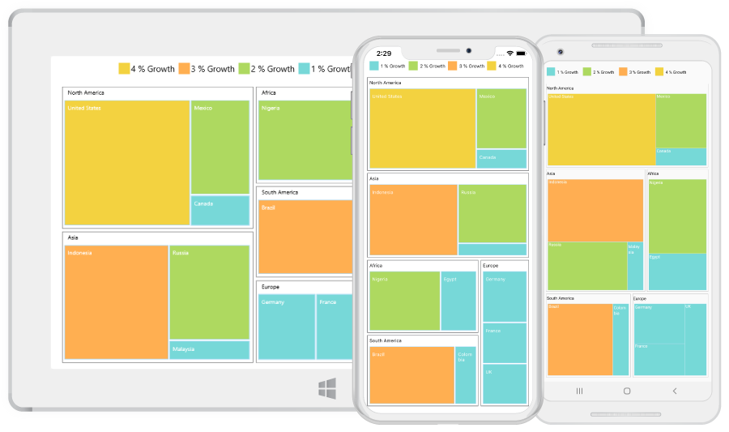

# Getting Started

This section explains the steps required to configure the TreeMap control in a real-time scenario and provides a walk-through on some of the customization features available in the TreeMap control.

## Adding SfTreeMap reference

You can add SfTreeMap reference using one of the following methods:

**Method 1: Adding SfTreeMap reference from nuget.org**

Syncfusion Xamarin components are available in [nuget.org](https://www.nuget.org/). To add SfTreeMap to your project, open the NuGet package manager in Visual Studio, search for [Syncfusion.Xamarin.SfTreeMap](https://www.nuget.org/packages/Syncfusion.Xamarin.SfTreeMap), and then install it.

N> Install the same version of SfTreeMap NuGet in all the projects.

**Method 2: Adding SfTreeMap reference from toolbox**

Syncfusion also provides Xamarin Toolbox. Using this toolbox, you can drag the SfTreeMap control to the XAML page. It will automatically install the required NuGet packages and add the namespace to the page. To install Syncfusion Xamarin Toolbox, refer to [Toolbox](https://help.syncfusion.com/xamarin/utility#toolbox).

**Method 3: Adding SfTreeMap assemblies manually from the installed location**

If you prefer to manually reference the assemblies instead referencing from NuGet, add the following assemblies in respective projects.

Location: {Installed location}/{version}/Xamarin/lib

<table>
<tr>
<td>PCL</td>
<td>Syncfusion.SfTreeMap.XForms.dll Syncfusion.Core.XForms.dll Syncfusion.Licensing.dll </td>
</tr>
<tr>
<td>Android</td>
<td>Syncfusion.SfTreeMap.Android.dll Syncfusion.SfTreeMap.XForms.Android.dll Syncfusion.SfTreeMap.XForms.dll Syncfusion.Core.XForms.dll Syncfusion.Core.XForms.Android.dll Syncfusion.Licensing.dll </td>
</tr>
<tr>
<td>iOS</td>
<td>Syncfusion.SfTreeMap.iOS.dll Syncfusion.SfTreeMap.XForms.iOS.dll Syncfusion.SfTreeMap.XForms.dll Syncfusion.Core.XForms.dll Syncfusion.Core.XForms.iOS.dll Syncfusion.Licensing.dll </td>
</tr>
<tr>
<td>UWP</td>
<td>Syncfusion.SfTreeMap.UWP.dll Syncfusion.SfTreeMap.XForms.UWP.dll Syncfusion.SfTreeMap.XForms.dll Syncfusion.Core.XForms.dll Syncfusion.Core.XForms.UWP.dll Syncfusion.Licensing.dll </td>
</tr>
</table>

N> To know more about obtaining our components, refer to these links for [Mac](https://help.syncfusion.com/xamarin/introduction/download-and-installation/mac/) and [Windows](https://help.syncfusion.com/xamarin/introduction/download-and-installation/windows/).

I> Starting with v16.2.0.x, if you reference Syncfusion assemblies from the trial setup or from the NuGet feed, you also have to include a license key in your projects. Please refer to [Syncfusion license key](https://help.syncfusion.com/common/essential-studio/licensing/license-key/) to know about registering Syncfusion license key in your Xamarin application to use our components.

N> Currently an additional step is required for UWP project. You need to create an instance of the TreeMap custom renderer. If you are adding the references from toolbox, this step is not needed.

Create an instance of SfTreeMapRenderer in the MainPage constructor of the UWP project as demonstrated in the following code sample.

  

public MainPage()
{

    new SfTreeMapRenderer ();

    ...    

}



Create an instance of SfTreeMapRenderer in the FinishedLaunching overridden method of AppDelegate class in the iOS Project as demonstrated in the following code sample.

  

public override bool FinishedLaunching(UIApplication app, NSDictionary options)
{

    ...

    new SfTreeMapRenderer ();

    ...

}


   
## Initializing TreeMap

The Treemap control can be configured entirely in C# or using XAML markup.

The first step is to create a TreeMap object.

  



<?xml version="1.0" encoding="utf-8" ?>
<ContentPage xmlns="http://xamarin.com/schemas/2014/forms"
             xmlns:x="http://schemas.microsoft.com/winfx/2009/xaml"
             xmlns:treemap="clr-namespace:Syncfusion.SfTreeMap.XForms;assembly=Syncfusion.SfTreeMap.XForms"
             x:Class="TreeMap.Page3">
    <ContentPage.Content>
        <treemap:SfTreeMap></treemap:SfTreeMap>
    </ContentPage.Content>
</ContentPage>





public Page3 ()
		{
			InitializeComponent ();

            SfTreeMap treeMap = new SfTreeMap();
            
            this.Content = treeMap;
        }



  

## Populating TreeMap items

The Treemap items can be populated in two ways using the following properties:

* DataSource
* Items

Using the `DataSource` property, you can bind the tree map data collection to it. To render leaf nodes for underlying data, levels and leaf item settings have to be specified; it is explained in detail in the `Levels`
section.

  



 <ContentPage.BindingContext>
        <local:PopulationViewModel></local:PopulationViewModel> 
    </ContentPage.BindingContext>    

  <treemap:SfTreeMap x:Name="treeMap"  DataSource="{Binding PopulationDetails}" WeightValuePath="Population">
            <treemap:SfTreeMap.LeafItemSettings>
                <treemap:LeafItemSettings  Gap="2" BorderColor="#A9D9F7" LabelPath="Country" >
                </treemap:LeafItemSettings>
            </treemap:SfTreeMap.LeafItemSettings>
            <treemap:SfTreeMap.Levels>
                <treemap:TreeMapFlatLevel  HeaderHeight="20" GroupPath = "Continent" GroupGap =" 5" ShowHeader = "true">
                </treemap:TreeMapFlatLevel>
            </treemap:SfTreeMap.Levels>
        </treemap:SfTreeMap>





 public class PopulationViewModel
    {
        public PopulationViewModel()
        {
            this.PopulationDetails = new ObservableCollection<PopulationDetail>();
            PopulationDetails.Add(new PopulationDetail() { Continent = "Asia", Country = "Indonesia", Growth = 3, Population = 237641326 });
            PopulationDetails.Add(new PopulationDetail() { Continent = "Asia", Country = "Russia", Growth = 2, Population = 152518015 });
            PopulationDetails.Add(new PopulationDetail() { Continent = "Asia", Country = "Malaysia", Growth = 1, Population = 29672000 });
            PopulationDetails.Add(new PopulationDetail() { Continent = "North America", Country = "United States", Growth = 4, Population = 315645000 });
            PopulationDetails.Add(new PopulationDetail() { Continent = "North America", Country = "Mexico", Growth = 2, Population = 112336538 });
            PopulationDetails.Add(new PopulationDetail() { Continent = "North America", Country = "Canada", Growth = 1, Population = 35056064 });
            PopulationDetails.Add(new PopulationDetail() { Continent = "South America", Country = "Colombia", Growth = 1, Population = 47000000 });
            PopulationDetails.Add(new PopulationDetail() { Continent = "South America", Country = "Brazil", Growth = 3, Population = 193946886 });
            PopulationDetails.Add(new PopulationDetail() { Continent = "Africa", Country = "Nigeria", Growth = 2, Population = 170901000 });
            PopulationDetails.Add(new PopulationDetail() { Continent = "Africa", Country = "Egypt", Growth = 1, Population = 83661000 });
            PopulationDetails.Add(new PopulationDetail() { Continent = "Europe", Country = "Germany", Growth = 1, Population = 81993000 });
            PopulationDetails.Add(new PopulationDetail() { Continent = "Europe", Country = "France", Growth = 1, Population = 65605000 });
            PopulationDetails.Add(new PopulationDetail() { Continent = "Europe", Country = "UK", Growth = 1, Population = 63181775 });
        }

        public ObservableCollection<PopulationDetail> PopulationDetails
        {
            get;
            set;
        }
    }

    public class PopulationDetail
    {
        public string Continent { get; set; }
        public string Country { get; set; }
        public double Growth { get; set; }
        public double Population { get; set; }
    }





The [`Items`](https://help.syncfusion.com/cr/xamarin/Syncfusion.SfTreeMap.XForms.SfTreeMap.html#Syncfusion_SfTreeMap_XForms_SfTreeMap_Items) property accepts a collection of TreeMapItems as input. You can bind tree map items to the Items collection as demonstrated in the following code sample.

  



 <ContentPage.BindingContext>
        <local:DataModel></local:DataModel> 
    </ContentPage.BindingContext>
    
    <ContentPage.Content>
        <treemap:SfTreeMap x:Name="treeMap"  Items = "{Binding TreeMapItems}"></treemap:SfTreeMap>
    </ContentPage.Content>





SfTreeMap treeMap = new SfTreeMap();

DataModel model = new DataModel();

treeMap.Items = model.TreeMapItems;

public class DataModel : BindableObject

{

public static readonly BindableProperty TreeMapItemsProperty =

	BindableProperty.Create<DataModel, ObservableCollection<TreeMapItem>>(p => p.TreeMapItems, null, BindingMode.TwoWay, null, null, null, null);

public ObservableCollection<TreeMapItem> TreeMapItems
{

    get { return (ObservableCollection<TreeMapItem>)GetValue(TreeMapItemsProperty); }

    set { SetValue(TreeMapItemsProperty, value); }

}

public DataModel()
{

    this.TreeMapItems = new ObservableCollection<TreeMapItem>();

    TreeMapItems.Add(new TreeMapItem() { Label = "Indonesia", ColorWeight = 3, Weight = 237641326 });

    TreeMapItems.Add(new TreeMapItem() { Label = "Russia", ColorWeight = 2, Weight = 152518015 });

    TreeMapItems.Add(new TreeMapItem() { Label = "United States", ColorWeight = 4, Weight = 315645000 });

    TreeMapItems.Add(new TreeMapItem() { Label = "Mexico", ColorWeight = 2, Weight = 112336538 });

    TreeMapItems.Add(new TreeMapItem() { Label = "Nigeria", ColorWeight = 2, Weight = 170901000 });

    TreeMapItems.Add(new TreeMapItem() { Label = "Egypt", ColorWeight = 1, Weight = 83661000 });

    TreeMapItems.Add(new TreeMapItem() { Label = "Germany", ColorWeight = 1, Weight = 81993000 });

    TreeMapItems.Add(new TreeMapItem() { Label = "France", ColorWeight = 1, Weight = 65605000 });

    TreeMapItems.Add(new TreeMapItem() { Label = "UK", ColorWeight = 1, Weight = 63181775 });

}
}



  

## Grouping TreeMap items using levels

You can group TreeMapItems using the following two types of levels:

* TreeMap Flat Level
* TreeMap Hierarchical Level

The [`Levels`](https://help.syncfusion.com/cr/xamarin/Syncfusion.SfTreeMap.XForms.SfTreeMap.html#Syncfusion_SfTreeMap_XForms_SfTreeMap_Levels) are explained in detail in the [`TreeMapLevels`](https://help.syncfusion.com/xamarin/sftreemap/treemaplevels) section.

## Customizing the appearance of TreeMap by range

You can differentiate the nodes based on their values and colors using [`RangeColorMapping`](https://help.syncfusion.com/cr/xamarin/Syncfusion.SfTreeMap.XForms.RangeColorMapping.html). You can define the color value range using the [`From`](https://help.syncfusion.com/cr/xamarin/Syncfusion.SfTreeMap.XForms.Range.html#Syncfusion_SfTreeMap_XForms_Range_From) and [`To`](https://help.syncfusion.com/cr/xamarin/Syncfusion.SfTreeMap.XForms.Range.html#Syncfusion_SfTreeMap_XForms_Range_To) properties in [`Range`](https://help.syncfusion.com/cr/xamarin/Syncfusion.SfTreeMap.XForms.Range.html). The values of `From` and `To` properties depend on underlying data bound to the [`ColorValuePath`](https://help.syncfusion.com/cr/xamarin/Syncfusion.SfTreeMap.XForms.SfTreeMap.html#Syncfusion_SfTreeMap_XForms_SfTreeMap_ColorValuePath) property.

  



  <treemap:SfTreeMap.LeafItemColorMapping>
                <treemap:RangeColorMapping>
                    <treemap:RangeColorMapping.Ranges>
                        <treemap:Range LegendLabel = "1 % Growth" From = "0" To = "1" Color =  "#77D8D8"  />
                        <treemap:Range LegendLabel = "2 % Growth" From = "0" To = "2" Color =  "#AED960"  />
                        <treemap:Range LegendLabel = "3 % Growth" From = "0" To = "3" Color =  "#FFAF51"  />
                        <treemap:Range LegendLabel = "4 % Growth" From = "0" To = "4" Color =  "#F3D240"  />
                    </treemap:RangeColorMapping.Ranges>
                </treemap:RangeColorMapping>
            </treemap:SfTreeMap.LeafItemColorMapping>





…

ObservableCollection<Range> ranges = new ObservableCollection<Range>();
ranges.Add(new Range() { LegendLabel="1 % Growth", From = 0, To = 1, Color = Color.FromHex("#77D8D8") });
ranges.Add(new Range() { LegendLabel = "2 % Growth", From = 0, To = 2, Color = Color.FromHex("#AED960") });
ranges.Add(new Range() { LegendLabel = "3 % Growth", From = 0, To = 3, Color = Color.FromHex("#FFAF51") });
ranges.Add(new Range() { LegendLabel = "4 % Growth", From = 0, To = 4, Color = Color.FromHex("#F3D240") });
treeMap.LeafItemColorMapping = new RangeColorMapping (){ Ranges = ranges };



  

## LeafItemSetting

You can customize the tree map leaf nodes using [`LeafItemSettings`](https://help.syncfusion.com/cr/xamarin/Syncfusion.SfTreeMap.XForms.LeafItemSettings.html).

  



 <treemap:SfTreeMap.LeafItemSettings>
                <treemap:LeafItemSettings  Gap="2" BorderColor="#A9D9F7" LabelPath="Country" >
                </treemap:LeafItemSettings>
            </treemap:SfTreeMap.LeafItemSettings>





…
  LeafItemSettings leafSetting = new LeafItemSettings();
            leafSetting.Gap = 2;
            leafSetting.BorderColor = Color.FromHex("#A9D9F7");
            leafSetting.LabelPath = "Country";
            treeMap.LeafItemSettings = leafSetting;



 

## Enabling legends

The color value of leaf nodes can be tracked using tree map legend. The legend support is applicable only for the TreeMap whose leaf nodes are colored using RangeColorMapping. Set the value of [`ShowLegend`](https://help.syncfusion.com/cr/xamarin/Syncfusion.SfTreeMap.XForms.LegendSettings.html#Syncfusion_SfTreeMap_XForms_LegendSettings_ShowLegend) property to “True” to make legends visible.

## Labels for legends

You can customize the labels of legend items using the [`LegendLabel`](https://help.syncfusion.com/cr/xamarin/Syncfusion.SfTreeMap.XForms.Range.html#Syncfusion_SfTreeMap_XForms_Range_LegendLabel) property in RangeColorMapping. 

 



   <treemap:SfTreeMap.LegendSettings>
                <treemap:LegendSettings ShowLegend="True" Size="700,45">                  
                </treemap:LegendSettings>
            </treemap:SfTreeMap.LegendSettings>




…

 LegendSettings legendSettings = new LegendSettings();
            legendSettings.ShowLegend = true;
            legendSettings.Size = new Size(700, 45);
            treeMap.LegendSettings = legendSettings;





The following code sample helps you reproduce the output.

 



<ContentPage.BindingContext>
        <local:PopulationViewModel></local:PopulationViewModel> 
    </ContentPage.BindingContext>
    
    <ContentPage.Content>
        <treemap:SfTreeMap x:Name="treeMap"  DataSource="{Binding PopulationDetails}" 
        WeightValuePath="Population" ColorValuePath="Growth" LayoutType="Squarified" ShowTooltip="True">
            <treemap:SfTreeMap.LeafItemSettings>
                <treemap:LeafItemSettings OverflowMode="Wrap"  Gap="2" BorderColor="#A9D9F7" LabelPath="Country" >
                </treemap:LeafItemSettings>
            </treemap:SfTreeMap.LeafItemSettings>
            <treemap:SfTreeMap.Levels>
                <treemap:TreeMapFlatLevel  HeaderHeight="20" GroupPath = "Continent" GroupGap =" 5" ShowHeader = "true">
                    <treemap:TreeMapFlatLevel.HeaderStyle>
                        <treemap:Style Color= "Black"/>
                    </treemap:TreeMapFlatLevel.HeaderStyle>
                </treemap:TreeMapFlatLevel>
            </treemap:SfTreeMap.Levels>

            <treemap:SfTreeMap.LegendSettings>
                <treemap:LegendSettings ShowLegend="True"  Size="700,45">
                    <treemap:LegendSettings.LabelStyle>
                        <treemap:Style Color="Black"></treemap:Style>
                    </treemap:LegendSettings.LabelStyle>
                </treemap:LegendSettings>
            </treemap:SfTreeMap.LegendSettings>         

            <treemap:SfTreeMap.LeafItemColorMapping>
                <treemap:RangeColorMapping>
                    <treemap:RangeColorMapping.Ranges>
                        <treemap:Range LegendLabel = "1 % Growth" From = "0" To = "1" Color =  "#77D8D8"  />
                        <treemap:Range LegendLabel = "2 % Growth" From = "0" To = "2" Color =  "#AED960"  />
                        <treemap:Range LegendLabel = "3 % Growth" From = "0" To = "3" Color =  "#FFAF51"  />
                        <treemap:Range LegendLabel = "4 % Growth" From = "0" To = "4" Color =  "#F3D240"  />
                    </treemap:RangeColorMapping.Ranges>
                </treemap:RangeColorMapping>
            </treemap:SfTreeMap.LeafItemColorMapping>          

        </treemap:SfTreeMap>
    </ContentPage.Content>





 PopulationViewModel viewModel = new PopulationViewModel();

            SfTreeMap treeMap = new SfTreeMap();
            treeMap.BackgroundColor = Color.White;
            treeMap.ColorValuePath = "Growth";
            treeMap.WeightValuePath = "Population";
            treeMap.LayoutType = LayoutTypes.Squarified;
            treeMap.ShowTooltip = true;

            LeafItemSettings leafSetting = new LeafItemSettings();
            leafSetting.Gap = 2;
            leafSetting.OverflowMode = LabelOverflowMode.Wrap;
            leafSetting.BorderColor = Color.FromHex("#A9D9F7");
            leafSetting.LabelPath = "Country";
            treeMap.LeafItemSettings = leafSetting;

            TreeMapFlatLevel flatLevel = new TreeMapFlatLevel();
            flatLevel.HeaderHeight = 20;
            flatLevel.GroupPath = "Continent";
            flatLevel.GroupGap = 5;
            flatLevel.ShowHeader = true;
            flatLevel.HeaderStyle = new Syncfusion.SfTreeMap.XForms.Style() { Color = Color.Black };
            treeMap.Levels.Add(flatLevel);

            LegendSettings legendSettings = new LegendSettings();
            legendSettings.ShowLegend = true;
            legendSettings.Size = new Size(700, 45);
            legendSettings.LabelStyle = new Syncfusion.SfTreeMap.XForms.Style() { Color = Color.Black };
            treeMap.LegendSettings = legendSettings;

            RangeColorMapping rangeColorMapping = new RangeColorMapping();

            Range range1 = new Range();
            range1.From = 0;
            range1.To = 1;
            range1.Color = Color.FromHex("#77D8D8");
            range1.LegendLabel = "1 % Growth";

            Range range2 = new Range();
            range2.From = 0;
            range2.To = 2;
            range2.Color = Color.FromHex("#AED960");
            range2.LegendLabel = "2 % Growth";

            Range range3 = new Range();
            range3.From = 0;
            range3.To = 3;
            range3.Color = Color.FromHex("#FFAF51");
            range3.LegendLabel = "3 % Growth";

            Range range4 = new Range();
            range4.From = 0;
            range4.To = 4;
            range4.Color = Color.FromHex("#F3D240");
            range4.LegendLabel = "4 % Growth";

            rangeColorMapping.Ranges.Add(range1);
            rangeColorMapping.Ranges.Add(range2);
            rangeColorMapping.Ranges.Add(range3);
            rangeColorMapping.Ranges.Add(range4);

            treeMap.LeafItemColorMapping = rangeColorMapping;

            treeMap.DataSource = viewModel.PopulationDetails;
            this.Content = treeMap;





You can find the complete getting-started sample in the following link: [Getting-started sample](https://github.com/SyncfusionExamples/TreeMap_GettingStarted_Xamarin_Forms-).

The following screenshot illustrates the output of SfTreeMap.

