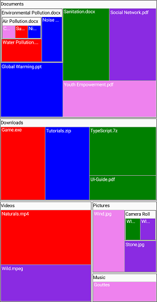

# TreeMap levels and its usage

The levels of tree map can be categorized into the following two types:

* Flat level
* Hierarchical level

## Flat Level

### GroupPath

You can use the [`GroupPath`](https://help.syncfusion.com/cr/xamarin/Syncfusion.SfTreeMap.XForms.TreeMapFlatLevel.html#Syncfusion_SfTreeMap_XForms_TreeMapFlatLevel_GroupPath) property for every flat level in the TreeMap control. It is a path to a field on the source object that serves as “Group” for the level specified. You can group the data based on the `GroupPath` property. When `GroupPath` is not specified, the items will not be grouped, and the data will be displayed in the order specified in [`DataSource`](https://help.syncfusion.com/cr/xamarin/Syncfusion.SfTreeMap.XForms.SfTreeMap.html#Syncfusion_SfTreeMap_XForms_SfTreeMap_DataSource).

### GroupGap

You can use the [`GroupGap`](https://help.syncfusion.com/cr/xamarin/Syncfusion.SfTreeMap.XForms.TreeMapFlatLevel.html#Syncfusion_SfTreeMap_XForms_TreeMapFlatLevel_GroupGap) property to separate items from every flat level and differentiate the levels mentioned in the TreeMap control.

  



 <treemap:SfTreeMap x:Name="treeMap"  DataSource="{Binding PopulationDetails}" WeightValuePath="Population" ColorValuePath="Growth">
            <treemap:SfTreeMap.LeafItemSettings>
                <treemap:LeafItemSettings  Gap="2" BorderColor="#A9D9F7" LabelPath="Country" >
                </treemap:LeafItemSettings>
            </treemap:SfTreeMap.LeafItemSettings>
            <treemap:SfTreeMap.Levels>
                <treemap:TreeMapFlatLevel  HeaderHeight="20" GroupPath = "Continent" GroupGap =" 5" ShowHeader = "true">
                </treemap:TreeMapFlatLevel>
            </treemap:SfTreeMap.Levels>

            <treemap:SfTreeMap.LegendSettings>
                <treemap:LegendSettings ShowLegend="True"  Size="700,45">
                    <treemap:LegendSettings.LabelStyle>
                        <treemap:Style Color="Black"></treemap:Style>
                    </treemap:LegendSettings.LabelStyle>
                </treemap:LegendSettings>
            </treemap:SfTreeMap.LegendSettings>

            <treemap:SfTreeMap.LeafItemColorMapping>
                <treemap:RangeColorMapping>
                    <treemap:RangeColorMapping.Ranges>
                        <treemap:Range LegendLabel = "1 % Growth" From = "0" To = "1" Color =  "#77D8D8"  />
                        <treemap:Range LegendLabel = "2 % Growth" From = "0" To = "2" Color =  "#AED960"  />
                        <treemap:Range LegendLabel = "3 % Growth" From = "0" To = "3" Color =  "#FFAF51"  />
                        <treemap:Range LegendLabel = "4 % Growth" From = "0" To = "4" Color =  "#F3D240"  />
                    </treemap:RangeColorMapping.Ranges>
                </treemap:RangeColorMapping>
            </treemap:SfTreeMap.LeafItemColorMapping>

        </treemap:SfTreeMap>



  

    PopulationViewModel viewModel = new PopulationViewModel();
            
            SfTreeMap treeMap = new SfTreeMap();
            treeMap.DataSource = viewModel.PopulationDetails;
            treeMap.ColorValuePath = "Growth";
            treeMap.WeightValuePath = "Population";

            LeafItemSettings leafSetting = new LeafItemSettings();
            leafSetting.Gap = 2;
            leafSetting.BorderColor = Color.FromHex("#A9D9F7");
            leafSetting.LabelPath = "Country";
            treeMap.LeafItemSettings = leafSetting;

            TreeMapFlatLevel flatLevel = new TreeMapFlatLevel();
            flatLevel.HeaderHeight = 20;
            flatLevel.GroupPath = "Continent";
            flatLevel.GroupGap = 5;
            flatLevel.ShowHeader = true;
            treeMap.Levels.Add(flatLevel);

            LegendSettings legendSettings = new LegendSettings();
            legendSettings.ShowLegend = true;
            legendSettings.Size = new Size(700, 45);
            legendSettings.LabelStyle = new Syncfusion.SfTreeMap.XForms.Style() { Color = Color.Black };
            treeMap.LegendSettings = legendSettings;

            RangeColorMapping rangeColorMapping = new RangeColorMapping();

            Range range1 = new Range();
            range1.From = 0;
            range1.To = 1;
            range1.Color = Color.FromHex("#77D8D8");
            range1.LegendLabel = "1 % Growth";

            Range range2 = new Range();
            range2.From = 0;
            range2.To = 2;
            range2.Color = Color.FromHex("#AED960");
            range2.LegendLabel = "2 % Growth";

            Range range3 = new Range();
            range3.From = 0;
            range3.To = 3;
            range3.Color = Color.FromHex("#FFAF51");
            range3.LegendLabel = "3 % Growth";

            Range range4 = new Range();
            range4.From = 0;
            range4.To = 4;
            range4.Color = Color.FromHex("#F3D240");
            range4.LegendLabel = "4 % Growth";

            rangeColorMapping.Ranges.Add(range1);
            rangeColorMapping.Ranges.Add(range2);
            rangeColorMapping.Ranges.Add(range3);
            rangeColorMapping.Ranges.Add(range4);

            treeMap.LeafItemColorMapping = rangeColorMapping;

            this.Content = treeMap;



  

## Hierarchical Level

Hierarchical level is used to define levels for hierarchical data collection that contains tree-structured data.

  



    <ContentPage.BindingContext>
        <local:FileManagerViewModel></local:FileManagerViewModel>
    </ContentPage.BindingContext>

      <treeMap:SfTreeMap x:Name="treemap" WeightValuePath="MemorySize" ColorValuePath="MemorySize" 
                                DataSource="{Binding Folders}"  ShowTooltip="True">
                <treeMap:SfTreeMap.LeafItemSettings>
                    <treeMap:LeafItemSettings   LabelPath="FileName"/>
                </treeMap:SfTreeMap.LeafItemSettings>

                <treeMap:SfTreeMap.LeafItemColorMapping>                  
                    <treeMap:PaletteColorMapping >
                        <treeMap:PaletteColorMapping.Colors>
                            <Color>Red</Color>
                            <Color>Blue</Color>
                            <Color>Green</Color>
                            <Color>BlueViolet</Color>
                            <Color>Violet</Color>
                        </treeMap:PaletteColorMapping.Colors>
                    </treeMap:PaletteColorMapping>
                </treeMap:SfTreeMap.LeafItemColorMapping>

                <treeMap:SfTreeMap.Levels>
                    <treeMap:TreeMapHierarchicalLevel x:Name="level1" HeaderPath="FileName" ChildBorderColor="Black" 
                                                      ChildBorderThickness="2" ChildGap="5" 
                                                      ChildPath="Files"  LabelPath="FileName">
                        <treeMap:TreeMapHierarchicalLevel.LabelStyle>
                            <treeMap:Style   Color= "White" />
                        </treeMap:TreeMapHierarchicalLevel.LabelStyle>
                        <treeMap:TreeMapHierarchicalLevel.HeaderStyle>
                            <treeMap:Style Color= "Black"/>
                        </treeMap:TreeMapHierarchicalLevel.HeaderStyle>

                    </treeMap:TreeMapHierarchicalLevel>
                    <treeMap:TreeMapHierarchicalLevel x:Name="level2" HeaderPath="FileName" ChildBorderColor="Black" 
                                                      ChildBorderThickness="2" ChildGap="5" 
                                                      ChildPath="SubFiles" LabelPath="MemorySize"  >
                        <treeMap:TreeMapHierarchicalLevel.LabelStyle>
                            <treeMap:Style  Color= "Black" />
                        </treeMap:TreeMapHierarchicalLevel.LabelStyle>
                        <treeMap:TreeMapHierarchicalLevel.HeaderStyle>
                            <treeMap:Style Color= "Black"/>
                        </treeMap:TreeMapHierarchicalLevel.HeaderStyle>

                    </treeMap:TreeMapHierarchicalLevel>

                    <treeMap:TreeMapHierarchicalLevel x:Name="level3" HeaderPath="FileName" ChildBorderColor="Black" 
                                                      ChildBorderThickness="2" ChildGap="5" 
                                                      ChildPath="InnerFiles" LabelPath="FileName">
                        <treeMap:TreeMapHierarchicalLevel.LabelStyle>
                            <treeMap:Style Color= "Green" />
                        </treeMap:TreeMapHierarchicalLevel.LabelStyle>
                        <treeMap:TreeMapHierarchicalLevel.HeaderStyle>
                            <treeMap:Style Color= "Black"/>
                        </treeMap:TreeMapHierarchicalLevel.HeaderStyle>

                    </treeMap:TreeMapHierarchicalLevel>
                </treeMap:SfTreeMap.Levels>
            </treeMap:SfTreeMap>  



 

    public class FileManagerViewModel
    {
        public ObservableCollection<Folder> Folders { get; set; }

        public ObservableCollection<File> Files { get; set; }

        public ObservableCollection<SubFile> SubFiles { get; set; }

        public FileManagerViewModel()
        {
            this.Folders = GetFiles();
        }

        private ObservableCollection<Folder> GetFiles()
        {
            var nodeImageInfo = new ObservableCollection<Folder>();

            var doc = new Folder() { FileName = "Documents", MemorySize = 1000 };
            var download = new Folder() { FileName = "Downloads", MemorySize = 700 };
            var mp3 = new Folder() { FileName = "Music", MemorySize = 100 };
            var pictures = new Folder() { FileName = "Pictures", MemorySize = 250 };
            var video = new Folder() { FileName = "Videos", MemorySize = 500 };

            var pollution = new File() { FileName = "Environmental Pollution.docx", MemorySize = 200 };
            var globalWarming = new File() { FileName = "Global Warming.ppt", MemorySize = 200 };
            var sanitation = new File() { FileName = "Sanitation.docx", MemorySize = 200 };
            var socialNetwork = new File() { FileName = "Social Network.pdf", MemorySize = 200 };
            var youthEmpower = new File() { FileName = "Youth Empowerment.pdf", MemorySize = 200 };

            var air = new SubFile() { FileName = "Air Pollution.docx", MemorySize = 200 };//, ImageIcon = ImageSource.FromResource("GettingStartedBound.Icons.treeview_word.png", assembly) };
            var water = new SubFile() { FileName = "Water Pollution.docx", MemorySize = 200 };//, ImageIcon = ImageSource.FromResource("GettingStartedBound.Icons.treeview_word.png", assembly) };
            var noise = new SubFile() { FileName = "Noise Pollution.docx", MemorySize = 200 };//, ImageIcon = ImageSource.FromResource("GettingStartedBound.Icons.treeview_word.png", assembly) };

            pollution.SubFiles = new ObservableCollection<SubFile>
            {
                air,
                water,
                noise
            };

            var carbon = new InnerFile() { FileName = "Carbon monoxide.docx", MemorySize = 200 };
            var sulphur = new InnerFile() { FileName = "Sulphur dioxide.docx", MemorySize = 200 };
            var nitrogen = new InnerFile() { FileName = "Nitrogen oxides.docx", MemorySize = 200 };

            air.InnerFiles = new ObservableCollection<InnerFile>
            {
                carbon,
                sulphur,
                nitrogen
            };

            var games = new File() { FileName = "Game.exe", MemorySize = 200 };
            var tutorials = new File() { FileName = "Tutorials.zip", MemorySize = 200 };
            var typeScript = new File() { FileName = "TypeScript.7z", MemorySize = 200 };
            var uiGuide = new File() { FileName = "UI-Guide.pdf", MemorySize = 100 };

            var song = new File() { FileName = "Gouttes", MemorySize = 100 };

            var camera = new File() { FileName = "Camera Roll", MemorySize = 100 };
            var stone = new File() { FileName = "Stone.jpg", MemorySize = 100 };
            var wind = new File() { FileName = "Wind.jpg", MemorySize = 200 };

            var img0 = new SubFile() { FileName = "WIN_20160726_094117.JPG", MemorySize = 200 };
            var img1 = new SubFile() { FileName = "WIN_20160726_094118.JPG", MemorySize = 200 };

            var video1 = new File() { FileName = "Naturals.mp4", MemorySize = 300 };
            var video2 = new File() { FileName = "Wild.mpeg", MemorySize = 200 };

            doc.Files = new ObservableCollection<File>
            {
                pollution,
                globalWarming,
                sanitation,
                socialNetwork,
                youthEmpower
            };

            download.Files = new ObservableCollection<File>
            {
                games,
                tutorials,
                typeScript,
                uiGuide
            };

            mp3.Files = new ObservableCollection<File>
            {
                song
            };

            pictures.Files = new ObservableCollection<File>
            {
                camera,
                stone,
                wind
            };

            camera.SubFiles = new ObservableCollection<SubFile>
            {
                img0,
                img1
            };

            video.Files = new ObservableCollection<File>
            {
                video1,
                video2
            };

            nodeImageInfo.Add(doc);
            nodeImageInfo.Add(download);
            nodeImageInfo.Add(mp3);
            nodeImageInfo.Add(pictures);
            nodeImageInfo.Add(video);
            return nodeImageInfo;
        }
    }

      public class Folder : INotifyPropertyChanged
    {
        private string fileName;
        private double memorySize;
        private ObservableCollection<File> files;

        public Folder()
        {
        }

        public ObservableCollection<File> Files
        {
            get { return files; }
            set
            {
                files = value;
                RaisedOnPropertyChanged("SubFiles");
            }
        }

        public string FileName
        {
            get { return fileName; }
            set
            {
                fileName = value;
                RaisedOnPropertyChanged("FileName");
            }
        }

        public double MemorySize
        {
            get { return memorySize; }
            set
            {
                memorySize = value;
                RaisedOnPropertyChanged("MemorySize");
            }
        }

        public event PropertyChangedEventHandler PropertyChanged;

        public void RaisedOnPropertyChanged(string _PropertyName)
        {
            if (PropertyChanged != null)
            {
                PropertyChanged(this, new PropertyChangedEventArgs(_PropertyName));
            }
        }
    }

    public class File : INotifyPropertyChanged
    {
        private string fileName;
        private double memorySize;
        private ObservableCollection<SubFile> subFiles;

        public File()
        {
        }

        public ObservableCollection<SubFile> SubFiles
        {
            get { return subFiles; }
            set
            {
                subFiles = value;
                RaisedOnPropertyChanged("SubFiles");
            }
        }

        public string FileName
        {
            get { return fileName; }
            set
            {
                fileName = value;
                RaisedOnPropertyChanged("FileName");
            }
        }

        public double MemorySize
        {
            get { return memorySize; }
            set
            {
                memorySize = value;
                RaisedOnPropertyChanged("MemorySize");
            }
        }
        public event PropertyChangedEventHandler PropertyChanged;

        public void RaisedOnPropertyChanged(string _PropertyName)
        {
            if (PropertyChanged != null)
            {
                PropertyChanged(this, new PropertyChangedEventArgs(_PropertyName));
            }
        }
    }

    public class SubFile : INotifyPropertyChanged
    {
        private string fileName;
        private double memorySize;
        private ObservableCollection<InnerFile> subFiles;

        public SubFile()
        {
        }

        public ObservableCollection<InnerFile> InnerFiles
        {
            get { return subFiles; }
            set
            {
                subFiles = value;
                RaisedOnPropertyChanged("InnerFiles");
            }
        }

        public string FileName
        {
            get { return fileName; }
            set
            {
                fileName = value;
                RaisedOnPropertyChanged("FolderName");
            }
        }

        public double MemorySize
        {
            get { return memorySize; }
            set
            {
                memorySize = value;
                RaisedOnPropertyChanged("MemorySize");
            }
        }

        public event PropertyChangedEventHandler PropertyChanged;

        public void RaisedOnPropertyChanged(string _PropertyName)
        {
            if (PropertyChanged != null)
            {
                PropertyChanged(this, new PropertyChangedEventArgs(_PropertyName));
            }
        }
    }

    public class InnerFile : INotifyPropertyChanged
    {
        private string fileName;
        private double memorySize;
        public InnerFile()
        {

        }

        public string FileName
        {
            get { return fileName; }
            set
            {
                fileName = value;
                RaisedOnPropertyChanged("FolderName");
            }
        }

        public double MemorySize
        {
            get { return memorySize; }
            set
            {
                memorySize = value;
                RaisedOnPropertyChanged("MemorySize");
            }
        }

        public event PropertyChangedEventHandler PropertyChanged;

        public void RaisedOnPropertyChanged(string _PropertyName)
        {
            if (PropertyChanged != null)
            {
                PropertyChanged(this, new PropertyChangedEventArgs(_PropertyName));
            }
        }
    }



  

