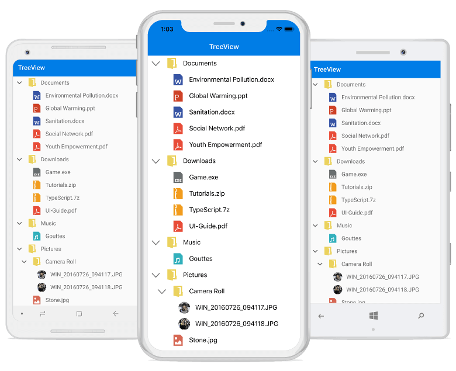

# Getting Started with Xamarin TreeView (SfTreeView)

This section provides a quick overview for getting started with the TreeView for Xamarin.Forms. Walk through the entire process of creating an app with TreeView.

## Assembly Deployment

After installing Essential Studio for Xamarin, you can find all the required assemblies in the {Syncfusion Essential Studio Installed location}\Essential Studio\{{ site.releaseversion }}\Xamarin\lib installation folder.

Eg: C:\Program Files (x86)\Syncfusion\Essential Studio\{{ site.releaseversion }}\Xamarin\lib

Refer [control dependencies](https://help.syncfusion.com/xamarin/introduction/control-dependencies#sftreeview) section to get the list of assemblies or NuGet package needs to be added as reference to use the TreeView control in any application.

N> Assemblies can be found in an unzipped package location in Mac.

## Adding SfTreeView reference

You can add SfTreeView reference using one of the following methods:

**Method 1: Adding SfTreeView reference from nuget.org**

Syncfusion Xamarin components are available in [nuget.org](https://www.nuget.org/). To add SfTreeView to your project, open the NuGet package manager in Visual Studio, search for [Syncfusion.Xamarin.SfTreeView](https://www.nuget.org/packages/Syncfusion.Xamarin.SfTreeView), and then install it.

N> Install the same version of SfTreeView NuGet in all the projects.

**Method 2: Adding SfTreeView reference from toolbox**

Syncfusion also provides Xamarin Toolbox. Using this toolbox, you can drag the SfTreeView control to the XAML page. It will automatically install the required NuGet packages and add the namespace to the page. To install Syncfusion Xamarin Toolbox, refer to [Toolbox](https://help.syncfusion.com/xamarin/utility#toolbox).

**Method 3: Adding SfTreeView assemblies manually from the installed location**

If you prefer to manually reference the assemblies instead referencing from NuGet, add the following assemblies in respective projects.

Location: {Installed location}/{version}/Xamarin/lib

<table>
<tr>
<td>PCL</td>
<td>Syncfusion.SfTreeView.XForms.dll Syncfusion.Core.XForms.dll Syncfusion.Licensing.dll </td>
</tr>
<tr>
<td>Android</td>
<td>Syncfusion.GridCommon.Portable.dll Syncfusion.SfTreeView.XForms.Android.dll Syncfusion.SfTreeView.XForms.dll Syncfusion.Core.XForms.dll Syncfusion.Core.XForms.Android.dll Syncfusion.Licensing.dll </td>
</tr>
<tr>
<td>iOS</td>
<td>Syncfusion.GridCommon.Portable.dll Syncfusion.SfTreeView.XForms.iOS.dll Syncfusion.SfTreeView.XForms.dll Syncfusion.Core.XForms.dll Syncfusion.Core.XForms.iOS.dll Syncfusion.Licensing.dll </td>
</tr>
<tr>
<td>UWP</td>
<td>Syncfusion.GridCommon.Portable.dll Syncfusion.SfTreeView.XForms.UWP.dll Syncfusion.SfTreeView.XForms.dll Syncfusion.Core.XForms.dll Syncfusion.Core.XForms.UWP.dll Syncfusion.Licensing.dll </td>
</tr>
</table>

N> To know more about obtaining our components, refer to these links for [Mac](https://help.syncfusion.com/xamarin/introduction/download-and-installation/mac/) and [Windows](https://help.syncfusion.com/xamarin/introduction/download-and-installation/windows/).

I> Starting with v16.2.0.x, if you reference Syncfusion assemblies from the trial setup or from the NuGet feed, you also have to include a license key in your projects. Please refer to [Syncfusion license key](https://help.syncfusion.com/common/essential-studio/licensing/license-key/) to know about registering Syncfusion license key in your Xamarin application to use our components.

## Launching the TreeView on Each Platform

To use this control inside an application, each platform application must initialize the TreeView renderer. This initialization step varies from platform to platform, and is discussed in the following sections:

### Android

The Android launches the TreeView without any initialization and is enough to only initialize the Xamarin.Forms Framework to launch the application.

N> After adding the reference, an additional step is required to initialize the renderer for iOS and UWP projects. If you are adding the references from toolbox, this step is not needed.

### iOS

To launch the TreeView in iOS, call the `SfTreeViewRenderer.Init()` in the `FinishedLaunching` overridden method of the AppDelegate class after the Xamarin.Forms Framework initialization, and before the LoadApplication is called as demonstrated in the following code example:



public override bool FinishedLaunching(UIApplication app, NSDictionary options)
{
    …
    global::Xamarin.Forms.Forms.Init ();
    SfTreeViewRenderer.Init();
    LoadApplication (new App ());
    …
}
 


### Universal Windows Platform (UWP)

To launch the TreeView in UWP, call the `SfTreeViewRenderer.Init()` in the `MainPage` constructor before the LoadApplication is called as demonstrated in the following code example:



public MainPage()
{
    …
    SfTreeViewRenderer.Init();
    LoadApplication (new App ());
    …
}
 


### ReleaseMode Issue in UWP Platform

The known Framework issue in UWP platform is the custom controls will not render when deployed the application in `Release Mode`.

The above problem can be resolved by initializing the TreeView assemblies in `App.xaml.cs` in UWP project as in the following code snippet:



// In App.xaml.cs

protected override void OnLaunched(LaunchActivatedEventArgs e)
{
    …

    rootFrame.NavigationFailed += OnNavigationFailed;
        
    // you'll need to add `using System.Reflection;`
    List<Assembly> assembliesToInclude = new List<Assembly>();

    //Now, add all the assemblies your app uses
    assembliesToInclude.Add(typeof(SfTreeViewRenderer).GetTypeInfo().Assembly);

    // replaces Xamarin.Forms.Forms.Init(e);        
    Xamarin.Forms.Forms.Init(e, assembliesToInclude);
        
    …     
}



## Create a tree view

This section explains how to create a TreeView and configure it. The TreeView control can be configured entirely in C# code, or by using XAML markup. This is how the control will look like on iOS, Android, and Windows devices.

In this walk through, you will create a new application with the TreeView that includes the following topics:

* [Creating the project](#creating-the-project)
* [Adding tree view in Xamarin.Forms](#adding-the-tree-view-in-xamarin.forms)     
* [Populating Nodes without data source - Unbound Mode](#populating-nodes-without-data-source---unbound-mode) 
* [Creating Data Model](#creating-data-model-for-the-tree-view)  
* [Bind to a hierarchical data source - Bound Mode](#bind-to-a-hierarchical-data-source---bound-mode)
* [Creating hierarchical Data Model](#creating-hierarchical-data-model-for-the-tree-view)
* [Bind to a Hierarchy Property Descriptors data source - Bound Mode](#bind-to-a-hierarchy-Property-descriptors-data-source---bound-mode)
* [Defining a template to expander and content view](#defining-a-template-to-expander-and-content-view)
* [Interacting with a tree view](#interacting-with-a-tree-view)
* [Selection](#selection)

## Creating the Project

Create a new blank [(Xamarin.Forms.NET Standard) application](https://docs.microsoft.com/en-us/xamarin/xamarin-forms/get-started/first-app/?pivots=windows) in Xamarin Studio or Visual Studio for Xamarin.Forms.

## Adding the tree view in Xamarin.Forms 

 1. Add the required assembly references to the corresponding projects as discussed in the [Assembly deployment](#assembly-deployment) section.
 2. Import the SfTreeView control namespace Syncfusion.XForms.TreeView.
 3. Set the TreeView control to the ContentPage.



<?xml version="1.0" encoding="utf-8" ?>
<ContentPage xmlns="http://xamarin.com/schemas/2014/forms"
             xmlns:x="http://schemas.microsoft.com/winfx/2009/xaml"
             xmlns:syncfusion="clr-namespace:Syncfusion.XForms.TreeView;assembly=Syncfusion.SfTreeView.XForms"
             xmlns:local="clr-namespace:GettingStarted;assembly=GettingStarted"
             x:Class="GettingStarted.MainPage">
  <syncfusion:SfTreeView x:Name="treeView" />
</ContentPage>


using Syncfusion.XForms.TreeView;
using Xamarin.Forms;

namespace GettingStarted
{
    public class App : Application
    {
        SfTreeView treeView;
        public App()
        {
            treeView = new SfTreeView();
            MainPage = new ContentPage { Content = treeView};
        }
    }
} 



## Populating Nodes without data source - Unbound Mode

You can create and manage the [TreeViewNode](https://help.syncfusion.com/cr/xamarin/Syncfusion.TreeView.Engine.TreeViewNode.html) objects by yourself to display the data in a hierarchical view. To create a tree view, you use a `TreeView` control and a hierarchy of `TreeViewNode` objects. You create the node hierarchy by adding one or more root nodes to the TreeView control’s [Nodes](https://help.syncfusion.com/cr/xamarin/Syncfusion.XForms.TreeView.SfTreeView.html#Syncfusion_XForms_TreeView_SfTreeView_Nodes) collection. Each `TreeViewNode` can then have more nodes added to its Children collection. You can nest tree view nodes to whatever depth you require.

>**Important** 
[ItemsSource](https://help.syncfusion.com/cr/xamarin/Syncfusion.XForms.TreeView.SfTreeView.html#Syncfusion_XForms_TreeView_SfTreeView_ItemsSource) is an alternative mechanism to `Nodes` for putting content into the TreeView control. You cannot set both `ItemsSource` and `Nodes` at the same time. When you use `ItemsSource`, nodes created for you internally, but you cannot access them from `Nodes` property.



<?xml version="1.0" encoding="utf-8" ?>
<ContentPage xmlns="http://xamarin.com/schemas/2014/forms"
             xmlns:x="http://schemas.microsoft.com/winfx/2009/xaml"
             xmlns:syncfusion="clr-namespace:Syncfusion.XForms.TreeView;assembly=Syncfusion.SfTreeView.XForms"
             xmlns:treeviewengine="clr-namespace:Syncfusion.TreeView.Engine;assembly=Syncfusion.SfTreeView.XForms"
             xmlns:local="clr-namespace:GettingStarted;assembly=GettingStarted"
             x:Class="GettingStarted.MainPage">
    <ContentPage.Content>
       <syncfusion:SfTreeView x:Name="treeView">
            <syncfusion:SfTreeView.Nodes>
                <treeviewengine:TreeViewNode Content="Australia">
                    <treeviewengine:TreeViewNode.ChildNodes>
                        <treeviewengine:TreeViewNode Content="New South Wales">
                            <treeviewengine:TreeViewNode.ChildNodes>
                                <treeviewengine:TreeViewNode Content="Sydney"/>
                            </treeviewengine:TreeViewNode.ChildNodes>
                        </treeviewengine:TreeViewNode>
                    </treeviewengine:TreeViewNode.ChildNodes>
                </treeviewengine:TreeViewNode>
                <treeviewengine:TreeViewNode Content="United States of America">
                    <treeviewengine:TreeViewNode.ChildNodes>
                        <treeviewengine:TreeViewNode Content="New York"/>
                        <treeviewengine:TreeViewNode Content="California">
                            <treeviewengine:TreeViewNode.ChildNodes>
                                <treeviewengine:TreeViewNode Content="San Francisco"/>
                            </treeviewengine:TreeViewNode.ChildNodes>
                        </treeviewengine:TreeViewNode>
                    </treeviewengine:TreeViewNode.ChildNodes>
                </treeviewengine:TreeViewNode>
            </syncfusion:SfTreeView.Nodes>
        </syncfusion:SfTreeView>
    </ContentPage.Content>
</ContentPage>


using Syncfusion.TreeView.Engine;
using Syncfusion.XForms.TreeView;
using Xamarin.Forms;

namespace GettingStarted
{
    public class App : Application
    {
        SfTreeView treeView;
        public App()
        {
            treeView = new SfTreeView();

            var australia = new TreeViewNode() { Content = "Australia" };
            var _NSW = new TreeViewNode() { Content = "New South Wales" };
            var Sydney = new TreeViewNode() { Content = "Sydney" };
            australia.ChildNodes.Add(_NSW);
            _NSW.ChildNodes.Add(Sydney);
 
            var usa = new TreeViewNode() { Content = "United States of America" };
            var newYork = new TreeViewNode() { Content = "New York," };
            var California = new TreeViewNode() { Content = "California" };
            var SanFrancisco = new TreeViewNode() { Content = "San Francisco" };
            usa.ChildNodes.Add(newYork);
            usa.ChildNodes.Add(California);
            California.ChildNodes.Add(SanFrancisco);
            treeView.Nodes.Add(australia);
            treeView.Nodes.Add(usa);

            MainPage = new ContentPage { Content = treeView};
        }
    }
} 



Now, run the application to render the below output:

You can also download the entire source code of this demo from [here](https://github.com/SyncfusionExamples/xamarin-treeview-unbound-mode).

## Creating Data Model for the tree view

Create a data model to bind it to the control. 

Create a simple data source as shown in the following code example in a new class file, and save it as FileManager.cs file: 



public class FileManager : INotifyPropertyChanged
{
   private string fileName;
   private ImageSource imageIcon;
   private ObservableCollection<FileManager> subFiles;

   public ObservableCollection<FileManager> SubFiles
   {
      get { return subFiles; }
      set
      {
         subFiles = value;
         RaisedOnPropertyChanged("SubFiles");
      }
   }

   public string ItemName
   {
      get { return fileName; }
      set
      {
         fileName = value;
         RaisedOnPropertyChanged("FolderName");
      }
   }
   
   public ImageSource ImageIcon
   {
       get { return imageIcon; }
       set
       {
          imageIcon = value;
          RaisedOnPropertyChanged("ImageIcon");
       }
   }

   public event PropertyChangedEventHandler PropertyChanged;

   public void RaisedOnPropertyChanged(string _PropertyName)
   {
      if (PropertyChanged != null)
      {
         PropertyChanged(this, new PropertyChangedEventArgs(_PropertyName));
      }
   }
}



N> If you want your data model to respond to property changes, then implement `INotifyPropertyChanged` interface in your model class.

Create a model repository class with ImageNodeInfo collection property initialized with required number of data objects in a new class file as shown in the following code example, and save it as FileManagerViewModel.cs file:



public class FileManagerViewModel
{
   private ObservableCollection<FileManager> imageNodeInfo;

   public FileManagerViewModel()
   {
      GenerateSource();
   }

   public ObservableCollection<FileManager> ImageNodeInfo
   {
      get { return imageNodeInfo; }
      set { this.imageNodeInfo = value; }
   }

   private void GenerateSource()
   {
      var nodeImageInfo = new ObservableCollection<FileManager>();
      Assembly assembly = typeof(GettingStated).GetTypeInfo().Assembly;
      var doc = new FileManager() { ItemName = "Documents", ImageIcon = ImageSource.FromResource("GettingStartedBound.Icons.treeview_folder.png", assembly) };
      var download = new FileManager() { ItemName = "Downloads", ImageIcon = ImageSource.FromResource("GettingStartedBound.Icons.treeview_folder.png", assembly) };
      var mp3 = new FileManager() { ItemName = "Music", ImageIcon = ImageSource.FromResource("GettingStartedBound.Icons.treeview_folder.png", assembly) };
      var pictures = new FileManager() { ItemName = "Pictures", ImageIcon = ImageSource.FromResource("GettingStartedBound.Icons.treeview_folder.png", assembly) };
      var video = new FileManager() { ItemName = "Videos", ImageIcon = ImageSource.FromResource("GettingStartedBound.Icons.treeview_folder.png", assembly) };

      var pollution = new FileManager() { ItemName = "Environmental Pollution.docx", ImageIcon = ImageSource.FromResource("GettingStartedBound.Icons.treeview_word.png", assembly) };
      var globalWarming = new FileManager() { ItemName = "Global Warming.ppt", ImageIcon = ImageSource.FromResource("GettingStartedBound.Icons.treeview_ppt.png", assembly) };
      var sanitation = new FileManager() { ItemName = "Sanitation.docx", ImageIcon = ImageSource.FromResource("GettingStartedBound.Icons.treeview_word.png", assembly) };
      var socialNetwork = new FileManager() { ItemName = "Social Network.pdf", ImageIcon = ImageSource.FromResource("GettingStartedBound.Icons.treeview_pdf.png", assembly) };
      var youthEmpower = new FileManager() { ItemName = "Youth Empowerment.pdf", ImageIcon = ImageSource.FromResource("GettingStartedBound.Icons.treeview_pdf.png", assembly) };

      var games = new FileManager() { ItemName = "Game.exe", ImageIcon = ImageSource.FromResource("GettingStartedBound.Icons.treeview_exe.png", assembly) };
      var tutorials = new FileManager() { ItemName = "Tutorials.zip", ImageIcon = ImageSource.FromResource("GettingStartedBound.Icons.treeview_zip.png", assembly) };
      var TypeScript = new FileManager() { ItemName = "TypeScript.7z", ImageIcon = ImageSource.FromResource("GettingStartedBound.Icons.treeview_zip.png", assembly) };
      var uiGuide = new FileManager() { ItemName = "UI-Guide.pdf", ImageIcon = ImageSource.FromResource("GettingStartedBound.Icons.treeview_pdf.png", assembly) };

      var song = new FileManager() { ItemName = "Goutiest", ImageIcon = ImageSource.FromResource("GettingStartedBound.Icons.treeview_mp3.png", assembly) };

      var camera = new FileManager() { ItemName = "Camera Roll", ImageIcon = ImageSource.FromResource("GettingStartedBound.Icons.treeview_folder.png", assembly) };
      var stone = new FileManager() { ItemName = "Stone.jpg", ImageIcon = ImageSource.FromResource("GettingStartedBound.Icons.treeview_png.png", assembly) };
      var wind = new FileManager() { ItemName = "Wind.jpg", ImageIcon = ImageSource.FromResource("GettingStartedBound.Icons.treeview_png.png", assembly) };

      var img0 = new FileManager() { ItemName = "WIN_20160726_094117.JPG", ImageIcon = ImageSource.FromResource("GettingStartedBound.Icons.treeview_img0.png", assembly) };
      var img1 = new FileManager() { ItemName = "WIN_20160726_094118.JPG", ImageIcon = ImageSource.FromResource("GettingStartedBound.Icons.treeview_img1.png", assembly) };

      var video1 = new FileManager() { ItemName = "Naturals.mp4", ImageIcon = ImageSource.FromResource("GettingStartedBound.Icons.treeview_video.png", assembly) };
      var video2 = new FileManager() { ItemName = "Wild.mpg", ImageIcon = ImageSource.FromResource("GettingStartedBound.Icons.treeview_video.png", assembly) };

      doc.SubFiles = new ObservableCollection<FileManager>
      {
         pollution,
         globalWarming,
         sanitation,
         socialNetwork,
         youthEmpower
      };

      download.SubFiles = new ObservableCollection<FileManager>
      {
         games,
         tutorials,
         TypeScript,
         uiGuide
      };

      mp3.SubFiles = new ObservableCollection<FileManager>
      {
         song
      };

      pictures.SubFiles = new ObservableCollection<FileManager>
      {
         camera,
         stone,
         wind
      };
      
      camera.SubFiles = new ObservableCollection<FileManager>
      {
         img0,
         img1
      };

      video.SubFiles = new ObservableCollection<FileManager>
      {
         video1,
         video2
      };

      nodeImageInfo.Add(doc);
      nodeImageInfo.Add(download);
      nodeImageInfo.Add(mp3);
      nodeImageInfo.Add(pictures);
      nodeImageInfo.Add(video);
      imageNodeInfo = nodeImageInfo;
  }
}



## Bind to a hierarchical data source - Bound Mode

You can create a tree view by binding the [ItemsSource](https://help.syncfusion.com/cr/xamarin/Syncfusion.XForms.TreeView.SfTreeView.html#Syncfusion_XForms_TreeView_SfTreeView_ItemsSource) to a hierarchical data source. To create a tree view using data binding, set a hierarchical collection to the `ItemsSource` property. Then in the [ItemTemplate](https://help.syncfusion.com/cr/xamarin/Syncfusion.XForms.TreeView.SfTreeView.html#Syncfusion_XForms_TreeView_SfTreeView_ItemTemplate) and [ExpanderTemplate](https://help.syncfusion.com/cr/xamarin/Syncfusion.XForms.TreeView.SfTreeView.html#Syncfusion_XForms_TreeView_SfTreeView_ExpanderTemplate), set the child items collection to the `ItemsSource` property.

>**Important** 
`ItemsSource` is an alternative mechanism to [Nodes](https://help.syncfusion.com/cr/xamarin/Syncfusion.XForms.TreeView.SfTreeView.html#Syncfusion_XForms_TreeView_SfTreeView_Nodes) for putting content into the TreeView control. You cannot set both `ItemsSource` and `Nodes` at the same time. When you use `ItemsSource`, nodes created for you internally, but you cannot access them from `Nodes` property.



<?xml version="1.0" encoding="utf-8" ?>
<ContentPage xmlns="http://xamarin.com/schemas/2014/forms"
             xmlns:x="http://schemas.microsoft.com/winfx/2009/xaml"
             xmlns:syncfusion="clr-namespace:Syncfusion.XForms.TreeView;assembly=Syncfusion.SfTreeView.XForms"
             xmlns:treeviewengine="clr-namespace:Syncfusion.TreeView.Engine;assembly=Syncfusion.SfTreeView.XForms"
             xmlns:local="clr-namespace:GettingStarted;assembly=GettingStarted"
             x:Class="GettingStarted.MainPage">
    <ContentPage.BindingContext>
       <local:FileManagerViewModel x:Name="viewModel"></local:FileManagerViewModel>
    </ContentPage.BindingContext>
    <ContentPage.Content>
       <syncfusion:SfTreeView x:Name="treeView" ChildPropertyName="SubFiles" ItemsSource="{Binding ImageNodeInfo}">
       </syncfusion:SfTreeView>
    </ContentPage.Content>
</ContentPage>


SfTreeView treeView = new SfTreeView();
FileManagerViewModel viewModel = new FileManagerViewModel ();
treeView.ItemsSource = viewModel.ImageNodeInfo; 
MainPage = new ContentPage { Content = treeView };



## Creating hierarchical Data Model for tree view

Create an hierarchical data model to bind it to the control. 

Create a simple hierarchical  data source as shown in the following code example in a new class file, and save it as FileManager.cs file.



public class Folder : INotifyPropertyChanged
{
    private string fileName;
    private ImageSource imageIcon;
    private ObservableCollection<File> files;

    public Folder()
    {
    }

    public ObservableCollection<File> Files
    {
        get { return files; }
        set
        {
            files = value;
            RaisedOnPropertyChanged("SubFiles");
        }
    }

    public string FileName
    {
        get { return fileName; }
        set
        {
            fileName = value;
            RaisedOnPropertyChanged("FileName");
        }
    }

    public ImageSource ImageIcon
    {
        get { return imageIcon; }
        set
        {
            imageIcon = value;
            RaisedOnPropertyChanged("ImageIcon");
        }
    }

    public event PropertyChangedEventHandler PropertyChanged;

    public void RaisedOnPropertyChanged(string _PropertyName)
    {
        if (PropertyChanged != null)
        {
            PropertyChanged(this, new PropertyChangedEventArgs(_PropertyName));
        }
    }
}

public class File : INotifyPropertyChanged
{
    private string fileName;
    private ImageSource imageIcon;
    private ObservableCollection<SubFile> subFiles;

    public File()
    {
    }

    public ObservableCollection<SubFile> SubFiles
    {
        get { return subFiles; }
        set
        {
            subFiles = value;
            RaisedOnPropertyChanged("SubFiles");
        }
    }

    public string FileName
    {
        get { return fileName; }
        set
        {
            fileName = value;
            RaisedOnPropertyChanged("FileName");
        }
    }

    public ImageSource ImageIcon
    {
        get { return imageIcon; }
        set
        {
            imageIcon = value;
            RaisedOnPropertyChanged("ImageIcon");
        }
    }

    public event PropertyChangedEventHandler PropertyChanged;

    public void RaisedOnPropertyChanged(string _PropertyName)
    {
        if (PropertyChanged != null)
        {
            PropertyChanged(this, new PropertyChangedEventArgs(_PropertyName));
        }
    }
}

public class SubFile : INotifyPropertyChanged
{
    private string fileName;
    private ImageSource imageIcon;

    public SubFile()
    {
    }

    public string FileName
    {
        get { return fileName; }
        set
        {
            fileName = value;
            RaisedOnPropertyChanged("FolderName");
        }
    }

    public ImageSource ImageIcon
    {
        get { return imageIcon; }
        set
        {
            imageIcon = value;
            RaisedOnPropertyChanged("ImageIcon");
        }
    }

    public event PropertyChangedEventHandler PropertyChanged;

    public void RaisedOnPropertyChanged(string _PropertyName)
    {
        if (PropertyChanged != null)
        {
            PropertyChanged(this, new PropertyChangedEventArgs(_PropertyName));
        }
    }
}



N> If you need your hierarchical data model to respond to property changes, then implement the `INotifyPropertyChanged` interface in your model class.

Create a model repository class with ImageNodeInfo collection property initialized with required number of data objects in a new class file as shown in the following code example, and save it as FileManagerViewModel.cs file:



public class FileManagerViewModel
{
    public ObservableCollection<Folder> Folders { get; set; }

    public ObservableCollection<File> Files { get; set; }

    public ObservableCollection<SubFile> SubFiles { get; set; }

    public FileManagerViewModel()
    {
        this.Folders = GetFiles();
    }

    private ObservableCollection<Folder> GetFiles()
    {
        var nodeImageInfo = new ObservableCollection<Folder>();
        Assembly assembly = typeof(NodeWithImage).GetTypeInfo().Assembly;

        var doc = new Folder() { FileName = "Documents", ImageIcon = ImageSource.FromResource("SampleBrowser.SfTreeView.Icons.NodeWithImage.treeview_folder.png", assembly) };
        var download = new Folder() { FileName = "Downloads", ImageIcon = ImageSource.FromResource("SampleBrowser.SfTreeView.Icons.NodeWithImage.treeview_folder.png", assembly) };
        var mp3 = new Folder() { FileName = "Music", ImageIcon = ImageSource.FromResource("SampleBrowser.SfTreeView.Icons.NodeWithImage.treeview_folder.png", assembly) };
        var pictures = new Folder() { FileName = "Pictures", ImageIcon = ImageSource.FromResource("SampleBrowser.SfTreeView.Icons.NodeWithImage.treeview_folder.png", assembly) };
        var video = new Folder() { FileName = "Videos", ImageIcon = ImageSource.FromResource("SampleBrowser.SfTreeView.Icons.NodeWithImage.treeview_folder.png", assembly) };

        var pollution = new File() { FileName = "Environmental Pollution.docx", ImageIcon = ImageSource.FromResource("SampleBrowser.SfTreeView.Icons.NodeWithImage.treeview_word.png", assembly) };
        var globalWarming = new File() { FileName = "Global Warming.ppt", ImageIcon = ImageSource.FromResource("SampleBrowser.SfTreeView.Icons.NodeWithImage.treeview_ppt.png", assembly) };
        var sanitation = new File() { FileName = "Sanitation.docx", ImageIcon = ImageSource.FromResource("SampleBrowser.SfTreeView.Icons.NodeWithImage.treeview_word.png", assembly) };
        var socialNetwork = new File() { FileName = "Social Network.pdf", ImageIcon = ImageSource.FromResource("SampleBrowser.SfTreeView.Icons.NodeWithImage.treeview_pdf.png", assembly) };
        var youthEmpower = new File() { FileName = "Youth Empowerment.pdf", ImageIcon = ImageSource.FromResource("SampleBrowser.SfTreeView.Icons.NodeWithImage.treeview_pdf.png", assembly) };

        var games = new File() { FileName = "Game.exe", ImageIcon = ImageSource.FromResource("SampleBrowser.SfTreeView.Icons.NodeWithImage.treeview_exe.png", assembly) };
        var tutorials = new File() { FileName = "Tutorials.zip", ImageIcon = ImageSource.FromResource("SampleBrowser.SfTreeView.Icons.NodeWithImage.treeview_zip.png", assembly) };
        var typeScript = new File() { FileName = "TypeScript.7z", ImageIcon = ImageSource.FromResource("SampleBrowser.SfTreeView.Icons.NodeWithImage.treeview_zip.png", assembly) };
        var uiGuide = new File() { FileName = "UI-Guide.pdf", ImageIcon = ImageSource.FromResource("SampleBrowser.SfTreeView.Icons.NodeWithImage.treeview_pdf.png", assembly) };

        var song = new File() { FileName = "Gouttes", ImageIcon = ImageSource.FromResource("SampleBrowser.SfTreeView.Icons.NodeWithImage.treeview_mp3.png", assembly) };

        var camera = new File() { FileName = "Camera Roll", ImageIcon = ImageSource.FromResource("SampleBrowser.SfTreeView.Icons.NodeWithImage.treeview_folder.png", assembly) };
        var stone = new File() { FileName = "Stone.jpg", ImageIcon = ImageSource.FromResource("SampleBrowser.SfTreeView.Icons.NodeWithImage.treeview_png.png", assembly) };
        var wind = new File() { FileName = "Wind.jpg", ImageIcon = ImageSource.FromResource("SampleBrowser.SfTreeView.Icons.NodeWithImage.treeview_png.png", assembly) };

        var img0 = new SubFile() { FileName = "WIN_20160726_094117.JPG", ImageIcon = ImageSource.FromResource("SampleBrowser.SfTreeView.Icons.NodeWithImage.treeview_img0.png", assembly) };
        var img1 = new SubFile() { FileName = "WIN_20160726_094118.JPG", ImageIcon = ImageSource.FromResource("SampleBrowser.SfTreeView.Icons.NodeWithImage.treeview_img1.png", assembly) };

        var video1 = new File() { FileName = "Naturals.mp4", ImageIcon = ImageSource.FromResource("SampleBrowser.SfTreeView.Icons.NodeWithImage.treeview_video.png", assembly) };
        var video2 = new File() { FileName = "Wild.mpeg", ImageIcon = ImageSource.FromResource("SampleBrowser.SfTreeView.Icons.NodeWithImage.treeview_video.png", assembly) };

        doc.Files = new ObservableCollection<File>
            {
                pollution,
                globalWarming,
                sanitation,
                socialNetwork,
                youthEmpower
            };

        download.Files = new ObservableCollection<File>
            {
                games,
                tutorials,
                typeScript,
                uiGuide
            };

        mp3.Files = new ObservableCollection<File>
            {
                song
            };

        pictures.Files = new ObservableCollection<File>
            {
                camera,
                stone,
                wind
            };

        camera.SubFiles = new ObservableCollection<SubFile>
            {
                img0,
                img1
            };

        video.Files = new ObservableCollection<File>
            {
                video1,
                video2
            };

        nodeImageInfo.Add(doc);
        nodeImageInfo.Add(download);
        nodeImageInfo.Add(mp3);
        nodeImageInfo.Add(pictures);
        nodeImageInfo.Add(video);
        return nodeImageInfo;
    }
}



## Bind to a Hierarchy Property Descriptors data source - Bound mode

You can create a tree view by binding the [ItemsSource](https://help.syncfusion.com/cr/xamarin/Syncfusion.XForms.TreeView.SfTreeView.html#Syncfusion_XForms_TreeView_SfTreeView_ItemsSource) to a hierarchy property descriptors data source. To create a tree view using hierarchical data binding, set a hierarchical collection to the `ItemsSource` property, and then set the `TargetType` and [ChildPropertyName](https://help.syncfusion.com/cr/xamarin/Syncfusion.XForms.TreeView.SfTreeView.html#Syncfusion_XForms_TreeView_SfTreeView_ChildPropertyName) property values in [HierarchyPropertyDescriptors](https://help.syncfusion.com/cr/xamarin/Syncfusion.XForms.TreeView.SfTreeView.html#Syncfusion_XForms_TreeView_SfTreeView_HierarchyPropertyDescriptors) .

>**Important** 
`ItemsSource` is an alternative mechanism to [Nodes](https://help.syncfusion.com/cr/xamarin/Syncfusion.XForms.TreeView.SfTreeView.html#Syncfusion_XForms_TreeView_SfTreeView_Nodes) for adding content into the TreeView control. You cannot set both `ItemsSource` and `Nodes` at the same time. When you use `ItemsSource`, nodes are created internally, but you cannot access them from the `Nodes` property.



<?xml version="1.0" encoding="utf-8" ?>
<ContentPage xmlns="http://xamarin.com/schemas/2014/forms"
             xmlns:x="http://schemas.microsoft.com/winfx/2009/xaml"
             xmlns:syncfusion="clr-namespace:Syncfusion.XForms.TreeView;assembly=Syncfusion.SfTreeView.XForms"
             xmlns:treeviewengine="clr-namespace:Syncfusion.TreeView.Engine;assembly=Syncfusion.SfTreeView.XForms"
             xmlns:local="clr-namespace:GettingStarted;assembly=GettingStarted"
             x:Class="GettingStarted.MainPage">

   <ContentPage.BindingContext>
      <local:FileManagerViewModel x:Name="viewModel"></local:FileManagerViewModel>
   </ContentPage.BindingContext>

   <ContentPage.Content>
      <syncfusion:SfTreeView x:Name="treeView" ItemsSource="{Binding ImageNodeInfo}">
         <sfTreeView:SfTreeView.HierarchyPropertyDescriptors>
            <treeviewengine:HierarchyPropertyDescriptor TargetType="{x:Type local:Folder}" ChildPropertyName="Files"/>
            <treeviewengine:HierarchyPropertyDescriptor TargetType="{x:Type local:File}" ChildPropertyName="SubFiles"/>
         </sfTreeView:SfTreeView.HierarchyPropertyDescriptors>
      </syncfusion:SfTreeView>
   </ContentPage.Content>
</ContentPage>


SfTreeView treeView = new SfTreeView();
FileManagerViewModel viewModel = new FileManagerViewModel ();
treeView.ItemsSource = viewModel.ImageNodeInfo; 
MainPage = new ContentPage { Content = treeView };



## Defining a template to expander and content view

By defining the [ExpanderTemplate](https://help.syncfusion.com/cr/xamarin/Syncfusion.XForms.TreeView.SfTreeView.html#Syncfusion_XForms_TreeView_SfTreeView_ExpanderTemplate) and [ItemTemplate](https://help.syncfusion.com/cr/xamarin/Syncfusion.XForms.TreeView.SfTreeView.html#Syncfusion_XForms_TreeView_SfTreeView_ItemTemplate) properties, a custom user interface (UI) can be created to display the data items for both expander and content view. It is applicable for both Unbound mode and Bound mode data items. 

N> By default, the binding context for each tree view item will be the data model object for Bound Mode and [TreeViewNode](https://help.syncfusion.com/cr/xamarin/Syncfusion.TreeView.Engine.TreeViewNode.html) for Unbound Mode. However, you can change the binding context for tree view items in Bound Mode as `TreeViewNode` by defining the [ItemTemplateContextType](https://help.syncfusion.com/cr/xamarin/Syncfusion.XForms.TreeView.SfTreeView.html#Syncfusion_XForms_TreeView_SfTreeView_ItemTemplateContextTypeProperty) enumeration to `Node`, which is applicable for both `ExpanderTemplate` and `ItemTemplate` properties.

The following code example demonstrates how to customize your content view using the `ItemTemplate` and `ExpanderTemplate` property in both XAML and C#.



<?xml version="1.0" encoding="utf-8" ?>
<ContentPage xmlns="http://xamarin.com/schemas/2014/forms"
             xmlns:x="http://schemas.microsoft.com/winfx/2009/xaml"
             xmlns:syncfusion="clr-namespace:Syncfusion.XForms.TreeView;assembly=Syncfusion.SfTreeView.XForms"
             xmlns:treeviewengine="clr-namespace:Syncfusion.TreeView.Engine;assembly=Syncfusion.SfTreeView.XForms"
             xmlns:local="clr-namespace:GettingStarted;assembly=GettingStarted"
             x:Class="GettingStarted.MainPage">
    <ContentPage.BindingContext>
       <local:FileManagerViewModel x:Name="viewModel"></local:FileManagerViewModel>
    </ContentPage.BindingContext>
    <ContentPage.Content>
       <syncfusion:SfTreeView x:Name="treeView" ItemsSource="{Binding ImageNodeInfo}">
            <syncfusion:SfTreeView.ItemTemplate>
                <DataTemplate>
                    <ViewCell>
                        <ViewCell.View>
                           <Grid x:Name="grid" RowSpacing="0" BackgroundColor="Transparent">
                              <Grid Padding="5,5,5,5">
                                  <Image Source="{Binding ImageIcon}" VerticalOptions="Center"
                                         HorizontalOptions="Center" HeightRequest="35" 
                                         WidthRequest="35"/>
                              </Grid>
                              <Grid Grid.Column="1" RowSpacing="1" Padding="1,0,0,0" VerticalOptions="Center">
                                <Label LineBreakMode="NoWrap" Text="{Binding ItemName}" VerticalTextAlignment="Center"/>
                              </Grid>
                           </Grid>
                        </ViewCell.View>
                    </ViewCell>
                </DataTemplate>
            </syncfusion:SfTreeView.ItemTemplate>
            <syncfusion:SfTreeView.ExpanderTemplate>
                <DataTemplate>
                    <ViewCell>
                        <ViewCell.View>
                            <Image IsVisible="{Binding HasChildNodes,Converter={StaticResource IconVisibleConverter}}" 
                                   Source="{ Binding IsExpanded,Converter={StaticResource ExpanderIconConverter}}"
                                   VerticalOptions="Center" HorizontalOptions="Center"/>
                        </ViewCell.View>
                    </ViewCell>
                </DataTemplate>
            </syncfusion:SfTreeView.ExpanderTemplate>
       </syncfusion:SfTreeView>
    </ContentPage.Content>
</ContentPage>


SfTreeView treeView = new SfTreeView();
FileManagerViewModel viewModel = new FileManagerViewModel ();
treeView.ItemsSource = viewModel.ImageNodeInfo; 
treeView.ItemTemplateContextType = ItemTemplateContextType.Node;
treeView.ItemTemplate = new DataTemplate(() => 
{
    var grid = new Grid();
    var imageIcon = new Image();
    imageIcon.SetBinding(Image.SourceProperty, new Binding("Content.ImageIcon"));
    var itemName = new Label { FontSize = 15 };
    itemName.SetBinding(Label.TextProperty, new Binding("Content.ItemName"));

    grid.Children.Add(imageIcon);
    grid.Children.Add(itemName, 1, 0);

    return grid;
});
treeView.ExpanderTemplate = new DataTemplate(()=>
{
    var grid = new Grid();
    var expanderIcon = new Image();
    imageIcon.SetBinding(Image.SourceProperty, new Binding("IsExpanded"));
})
MainPage = new ContentPage { Content = treeView };



Now, run the application to render the similar output:

You can also download the entire source code of this demo from [here](https://github.com/SyncfusionExamples/xamarin-treeview-databinding).

## Interacting with a tree view

The `TreeView` allows you to expand and collapse the nodes either by user interaction on the nodes or by programmatically. The expanding and collapsing interactions can be handled with the help of [NodeCollapsing](https://help.syncfusion.com/cr/xamarin/Syncfusion.XForms.TreeView.SfTreeView.html) and [NodeExpanding](https://help.syncfusion.com/cr/xamarin/Syncfusion.XForms.TreeView.SfTreeView.html) events.

 You can define how the nodes to be expanded while loading the `TreeView` by using [AutoExpandMode](https://help.syncfusion.com/cr/xamarin/Syncfusion.XForms.TreeView.SfTreeView.html#Syncfusion_XForms_TreeView_SfTreeView_AutoExpandModeProperty) property. Also, the `TreeView` allows you to set the restrictions whether expanding and collapsing of nodes can be performed only by tapping in expander view or in both expander view and content view by using [ExpandActionTarget](https://help.syncfusion.com/cr/xamarin/Syncfusion.XForms.TreeView.SfTreeView.html#Syncfusion_XForms_TreeView_SfTreeView_ExpandActionTargetProperty) property.

 N> `AutoExpandMode` property is only applicable for bound mode. For Unbound mode you need to set `IsExpanded` property to `true` while creating the nodes, to be in expanded state while loading the TreeView.



<?xml version="1.0" encoding="utf-8" ?>
<ContentPage xmlns="http://xamarin.com/schemas/2014/forms"
             xmlns:x="http://schemas.microsoft.com/winfx/2009/xaml"
             xmlns:syncfusion="clr-namespace:Syncfusion.XForms.TreeView;assembly=Syncfusion.SfTreeView.XForms"
             xmlns:local="clr-namespace:GettingStarted;assembly=GettingStarted"
             x:Class="GettingStarted.MainPage">
  <syncfusion:SfTreeView x:Name="treeView" AutoExpandMode="AllNodesExpanded"
                         ExpandActionTarget="Node"/>
</ContentPage>


using Syncfusion.XForms.TreeView;
using Xamarin.Forms;

namespace GettingStarted
{
    public class App : Application
    {
        SfTreeView treeView;
        public App()
        {
            treeView = new SfTreeView();
            treeView.AutoExpandMode = AutoExpandMode.AllNodesExpanded;
            treeView.ExpandActionTarget = ExpandActionTarget.Node;
            MainPage = new ContentPage { Content = treeView};
        }
    }
} 



## Selection

The `TreeView` allows selecting the item by setting the [SelectionMode](https://help.syncfusion.com/cr/xamarin/Syncfusion.XForms.TreeView.SfTreeView.html#Syncfusion_XForms_TreeView_SfTreeView_SelectionModeProperty) property. Set the `SelectionMode` property to single, single-deselect, multiple, extended and none based on the requirements. Informations about the selected item can be tracked using the [SelectedItem](https://help.syncfusion.com/cr/xamarin/Syncfusion.XForms.TreeView.SfTreeView.html#Syncfusion_XForms_TreeView_SfTreeView_SelectedItemProperty), [CurrentItem](https://help.syncfusion.com/cr/xamarin/Syncfusion.XForms.TreeView.SfTreeView.html#Syncfusion_XForms_TreeView_SfTreeView_CurrentItemProperty) and [SelectedItems](https://help.syncfusion.com/cr/xamarin/Syncfusion.XForms.TreeView.SfTreeView.html#Syncfusion_XForms_TreeView_SfTreeView_SelectedItemsProperty) properties. Also, `TreeView` provides key board navigation support in UWP platform.

It also allows changing the selection highlight color by using the [SelectionBackgroundColor](https://help.syncfusion.com/cr/xamarin/Syncfusion.XForms.TreeView.SfTreeView.html#Syncfusion_XForms_TreeView_SfTreeView_SelectionBackgroundColorProperty) property. Additionally, for unbound mode, you can change the selection fore ground color of the text by using the [SelectionForegroundColor](https://help.syncfusion.com/cr/xamarin/Syncfusion.XForms.TreeView.SfTreeView.html#Syncfusion_XForms_TreeView_SfTreeView_SelectionForegroundColorProperty) property.

The selection operations can be handled with the help of [SelectionChanging](https://help.syncfusion.com/cr/xamarin/Syncfusion.XForms.TreeView.SfTreeView.html) and [SelectionChanged](https://help.syncfusion.com/cr/xamarin/Syncfusion.XForms.TreeView.SfTreeView.html).



<?xml version="1.0" encoding="utf-8" ?>
<ContentPage xmlns="http://xamarin.com/schemas/2014/forms"
             xmlns:x="http://schemas.microsoft.com/winfx/2009/xaml"
             xmlns:syncfusion="clr-namespace:Syncfusion.XForms.TreeView;assembly=Syncfusion.SfTreeView.XForms"
             xmlns:local="clr-namespace:GettingStarted;assembly=GettingStarted"
             x:Class="GettingStarted.MainPage">
  <syncfusion:SfTreeView x:Name="treeView" SelectionMode="Single"
                         SelectionBackgroundColor="#E4E4E4" SelectionForegroundColor="#D3D3D3"/>
</ContentPage>


using Syncfusion.XForms.TreeView;
using Xamarin.Forms;

namespace GettingStarted
{
    public class App : Application
    {
        SfTreeView treeView;
        public App()
        {
            treeView = new SfTreeView();
            treeView.SelectionMode = SelectionMode.Single;
            treeView.SelectionBackgroundColor = Color.FromHex("#E4E4E4");
            treeView.SelectionForegroundColor = Color.FromHex("#D3D3D3");
            MainPage = new ContentPage { Content = treeView};
        }
    }
} 



## Reset tree view items 

You can reset the visible treeview items by using the [ResetTreeViewItems](https://help.syncfusion.com/cr/xamarin/Syncfusion.XForms.TreeView.SfTreeView.html#Syncfusion_XForms_TreeView_SfTreeView_ResetTreeViewItems_System_Object_) method. If the parameter is null, all the visible treeview items will reset. If you are passing the `data object` as a parameter, a particular treeview item will reset.



treeView.ResetTreeViewItems();



## Refresh view

You can refresh the view by using the [RefreshView](https://help.syncfusion.com/cr/xamarin/Syncfusion.XForms.TreeView.SfTreeView.html#Syncfusion_XForms_TreeView_SfTreeView_RefreshView) method. It will be used to refresh the items in the treeview at runtime while updating the view.



treeView.RefreshView();



## See also

[How to resolve SfTreeView not rendering issue in iOS and UWP](https://www.syncfusion.com/kb/11260)                                                                                                                                                                                                                                                                                                                                                                                                                                                                                                                                                                                                                                                                                          
[How to sort TreeView nodes in Xamarin.Forms (SfTreeView)](https://www.syncfusion.com/kb/11315)                                                                                                                                                                                                                                                                                                                                                                                 
[How to filter Xamarin.Forms TreeView (SfTreeView)](https://www.syncfusion.com/kb/11350)                                                                                                                                                                                                                                                                                                                    
[How to add nodes to bound mode TreeView in Xamarin.Forms (SfTreeView)](https://www.syncfusion.com/kb/11487)                                                                                                                                                                                                                                                                                                                                                                                            
[How to hide expander in Xamarin.Forms TreeView (SfTreeView)](https://www.syncfusion.com/kb/11422)                                                                                                                                                                                                                                      
[How to show Xamarin.Forms TreeView (SfTreeView) in popup using Rg.Plugin.Popup framework](https://www.syncfusion.com/kb/11316)