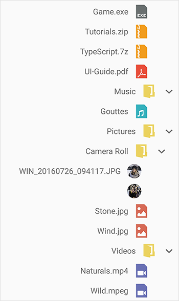

# Right to left(RTL) in Xamarin TreeView (SfTreeView)

TreeView supports to change the flow of text to the right-to-left direction by setting the [FlowDirection](https://docs.microsoft.com/en-us/dotnet/api/xamarin.forms.visualelement.flowdirection?view=xamarin-forms#Xamarin_Forms_VisualElement_FlowDirection) to `RightToLeft`. TreeView supports RTL in Xamarin.Forms version 3.0 and above.

N> Specific platform setup is required to enable right-to-left localization. For platform settings you can refer [here](https://docs.microsoft.com/en-us/xamarin/xamarin-forms/app-fundamentals/localization/right-to-left#platform-setup).




<ContentPage  xmlns:x="http://schemas.microsoft.com/winfx/2009/xaml"
              xmlns:syncfusion="clr-namespace:Syncfusion.XForms.TreeView;assembly=Syncfusion.SfTreeView.XForms">
    <ContentPage.Content>
       <syncfusion:SfTreeView x:Name="treeView" FlowDirection="RightToLeft"/>
    </ContentPage.Content>
</ContentPage>




treeView.FlowDirection = FlowDirection.RightToLeft;




TreeView also supports RTL when device's flow direction is changed, it is achieved by setting the `FlowDirection` to [Device.FlowDirection](https://docs.microsoft.com/en-us/dotnet/api/xamarin.forms.device.flowdirection?view=xamarin-forms#Xamarin_Forms_Device_FlowDirection).




<ContentPage  xmlns:x="http://schemas.microsoft.com/winfx/2009/xaml"
              xmlns:syncfusion="clr-namespace:Syncfusion.XForms.TreeView;assembly=Syncfusion.SfTreeView.XForms">
    <ContentPage.Content>
       <syncfusion:SfTreeView x:Name="treeView" FlowDirection="{x:Static Device.FlowDirection}"/>
    </ContentPage.Content>
</ContentPage>




treeView.FlowDirection = Device.FlowDirection;




In UWP platform, the ScrollView is not changed when RTL is enabled (framework issue). To overcome this issue, set the `FlowDirection` property in constructor of `MainPage` in UWP renderer as demonstrated in the following code example.



public MainPage()
{
    …
    SfTreeViewRenderer.Init();
    this.FlowDirection = FlowDirection.RightToLeft;
    LoadApplication (new App ());
    …
}
 


You can download the entire [source code](https://github.com/SyncfusionExamples/treeview-xamarin-right-to-left) here.

N> When a label is loaded in the `ItemTemplate`, the right-to-left direction is not applied due to the framework issue. It has been reported to the Xamarin team; for more details about this, refer to this [link](https://github.com/xamarin/Xamarin.Forms/issues/3611). To overcome this issue, set the `HorizontalOptions` to `StartAndExpand` in Label.

## Limitations

* When you use custom [ItemTemplate](https://help.syncfusion.com/cr/xamarin/Syncfusion.XForms.TreeView.SfTreeView.html#Syncfusion_XForms_TreeView_SfTreeView_ItemTemplate) in `TreeView`, it does not respond to `FlowDirection` due to framework issue. To respond to `FlowDirection` changes, you need to set `FlowDirection` of `TreeView` to parent view of your custom `ItemTemplate`.

## See also

[How to work with RTL in Xamarin.Forms TreeView (SfTreeView)](https://www.syncfusion.com/kb/11414/how-to-work-with-rtl-in-xamarin-forms-treeview-sftreeview)